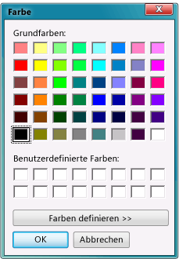

# Schritt 11: Ausführen Ihrer Picture Viewer-App und Ausprobieren weiterer Features

Ihre Picture Viewer-App ist fertig und bereit zur Ausführung. Sie können Ihre App ausführen und die Hintergrundfarbe von <xref:System.Windows.Forms.PictureBox> festlegen. Indem Sie versuchen, die Anwendung zu verbessern, indem Sie die Farbe des Formulars ändern, die Schaltflächen und das Kontrollkästchen anpassen und die Eigenschaften des Formulars ändern, können Sie mehr lernen.

## Ausführen Ihrer App und Festlegen der Hintergrundfarbe

1. Drücken Sie **F5**, oder klicken Sie in der Menüleiste auf **Debuggen** > **Debuggen starten**.

1. Bevor Sie ein Bild öffnen, wählen Sie die Schaltfläche **Hintergrundfarbe festlegen** aus. Das Dialogfeld **Farbe** wird geöffnet.

      
*Dialogfeld* ***Farbe***

1. Wählen Sie eine Farbe aus, um die PictureBox-Hintergrundfarbe festzulegen. Sehen Sie sich die `backgroundButton_Click()`- oder `BackgroundButton_Click()`-Methode genau an, um zu verstehen, wie sie funktioniert.

    > [!NOTE]
    > Sie können aus dem Internet ein Bild laden, indem Sie die URL des Bilds in das Dialogfeld **Datei öffnen** einfügen. Versuchen Sie, ein Bild mit einem transparenten Hintergrund zu finden, damit die Hintergrundfarbe angezeigt wird.

1. Wählen Sie die Schaltfläche **Bild löschen** aus, um sicherzustellen, das es gelöscht wird. Beenden Sie dann die App, indem Sie auf **Schließen** klicken.

## Ausprobieren weiterer Features

* Ändern Sie die Farbe des Formulars und der Schaltflächen mit der **BackColor**-Eigenschaft.

* Passen Sie die Schaltflächen und das Kontrollkästchen mit den Eigenschaften **Font** und **ForeColor** an.

* Ändern Sie die Eigenschaften **FormBorderStyle** und **ControlBox** des Formulars.

* Verwenden Sie die Eigenschaften **AcceptButton** und **CancelButton** des Formulars, damit Schaltflächen automatisch ausgewählt werden, wenn der Benutzer die **EINGABETASTE** oder die **ESC-TASTE** drückt. Veranlassen Sie, dass die App das Dialogfeld **Datei öffnen** öffnet, wenn der Benutzer die **EINGABETASTE** drückt, und das Dialogfeld schließt, wenn der Benutzer die **ESC-TASTE** drückt.

## Nächste Schritte

Fahren Sie für weitere Informationen mit dem folgenden Tutorial fort:

> [!div class="nextstepaction"]
> [Tutorial 2: Erstellen eines Mathequiz mit Zeitmessung](../ide/tutorial-2-create-a-timed-math-quiz.md)

Den vorherigen Schritt des Tutorials finden Sie unter [Schritt 10: Schreiben von Code für zusätzliche Schaltflächen und ein Kontrollkästchen](../ide/step-10-write-code-for-additional-buttons-and-a-check-box.md).

## Siehe auch

* [Weitere C#-Tutorials](/visualstudio/get-started/csharp/)
* [Weitere Visual Basic-Tutorials](/visualstudio/get-started/visual-basic/)
* [C++-Tutorial](/cpp/get-started/tutorial-console-cpp)
