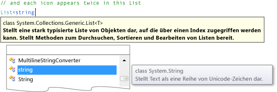

# Schritt 2: Hinzufügen eines zufällig ausgewählten Objekts und einer Liste von Symbolen
In diesem Schritt erstellen Sie einen Satz übereinstimmender Symbole für das Spiel. Jedes Symbol wird zwei zufällig ausgewählten Zellen im TableLayoutPanel auf dem Formular hinzugefügt. Sie verwenden zwei `new`-Anweisungen, um zwei Objekte zu erstellen. Das erste Objekt ist ein `Random`-Objekt, wie Sie es auch im Mathematik-Quiz verwendet haben. Es wird in diesem Code verwendet, um Zellen im TableLayoutPanel zufällig auszuwählen. Das zweite Objekt ist möglicherweise neu für Sie – es ist ein `List`-Objekt, das verwendet wird, um die zufällig ausgewählten Symbole zu speichern.

### So fügen Sie ein zufällig ausgewähltes Objekt und eine Liste von Symbolen hinzu

1.  Wählen Sie **Form1.cs** im **Projektmappen-Explorer** aus, wenn Sie Visual C# verwenden, oder **Form1.vb**, wenn Sie Visual Basic verwenden. Klicken Sie dann in der Menüleiste auf **Ansicht** > **Code**. Alternativ können Sie die Taste **F7** drücken oder im **Projektmappen-Explorer** auf **Form1** doppelklicken.

     Dadurch wird das Codemodul für Form1 angezeigt.

2.  Fügen Sie im vorhandenen Code den folgenden Code hinzu.

     [!code-csharp[VbExpressTutorial4Step2_3_4#1](../ide/codesnippet/CSharp/step-2-add-a-random-object-and-a-list-of-icons_1.cs)]
     [!code-vb[VbExpressTutorial4Step2_3_4#1](../ide/codesnippet/VisualBasic/step-2-add-a-random-object-and-a-list-of-icons_1.vb)]

     Achten Sie bei der Verwendung von Visual C#-Code darauf, dass Sie den Code nach der öffnenden geschweiften Klammer und direkt nach der Klassendeklaration (`public partial class Form1 : Form`) einfügen. Sofern Sie Visual Basic verwenden, müssen Sie den Code direkt nach der Klassendeklaration (`Public Class Form1`) einfügen.

3.  Beim Hinzufügen des `List`-Objekts öffnet sich das **IntelliSense**-Fenster. Das folgende Beispiel ist ein Visual C#-Beispiel, aber es wird ein ähnlicher Text angezeigt, wenn Sie eine Liste unter Visual Basic hinzufügen.

      IntelliSense-Fenster

    > [!NOTE]
    >  Das IntelliSense-Fenster wird nur angezeigt, wenn Sie Code manuell eingeben. Beim Einfügen von kopiertem Code wird es nicht angezeigt.

     Der Code (samt Kommentar) ist einfacher zu verstehen, wenn Sie sich diesen in kleinen Abschnitten ansehen. Sie können in Programmen `List`-Objekte verwenden, um viele Elemente unterschiedlichen Typs zu speichern. Eine Liste kann Zahlen, Wahr/Falsch-Werte, Text oder andere Objekte enthalten. Sie können auch ein `List`-Objekt verwenden, das andere `List`-Objekte enthält. Die Bestandteile der Liste werden als *Elemente* bezeichnet, und jede Liste enthält nur einen Typ von Element. Eine Liste für Zahlen kann somit nur Zahlen enthalten. Sie können einer solchen Liste keinen Text hinzufügen. Ebenso ist es nicht möglich, einer Liste mit Wahr/Falsch-Werten Zahlen hinzuzufügen.

     Wenn Sie ein `List`-Objekt mit einer `new`-Anweisung erstellen, müssen Sie die Art von Daten angeben, die in der Liste gespeichert werden soll. Aus diesem Grund zeigt die QuickInfo oben im **IntelliSense**-Fenster den Typ der Elemente in der Liste an. `List<string>` (in Visual C#) und `List(Of String)` (in Visual Basic) gibt an: Es handelt sich um ein `List`-Objekt, das Datenelemente vom Typ `string` enthält. Das Programm speichert Text als Zeichenfolge. Diese Information steht in der QuickInfo rechts im **IntelliSense**-Fenster.

4.  Überlegen Sie, warum in Visual Basic zuerst ein temporäres Array erstellt werden muss, während die Liste in Visual C# mit einer Anweisung erstellt werden kann. Der Grund ist, dass die Sprache Visual C# über *Auflistungsinitialisierer* verfügt, mit deren Hilfe die Liste zur Aufnahme von Werten vorbereitet wird. In Visual Basic können Sie einen Auflistungsinitialisierer verwenden. Um jedoch die Kompatibilität mit der früheren Version von Visual Basic sicherzustellen, empfiehlt sich die Verwendung des oben angegebenen Codes.

     Wenn Sie einen Auflistungsinitialisierer mit einer `new`-Anweisung verwenden, füllt das Programm das neue `List`-Objekt nach seiner Erstellung mit dem Inhalt, der zwischen den geschweiften Klammern angegeben ist. In diesem Fall erhalten Sie eine Liste mit Zeichenfolgen namens **icons** (Symbole). Diese Liste wird so initialisiert, dass sie 16 Zeichenfolgen enthält. Jede dieser Zeichenfolgen ist ein einzelner Buchstabe. Die Buchstaben entsprechen jeweils den Symbolen, die unter den Bezeichnungen angezeigt werden. Das Spiel verfügt also über ein Paar Ausrufezeichen, ein Paar von N-Buchstaben, ein Paar Kommas usw. (Wenn für diese Zeichen die Schriftart Webdings festgelegt wird, werden sie als Symbole dargestellt, beispielsweise als Bus, Fahrrad, Spinne usw.) Das `List`-Objekt verfügt insgesamt über sechzehn Zeichenfolgen, eine für jede Zelle im TableLayoutPanel-Steuerelement.

    > [!NOTE]
    >  In Visual Basic erhalten Sie das gleiche Ergebnis, aber die Zeichenfolgen werden zuerst in ein temporäres Array eingefügt, das dann in ein `List`-Objekt konvertiert wird. Ein Array ähnelt einer Liste, aber Arrays werden z. B. mit einer festen Größe erstellt. Listen können kürzer oder länger werden, was für dieses Programm wichtig ist.

### So fahren Sie fort oder überprüfen die Angaben

-   Um mit dem nächsten Tutorial fortzufahren, klicken Sie auf [Schritt 3: Zuweisen eines zufällig ausgewählten Symbols zu jeder Bezeichnung](../ide/step-3-assign-a-random-icon-to-each-label.md).

-   Um zum vorherigen Schritt des Tutorials zurückzukehren, klicken Sie auf [Schritt 1: Erstellen eines Projekts und Hinzufügen einer Tabelle zum Formular](../ide/step-1-create-a-project-and-add-a-table-to-your-form.md).