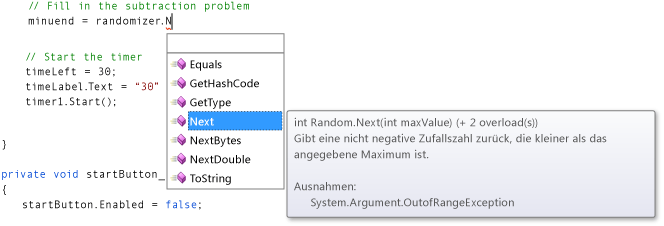
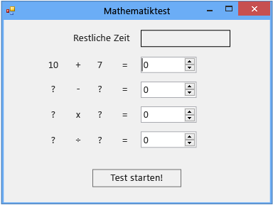

# Schritt 2: Erstellen einer zufälligen Additionsaufgabe
Im zweiten Teil dieses Lernprogramms gestalten Sie das Quiz anspruchsvoll, indem Sie mathematische Aufgaben hinzufügen, die auf Zufallszahlen basieren. Sie erstellen außerdem eine Methode mit dem Namen `StartTheQuiz()`, mit der die Aufgaben ausgefüllt und der Countdownzeitgeber gestartet wird. Später in diesem Lernprogramm fügen Sie die Subtraktions-, die Multiplikations- und Divisionsaufgaben hinzu.  
  
> [!NOTE]
>  Dieses Thema ist Teil einer Reihe von Lernprogrammen zu grundlegenden Konzepte der Codierung. Eine Übersicht des Tutorials finden Sie unter [Tutorial 2: Erstellen eines Mathequiz mit Zeitmessung](../ide/tutorial-2-create-a-timed-math-quiz.md).  
  
### So erstellen Sie eine zufällige Additionsaufgabe  
  
1.  Wählen Sie das Formular (Form1) im Formular-Designer aus.  
  
2.  Wählen Sie in der Menüleiste **Ansicht**und **Code**aus.  
  
     Je nach verwendeter Programmiersprache wird Form1.cs oder Form1.vb angezeigt. Sie können nun den Code hinter dem Formular sehen.  
  
3.  Erstellen Sie ein `Random`-Objekt, indem Sie oben im Code eine `new`-Anweisung wie die folgende hinzufügen.  
  
     [!code-csharp[VbExpressTutorial3Step2#1](../ide/codesnippet/CSharp/step-2-create-a-random-addition-problem_1.cs)]
     [!code-vb[VbExpressTutorial3Step2#1](../ide/codesnippet/VisualBasic/step-2-create-a-random-addition-problem_1.vb)]  
  
     Sie haben dem Formular ein `Random`-Objekt hinzugefügt und das Objekt **randomizer** genannt.  
  
     `Random` wird als Objekt bezeichnet. Sie haben das Wort "Objekt" wahrscheinlich schon einmal gehört. In den nächsten Lernprogrammen erfahren Sie mehr über die Bedeutung eines Objekts für die Programmierung. Im Moment müssen Sie wissen, dass Sie mit `new`-Anweisungen Schaltflächen, Bezeichnungen, Bereiche, OpenFileDialogs, ColorDialogs, SoundPlayer, Randoms und sogar Formulare erstellen können und diese Elemente als Objekte bezeichnet werden. Wenn Sie das Programm ausführen, wird das Formular gestartet, und mit dem zugrunde liegenden Code wird ein `Random`-Objekt erstellt und mit **randomizer** benannt.  
  
     In Kürze erstellen Sie eine Methode zur Überprüfung von Antworten. Sie müssen also im Quiz Variablen verwenden, mit denen die Zufallszahlen, die für die einzelnen Aufgaben generiert werden, gespeichert werden. Weitere Informationen finden Sie unter [Variablen](/dotnet/visual-basic/programming-guide/language-features/variables/index) oder [Typen](/dotnet/csharp/programming-guide/types/index). Damit die Variablen ordnungsgemäß verwendet werden, müssen Sie sie deklarieren. Das heißt, dass Sie ihre Namen und Datentypen auflisten müssen.  
  
4.  Fügen Sie dem Formular zwei Ganzzahlvariablen hinzu, und benennen Sie sie **addend1** und **addend2**.  
  
    > [!NOTE]
    >  Eine Ganzzahlvariable wird in C# als "int" oder in Visual Basic als "Integer" bezeichnet. Mit dieser Art Variablen wird eine positive oder negative Zahl von – 2147483648 bis 2147483647 gespeichert. Dabei können nur ganze Zahlen und keine Dezimalwerte gespeichert werden.  
  
     Verwenden Sie zum Hinzufügen einer Ganzzahlvariable eine ähnliche Syntax wie beim Hinzufügen des `Random`-Objekts. Dies ist im folgenden Code veranschaulicht.  
  
     [!code-csharp[VbExpressTutorial3Step2#2](../ide/codesnippet/CSharp/step-2-create-a-random-addition-problem_2.cs)]
     [!code-vb[VbExpressTutorial3Step2#2](../ide/codesnippet/VisualBasic/step-2-create-a-random-addition-problem_2.vb)]  
  
5.  Fügen Sie eine Methode mit dem Namen `StartTheQuiz()`-Methode hinzu, die die `Random`-Methode des `Next()`-Objekts verwendet, um die Zufallszahlen in den Bezeichnungen anzuzeigen. Mit `StartTheQuiz()` werden alle Aufgaben ausgefüllt und der Zeitgeber gestartet. Fügen Sie deshalb einen Kommentar hinzu. Die Funktion sollte wie folgt aussehen:  
  
     [!code-csharp[VbExpressTutorial3Step2#3](../ide/codesnippet/CSharp/step-2-create-a-random-addition-problem_3.cs)]
     [!code-vb[VbExpressTutorial3Step2#3](../ide/codesnippet/VisualBasic/step-2-create-a-random-addition-problem_3.vb)]  
  
     Wenn Sie im Code den Punkt (.) nach **randomizer** eingeben, öffnet sich ein IntelliSense-Fenster, in dem alle Methoden des `Random`-Objekts angezeigt werden, die Sie aufrufen können. Beispielsweise führt IntelliSense die `Next()`-Methode wie folgt auf.  
  
       
Nächste Methode  
  
     Wenn Sie einen Punkt nach einem Objekt eingeben, zeigt IntelliSense eine Liste der Member des Objekts an, wie Eigenschaften, Methoden und Ereignisse.  
  
    > [!NOTE]
    >  Wenn Sie die `Next()`-Methode mit dem `Random`-Objekt verwenden, z. B. wenn Sie `randomizer.Next(50)` aufrufen, wird eine Zufallszahl abgerufen, die kleiner als 50 (von 0 bis 49) ist. In diesem Beispiel haben Sie `randomizer.Next(51)` aufgerufen. Sie haben dabei die Zahl 51 und nicht 50 verwendet. Somit werden die beiden Zahlen zu einer Summe zwischen 0 und 100 addiert. Wenn die Zahl 50 an die `Next()`-Methode übergeben wird, wählt sie eine Zahl zwischen 0 bis 49 aus, sodass die höchstmögliche Antwort 98 ist und nicht 100 ist. Nachdem die ersten beiden Anweisungen in der Methode ausgeführt wurden, enthält jede der beiden Ganzzahlvariablen `addend1` und `addend2` eine Zufallszahl zwischen 0 und 50. Diese Bildschirmabbildung zeigt Visual C#-Code, doch IntelliSense funktioniert auf die gleiche Weise für Visual Basic.  
  
     Sehen Sie sich diese Anweisungen genauer an.  
  
     [!code-csharp[VbExpressTutorial3Step2#18](../ide/codesnippet/CSharp/step-2-create-a-random-addition-problem_4.cs)]
     [!code-vb[VbExpressTutorial3Step2#18](../ide/codesnippet/VisualBasic/step-2-create-a-random-addition-problem_4.vb)]  
  
     Die Anweisungen legen die **Text**-Eigenschaften von **plusLeftLabel** und **plusRightLabel** fest, damit hier die beiden Zufallszahlen angezeigt werden. Sie müssen die `ToString()`-Methode der Ganzzahl verwenden, um die Zahlen in Text zu konvertieren. (In der Programmierung bedeutet Zeichenfolge Text.) Label-Steuerelement zeigen nur Text, aber keine Zahlen an.  
  
6.  Klicken Sie im Entwurfsfenster entweder auf die Schaltfläche **Start**, oder wählen Sie sie aus, und wählen Sie dann die EINGABETASTE aus.  
  
     Wenn ein Quizteilnehmer diese Schaltfläche auswählt, startet das Quiz, und Sie haben soeben einen Click-Ereignishandler hinzugefügt, mit dem dieses Verhalten implementiert wird.  
  
7.  Fügen Sie die folgenden beiden Anweisungen hinzu.  
  
     [!code-csharp[VbExpressTutorial3Step2#4](../ide/codesnippet/CSharp/step-2-create-a-random-addition-problem_5.cs)]
     [!code-vb[VbExpressTutorial3Step2#4](../ide/codesnippet/VisualBasic/step-2-create-a-random-addition-problem_5.vb)]  
  
     Die erste Anweisung ruft die neue `StartTheQuiz()`-Methode auf. Die zweite Anweisung legt die **Enabled**-Eigenschaft des **startButton**-Steuerelements auf **False** fest, damit der Quizteilnehmer die Schaltfläche nicht während eines Quiz auswählen kann.  
  
8.  Speichern Sie den Code, führen Sie ihn aus, und wählen Sie dann die Schaltfläche **Start** aus.  
  
     Eine zufällige Additionsaufgabe wird, wie die folgende Abbildung veranschaulicht, angezeigt.  
  
       
Addition von Zufallszahlen  
  
     Im nächsten Lernprogrammschritt fügen Sie die Summe hinzu.  
  
### So fahren Sie fort oder überprüfen die Angaben  
  
-   Um zum nächsten Schritt des Tutorials zu wechseln, klicken Sie auf [Schritt 3: Hinzufügen eines Countdowntimers](../ide/step-3-add-a-countdown-timer.md).  
  
-   Um zum vorherigen Schritt des Lernprogramms zurückzukehren, klicken Sie auf [Schritt 1: Erstellen eines Projekts und Hinzufügen von Bezeichnungen zum Formular](../ide/step-1-create-a-project-and-add-labels-to-your-form.md).