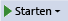
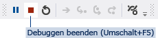

# Schritt 2: Ausf&#252;hren des Programms
[!INCLUDE[vs2017banner](../code-quality/includes/vs2017banner.md)]

Als Sie eine neue Projektmappe erstellt haben, haben Sie tatsächlich ein ausführbares Programm erstellt.  Bisher hat das Programm noch nicht viele Funktionen – es zeigt nur ein leeres Fenster mit dem Text **Form1** in der Titelleiste an.  Aber es kann ausgeführt werden, wie Sie gleich feststellen werden.  
  
  Eine Videoversion dieses Themas finden Sie im [Video 1 zum Lernprogramm 1: Erstellen eines Bildanzeigeprogramms in Visual Basic](http://go.microsoft.com/fwlink/?LinkId=205209) oder im [Video 1 zum Lernprogramm 1: Erstellen eines Bildanzeigeprogramms in C\#](http://go.microsoft.com/fwlink/?LinkId=205199).  Diese Videos verwenden eine frühere Version von Visual Studio, sodass Menübefehle und andere Benutzeroberflächenelemente geringfügig abweichen können.  Allerdings funktionieren die Konzepte und Prozeduren in der aktuellen Version von Visual Studio auf ähnliche Weise.  
  
### So führen Sie das Programm aus  
  
1.  Verwenden Sie eine der folgenden Methoden, um das Programm auszuführen.  
  
    -   Wählen Sie die Taste **F5** aus.  
  
    -   Klicken Sie in der Menüleiste auf **Debuggen** und dann auf **Debuggen starten**.  
  
    -   Wählen Sie auf der Symbolleiste die Schaltfläche **Debuggen starten** aus, die wie folgt aussieht.  
  
           
Symbolleistenschaltfläche "Debugging starten"  
  
2.  Visual Studio führt das Programm aus, und ein Fenster mit der Bezeichnung **Form1** wird angezeigt.  Im folgenden Diagramm wird das Programm gezeigt, das Sie soeben erstellt haben.  Das Programm wird ausgeführt, und Sie werden es bald ergänzen.  
  
       
Ausgeführtes Windows Form\-Anwendungsprogramm  
  
3.  Wechseln Sie zurück zur integrierten Entwicklungsumgebung \(IDE\) von Visual Studio, und schauen Sie sich die neue Symbolleiste an.  Zusätzliche Schaltflächen werden auf der Symbolleiste angezeigt, wenn ein Programm ausgeführt wird.  Mit diesen Schaltflächen können Sie Aufgaben ausführen, wie z. B. ein Programm beenden und starten. Außerdem helfen sie Ihnen, alle evtl. vorhandenen Fehler zu ermitteln.  Für dieses Beispiel verwenden wir sie nur, um das Programm zu starten und zu beenden.  
  
       
Debuggingsymbolleiste  
  
4.  Verwenden Sie eine der folgenden Methoden, um das Programm zu beenden.  
  
    -   Wählen Sie auf der Symbolleiste die Schaltfläche **Debuggen beenden** aus.  
  
    -   Wählen Sie auf der Menüleiste **Debuggen** und dann **Debuggen beenden** aus.  
  
    -   Wählen Sie die X\-Schaltfläche in der oberen Ecke des **Form1**\-Fensters aus.  
  
    > [!NOTE]
    >  Wenn Sie das Programm von der IDE aus ausführen, wird dies als *Debugging* bezeichnet, denn dies geschieht normalerweise, um Programmfehler zu finden und zu beheben.  Obwohl dieses Programm klein ist und noch keine wirkliche Funktion hat, ist es immer noch ein echtes Programm.  Halten Sie die gleiche Prozedur ein, um andere Programme auszuführen und zu debuggen.  Weitere Informationen zum Debugging finden Sie unter [Debugger – Grundlagen](../debugger/debugger-basics.md).  
  
### So fahren Sie fort oder überprüfen die Angaben  
  
-   Um zum nächsten Schritt des Lernprogramms zu wechseln, klicken Sie auf [Schritt 3: Festlegen der Formulareigenschaften](../ide/step-3-set-your-form-properties.md).  
  
-   Um zum vorherigen Schritt des Lernprogramms zurückzukehren, klicken Sie auf [Schritt 1: Erstellen eines Windows Forms\-Anwendungsprojekts](../ide/step-1-create-a-windows-forms-application-project.md).