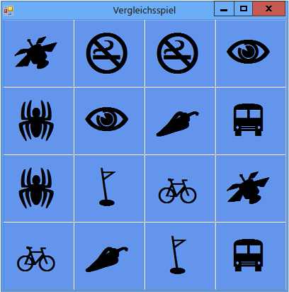

# <a name="step-3-assign-a-random-icon-to-each-label"></a>Schritt 3: Zuweisen eines zufällig ausgewählten Symbols zu jeder Bezeichnung
Es wäre zu einfach, wenn die Symbole in jedem Spiel in den gleichen Zellen erscheinen. Um dies zu vermeiden, weisen Sie die Symbole mithilfe einer `AssignIconsToSquares()`-Methode zufällig den Bezeichnungsfeld-Steuerelementen des Formulars zu.  
  
### <a name="to-assign-a-random-icon-to-each-label"></a>So weisen Sie jeder Bezeichnung ein zufälliges Symbol zu  
  
1.  Machen Sie sich vor dem Hinzufügen des folgenden Codes bewusst, wie die Methode funktioniert. Es ist ein neues Schlüsselwort verfügbar: `foreach` in Visual C# und `For Each` in Visual Basic. (Eine der Zeilen ist absichtlich auskommentiert. Dies wird am Ende dieser Prozedur erklärt.)  
  
     [!code-csharp[VbExpressTutorial4Step2_3_4#2](../ide/codesnippet/CSharp/step-3-assign-a-random-icon-to-each-label_1.cs)]  [!code-vb[VbExpressTutorial4Step2_3_4#2](../ide/codesnippet/VisualBasic/step-3-assign-a-random-icon-to-each-label_1.vb)]  
  
2.  Fügen Sie die `AssignIconsToSquares()`-Methode wie im vorherigen Schritt gezeigt hinzu. Sie können sie direkt unterhalb dem in [Schritt 2: Hinzufügen eines zufällig ausgewählten Objekts und einer Liste von Symbolen](../ide/step-2-add-a-random-object-and-a-list-of-icons.md) hinzugefügten Code einfügen.  
  
     Wie bereits erwähnt, enthält die `AssignIconsToSquares()`-Methode ein neues Element: Eine `foreach`-Schleife in Visual C# und eine `For Each`-Schleife in Visual Basic. Sie können eine `For Each`-Schleife verwenden, wenn Sie die gleiche Aktion immer wieder ausführen möchten. In diesem Fall sollen die gleichen Anweisungen für jedes Bezeichnungsfeld aus TableLayoutPanel ausgeführt werden, wie im folgenden Code erläutert wird. Die erste Zeile erstellt eine Variable mit dem Namen `control`, die nacheinander jedes Steuerelement speichert. Jedes dieser Steuerelement umfasst die Anweisungen, die in der Schleife ausgeführt werden.  
  
     [!code-csharp[VbExpressTutorial4Step2_3_4#14](../ide/codesnippet/CSharp/step-3-assign-a-random-icon-to-each-label_2.cs)]  [!code-vb[VbExpressTutorial4Step2_3_4#14](../ide/codesnippet/VisualBasic/step-3-assign-a-random-icon-to-each-label_2.vb)]  
  
    > [!NOTE]
    >  Die Namen "iconLabel" (Symbolbezeichnung) und "control" (Steuerelement) dienen zur Verdeutlichung der Verwendungsweise. Sie können diese Namen durch beliebige andere Namen ersetzen, ohne die Funktionsweise des Codes zu beeinflussen, sofern Sie die Namen in jeder Anweisung innerhalb der Schleife ändern.  
  
     Die `AssignIconsToSquares()`-Methode durchläuft jedes Bezeichnungsfeld-Steuerelement in TableLayoutPanel und führt für jedes die gleichen Anweisungen aus. Diese Anweisungen ziehen ein zufälliges Symbol aus der Liste, die Sie in [Schritt 2: Hinzufügen eines zufällig ausgewählten Objekts und einer Liste von Symbolen](../ide/step-2-add-a-random-object-and-a-list-of-icons.md) hinzugefügt haben. (Sie haben deshalb zwei Exemplare jedes Symbols in die Liste eingefügt, damit zufälligen Bezeichnungsfeld-Steuerelementen ein Symbolpaar zugewiesen werden kann.)  
  
     Betrachten Sie den Code genauer, der innerhalb der `foreach`-Schleife oder der `For Each`-Schleife ausgeführt wird. Dabei handelt es sich um den folgenden Code.  
  
     [!code-csharp[VbExpressTutorial4Step2_3_4#16](../ide/codesnippet/CSharp/step-3-assign-a-random-icon-to-each-label_3.cs)]  [!code-vb[VbExpressTutorial4Step2_3_4#16](../ide/codesnippet/VisualBasic/step-3-assign-a-random-icon-to-each-label_3.vb)]  
  
     In der ersten Zeile wird die Variable `control` in ein Bezeichnungsfeld mit dem Namen `iconLabel` konvertiert. Die folgende Zeile ist eine `if`-Anweisung, die prüft, ob die Konvertierung erfolgt ist. Wenn die Konvertierung funktioniert, werden die Anweisungen innerhalb der `if`-Anweisung ausgeführt. (Wie Sie vielleicht aus vorherigen Lernprogrammen wissen, kann mit der `if`-Anweisung eine beliebige Bedingung geprüft werden.) Die erste Zeile in der `if`-Anweisung erstellt die Variable `randomNumber`, die eine Zufallszahl enthält, die einem der Elemente in der Symbolliste entspricht. Dazu verwendet die Anweisung die `Next`-Methode des `Random`-Objekts, das Sie früher erstellt haben. Die `Next`-Methode gibt eine Zufallszahl zurück. Diese Zeile verwendet auch die `Count`-Eigenschaft der `icons`-Liste, um den Bereich festzulegen, aus dem die Zufallszahl ausgewählt wird. Die nächste Zeile weist der `Text`-Eigenschaft des Bezeichnungsfelds eines der Symbollistenelemente zu. Die auskommentierte Zeile wird später in diesem Thema erläutert. Schließlich entfernt die letzte Zeile in der `if`-Anweisung das Symbol aus der Liste, das dem Formular hinzugefügt wurde.  
  
     Vergessen Sie nicht: Wenn Sie sich über die Funktionsweise eines Codeabschnitts nicht sicher sind, können Sie den Mauszeiger über einem Codeelement positionieren und erhalten eine entsprechende QuickInfo. Mithilfe des Visual Studio-Debuggers können Sie auch während der Programmausführung jede Codezeile untersuchen. Weitere Informationen finden Sie unter [How Do I: Step with The Debugger in Visual Studio? (Wie setze ich den Debugger in Visual Studio ein?)](http://msdn.microsoft.com/vstudio/ee672313.aspx) oder unter [Navigieren im Code mit dem Debugger](../debugger/navigating-through-code-with-the-debugger.md).  
  
3.  Um das Spielbrett mit Symbolen zu füllen, müssen Sie die `AssignIconsToSquares()`-Methode aufrufen, sobald das Programm startet. Wenn Sie Visual C# verwenden, fügen Sie direkt unter dem Aufruf der `InitializeComponent()`-Methode im `Form1`*Konstruktor* eine Anweisung hinzu, mit der das Formular die neue Methode aufruft und sich entsprechend einrichtet, bevor es angezeigt wird. Konstruktoren werden aufgerufen, wenn Sie ein neues Objekt erstellen, beispielsweise eine Klasse oder eine Struktur. Weitere Informationen finden Sie unter [Konstruktoren (C#-Programmierhandbuch)](http://msdn.microsoft.com/library/ace5hbzh.aspx) oder unter [Verwenden von Konstruktoren und Destruktoren](http://msdn.microsoft.com/library/2z08e49e.aspx) in Visual Basic.  
  
     [!code-csharp[VbExpressTutorial4Step2_3_4#13](../ide/codesnippet/CSharp/step-3-assign-a-random-icon-to-each-label_4.cs)]  
  
     In Visual Basic fügen Sie den `AssignIconsToSquares()`-Methodenaufruf der `Form1_Load`-Methode hinzu, sodass der Code wie folgt aussieht.  
  
    ```vb  
    Private Sub Form1_Load(sender As Object, e As EventArgs) Handles MyBase.Load  
        AssignIconsToSquares()  
    End Sub  
    ```  
  
4.  Speichern Sie das Programm, und führen Sie es aus. Es sollte ein Formular mit zufälligen Symbolen angezeigt werden, die den einzelnen Bezeichnungen zugewiesen sind.  
  
5.  Schließen Sie das Programm, und führen Sie es erneut aus. In der folgenden Abbildung erkennen Sie, dass den einzelnen Bezeichnungsfeldern nun unterschiedliche Symbole zugewiesen sind.  
  
       
Vergleichsspiel mit zufälligen Symbolen  
  
     Die Symbole sind jetzt sichtbar, weil sie nicht ausgeblendet wurden. Um Sie vor dem Spieler zu verbergen, können Sie für die `Forecolor`-Eigenschaft jedes Bezeichnungsfelds die Farbe der `BackColor`-Eigenschaft verwenden.  
  
    > [!TIP]
    >  Eine andere Methode zum Ausblenden von Steuerelementen wie Bezeichnungen ist, deren **Sichtbar**-Eigenschaft auf `False` festzulegen.  
  
6.  Um die Symbole auszublenden, stoppen Sie das Programm und entfernen die Kommentarmarken für die kommentierte Codezeile innerhalb der `For Each`-Schleife.  
  
     [!code-csharp[VbExpressTutorial4Step2_3_4#15](../ide/codesnippet/CSharp/step-3-assign-a-random-icon-to-each-label_5.cs)]  [!code-vb[VbExpressTutorial4Step2_3_4#15](../ide/codesnippet/VisualBasic/step-3-assign-a-random-icon-to-each-label_5.vb)]  
  
7.  Wählen Sie auf der Menüleiste die Schaltfläche **Alle speichern**, um das Programm zu speichern, und führen Sie es anschließend aus. Die Symbole scheinen nicht mehr vorhanden zu sein, und es wird nur ein blauer Hintergrund angezeigt. Die Symbole werden jedoch zufällig zugewiesen und sind immer noch vorhanden. Da die Symbole die gleiche Farbe wie der Hintergrund besitzen, sind Sie für den Spieler nicht sichtbar. Es wäre ja auch ein langweiliges Spiel, wenn der Spieler alle Symbole sofort sehen könnte!  
  
### <a name="to-continue-or-review"></a>So fahren Sie fort oder überprüfen die Angaben  
  
-   Informationen darüber, wie Sie zum nächsten Lernprogramm-Schritt wechseln, finden Sie unter [Schritt 4: Hinzufügen eines Click-Ereignishandlers zu jeder Bezeichnung](../ide/step-4-add-a-click-event-handler-to-each-label.md).  
  
-   Informationen darüber, wie Sie zum vorherigen Lernprogramm-Schritt zurückzukehren, finden Sie unter [Schritt 2: Hinzufügen eines zufällig ausgewählten Objekts und einer Liste von Symbolen](../ide/step-2-add-a-random-object-and-a-list-of-icons.md).
