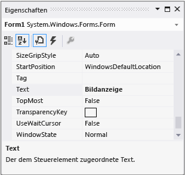

# Schritt 3: Festlegen der Formulareigenschaften

Als Nächstes verwenden Sie das **Eigenschaftenfenster**, um das Aussehen des Formulars zu ändern.

## Festlegen der Formulareigenschaften

1. Stellen Sie sicher, dass Sie **Windows Forms-Designer** anzeigen. Wählen Sie in der integrierten Entwicklungsumgebung (IDE) von Visual Studio die Registerkarte **Form1.cs [Design]** (oder die Registerkarte **Form1.vb [Design]** in Visual Basic) aus.

1. Wählen Sie im Formular **Form1** eine beliebige Stelle, um es auszuwählen. Betrachten Sie das **Eigenschaftenfenster**, das jetzt die Eigenschaften für das Formular enthalten sollte. Formulare verfügen über verschiedene Eigenschaften. Sie können z. B. die Vordergrund- und Hintergrundfarbe, den Titeltext, der oben im Formular erscheint, die Größe des Formulars und andere Eigenschaften festlegen.

   > [!NOTE]
   > Wenn das **Eigenschaftenfenster** nicht angezeigt wird, beenden Sie die App, indem Sie auf der Symbolleiste die quadratische Schaltfläche **Debuggen beenden** auswählen, oder schließen Sie das Fenster einfach. Wenn die App beendet wurde und das **Eigenschaftenfenster** immer noch nicht angezeigt wird, wählen Sie in der Menüleiste **Ansicht** > **Eigenschaftenfenster** aus.

1. Suchen Sie nach dem Auswählen des Formulars die Eigenschaft **Text** im Fenster **Eigenschaften**. Je nachdem, wie die Liste sortiert wird, müssen Sie möglicherweise einen Bildlauf nach unten durchführen. Wählen Sie **Text** aus, geben Sie **Picture Viewer** ein, und drücken Sie dann die **EINGABETASTE**.  In der Titelleiste des Formulars sollte jetzt der Text **Picture Viewer** angezeigt werden, und das **Eigenschaftenfenster** sollte wie im folgenden Screenshot aussehen.

     
   ***Eigenschaften****fenster*

   > [!NOTE]
   > Eigenschaften können in einer **kategorisierten** oder **alphabetischen** Ansicht angeordnet sein. Sie können mit den Schaltflächen im **Eigenschaftenfenster** zwischen diesen beiden Ansichten umschalten. In diesem Tutorial ist es einfacher, in der **alphabetischen** Ansicht nach Eigenschaften zu suchen.

1. Kehren Sie zum **Windows Forms-Designer** zurück. Wählen Sie unten rechts den Ziehpunkt des Formulars aus. Dies ist ein kleines, weißes Quadrat, das wie folgt aussieht.

     
   *Ziehpunkt*

    Ziehen Sie am Ziehpunkt, um die Größe des Formulars so zu ändern, dass es breiter und ein bisschen größer ist.

1. Im **Eigenschaftenfenster** können Sie feststellen, dass sich der Wert der Eigenschaft **Size** geändert hat. Die Eigenschaft **Size** ändert sich jedes Mal, wenn Sie die Größe des Formulars ändern. Versuchen Sie, die Formulargröße durch Ziehen am Ziehpunkt in eine Größe von ca. **550, 350** zu ändern (muss nicht exakt sein). Diese Größe eignet sich gut für dieses Projekt. Alternativ können Sie die Werte direkt in der Eigenschaft **Size** eingeben und dann die **EINGABETASTE** drücken.

1. Führen Sie die App noch mal aus. Denken Sie daran, dass Sie eine der folgenden Methoden verwenden können, um die App auszuführen.

   - Drücken Sie die Taste **F5**.

   - Klicken Sie in der Menüleiste auf **Debuggen** > **Debuggen starten**.

   - Wählen Sie auf der Symbolleiste die Schaltfläche **Debuggen starten** aus, die wie folgt aussieht.

       
     *Symbolleistenschaltfläche* ***Debugging starten***

     Wie bereits zuvor geschehen, erstellt die IDE die App und führt sie aus, und ein Fenster wird angezeigt.

1. Bevor Sie mit dem nächsten Schritt fortfahren, beenden Sie die App, da die IDE Änderungen an einer App, die ausgeführt wird, nicht zulässt. Denken Sie daran, dass Sie eine der folgenden Methoden verwenden können, um die App zu beenden.

   - Wählen Sie auf der Symbolleiste die Schaltfläche **Debuggen beenden** aus.

   - Klicken Sie in der Menüleiste auf **Debuggen** > **Debuggen beenden** aus.

   - Drücken Sie **UMSCHALT**+**F5**.

   - Klicken Sie auf das **X** in der oberen rechten Ecke des **Picture Viewer**-Fensters.

## Nächste Schritte

* Den nächsten Schritt des Tutorials finden Sie unter **[Schritt 4: Erstellen eines Layouts für das Formular mit einem TableLayoutPanel-Steuerelement](../ide/step-4-lay-out-your-form-with-a-tablelayoutpanel-control.md)** .

* Den vorherigen Schritt des Tutorials finden Sie unter [Schritt 2: Ausführen Ihrer Picture Viewer-App](../ide/step-2-run-your-program.md).

## Siehe auch

* [Tutorial 2: Erstellen eines Mathequiz mit Zeitmessung](tutorial-2-create-a-timed-math-quiz.md)
* [Tutorial 3: Erstellen eines Vergleichsspiels](tutorial-3-create-a-matching-game.md)
