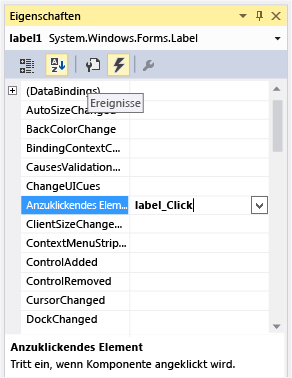

# Schritt 4: Hinzufügen eines Click-Ereignishandlers zu jeder Bezeichnung
Das Vergleichsspiel funktioniert wie folgt:  

1.  Wenn ein Spieler eines der Quadrate mit einem ausgeblendeten Symbol wählt, zeigt das Programm dem Spieler das Symbol an, indem es die Symbolfarbe in Schwarz ändert.  

2.  Dann wählt der Spieler ein anderes ausgeblendetes Symbol.  

3.  Wenn die Symbole übereinstimmen, bleiben sie sichtbar. Falls nicht, werden beide Symbole wieder ausgeblendet.  

 Damit das Programm sich wie beschrieben verhält, fügen Sie einen Click-Ereignishandler hinzu, der die Farbe des gewählten Bezeichnungsfelds ändert.  

### So fügen Sie jeder Bezeichnung einen Click-Ereignishandler hinzu  

1.  Öffnen Sie das Formular im Windows Forms-Designer. Wählen Sie Form1.cs oder Form1.vb im Projektmappen-Explorer. Wählen Sie in der Menüleiste **Ansicht**, **Designer**.  

2.  Wählen Sie das erste Bezeichnungsfeld-Steuerelement, um es zu markieren. Halten Sie dann die STRG-TASTE gedrückt, während Sie nacheinander die anderen Bezeichnungsfelder wählen. Achten Sie darauf, dass jede Bezeichnung ausgewählt wird.  

3.  Wählen Sie die Schaltfläche **Ereignisse** auf der Symbolleiste im Fenster **Eigenschaften**, um die Seite **Ereignisse** im Fenster **Eigenschaften** anzuzeigen. Führen Sie einen Bildlauf nach unten bis zum **Click**-Ereignis durch, und geben Sie **label_Click** ein, wie in der folgenden Abbildung dargestellt.  

       
Anzeige des Click-Ereignisses im Eigenschaftenfenster  

4.  Wählen Sie anschließend die EINGABETASTE. Die IDE fügt dem Code einen Click-Ereignishandler mit dem Namen `label_Click()` hinzu und verknüpft diesen mit jedem Bezeichnungsfeld im Formular.  

5.  Fügen Sie den Rest des Codes wie folgt ein:  

     [!code-csharp[VbExpressTutorial4Step2_3_4#4](../ide/codesnippet/CSharp/step-4-add-a-click-event-handler-to-each-label_1.cs)]
     [!code-vb[VbExpressTutorial4Step2_3_4#4](../ide/codesnippet/VisualBasic/step-4-add-a-click-event-handler-to-each-label_1.vb)]  

    > [!NOTE]
    >  Wenn Sie den `label_Click()`-Codeblock nicht manuell eingeben, sondern ihn kopieren und einfügen, achten Sie darauf, den vorhandenen `label_Click()`-Code zu ersetzen. Andernfalls erhalten Sie einen doppelten Codeblock.  

    > [!NOTE]
    >  Wie Sie möglicherweise bemerkt haben, ist `object sender` am Anfang des Ereignishandlers der gleiche wie im [Tutorial 2: Erstellen eines Mathequiz mit Zeitmessung](../ide/tutorial-2-create-a-timed-math-quiz.md). Da Sie verschiedene Click-Ereignisse von Bezeichnungsfeld-Steuerelementen mit einer einzelnen Ereignishandlermethode verknüpft haben, wird immer diese Methode aufgerufen, unabhängig davon, welches Bezeichnungsfeld der Benutzer wählt. Die Ereignishandlermethode muss wissen, welche Bezeichnung ausgewählt wurde, und verwendet den **Sender**-Namen, um das Steuerelement zu identifizieren. Die erste Zeile der Methode teilt dem Programm mit, dass es sich nicht nur um ein generisches Objekt handelt, sondern ausdrücklich um ein Bezeichnungsfeld-Steuerelement, und dass zum Zugreifen auf dessen Eigenschaften und Methoden der Name **clickedLabel** verwendet wird.  

     Diese Methode überprüft zuerst, ob **clickedLabel** erfolgreich von einem Objekt in ein Bezeichnungsfeld-Steuerelement umgewandelt wurde. Falls hierbei ein Fehler auftritt, lautet der Wert `null` (C#) bzw. `Nothing` (Visual Basic). Der Rest des Codes in der Methode soll dann nicht mehr ausgeführt werden. Als Nächstes überprüft die Methode mithilfe der **ForeColor**-Eigenschaft die Textfarbe des gewählten Bezeichnungsfelds. Wenn die Textfarbe des Bezeichnungsfelds Schwarz ist, wurde das Symbol bereits ausgewählt und die Methode muss abgebrochen werden. (Dies ist Aufgabe der `return`-Anweisung: Sie weist das Programm an, die Ausführung der Methode zu beenden.) Andernfalls ist das Symbol nicht ausgewählt worden, und das Programm ändert die Textfarbe des Bezeichnungsfelds in Schwarz.  

6.  Wählen Sie in der Menüleiste **Datei** die Option **Alle speichern**, um Ihre Arbeit zu speichern, und wählen Sie dann in der Menüleiste **Debuggen** die Option **Debuggen starten**, um das Programm auszuführen. Es wird ein leeres Formular mit einem blauen Hintergrund angezeigt. Wählen Sie eine der Zellen im Formular, und eines der Symbole sollte sichtbar werden. Setzten Sie die Auswahl mit anderen Stellen im Formular fort. Wenn Sie die Symbole wählen, sollten diese angezeigt werden.  

### So fahren Sie fort oder überprüfen die Angaben  

-   Um zum nächsten Schritt des Tutorials zu wechseln, klicken Sie auf [Schritt 5: Hinzufügen von Bezeichnungsverweisen](../ide/step-5-add-label-references.md).  

-   Informationen darüber, wie Sie zum vorherigen Tutorial-Schritt zurückkehren, finden Sie unter [Schritt 3: Zuweisen eines zufällig ausgewählten Symbols zu jeder Bezeichnung](../ide/step-3-assign-a-random-icon-to-each-label.md).
