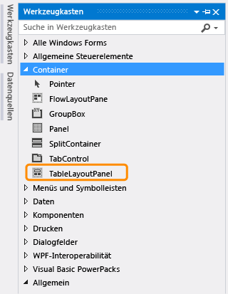
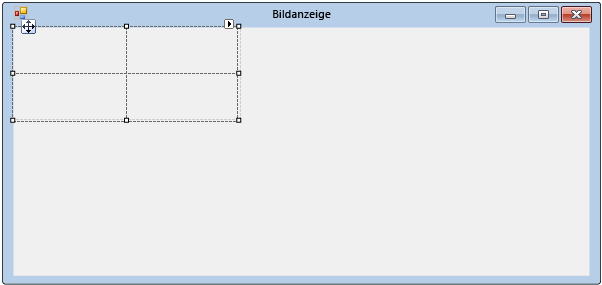
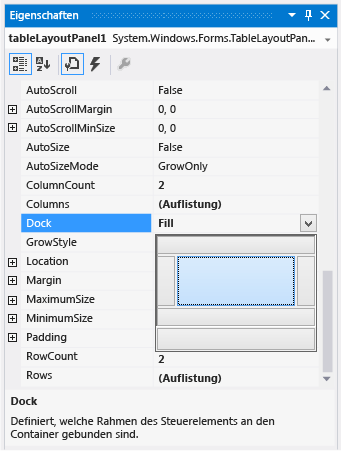
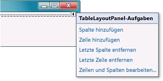
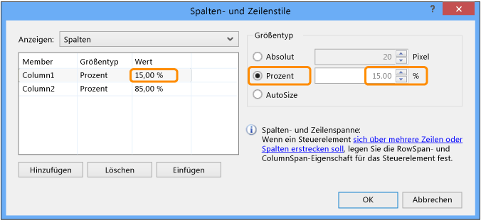
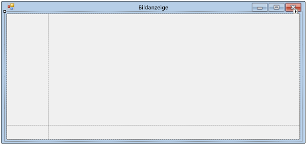

# Schritt 4: Erstellen eines Layouts für das Formular mit einem TableLayoutPanel-Steuerelement

In diesem Schritt fügen Sie Ihrem Formular ein <xref:System.Windows.Forms.TableLayoutPanel>-Steuerelement hinzu. Das TableLayoutPanel-Steuerelement hilft Ihnen dabei, Steuerelemente im Formular ordnungsgemäß auszurichten, die Sie später hinzufügen.

## Erstellen des Layouts für das Formular mit einem TableLayoutPanel-Steuerelement

1. Wählen Sie die Registerkarte **Toolbox** auf der linken Seite der Visual Studio-IDE aus. (Klicken Sie alternativ in der Menüleiste auf **Ansicht** > **Toolbox**, oder drücken Sie **STRG**+**ALT**+**X**.)

1. Klicken Sie zum Öffnen der Gruppe **Container** wie im folgenden Screenshot gezeigt auf das kleine Dreiecksymbol daneben.

      
*Gruppe* ***Container***

1. Sie können dem Formular Steuerelemente hinzufügen, z. B. Schaltflächen, Kontrollkästchen und Beschriftungen. Doppelklicken Sie in der **Toolbox** auf das TableLayoutPanel-Steuerelement. (Sie können auch das Steuerelement von der Toolbox in das Formular ziehen.) Dies bewirkt, dass die IDE dem Formular wie im folgenden Screenshot gezeigt ein TableLayoutPanel-Steuerelement hinzufügt.

      
*Steuerelement* ***TableLayoutPanel***

    > [!NOTE]
    > Wenn im Formular ein Fenster mit dem Titel **TableLayoutPanel-Aufgaben** angezeigt wird, nachdem Sie das TableLayoutPanel-Steuerelement hinzugefügt haben, wählen Sie eine beliebige Stelle im Formular aus, um es zu schließen. Im späteren Verlauf dieses Tutorials erfahren Sie mehr über dieses Fenster.

     Beachten Sie, wie die **Toolbox** Werkzeugkasten erweitert wird, um das Formular abzudecken, wenn Sie die Registerkarte auswählen, und geschlossen wird, nachdem Sie eine Stelle außerhalb des Formulars ausgewählt haben. Das ist das IDE-Feature „Automatisch im Hintergrund“. Sie können das Feature für alle Fenster aktivieren oder deaktivieren, indem Sie oben rechts im Fenster auf das Stecknadelsymbol klicken, um das Feature „Automatisch im Hintergrund“ ein- und auszuschalten. Das Ortsmarkensymbol sieht wie folgt aus.

      
***Stecknadel****symbol*

1. Stellen Sie sicher, dass Sie TableLayoutPanel auswählen. Sie können überprüfen, welches Steuerelement ausgewählt ist, indem Sie sich die im folgenden Screenshot gezeigte Dropdownliste oben im **Eigenschaftenfenster** ansehen.

      
***Eigenschaftenfenster*** *mit* ***TableLayoutPanel***-*Steuerelement*

1. Wählen Sie die Schaltfläche **Alphabetisch** auf der Symbolleiste im Fenster **Eigenschaften** aus. Dadurch wird die Liste der Eigenschaften im **Eigenschaftenfenster** in alphabetischer Reihenfolge sortiert, was die Suche nach den Eigenschaften für dieses Tutorial erleichtert.

1. Die Steuerelementauswahl ist eine Dropdownliste oben im **Eigenschaftenfenster**. In diesem Beispiel ist ein Steuerelement mit dem Namen `tableLayoutPanel1` ausgewählt. Sie können Steuerelemente auswählen, indem Sie entweder einen Bereich im **Windows Forms-Designer** auswählen oder in der Steuerelementauswahl das gewünschte Steuerelement auswählen.

   Suchen Sie bei ausgewähltem TableLayoutPanel-Steuerelement nach der Eigenschaft **Dock**, und wählen Sie die Eigenschaft **Dock** aus, die auf **None** gesetzt sein sollte. Beachten Sie, dass neben dem Wert ein Dropdownpfeil angezeigt wird. Klicken Sie auf den Pfeil, und klicken Sie dann wie im folgenden Screenshot gezeigt auf die Schaltfläche **Füllen** (die große Schaltfläche in der Mitte) aus.

      
***Eigenschaftenfenster*** *mit* ***Füllen*** *ausgewählt*

     *Andocken* in Visual Studio bedeutet, dass ein Fenster an ein anderes Fenster oder einen anderen Bereich der IDE angefügt wird. Beispielsweise kann das **Eigenschaftenfenster** abgedockt werden, &mdash;d. h. es wird getrennt und kann frei in Visual Studio verschoben werden&mdash;, oder an den **Projektmappen-Explorer** angedockt werden.

1. Nachdem Sie die **Dock**-Eigenschaft des TableLayoutPanel-Steuerelements auf **Füllen** festgelegt haben, nimmt der Bereich das gesamte Formular ein. Wenn Sie die Größe des Formulars wieder ändern, bleibt das TableLayoutPanel-Steuerelement verankert und passt sich an die Formulargröße an.

    > [!NOTE]
    > Ein TableLayoutPanel-Steuerelement funktioniert wie eine Tabelle in Microsoft Office Word: Es weist Zeilen und Spalten auf, und eine einzelne Zelle kann sich über mehrere Zeilen und Spalten erstrecken. Jede Zelle kann ein Steuerelement enthalten (z. B. eine Schaltfläche, ein Kontrollkästchen oder eine Beschriftung). Das TableLayoutPanel-Steuerelement sollte über ein <xref:System.Windows.Forms.PictureBox>-Steuerelement, das sich über die gesamte oberste Zeile erstreckt, ein <xref:System.Windows.Forms.CheckBox>-Steuerelement in der Zelle unten links und vier <xref:System.Windows.Forms.Button>-Steuerelemente in der Zelle unten rechts verfügen.

1. Derzeit weist das TableLayoutPanel-Steuerelement zwei gleich große Zeilen und zwei gleich große Spalten auf. Als Nächstes ändern Sie ihre Größe, damit die obere Zeile und die rechte Spalte deutlich größer sind. Wählen Sie im **Windows Forms-Designer** das TableLayoutPanel-Steuerelement aus. Oben rechts in der Ecke befindet sich eine Schaltfläche in Form eines kleinen schwarzen Dreiecks, die wie folgt aussieht.

      
***Dreieck***-*Schaltfläche*

     Diese Schaltfläche zeigt an, dass das Steuerelement über Aufgaben verfügt, die Sie beim automatischen Festlegen von Eigenschaften unterstützen.

1. Klicken Sie auf das Dreieck, um die Aufgabenliste des Steuerelements wie im folgenden Screenshot gezeigt anzuzeigen.

      
***TableLayoutPanel***-*Aufgaben*

1. Wählen Sie die Aufgabe **Zeilen und Spalten bearbeiten** aus, um das Fenster **Spalten- und Zeilenstile** anzuzeigen. Wählen Sie **Column1** aus, und legen Sie die Größe auf 15 Prozent fest, indem Sie die Schaltfläche **Prozent** auswählen und im Feld **Prozent** den Wert **15** eingeben. (Das ist ein <xref:System.Windows.Forms.NumericUpDown>-Steuerelement, das Sie in einem späteren Tutorial verwenden.) Wählen Sie **Column2** aus, und legen Sie die Größe auf 85 Prozent fest. Wählen Sie noch nicht die Schaltfläche **OK** aus, da sonst das Fenster geschlossen wird. (Wenn Sie das Fenster versehentlich schließen, können Sie es über die Aufgabenliste noch mal öffnen.)

      
*Spalten- und Zeilenstile für* ***TableLayoutPanel***

1. Wählen Sie in der Dropdownliste **Anzeigen** oben im Fenster **Spalten- und Zeilenstile** die Option **Zeilen** aus. Legen Sie **Row1** auf 90 Prozent und **Row2** auf 10 Prozent fest.

1. Klicken Sie auf die Schaltfläche **OK** . Das TableLayoutPanel-Steuerelement sollte jetzt über eine große oberste Zeile, eine kleine unterste Zeile, eine kleine linke Spalte und eine große rechte Spalte verfügen. (Sie können die Größe der Zeilen und Spalten im TableLayoutPanel-Steuerelement ändern, indem Sie **tableLayoutPanel1** im Formular auswählen und dann die Zeilen- und Spaltenränder ziehen.)

      
***Form1*** *(Picture Viewer) mit angepasstem Steuerelement* ***TableLayoutPanel***

## Nächste Schritte

* Den nächsten Schritt des Tutorials finden Sie unter **[Schritt 5: Hinzufügen von Steuerelementen zum Formular](../ide/step-5-add-controls-to-your-form.md)** .

* Den vorherigen Schritt des Tutorials finden Sie unter [Schritt 3: Festlegen der Formulareigenschaften](../ide/step-3-set-your-form-properties.md).

## Siehe auch

* [Tutorial 2: Erstellen eines Mathequiz mit Zeitmessung](tutorial-2-create-a-timed-math-quiz.md)
* [Tutorial 3: Erstellen eines Vergleichsspiels](tutorial-3-create-a-matching-game.md)
