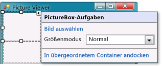
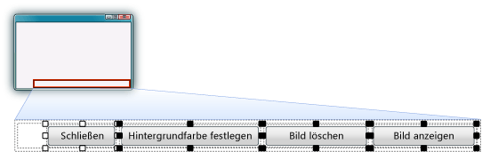

# Schritt 5: Hinzufügen von Steuerelementen zum Formular

In diesem Schritt fügen Sie dem Formular Steuerelemente hinzu, z. B. ein <xref:System.Windows.Forms.PictureBox>-Steuerelement und ein <xref:System.Windows.Forms.CheckBox>-Steuerelement. Anschließend fügen Sie dem Formular <xref:System.Windows.Forms.Button>-Steuerelemente hinzu.

## Hinzufügen von Steuerelementen zum Formular

1. Wechseln Sie zur Registerkarte **Toolbox** auf der linken Seite der Visual Studio-IDE (oder drücken Sie **STRG**+**ALT**+**X**), und erweitern Sie dann die Gruppe **Allgemeine Steuerelemente**. In dieser Gruppe werden allgemeine Steuerelemente angezeigt, die in Formularen häufig verwendet werden.

1. Doppelklicken Sie auf das Element **PictureBox**, um dem Formular ein PictureBox-Steuerelement hinzuzufügen. Da TableLayoutPanel angedockt ist, um das Formular zu füllen, fügt die IDE der ersten leeren Zelle (der oberen linken Ecke) das PictureBox-Steuerelement hinzu.

1. Wählen Sie das neue Steuerelement **PictureBox** aus, und klicken Sie dann auf das schwarze Dreieck auf dem neuen PictureBox-Steuerelement, um die dazugehörige Aufgabenliste wie im folgenden Screenshot gezeigt anzuzeigen.

     ***PictureBox***-*Aufgaben**

    > [!NOTE]
    > Wenn Sie dem TableLayoutPanel unbeabsichtigt den falschen Typ von Steuerelement hinzufügen, können Sie es löschen. Klicken Sie mit der rechten Maustaste auf das Steuerelement, und wählen Sie dann im Kontextmenü **Löschen** aus. Sie können Steuerelemente aus dem Formular auch mithilfe der Menüleiste entfernen. Wählen Sie in der Menüleiste **Bearbeiten** > **Rückgängig** oder **Bearbeiten** > **Löschen** aus.

1. Klicken Sie im Menü **PictureBox-Aufgaben** des Steuerelements **PictureBox** auf den Link **In übergeordnetem Container andocken**. Dadurch wird die **Dock**-Eigenschaft des PictureBox-Steuerelements automatisch auf **Fill** festgelegt. Sie können dies überprüfen, indem Sie das Steuerelement **PictureBox** auswählen. Öffnen Sie dann das Fenster **Eigenschaften**, und vergewissern Sie sich, dass die Eigenschaft **Dock** auf **Fill** festgelegt ist.

1. Sorgen Sie dafür, dass das PictureBox-Steuerelement beide Spalten umfasst, indem Sie dessen **ColumnSpan**-Eigenschaft ändern. Wählen Sie in **PictureBox** das **PictureBox**-Steuerelement aus, und legen Sie**2** für die Eigenschaft **ColumnSpan** fest. Auch wenn das PictureBox-Steuerelement leer ist, möchten Sie einen leeren Frame anzeigen. Legen Sie die **BorderStyle**-Eigenschaft auf **Fixed3D** fest.

    > [!NOTE]
    > Wenn die Eigenschaft **ColumnSpan** für das PictureBox-Steuerelement nicht angezeigt wird, ist es wahrscheinlich, dass das PictureBox-Steuerelement zum Formular anstatt zum TableLayoutPanel hinzugefügt wurde. Um dies zu korrigieren, wählen Sie das Steuerelement **PictureBox** aus, und löschen Sie es. Wählen Sie anschließend **TableLayoutPanel** aus, und fügen Sie ein neues PictureBox-Steuerelement hinzu.

1. Wählen Sie im Formular **TableLayoutPanel** aus, und fügen Sie dem Formular anschließend ein CheckBox-Steuerelement hinzu. Doppelklicken Sie in der **Toolbox** auf das Element **CheckBox**, um der nächsten freien Zelle in der Tabelle ein neues CheckBox-Steuerelement hinzuzufügen. Da ein PictureBox-Steuerelement die ersten beiden Zellen im TableLayoutPanel einnimmt, wird das CheckBox-Steuerelement der linken unteren Zelle hinzugefügt. Wählen Sie die Eigenschaft **Text** aus, und geben Sie wie in der folgenden Abbildung dargestellt das Wort **Stretch** ein.

     ***Steuerelement*** *TextBox* mit ***Stretch***-*Eigenschaft*

1. Wählen Sie das Steuerelement **TableLayoutPanel** im Formular aus, und wechseln Sie dann zur Gruppe **Container** in der **Toolbox** (wo Sie das TableLayoutPanel-Steuerelement abgerufen haben). Doppelklicken Sie auf das Element **FlowLayoutPanel**, um der letzten Zelle (unten rechts) ein neues Steuerelement hinzuzufügen. Docken Sie dann das FlowLayoutPanel-Element im TableLayoutPanel-Steuerelement an. Hierzu klicken Sie entweder in der Aufgabenliste des FlowLayoutPanel-Elements auf **In übergeordnetem Container andocken** oder legen die **Dock**-Eigenschaft des Steuerelements auf **Fill** fest.

    > [!NOTE]
    > Ein <xref:System.Windows.Forms.FlowLayoutPanel> ist ein Container, der andere Steuerelemente in einer Zeile nacheinander anordnet. Wenn Sie die Größe eines FlowLayoutPanel-Elements ändern, werden alle enthaltenen Steuerelemente in einer Reihe platziert, wenn hierzu genügend Platz vorhanden ist. Andernfalls ordnet es die Steuerelemente untereinander in Zeilen an.   Hier verwenden Sie ein FlowLayoutPanel-Element, das vier Schaltflächen enthält. Wenn die Schaltflächen untereinander angeordnet werden, wenn Sie sie hinzufügen, stellen Sie sicher, dass Sie das FlowLayoutPanel-Element ausgewählt haben, bevor Sie sie hinzufügen.   (In der Regel enthält jede Zelle nur ein Steuerelement. In diesem Beispiel enthält die untere rechte Zelle des TableLayoutPanel-Steuerelements vier Schaltflächen-Steuerelemente. Warum?  Weil das FlowLayoutPanel-Element ein Containersteuerelement ist, d. h. es ist ein Steuerelement in einer Zelle, das andere Steuerelemente enthält.)

## So fügen Sie Schaltflächen hinzu

1. Wählen Sie das neu hinzugefügte FlowLayoutPanel aus. Gehen Sie in der **Toolbox** zu **Allgemeine Steuerelemente**, und doppelklicken Sie auf das Element **Schaltfläche**, um FlowLayoutPanel ein Schaltflächen-Steuerelement namens **button1** hinzuzufügen. Wiederholen Sie den Vorgang, um eine weitere Schaltfläche hinzuzufügen. Die IDE stellt fest, dass bereits eine Schaltfläche mit dem Namen **button1** vorhanden ist, und gibt der nächsten Schaltfläche den Namen **button2**.

1. In der Regel werden die anderen Schaltflächen mit der **Toolbox** hinzugefügt. Klicken Sie dieses Mal auf **button2** und dann in der Menüleiste auf **Bearbeiten** > **Kopieren** (oder drücken Sie **STRG**+**C**). Klicken Sie dann in der Menüleiste auf **Bearbeiten** > **Einfügen** (oder drücken Sie **STRG**+**V**), um eine Kopie der Schaltfläche einzufügen. Fügen Sie sie jetzt erneut ein. Beachten Sie, dass die IDE **button3** und **button4** zum FlowLayoutPanel-Element hinzufügt.

    > [!NOTE]
    > Sie können jedes Steuerelement kopieren und einfügen. Die neuen Steuerelemente werden von der IDE auf eine logische Weise benannt und eingefügt. Wenn Sie ein Steuerelement in einen Container einfügen, wählt die IDE den nächsten logischen Platz für die Platzierung aus.

1. Wählen Sie die erste Schaltfläche aus, und legen Sie die entsprechende **Text**-Eigenschaft auf **Bild anzeigen** fest. Legen Sie dann die **Text**-Eigenschaften der nächsten drei Schaltflächen auf **Bild löschen**, **Hintergrundfarbe festlegen** und **Schließen** fest.

1. Als Nächstes passen Sie die Größe der Schaltflächen an und richten sie an der rechten Seite des Bereichs aus. Klicken Sie auf **FlowLayoutPanel**, und sehen Sie dessen **FlowDirection**-Eigenschaft an. Ändern Sie die Eigenschaft in **RightToLeft**.

   Die Schaltflächen sollten entlang der rechten Seite der Zelle ausgerichtet sein und in umgekehrter Reihenfolge angezeigt werden, sodass sich die Schaltfläche **Bild anzeigen** auf der rechten Seite befindet.

    > [!NOTE]
    > Wenn die Schaltflächen immer noch in der falschen Reihenfolge angeordnet sind, können Sie die Schaltflächen innerhalb des FlowLayoutPanel ziehen, um sie in gewünschter Reihenfolge neu anzuordnen. Sie können eine Schaltfläche auswählen und sie nach links oder rechts ziehen.

1. Wählen Sie die Schaltfläche **Schließen** aus. Drücken und halten Sie dann **STRG**, und klicken Sie die restlichen Schaltflächen an, um sie alle gleichzeitig auszuwählen.

   Wechseln Sie zum **Eigenschaftenfenster**, und verschieben Sie den Fensterinhalt nach oben bis zur **AutoSize**-Eigenschaft, nachdem Sie alle Schaltflächen ausgewählt haben. Diese Eigenschaft teilt der Schaltfläche mit, die Größe automatisch zu ändern, damit der gesamte Text Platz hat. Legen Sie **TRUE** für diese Eigenschaft fest.

   Die Schaltflächen sollten jetzt die richtige Größe aufweisen und in der richtigen Reihenfolge angezeigt werden. (Sofern alle vier Schaltflächen ausgewählt sind, können Sie alle vier **AutoSize**-Eigenschaften gleichzeitig ändern.) Im folgenden Bild werden die vier Schaltflächen gezeigt.

     ***Bildanzeigeprogramm*** *mit vier Schaltflächen*

1. Führen Sie jetzt Ihr Programm aus, damit die Änderungen widergespiegelt werden.

   Beachten Sie, dass die Schaltflächen und das Kontrollkästchen noch nichts tun &mdash; dies wird sich jedoch schon bald ändern.

## So fahren Sie fort oder überprüfen die Angaben

* Den nächsten Schritt des Tutorials finden Sie unter **[Schritt 6: Benennen der Schaltflächen-Steuerelemente](../ide/step-6-name-your-button-controls.md)** .

* Den vorherigen Schritt des Tutorials finden Sie unter [Schritt 4: Erstellen eines Layouts für das Formular mit einem TableLayoutPanel-Steuerelement](../ide/step-4-lay-out-your-form-with-a-tablelayoutpanel-control.md).

## Siehe auch

* [Tutorial 2: Erstellen eines Mathequiz mit Zeitmessung](tutorial-2-create-a-timed-math-quiz.md)
* [Tutorial 3: Erstellen eines Vergleichsspiels](tutorial-3-create-a-matching-game.md)
