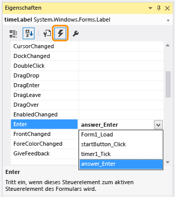

# Schritt&#160;5: Hinzuf&#252;gen von Enter-Ereignishandlern f&#252;r die NumericUpDown-Steuerelemente
[!INCLUDE[vs2017banner](../code-quality/includes/vs2017banner.md)]

Im fünften Teil dieses Lernprogramms fügen Sie Enter\-Ereignishandler hinzu, um die Eingabe von Antworten auf Quizfragen zu vereinfachen.  Mit diesem Code wird der aktuelle Wert in den einzelnen NumericUpDown\-Steuerelementen markiert und gelöscht, sobald ein Quizteilnehmer das Steuerelement ausgewählt und einen anderen Wert eingibt.  
  
> [!NOTE]
>  Dieses Thema ist Teil einer Reihe von Lernprogrammen zu grundlegenden Konzepte der Codierung.  Eine Übersicht des Lernprogramms finden Sie unter [Lernprogramm 2: Erstellen eines Mathequiz mit Zeitmessung](../ide/tutorial-2-create-a-timed-math-quiz.md).  
  
### So überprüfen Sie das Standardverhalten  
  
1.  Führen Sie das Programm aus, und starten Sie das Quiz.  
  
     Im NumericUpDown\-Steuerelement für die Additionsaufgabe blinkt der Cursor neben der **0** \(Null\).  
  
2.  Geben Sie `3` ein, und beachten Sie, dass das Steuerelement **30** anzeigt.  
  
3.  Geben Sie `5` ein, und beachten Sie, dass der Wert **350** angezeigt wird, sich aber nach einer Sekunde in **100** ändert.  
  
     Bevor Sie dieses Problem beheben, denken Sie über das nach, was geschieht.  Überlegen Sie, warum die **0** nicht verschwunden ist, als Sie `3` eingegeben haben, und warum **350** in **100** geändert wurde, die Änderung jedoch nicht unmittelbar stattgefunden hat.  
  
     Dieses Verhalten scheint ungewöhnlich, ist jedoch vor dem Hintergrund der Logik des Codes sinnvoll.  Wenn Sie die Schaltfläche **Start** auswählen, wird die **Enabled**\-Eigenschaft der Schaltfläche auf **False** gesetzt, und die Schaltfläche ist abgeblendet und nicht verfügbar.  Das Programm wechselt die aktuelle Auswahl \(Fokus\) auf das Steuerelement mit dem nächstniedrigen TabIndex\-Wert. Dies ist das NumericUpDown\-Steuerelement für die Additionsaufgabe.  Wenn Sie mit der TAB\-TASTE zu einem NumericUpDown\-Steuerelement wechseln, wird der Cursor automatisch an den Anfang des Steuerelements positioniert. Dies bewirkt, dass die von Ihnen eingegebenen Zahlen von links und nicht von rechts angezeigt werden.  Wenn Sie eine Zahl angeben, die höher als der Wert der Eigenschaft **MaximumValue** ist, der auf 100 festgelegt ist, wird die von Ihnen eingegebene Zahl durch den Wert dieser Eigenschaft ersetzt.  
  
### So fügen Sie einen Enter\-Ereignishandler für ein NumericUpDown\-Steuerelement hinzu  
  
1.  Wählen Sie das erste NumericUpDown\-Steuerelement \(namens "sum"\) im Formular aus, und wählen Sie im Dialogfeld **Eigenschaften** das Symbol **Ereignisse** auf der Symbolleiste aus.  
  
     Auf der Registerkarte **Ereignisse** im Dialogfeld **Eigenschaften** werden alle Ereignisse angezeigt, auf die Sie für das Element reagieren können \(Handler\), das Sie im Formular ausgewählt haben.  Da Sie das NumericUpDown\-Steuerelement ausgewählt haben, sind alle aufgeführten Ereignisse betroffen.  
  
2.  Wählen Sie das **Enter** Ereignis aus, geben Sie `answer_Enter` ein, und wählen Sie dann die EINGABETASTE aus.  
  
       
Dialogfeld "Eigenschaften"  
  
     Sie haben soeben einen Enter\-Ereignishandler für das NumericUpDown\-Steuerelement "sum" hinzugefügt, und Sie haben den Handler **answer\_Enter** genannt.  
  
3.  Fügen Sie in der Methode für den **answer\_Enter**\-Ereignishandler den folgenden Code hinzu.  
  
     [!code-vb[VbExpressTutorial3Step5_6#11](../ide/codesnippet/VisualBasic/step-5-add-enter-event-handlers-for-the-numericupdown-controls_1.vb)]
     [!code-cs[VbExpressTutorial3Step5_6#11](../ide/codesnippet/CSharp/step-5-add-enter-event-handlers-for-the-numericupdown-controls_1.cs)]  
  
     Dieser Code sieht komplex aus, aber Sie können ihn verstehen, wenn Sie ihn schrittweise überprüfen.  Schauen Sie sich zuerst den Beginn der Methode an: `object sender` in C\# oder `sender As System.Object` in Visual Basic.  Dieser Parameter verweist auf das Objekt, dessen Ereignis ausgelöst wird, das als Absender bezeichnet wird.  In diesem Fall ist das Absenderobjekt das NumericUpDown\-Steuerelement.  Geben Sie in der ersten Zeile der Methode an, dass der Absender nicht nur ein beliebiges generisches Objekt ist, sondern speziell ein NumericUpDown\-Steuerelement. \(Jedes NumericUpDown\-Steuerelement ist ein Objekt, aber nicht jedes Objekt ist ein NumericUpDown\-Steuerelement.\) Das NumericUpDown\-Steuerelement heißt in dieser Methode **answerBox**, da es für alle NumericUpDown\-Steuerelemente im Formular verwendet wird und nicht nur für das NumericUpDown\-Steuerelement "sum".  Da Sie die Variable "answerBox" in dieser Methode deklarieren, gilt der Bereich nur für diese Methode.  Das bedeutet, dass die Variable nur innerhalb dieser Methode verwendet werden kann.  
  
     Die nächste Zeile überprüft, ob answerBox erfolgreich von einem Objekt in ein NumericUpDown\-Steuerelement konvertiert \(umgewandelt\) wurde.  Wenn die Konvertierung nicht erfolgreich war, hat die Variable einen Wert von `null` \(C\#\) oder `Nothing` \(Visual Basic\).  In der dritten Zeile wird die Länge der Antwort angegeben, die im NumericUpDown\-Steuerelement angezeigt wird. In der vierten Zeile wird der aktuelle Wert im Steuerelement auf der Grundlage dieser Länge ausgewählt.  Wenn der Quizteilnehmer nun das Steuerelement aktiviert, löst Visual Studio das Ereignis aus. Daraufhin wird die aktuelle Antwort ausgewählt.  Sobald der Quizteilnehmer eine andere Antwort eingibt, wird die vorherige Antwort gelöscht und durch die neue Antwort ersetzt.  
  
4.  Wählen Sie im Windows Forms\-Designer das NumericUpDown\-Steuerelement "difference" aus.  
  
5.  Führen Sie auf der Seite **Ereignisse** des Dialogfelds **Eigenschaften** einen Bildlauf bis zum **Enter**\-Ereignis durch, wählen Sie den Dropdownpfeil am Ende der Zeile aus, und wählen Sie dann den `answer_Enter`\-Ereignishandler aus, den Sie gerade hinzugefügt haben.  
  
6.  Wiederholen Sie den vorherigen Schritt für die NumericUpDown\-Steuerelemente "product" und "quotient".  
  
7.  Speichern Sie das Programm, und führen Sie es aus.  
  
     Wenn Sie ein NumericUpDown\-Steuerelement auswählen, wird der vorhandene Wert automatisch aktiviert und dann gelöscht, wenn Sie einen anderen Wert eingeben.  
  
### So fahren Sie fort oder überprüfen die Angaben  
  
-   Um zum nächsten Schritt des Lernprogramms zu wechseln, klicken Sie auf [Schritt 6: Hinzufügen einer Subtraktionsaufgabe](../ide/step-6-add-a-subtraction-problem.md).  
  
-   Um zum vorherigen Schritt des Lernprogramms zurückzukehren, klicken Sie auf [Schritt 4: Hinzufügen der CheckTheAnswer\(\)\-Methode](../ide/step-4-add-the-checktheanswer-parens-method.md).