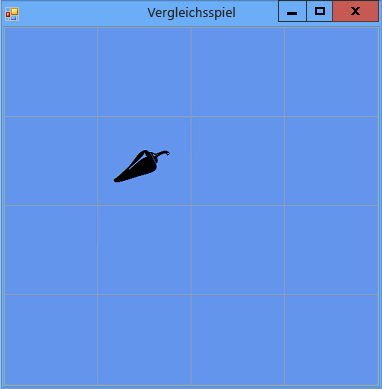

# Schritt 5: Hinzuf&#252;gen von Bezeichnungsverweisen
[!INCLUDE[vs2017banner](../code-quality/includes/vs2017banner.md)]

Das Programm muss nachverfolgen, welches Bezeichnungsfeld der Spieler wählt.  Bisher zeigt das Programm alle Bezeichnungsfelder an, die der Spieler ausgewählt hat.  Wir werden das ändern.  Nachdem das erste Bezeichnungsfeld gewählt wurde, sollte das Programm das Symbol im Bezeichnungsfeld anzeigen.  Nachdem das zweite Bezeichnungsfeld ausgewählt ist, sollte das Programm beide Symbole für eine kurze Zeit anzeigen und dann beide wieder ausblenden.  Das Programm verfolgt nun mithilfe von *Verweisvariablen*, welches Bezeichnungsfeld zuerst und welches danach gewählt wird.  
  
### So fügen Sie Bezeichnungsverweise hinzu  
  
1.  Fügen Sie dem Formular Bezeichnungsverweise hinzu, indem Sie den folgenden Code verwenden.  
  
     [!code-vb[VbExpressTutorial4Step5#5](../ide/codesnippet/VisualBasic/step-5-add-label-references_1.vb)]
     [!code-cs[VbExpressTutorial4Step5#5](../ide/codesnippet/CSharp/step-5-add-label-references_1.cs)]  
  
     Diese Verweisvariablen ähneln im Aussehen den Anweisungen, mit denen Sie zuvor dem Formular Objekte \(wie `Timer`, `List` und `Random`\) hinzugefügt haben.  Diese Anweisungen bewirken jedoch nicht, dass im Formular zwei zusätzliche Bezeichnungsfelder angezeigt werden, da das Schlüsselwort `new` in keiner der beiden Anweisungen enthalten ist.  Ohne das `new`\-Schlüsselwort wird kein Objekt erstellt.  `firstClicked` und `secondClicked` werden als Verweisvariablen bezeichnet, weil sie Verweise auf `Label`\-Objekte speichern.  
  
     Wenn eine Variable keinen Verweis auf ein Objekt enthält, wird sie auf einen besonderen Wert festgelegt: `null` in Visual C\# und `Nothing` in Visual Basic.  Beim Starten des Programms erhalten also sowohl `firstClicked` als auch `secondClicked` den Wert `null` bzw. `Nothing`. Dies bedeutet, dass die Variablen keine Objektverweise enthalten.  
  
2.  Ändern Sie den Click\-Ereignishandler so, dass er die neue `firstClicked`\-Verweisvariable verwendet.  Entfernen Sie die letzte Anweisung in der `label_Click()`\-Ereignishandlermethode \(`clickedLabel.ForeColor = Color.Black;`\), und ersetzen Sie diese durch die `if`\-Anweisung, die darauf folgt. \(Achten Sie darauf, den Kommentar und die gesamte `if`\-Anweisung einzufügen.\)  
  
     [!code-vb[VbExpressTutorial4Step5#6](../ide/codesnippet/VisualBasic/step-5-add-label-references_2.vb)]
     [!code-cs[VbExpressTutorial4Step5#6](../ide/codesnippet/CSharp/step-5-add-label-references_2.cs)]  
  
3.  Speichern Sie das Programm, und führen Sie es aus.  Wählen Sie eines der Bezeichnungsfelder. Das entsprechende Symbol wird angezeigt.  
  
4.  Wählen Sie das nächste Bezeichnungsfeld. Sie werden bemerken, dass nichts passiert.  Das Programm merkt sich bereits das erste Bezeichnungsfeld, auf das der Spieler geklickt hat, `firstClicked` entspricht also nicht `null` \(in Visual C\#\) bzw. `Nothing` \(in Visual Basic\).  Wenn die `if`\-Anweisung `firstClicked` darauf überprüft, ob sie `null` oder `Nothing` entspricht, stellt sie fest, dass dies nicht der Fall ist. Die Anweisungen in der `if`\-Anweisung werden also nicht ausgeführt.  Deshalb wird nur die Farbe für das erste gewählte Symbol in Schwarz geändert. Die anderen Symbole bleiben ausgeblendet. Dies ist in der folgenden Abbildung dargestellt.  
  
       
Anzeige eines Symbols im Spiel  
  
     Sie beheben diese Situation im nächsten Lernprogrammschritt, indem Sie ein **Zeitgeber**\-Steuerelement hinzufügen.  
  
### So fahren Sie fort oder überprüfen die Angaben  
  
-   Um zum nächsten Schritt des Lernprogramms zu wechseln, klicken Sie auf [Schritt 6: Hinzufügen eines Zeitgebers](../ide/step-6-add-a-timer.md).  
  
-   Um zum vorherigen Schritt des Lernprogramms zurückzukehren, klicken Sie auf [Schritt 4: Hinzufügen eines Click\-Ereignishandlers zu jeder Bezeichnung](../ide/step-4-add-a-click-event-handler-to-each-label.md).