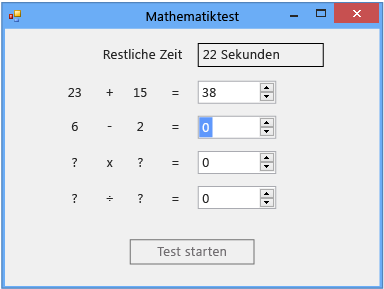

# Schritt 6: Hinzufügen einer Subtraktionsaufgabe
Im sechsten Teil dieses Lernprogramms fügen Sie eine Subtraktionsaufgabe hinzu und erfahren, wie die folgenden Aufgaben ausgeführt werden:

- Speichern Sie die Subtraktionswerte.

- Generieren Sie Zufallszahlen für die Aufgabe (und stellen Sie sicher, dass die Antwort ein Wert zwischen 0 und 100 ist).

- Aktualisieren Sie die Methode, mit der die Antworten überprüft werden, damit auch die neue Subtraktionsaufgabe überprüft wird.

- Aktualisieren Sie den <xref:System.Windows.Forms.Timer.Tick>-Ereignishandler des Zeitgebers, damit der Ereignishandler die richtige Antwort ausgibt, wenn die Zeit abgelaufen ist.

> [!NOTE]
> Dieses Thema ist Teil einer Reihe von Lernprogrammen zu grundlegenden Konzepte der Codierung.
> - Eine Übersicht über das Tutorial finden Sie unter [Tutorial 2: Erstellen eines Mathequiz mit Zeitmessung](../ide/tutorial-2-create-a-timed-math-quiz.md).
> - Informationen zum Herunterladen einer vollständigen Version des Codes finden Sie unter [Tutorialbeispiel des vollständigen Mathequiz](https://code.msdn.microsoft.com/Complete-Math-Quiz-8581813c).

## So fügen Sie eine Subtraktionsaufgabe hinzu

1. Fügen Sie dem Formular zwischen den Ganzzahlvariablen für die Additionsaufgabe und dem Zeitgeber zwei Ganzzahlvariablen für die Subtraktionsaufgabe hinzu. Der Code sollte wie folgt aussehen:

     [!code-vb[VbExpressTutorial3Step5_6#12](../ide/codesnippet/VisualBasic/step-6-add-a-subtraction-problem_1.vb)]
     [!code-csharp[VbExpressTutorial3Step5_6#12](../ide/codesnippet/CSharp/step-6-add-a-subtraction-problem_1.cs)]

     [!INCLUDE [devlang-control-csharp-vb](./includes/devlang-control-csharp-vb.md)]

     Die Namen der neuen Ganzzahlvariablen – **minuend** und **subtrahend** – sind keine Programmierbegriffe. Es handelt sich um traditionell in der Arithmetik verwendete Namen für die Zahl, die subtrahiert wird (der Subtrahend), und die Zahl, von der subtrahiert wird (der Minuend). Die Differenz ist der Minuend minus Subtrahend. Sie können auch andere Namen verwenden, da das Programm keine bestimmten Namen für Variablen, Steuerelemente, Komponenten oder Methoden erfordert. Sie müssen Regeln wie "Starten von Namen nicht mit Ziffern ausführen" beachten, jedoch können Sie Namen wie x1, x2, x3 und x4 im Allgemeinen verwenden. Gattungsnamen führen jedoch dazu, dass Code schwer lesbar wird und Probleme nahezu unmöglich erkannt werden können. Damit die Variablennamen eindeutig und nützlich bleiben, sollten Sie später in diesem Lernprogramm die traditionellen Namen für Multiplikation (Multiplikand × Multiplikator = Produkt) und Division (Dividend ÷ Divisor = Quotient) verwenden.

     Anschließend ändern Sie die `StartTheQuiz()`-Methode, um Zufallswerte für die Subtraktionsaufgabe bereitzustellen.

2. Fügen Sie nach dem Kommentar "Fill in the subtraction problem" folgenden Code hinzu.

     [!code-vb[VbExpressTutorial3Step5_6#13](../ide/codesnippet/VisualBasic/step-6-add-a-subtraction-problem_2.vb)]
     [!code-csharp[VbExpressTutorial3Step5_6#13](../ide/codesnippet/CSharp/step-6-add-a-subtraction-problem_2.cs)]

     Um Negativantworten für die Subtraktionsaufgabe zu verhindern, wird in diesem Code die <xref:System.Random.Next>-Methode der <xref:System.Random>-Klasse geringfügig anders verwendet als in der Additionsaufgabe. Wenn Sie der `Next()`-Methode zwei Werte zuweisen, wird eine Zufallszahl ausgewählt, die größer oder gleich dem ersten Wert und kleiner als der zweite Wert ist. Mit dem folgenden Code wird eine Zufallszahl von 1 bis 100 ausgewählt, die in der Minuend-Variablen gespeichert wird.

     [!code-vb[VbExpressTutorial3Step5_6#21](../ide/codesnippet/VisualBasic/step-6-add-a-subtraction-problem_3.vb)]
     [!code-csharp[VbExpressTutorial3Step5_6#21](../ide/codesnippet/CSharp/step-6-add-a-subtraction-problem_3.cs)]

     Sie können die `Next()`-Methode der Random-Klasse, die zuvor in diesem Tutorial „randomizer“ genannt wurde, auf unterschiedliche Weise aufrufen. Methoden, für die es mehrere Arten des Aufrufs gibt, werden als "überladene" Methoden bezeichnet. Sie können mithilfe von IntelliSense untersucht werden. Werfen Sie einen weiteren Blick auf die QuickInfo für die `Next()`-Methode im IntelliSense-Fenster.

      
*QuickInfo im* ***IntelliSense-Fenster***

     Die QuickInfo zeigt **(+ 2 Überladung(en))** an, was bedeutet, dass Sie die `Next()`-Methode auf zwei weitere Arten aufrufen können. Überladungen enthalten unterschiedliche Anzahl und Typen von Argumenten, sodass sie alle mit leichten Unterschieden funktionieren. Beispielsweise könnte eine Methode ein Argument mit nur einer ganzen Zahl aufweisen, während eine der entsprechenden Überladungen eine Ganzzahl und eine Zeichenfolge enthalten kann. Wählen Sie die richtige Überladung je nach gewünschter Funktionen aus. Wenn Sie der `StartTheQuiz()`-Methode den Code hinzufügen, werden weitere Informationen im IntelliSense-Fenster angezeigt, sobald Sie `randomizer.Next(` eingeben. Um die Überladungen zu durchlaufen, klicken Sie wie in der folgenden Abbildung gezeigt auf die Schaltflächen mit dem **Pfeil nach oben** und dem **Pfeil nach unten**:

      
*Überladung für* ***Next()***-*Methode in* ***IntelliSense***

     In diesem Fall wählen Sie die letzte Überladung aus, da Sie Mindest- und Höchstwerte angeben können.

3. Ändern Sie die `CheckTheAnswer()`-Methode, um zu prüfen, ob die Antwort für die Subtraktionsaufgabe korrekt ist.

     [!code-vb[VbExpressTutorial3Step5_6#14](../ide/codesnippet/VisualBasic/step-6-add-a-subtraction-problem_4.vb)]
     [!code-csharp[VbExpressTutorial3Step5_6#14](../ide/codesnippet/CSharp/step-6-add-a-subtraction-problem_4.cs)]

     In C# ist `&&` der `logical and`-Operator. In Visual Basic ist `AndAlso` die Entsprechung dieses Operators. Diese Operatoren entsprechen dem Wortlaut "Wenn die Summe aus addend1 und addend2 gleich dem Wert von sum NumericUpDown ist und wenn Minuend minus Subtrahend gleich dem Wert von difference NumericUpDown ist". Die `CheckTheAnswer()`-Methode gibt nur `true` zurück, wenn die Antworten der Additions- und die Subtraktionsaufgaben richtig sind.

4. Ersetzen Sie den letzten Teil des Tick-Ereignishandlers des Timers durch folgenden Code, damit die richtige Antwort ausgegeben wird, wenn die Zeit abgelaufen ist.

     [!code-vb[VbExpressTutorial3Step5_6#22](../ide/codesnippet/VisualBasic/step-6-add-a-subtraction-problem_5.vb)]
     [!code-csharp[VbExpressTutorial3Step5_6#22](../ide/codesnippet/CSharp/step-6-add-a-subtraction-problem_5.cs)]

5. Speichern Sie den Code, und führen Sie ihn aus.

     Das Programm enthält eine Subtraktionsaufgabe, wie in der folgenden Abbildung veranschaulicht:

      
***Mathetest*** *mit Subtraktionsaufgabe*

## So fahren Sie fort oder überprüfen die Angaben

- Den nächsten Schritt des Tutorials finden Sie unter **[Schritt 7: Hinzufügen von Multiplikations- und Divisionsaufgaben](../ide/step-7-add-multiplication-and-division-problems.md)** .

- Den vorherigen Schritt des Tutorials finden Sie unter [Schritt 5: Hinzufügen von Enter-Ereignishandlern für die NumericUpDown-Steuerelemente](../ide/step-5-add-enter-event-handlers-for-the-numericupdown-controls.md).
