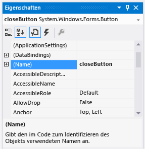

# Schritt 6: Benennen der Schaltflächen-Steuerelemente
Es gibt nur ein <xref:System.Windows.Forms.PictureBox> im Formular. Als Sie es hinzugefügt haben, hat die IDE diesem Steuerelement automatisch den Namen **pictureBox1**gegeben. Es gibt nur ein <xref:System.Windows.Forms.CheckBox>, das den Namen **checkBox1** trägt. Bald schreiben Sie einige Codezeilen, die auf das CheckBox- und das PictureBox-Steuerelement verweisen. Da jedes Steuerelement nur einmal vorhanden ist, wissen Sie, was sich hinter den Namen **pictureBox1** oder **checkBox1** im Code verbirgt.

> [!NOTE]
>  In Visual Basic beginnen die Namen von Steuerelementen automatisch mit einem großen Anfangsbuchstaben. Daher lauten die Namen dort **PictureBox1**, **CheckBox1**usw.

 Das Formular enthält vier Schaltflächen, und die IDE hat ihnen folgende Namen zugewiesen: **button1**, **button2**, **button3**und **button4**. Anhand der aktuellen Namen können Sie jedoch nicht erkennen, welches Steuerelement die Schaltfläche **Close** ist und welches Steuerelement die Schaltfläche **Show a picture** ist. Daher ist es hilfreich, den Schaltflächen-Steuerelementen aufschlussreichere Namen zu geben.

  Videos zu diesem Thema finden Sie unter [Tutorial 1: Create a picture viewer in Visual Basic – Video 3 (Tutorial 1: Erstellen eines Bildanzeigeprogramms in Visual Basic – Video 3)](http://go.microsoft.com/fwlink/?LinkId=205213) und [Tutorial 1: Create a picture viewer in C# – Video 3 (Tutorial 1: Erstellen eines Bildanzeigeprogramms in C# – Video 3)](http://go.microsoft.com/fwlink/?LinkId=205202). Diese Videos verwenden eine frühere Version von Visual Studio, sodass Menübefehle und andere Benutzeroberflächenelemente geringfügig abweichen können. Allerdings funktionieren die Konzepte und Prozeduren in der aktuellen Version von Visual Studio auf ähnliche Weise.

## So benennen Sie die Schaltflächen-Steuerelemente

1.  Wählen Sie im Formular die Schaltfläche **Schließen** aus. (Wenn alle Schaltflächen noch ausgewählt sind, drücken Sie die **ESC-TASTE**, um die Auswahl aufzuheben.) Scrollen Sie im Fenster **Eigenschaften**, bis Sie die Eigenschaft **(Name)** sehen. (Die Eigenschaft **(Name)** befindet sich oben in der Liste, wenn die Eigenschaften alphabetisch sortiert sind.) Ändern Sie den Namen in **closeButton**, wie im folgenden Bild gezeigt.

     
**Eigenschaftenfenster** mit **closeButton**-Name

    > [!NOTE]
    >  Wenn Sie versuchen, den Namen der Schaltfläche **closeButton** so zu ändern, dass ein Leerzeichen zwischen den beiden Wörtern „close“ und „Button“ verwendet wird, zeigt die IDE eine Fehlermeldung an: „Der Eigenschaftswert ist ungültig.“ Leerzeichen (und einige andere Zeichen) sind in Steuerelementnamen nicht zulässig.

2.  Benennen Sie die anderen drei Schaltflächen in **backgroundButton**, **clearButton**und **showButton**um. Sie können die Namen überprüfen, indem Sie im Fenster **Eigenschaften** die Steuerelementauswahl-Dropdownliste auswählen. Die neuen Schaltflächennamen werden angezeigt.

3.  Doppelklicken Sie im Formular auf die Schaltfläche **Bild anzeigen** . Wählen Sie alternativ im Formular die Schaltfläche **Bild anzeigen** aus, und drücken Sie anschließend die **EINGABETASTE**. Damit öffnet die IDE eine zusätzliche Registerkarte im Hauptfenster mit der Bezeichnung **Form1.cs** (**Form1.vb** bei Verwendung von Visual Basic). Auf dieser Registerkarte wird die Codedatei hinter dem Formular angezeigt, wie im folgenden Bild dargestellt.

     
**Form1.cs**-Registerkarte mit Visual C#-Code

4.  Konzentrieren Sie sich auf diesen Teil des Codes. (Wählen Sie bei Verwendung von Visual Basic die Registerkarte **VB** unten aus, um die Visual Basic-Version des Codes anzuzeigen.)

     [!code-vb[VbExpressTutorial1Step6#1](../ide/codesnippet/VisualBasic/step-6-name-your-button-controls_1.vb)]
     [!code-csharp[VbExpressTutorial1Step6#1](../ide/codesnippet/CSharp/step-6-name-your-button-controls_1.cs)]

     Sie betrachten Code mit dem Namen `showButton_Click()`. Die IDE hat ihn dem Code des Formulars hinzugefügt, als Sie die Codedatei für die Schaltfläche **showButton** geöffnet haben. Wenn Sie zur Entwurfszeit die Codedatei für ein Steuerelement in einem Formular öffnen, wird Code für das Steuerelement generiert, wenn er nicht bereits vorhanden ist. Dieser Code, als *Methode*bezeichnet, wird ausgeführt, wenn Sie das Programm ausführen und das Steuerelement auswählen, in diesem Fall die Schaltfläche **Bild anzeigen** .

    > [!NOTE]
    >  In diesem Tutorial wurde der automatisch generierte Visual Basic-Code vereinfacht, indem der zwischen die Klammern `()` gesetzte Text entfernt wurde. In diesen Fällen können Sie den gleichen Code entfernen. Das Programm funktioniert so oder so. Für den Rest der Lernprogramme wird automatisch generierter Code vereinfacht, wann immer dies möglich ist.

5.  Wählen Sie die Registerkarte **Windows Forms-Designer** erneut aus (**Form1.cs [Entwurf]** in Visual C#, **Form1.vb [Entwurf]** in Visual Basic), und öffnen Sie dann die Codedatei für die Schaltfläche **Bild löschen**, um eine Methode für sie im Code des Formulars zu erstellen. Wiederholen Sie diesen Vorgang für die verbleibenden beiden Schaltflächen. Die IDE fügt der Codedatei des Formulars jedes Mal eine neue Methode hinzu.

6.  Öffnen Sie zum Hinzufügen einer weiteren Methode im **Windows Forms-Designer** die Codedatei für das Steuerelement **CheckBox**, damit die IDE eine `checkBox1_CheckedChanged()`-Methode hinzufügt. Diese Methode wird immer dann aufgerufen, wenn der Benutzer das Kontrollkästchen aktiviert oder deaktiviert.

    > [!NOTE]
    >  Wenn Sie an einem Programm arbeiten, wechseln Sie häufig zwischen dem Code-Editor und dem **Windows Forms-Designer**. Die IDE vereinfacht die Navigation im Projekt. Öffnen Sie den **Windows Forms-Designer** mit dem **Projektmappen-Explorer**, indem Sie in Visual C# auf *Form1.cs* oder in Visual Basic auf *Form1.vb* doppelklicken, oder wählen Sie in der Menüleiste **Ansicht** > **Designer** aus.

     Im Folgenden sehen Sie den neuen Code, der im Code-Editor angezeigt wird.

     [!code-vb[VbExpressTutorial1Step6#2](../ide/codesnippet/VisualBasic/step-6-name-your-button-controls_2.vb)]
     [!code-csharp[VbExpressTutorial1Step6#2](../ide/codesnippet/CSharp/step-6-name-your-button-controls_2.cs)]

     Die fünf Methoden, die Sie hinzugefügt haben, werden als *Ereignishandler*bezeichnet, da das Programm sie immer dann aufruft, wenn ein Ereignis eintritt (wenn z. B. ein Benutzer eine Schaltfläche auswählt oder ein Kontrollkästchen aktiviert).

     Wenn Sie den Code für ein Steuerelement in der IDE zur Entwurfszeit anzeigen, fügt Visual Studio für dieses Steuerelement eine Ereignishandlermethode hinzu, wenn keine vorhanden ist. Wenn Sie z.B. auf eine Schaltfläche doppelklicken, fügt die IDE einen Ereignishandler für das <xref:System.Windows.Forms.Control.Click>-Ereignis hinzu (dieser wird jedes Mal aufgerufen, wenn der Benutzer auf die Schaltfläche klickt). Wenn Sie auf ein Kontrollkästchen doppelklicken, fügt die IDE einen Ereignishandler für das <xref:System.Windows.Forms.CheckBox.CheckedChanged>-Ereignis hinzu (dieser wird jedes Mal aufgerufen, wenn der Benutzer das Kontrollkästchen aktiviert oder deaktiviert).

     Nachdem Sie für ein Steuerelement einen Ereignishandler hinzugefügt haben, können Sie jederzeit vom **Windows Forms-Designer** dahin zurückkehren, indem Sie auf das Steuerelement doppelklicken oder in der Menüleiste **Ansicht** > **Code** auswählen.

     Namen sind wichtig, wenn Sie Programme erstellen, und für Methoden (und Ereignishandler) können Sie beliebige Namen verwenden. Wenn Sie mit der IDE einen Ereignishandler hinzufügen, erstellt die IDE basierend auf dem Namen des Steuerelements und des behandelten Ereignisses einen Namen. Das Click-Ereignis für eine Schaltfläche mit dem Namen **showButton** wird z. B. als `showButton_Click()` -Ereignishandlermethode bezeichnet. Normalerweise werden nach dem Methodennamen auch eine öffnende und eine schließende runde Klammer `()` hinzugefügt, um anzuzeigen, dass es sich um Methoden handelt. Wenn Sie den Namen einer Codevariable ändern möchten, klicken Sie mit der rechten Maustaste auf die Variable im Code, und wählen Sie dann **Umgestalten** > **Umbenennen** aus. Alle Instanzen dieser Variable im Code werden umbenannt. Weitere Informationen finden Sie unter [Umbenennen durch Refactoring ](../ide/reference/rename.md).

## So fahren Sie fort oder überprüfen die Angaben

-   Den nächsten Schritt des Tutorials finden Sie unter [Schritt 7: Hinzufügen von Dialogfeldkomponenten zum Formular](../ide/step-7-add-dialog-components-to-your-form.md).

-   Den vorherigen Schritt des Tutorials finden Sie unter [Schritt 5: Hinzufügen von Steuerelementen zum Formular](../ide/step-5-add-controls-to-your-form.md).
