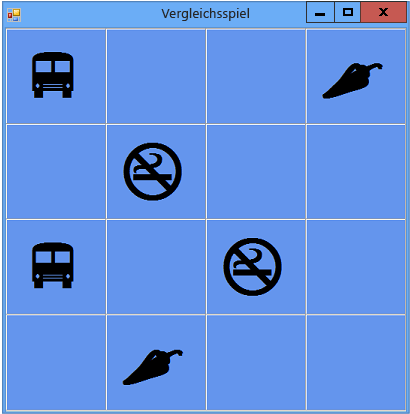

# <a name="step-7-keep-pairs-visible"></a>Schritt 7: Beibehalten der Sichtbarkeit von Paaren
Das Spiel funktioniert gut, solange der Spieler jeweils zwei Symbole auswählt, die nicht übereinstimmen. Was soll aber passieren, wenn der Spieler ein übereinstimmendes Symbolpaar wählt? Anstatt durch das Aktivieren des Timers (mit der <xref:System.Windows.Forms.Timer.Start>-Methode) das Ausblenden der Symbole zu veranlassen, sollte sich das Spiel selbst zurücksetzen, damit die Verweisvariablen `firstClicked` und `secondClicked` nicht mehr auf Bezeichnungsfelder verweisen. Die Farben für die beiden gewählten Bezeichnungsfelder sollen jedoch nicht zurückgesetzt werden.

## <a name="to-keep-pairs-visible"></a>So behalten Sie die Sichtbarkeit von Paaren bei

1. Fügen Sie der `if`-Ereignishandlermethode die folgende `label_Click()`-Anweisung hinzu, und zwar im unteren Teil des Codes oberhalb der Anweisung, mit der Sie den Timer starten. Sehen Sie sich den Code genau an, während Sie diesen dem Programm hinzufügen. Machen Sie sich klar, wie der Code funktioniert.

     [!code-csharp[VbExpressTutorial4Step7#9](../ide/codesnippet/CSharp/step-7-keep-pairs-visible_1.cs)]
     [!code-vb[VbExpressTutorial4Step7#9](../ide/codesnippet/VisualBasic/step-7-keep-pairs-visible_1.vb)]

       > [!IMPORTANT]
       > Use the programming language control at the top right of this page to view either the C# code snippet or the Visual Basic code snippet.<br><br>

     Die erste Zeile der gerade hinzugefügten `if`-Anweisung überprüft, ob das Symbol im ersten Bezeichnungsfeld, das der Spieler auswählt, dem Symbol im zweiten Bezeichnungsfeld entspricht. Wenn die Symbole übereinstimmen, führt das Programm in die drei Anweisungen zwischen den geschweiften Klammern (in C#) bzw. die drei Anweisungen innerhalb der `if`-Anweisung (in Visual Basic ) aus. Die ersten beiden Anweisungen setzen die Verweisvariablen `firstClicked` und `secondClicked` zurück, damit diese nicht mehr auf Bezeichnungsfelder verweisen. (Möglicherweise kennen Sie diese beiden Anweisungen bereits aus dem <xref:System.Windows.Forms.Timer.Tick>-Ereignishandler des Zeitgebers.) Die dritte Anweisung ist eine `return`-Anweisung, die das Programm anweist, die restlichen Anweisungen in der Methode zu überspringen, statt sie auszuführen.

     Beim Programmieren in C# ist Ihnen möglicherweise aufgefallen, dass in einigen Teilen des Codes ein einzelnes Gleichheitszeichen (`=`) verwendet wird, während in anderen Anweisungen zwei Gleichheitszeichen (`==`) verwendet werden. Überlegen Sie, warum an einigen Stellen `=` und an anderen Stellen `==` verwendet wird.

     Dies ist ein gutes Beispiel, das den Unterschied verdeutlicht. Sehen Sie sich den Code zwischen den Klammern in der `if`-Anweisung genau an.

    ```vb
    firstClicked.Text = secondClicked.Text
    ```

    ```csharp
    firstClicked.Text == secondClicked.Text
    ```

     Achten Sie dann besonders auf die erste Anweisung im Codeblock nach der `if`-Anweisung.

    ```vb
    firstClicked = Nothing
    ```

    ```csharp
    firstClicked = null;
    ```

     Die erste dieser beiden Anweisungen überprüft, ob zwei Symbole miteinander übereinstimmen. Da zwei Werte verglichen werden, verwendet das C#-Programm den Gleichheitsoperator `==`. Die zweite Anweisung nimmt dann die eigentliche Änderung des Werts (als *Zuweisung* bezeichnet) vor, indem sie die `firstClicked`-Verweisvariable auf `null` festlegt, um diese zurückzusetzen. Aus diesem Grund verwendet sie stattdessen den Zuweisungsoperator `=`. C# verwendet `=` zum Festlegen von Werten und `==` zum Vergleichen dieser Werte. Visual Basic verwendet `=` sowohl für die Zuweisung von Variablen als auch für den Vergleich.

2. Speichern und starten Sie das Programm, und beginnen Sie dann mit dem Auswählen von Symbolen im Formular. Wenn Sie ein Paar auswählen, das nicht übereinstimmt, wird das Tick-Ereignis des Zeitgebers ausgelöst, und beide Symbole werden ausgeblendet. Wenn Sie ein übereinstimmendes Paar wählen, wird die neue `if`-Anweisung ausgeführt, und die Rückgabeanweisung bewirkt, dass die Methode den Code überspringt, der den Timer startet, sodass die Symbole sichtbar bleiben. Dies ist in der folgenden Abbildung dargestellt.

     <br/>
***Vergleichsspiel*** *mit sichtbaren Symbolpaaren*

## <a name="to-continue-or-review"></a>So fahren Sie fort oder überprüfen die Angaben

- Den nächsten Schritt des Tutorials finden Sie unter **[Schritt 8: Hinzufügen einer Methode, um zu überprüfen, ob ein Spieler gewonnen hat](../ide/step-8-add-a-method-to-verify-whether-the-player-won.md)** .

- Den vorherigen Schritt des Tutorials finden Sie unter [Schritt 6: Hinzufügen von Timern](../ide/step-6-add-a-timer.md).
