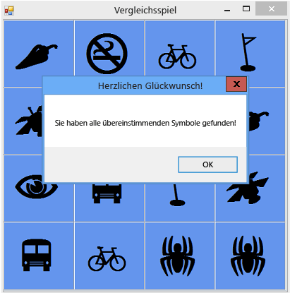

# Schritt 8: Hinzufügen einer Methode zum Überprüfen, ob der Spieler gewonnen hat
Sie haben ein unterhaltsames Spiel erstellt, aber es benötigt noch eine zusätzliche Funktion. Das Spiel soll enden, wenn der Spieler gewonnen hat. Sie müssen also eine `CheckForWinner()`-Methode hinzufügen, mit der überprüft wird, ob der Spieler gewonnen hat.  
  
### So fügen Sie eine Methode hinzu, mit der überprüft wird, ob der Spieler gewonnen hat  
  
1.  Fügen Sie eine `CheckForWinner()`-Methode am Ende Ihres Codes hinzu, unter dem `timer1_Tick()`-Ereignishandler, wie im folgenden Code gezeigt.  
  
     [!code-csharp[VbExpressTutorial4Step8#10](../ide/codesnippet/CSharp/step-8-add-a-method-to-verify-whether-the-player-won_1.cs)]
     [!code-vb[VbExpressTutorial4Step8#10](../ide/codesnippet/VisualBasic/step-8-add-a-method-to-verify-whether-the-player-won_1.vb)]  
  
     Die Methode verwendet eine weitere `foreach`-Schleife in Visual C# bzw. eine weitere `For Each`-Schleife in Visual Basic, um die einzelnen Bezeichnungen im TableLayoutPanel zu durchlaufen. Mithilfe des Gleichheitsoperators (`==` in Visual C# und `=` in Visual Basic) wird die Symbolfarbe der einzelnen Bezeichnungen darauf überprüft, ob diese mit dem Hintergrund übereinstimmt. Wenn die Farben übereinstimmen, bleibt das Symbol sichtbar. Dies bedeutet, dass der Spieler noch nicht alle Symbolpaare gefunden hat. Das Programm verwendet in diesem Fall eine `return`-Anweisung, um den Rest der Methode zu überspringen. Falls die Schleife alle Bezeichnungsfelder durchlaufen kann, ohne dass die `return`-Anweisung ausgeführt wird, bedeutet dies, dass alle Symbole des Formulars gefunden wurden. Das Programm zeigt eine MessageBox an, in der dem Spieler zum gewonnenen Spiel gratuliert wird, und ruft dann die `Close()`-Methode des Formulars auf, um das Spiel zu beenden.  
  
2.  Legen Sie als Nächstes fest, dass der Click-Ereignishandler der Bezeichnung die neue `CheckForWinner()`-Methode aufruft. Stellen Sie sicher, dass das Programm die Gewinnprüfung sofort durchführt, nachdem es das zweite Symbol angezeigt hat, das vom Spieler gewählt wurde. Suchen Sie nach der Zeile, in der Sie die Farbe des zweiten gewählten Symbols festgelegt haben, und rufen Sie direkt danach die `CheckForWinner()`-Methode auf. Dies ist im folgenden Code dargestellt.  
  
     [!code-csharp[VbExpressTutorial4Step8#11](../ide/codesnippet/CSharp/step-8-add-a-method-to-verify-whether-the-player-won_2.cs)]
     [!code-vb[VbExpressTutorial4Step8#11](../ide/codesnippet/VisualBasic/step-8-add-a-method-to-verify-whether-the-player-won_2.vb)]  
  
3.  Speichern Sie das Programm, und führen Sie es aus. Spielen Sie das Spiel, und finden Sie alle übereinstimmenden Symbolpaare. Wenn Sie gewonnen haben, zeigt das Programm eine MessageBox mit einem Glückwunsch an (wie in der folgenden Abbildung dargestellt) und schließt diese dann.  
  
       
Vergleichsspiel mit MessageBox  
  
### So fahren Sie fort oder überprüfen die Angaben  
  
-   Um zum nächsten Tutorialschritt zu wechseln, klicken Sie auf [Schritt 9: Ausprobieren weiterer Funktionen](../ide/step-9-try-other-features.md).  
  
-   Wenn Sie zum vorherigen Tutorialschritt zurückkehren möchten, klicken Sie auf [Schritt 7: Beibehalten der Sichtbarkeit von Paaren](../ide/step-7-keep-pairs-visible.md).