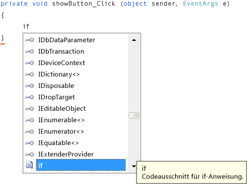

# Schritt 8: Schreiben von Code für den Ereignishandler der Schaltfläche „Bild anzeigen“

In diesem Schritt wird gezeigt, wie Code geschrieben wird, damit die Schaltfläche **Bild anzeigen** wie folgt funktioniert:

- Wenn ein Benutzer diese Schaltfläche auswählt, öffnet das Programm das Dialogfeld <xref:System.Windows.Forms.OpenFileDialog>.

- Wenn ein Benutzer eine Bilddatei öffnet, zeigt das Programm dieses Bild im <xref:System.Windows.Forms.PictureBox> an.

Die IDE stellt ein leistungsstarkes Tool namens IntelliSense bereit, das Sie beim Schreiben von Code unterstützt. Wenn Sie Code eingeben, öffnet die IDE ein Feld mit Vervollständigungsvorschlägen für teilweise eingegebene Wörter. Die IDE versucht zu bestimmen, was Sie als Nächstes machen möchten, und springt automatisch zum zuletzt in der Liste auswählten Element. Sie können mithilfe der NACH-OBEN- oder NACH-UNTEN-TASTE in der Liste navigieren oder die Eingabe von Buchstaben fortsetzen, um die Optionen einzugrenzen. Wenn Sie die gewünschte Auswahl sehen, verwenden Sie die **Tab**-Taste, um sie auszuwählen. Sie können die Vorschläge aber auch ignorieren, wenn sie nicht benötigt werden.

Eine Videoversion dieses Artikels finden Sie unter [Tutorial 1: Create a picture viewer in Visual Basic - Video 4 (Tutorial 1: Erstellen einer Bildanzeige in Visual Basic – Video 4)](https://msdn.microsoft.com/vstudio/gg315355.aspx). In diesem Video wird eine frühere Version von Visual Studio verwendet, sodass Menübefehle und andere Benutzeroberflächenelemente geringfügig abweichen können. Allerdings funktionieren die Konzepte und Prozeduren in der aktuellen Version von Visual Studio auf ähnliche Weise.

## So schreiben Sie Code für den Ereignishandler der Schaltfläche „Bild anzeigen“

1.  Wechseln Sie zum **Windows Forms-Designer**, und doppelklicken Sie auf die Schaltfläche **Bild anzeigen**. Die IDE wechselt sofort zum Code-Designer und positioniert den Cursor in die `showButton_Click()`-Methode, die Sie zuvor hinzugefügt haben.

2.  Geben Sie in der leeren Zeile zwischen den beiden geschweiften Klammern `{ }` ein `i` ein. (Machen Sie die Eingabe in Visual Basic in der leeren Zeile zwischen `Private Sub...` und `End Sub`.) Ein **IntelliSense**-Fenster wird geöffnet, so wie im folgenden Bild gezeigt.

     

3.  Im **IntelliSense**-Fenster sollte das Wort `if` markiert sein. (Ist dies nicht der Fall, geben Sie den Kleinbuchstaben `f` ein, dann wird das Wort markiert.) Beachten Sie, dass ein kleines *QuickInfo*-Feld neben dem **IntelliSense**-Fenster mit der Beschreibung **Codeausschnitt für if-Anweisung** angezeigt wird. (In Visual Basic zeigt die QuickInfo auch an, dass es sich um einen Codeausschnitt handelt, aber mit einem etwas anderen Wortlaut.) Wenn Sie diesen Ausschnitt verwenden möchten, drücken Sie die **Tab**-Taste, um `if` in den Code einzufügen. Drücken Sie dann erneut die **Tab**-Taste, um den Codeausschnitt für die `if`-Anweisung zu verwenden. (Wenn Sie eine andere Stelle ausgewählt haben und das **IntelliSense**-Fenster nicht mehr angezeigt wird, verwenden Sie die RÜCKTASTE, um das `i` zu löschen. Geben Sie den Buchstaben „i“ erneut ein, um das **IntelliSense-Fenster** wieder zu öffnen.)

     

4.  Als Nächstes verwenden Sie IntelliSense, um weiteren Code einzugeben, mit dem das Dialogfeld **Datei öffnen** geöffnet wird. Wenn der Benutzer die Schaltfläche **OK** auswählt, lädt PictureBox die Datei, die der Benutzer ausgewählt hat. Die folgenden Schritte zeigen, wie der Code eingegeben wird. Obwohl dies zahlreiche Schritte umfasst, sind nur einige Tastaturanschläge erforderlich:

    1.  Beginnen Sie mit dem markierten Text **true** im Ausschnitt. Geben Sie `op` ein, um ihn zu überschreiben. (In Visual Basic beginnen Sie den Text mit einem Großbuchstaben; geben Sie daher `Op` ein.)

    2.  Das **IntelliSense**-Fenster wird geöffnet und zeigt **openFileDialog1** an. Wählen Sie die **Tab**-Taste, um sie auszuwählen. (In Visual Basic beginnt der Text mit einem Großbuchstaben, daher wird **OpenFileDialog1** angezeigt. Stellen Sie sicher, dass **OpenFileDialog1** ausgewählt ist.)

         Weitere Informationen über `OpenFileDialog` finden Sie unter [OpenFileDialog](<xref:System.Windows.Forms.OpenFileDialog>).

    3.  Geben Sie einen Punkt (`.`) ein (viele Programmierer nennen dies einen „Dot“). Da Sie direkt nach **openFileDialog1** einen Punkt eingegeben haben, wird ein **IntelliSense**-Fenster geöffnet, das alle Eigenschaften und Methoden der **OpenFileDialog**-Komponente enthält. Dies sind die gleichen Eigenschaften, die im Fenster **Eigenschaften** angezeigt werden, wenn Sie sie im **Windows Forms-Designer** auswählen. Sie können auch Methoden auswählen, die Komponenten veranlassen, bestimmte Aufgaben auszuführen (z. B. Öffnen eines Dialogfelds).

        > [!NOTE]
        > Im **IntelliSense**-Fenster werden sowohl Eigenschaften als auch Methoden angezeigt. Um zu bestimmen, was angezeigt wird, betrachten Sie das Symbol auf der linken Seite jedes Elements im Fenster **IntelliSense**. Neben jeder Methode wird ein Bild eines Blocks und neben jeder Eigenschaft ein Schraubenschlüssel (oder Maulschlüssel) angezeigt. Zudem wird neben jedem Ereignis ein Blitzsymbol angezeigt. Diese Symbole sehen wie folgt aus.

         

         

         

    4.  Beginnen Sie mit der Eingabe von `ShowDialog` (die Großschreibung ist in IntelliSense nicht relevant). Die `ShowDialog()`-Methode zeigt das Dialogfeld **Datei öffnen** an. Nachdem **ShowDialog** im Fenster hervorgehoben wurde, wählen Sie die **Tab**-Taste. Sie können „ShowDialog“ auch markieren und **F1** auswählen, um dazu Hilfe abzurufen.

         Weitere Informationen zur `ShowDialog()`-Methode finden Sie unter [ShowDialog-Methode](<xref:System.Windows.Forms.Form.ShowDialog%2A>).

    5.  Wenn Sie für ein Steuerelement oder eine Komponente eine Methode verwenden (wird als *Aufrufen einer Methode* bezeichnet), müssen Sie Klammern hinzufügen. Geben Sie daher eine öffnende und schließende runde Klammer direkt nach dem „g“ in `ShowDialog` ein: `()`. Nun sollte es wie „openFileDialog1.ShowDialog()“ angezeigt werden.

        > [!NOTE]
        > Methoden sind ein wichtiger Teil von Programmen, und in diesem Lernprogramm wurden mehrere Möglichkeiten zum Verwenden von Methoden veranschaulicht. Sie können die Methode einer Komponente aufrufen, um sie zu veranlassen, eine bestimmte Aufgabe auszuführen, so wie Sie beispielsweise die `ShowDialog()`-Methode der **OpenFileDialog**-Komponente aufgerufen haben. Sie können eigene Methoden erstellen, um das Programm zum Ausführen bestimmter Schritte zu veranlassen. Hierzu gehört zum Beispiel die jetzt von Ihnen erstellten Methode, die als `showButton_Click()`-Methode bezeichnet wird und ein Dialogfeld und ein Bild öffnet, wenn ein Benutzer eine Schaltfläche auswählt.

    6.  Fügen Sie für Visual C# ein Leerzeichen und dann zwei Gleichheitszeichen (`==`) hinzu. Fügen Sie für Visual Basic ein Leerzeichen hinzu, und verwenden Sie dann ein einzelnes Gleichheitszeichen (`=`). (Visual C# und Visual Basic verwenden unterschiedliche Gleichheitsoperatoren.)

    7.  Fügen Sie ein weiteres Leerzeichen hinzu. Sobald Sie das Leerzeichen eingeben, wird ein anderes **IntelliSense**-Fenster geöffnet. Geben Sie `DialogResult` ein, und drücken Sie die **Tab**-Taste zum Hinzufügen.

        > [!NOTE]
        > Wenn Sie Code schreiben, um eine Methode aufzurufen, wird gelegentlich ein Wert zurückgegeben. In diesem Fall gibt die <xref:System.Windows.Forms.CommonDialog.ShowDialog>-Methode der **OpenFileDialog**-Komponente einen <xref:System.Windows.Forms.DialogResult>-Wert zurück. DialogResult ist ein besonderer Wert, der anzeigt, was in einem Dialogfeld geschehen ist. Bei der **OpenFileDialog**-Komponente gibt es z.B. die Möglichkeit, dass der Benutzer entweder **OK** oder **Abbrechen** auswählt. Daher gibt die `ShowDialog()`-Methode der Komponente entweder `DialogResult.OK` oder `DialogResult.Cancel` zurück.

    8.  Geben Sie einen Punkt ein, um das **IntelliSense**-Fenster für den DialogResult-Wert zu öffnen. Geben Sie den Buchstaben `O` ein, und drücken Sie die **Tab**-Taste, um **OK** einzufügen.

         Weitere Informationen zu DialogResult finden Sie unter [DialogResult](<xref:System.Windows.Forms.DialogResult>).

        > [!NOTE]
        >  Die erste Codezeile sollte vollständig sein. Für Visual C# sollte sie wie folgt aussehen.
        >
        >  `if (openFileDialog1.ShowDialog() == DialogResult.OK)`
        >
        >  Für Visual Basic sollte sie wie folgt aussehen.
        >
        >  `If OpenFileDialog1.ShowDialog() = DialogResult.OK Then`

    9. Fügen Sie jetzt eine weitere Codezeile hinzu. Sie können die Codezeile eingeben (oder kopieren und einfügen), aber erwägen Sie, die Codezeile mithilfe von IntelliSense hinzuzufügen. Je vertrauter Sie mit IntelliSense sind, desto schneller können Sie einen eigenen Code schreiben. Die fertige `showButton_Click()`-Methode sieht wie folgt aus: (Wählen Sie die Registerkarte **VB** aus, um die Visual Basic-Version des Codes anzuzeigen.)

         [!code-csharp[VbExpressTutorial1Step8#1](../ide/codesnippet/CSharp/step-8-write-code-for-the-show-a-picture-button-event-handler_1.cs)]
         [!code-vb[VbExpressTutorial1Step8#1](../ide/codesnippet/VisualBasic/step-8-write-code-for-the-show-a-picture-button-event-handler_1.vb)]

## So fahren Sie fort oder überprüfen die Angaben

-   Weitere Informationen zum Wechseln zum nächsten Tutorialschritt finden Sie unter [Schritt 9: Überprüfen, Kommentieren und Testen des Codes](../ide/step-9-review-comment-and-test-your-code.md).

-   Weitere Informationen zur Rückkehr zum vorherigen Tutorialschritt finden Sie unter [Schritt 7: Hinzufügen von Dialogfeldkomponenten zum Formular](../ide/step-7-add-dialog-components-to-your-form.md).
