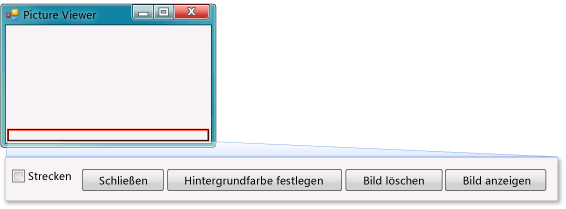

# Schritt 9: &#220;berpr&#252;fen, Kommentieren und Testen des Codes
[!INCLUDE[vs2017banner](../code-quality/includes/vs2017banner.md)]

Als Nächstes fügen Sie dem Code einen Kommentar hinzu.  Ein Kommentar ist ein Hinweis, der sich nicht auf das Programmverhalten auswirkt.  Kommentare machen den Code für andere verständlicher.  Es sollte zur guten Gewohnheit werden, Kommentare zum Code hinzuzufügen.  In Visual C\# kennzeichnen zwei Schrägstriche \(\/\/\) eine Zeile als Kommentar.  In Visual Basic wird ein einfaches Anführungszeichen \('\) verwendet, um eine Zeile als Kommentar zu kennzeichnen.  Testen Sie das Programm, nachdem Sie einen Kommentar hinzugefügt haben.  Es empfiehlt sich, den Code während der Arbeit am Projekt häufig auszuführen und zu testen, damit alle Probleme frühzeitig abgefangen und korrigiert werden können, bevor der Code komplexer wird.  Dies wird *iteratives Testen* genannt.  
  
 Sie haben soeben ein funktionierendes Programm erstellt, und obwohl es noch nicht fertig ist, kann es bereits ein Bild laden.  Bevor Sie dem Code einen Kommentar hinzufügen und den Code testen, sollten Sie sich die Zeit nehmen, die Codekonzepte zu prüfen, da Sie diese Konzepte häufig verwenden:  
  
-   Als Sie im Windows Forms\-Designer auf die Schaltfläche **Show a picture** doppelgeklickt haben, hat die IDE dem Code des Programms automatisch eine *Methode* hinzugefügt.  
  
-   Mithilfe von Methoden wird der Code organisiert, denn Methoden stellen Gruppen von Code dar.  
  
-   Die meiste Zeit führt eine Methode eine kleine Anzahl von Schritten in einer bestimmten Reihenfolge aus, so wie die `showButton_Click()`\-Methode beispielsweise ein Dialogfeld anzeigt und dann ein Bild lädt.  
  
-   Eine Methode besteht aus *Codeanweisungen* oder Codezeilen.  Stellen Sie sich eine Methode als eine Möglichkeit zum Bündeln von Codeanweisungen vor.  
  
-   Wenn eine Methode ausgeführt oder *aufgerufen* wird, werden die Anweisungen in der Methode einzeln der Reihe nach ausgeführt, und zwar beginnend mit der ersten Anweisung.  
  
     Im Folgenden sehen Sie ein Beispiel für eine Anweisung.  
  
    ```c#  
    pictureBox1.Load(openFileDialog1.FileName);  
    ```  
  
    ```vb#  
    pictureBox1.Load(openFileDialog1.FileName)  
    ```  
  
     Anweisungen sorgen dafür, dass Programme bestimmte Schritte ausführen.  In Visual C\# endet eine Anweisung immer mit einem Semikolon.  In Visual Basic ist das Ende einer Zeile das Ende einer Anweisung. \(In Visual Basic wird kein Semikolon benötigt.\) Die vorangehende Anweisung teilt dem `PictureBox`\-Steuerelement mit, die Datei zu laden, die der Benutzer mit der **OpenFileDialog**\-Komponente ausgewählt hat.  
  
  Eine Videoversion dieses Themas finden Sie im [Video 1 zum Lernprogramm 5: Erstellen eines Bildanzeigeprogramms in Visual Basic](http://go.microsoft.com/fwlink/?LinkId=205216) oder im [Video 1 zum Lernprogramm 5: Erstellen eines Bildanzeigeprogramms in C\#](http://go.microsoft.com/fwlink/?LinkId=205206).  Diese Videos verwenden eine frühere Version von Visual Studio, sodass Menübefehle und andere Benutzeroberflächenelemente geringfügig abweichen können.  Allerdings funktionieren die Konzepte und Prozeduren in der aktuellen Version von Visual Studio auf ähnliche Weise.  
  
### So fügen Sie Kommentare hinzu  
  
1.  Fügen Sie dem Code folgenden Kommentar hinzu.  
  
     [!code-vb[VbExpressTutorial1Step9_10#1](../ide/codesnippet/VisualBasic/step-9-review-comment-and-test-your-code_1.vb)]
     [!code-cs[VbExpressTutorial1Step9_10#1](../ide/codesnippet/CSharp/step-9-review-comment-and-test-your-code_1.cs)]  
  
    > [!NOTE]
    >  Der Click\-Ereignishandler der **showButton**\-Schaltfläche ist jetzt fertig, und er funktioniert.  Sie haben angefangen, Code zu schreiben, und mit einer `if`\-Anweisung begonnen.  Mit einer `if`\-Anweisung teilen Sie dem Programm Folgendes mit: "Prüfe diese Bedingung, und wenn sie zutrifft, führe diese Aktionen aus". In diesem Fall wird das Programm aufgefordert, das Dialogfeld **Datei öffnen** zu öffnen, und wenn der Benutzer eine Datei und die Schaltfläche **OK** auswählt, die entsprechende Datei in das PictureBox\-Steuerelement zu laden.  
  
    > [!TIP]
    >  Die IDE soll das Schreiben von Code vereinfachen, und *Codeausschnitte* sind eine Möglichkeit, dies zu erreichen.  Ein Ausschnitt ist eine Kurzform, die in einen kleinen Codeblock erweitert wird.  
    >   
    >  Sie können alle verfügbaren Ausschnitte sehen.  Wählen Sie in der Menüleiste **Tools**, **Codeausschnitt\-Manager** aus.  Bei Visual C\# befindet sich der `if`\-Ausschnitt unter **Visual C\#**.  Bei Visual Basic befinden sich die `if`\-Ausschnitte unter **Konditionelle Abschnitte und Schleifen**, **Codemuster**.  Sie können diesen Manager verwenden, um vorhandene Ausschnitte zu durchsuchen oder eigene Ausschnitte hinzuzufügen.  
    >   
    >  Um einen Ausschnitt bei der Eingabe von Code zu aktivieren, geben Sie ihn ein, und wählen Sie die TAB\-TASTE aus.  Im **IntelliSense**\-Fenster werden viele Ausschnitte angezeigt. Daher wählen Sie die TAB\-TASTE zweimal aus: Einmal, um den Ausschnitt im **IntelliSense**\-Fenster auszuwählen, und ein weiteres Mal, um der IDE mitzuteilen, dass dieser Ausschnitt verwendet werden soll. \(IntelliSense unterstützt den `if`\-Ausschnitt, aber nicht den `ifelse`\-Ausschnitt.\)  
  
2.  Speichern Sie das Programm, bevor Sie es ausführen, indem Sie die Symbolleistenschaltfläche **Alle speichern** auswählen, die wie folgt aussieht.  
  
       
Schaltfläche "Alle speichern"  
  
     Oder wählen Sie in der Menüleiste **Datei**, **Alle speichern** aus, um das Programm zu speichern.  Es ist empfehlenswert, früh und häufig zu speichern.  
  
     Wenn das Programm ausgeführt wird, sollte es wie im folgenden Bild aussehen.  
  
       
Bildanzeigeprogramm  
  
### So testen Sie das Programm  
  
1.  Wählen Sie die F5\-TASTE oder die Symbolleistenschaltfläche **Debuggen starten** aus.  
  
2.  Wählen Sie die Schaltfläche **Bild anzeigen** aus, um den Code auszuführen, den Sie soeben geschrieben haben.  Zuerst öffnet das Programm das Dialogfeld **Datei öffnen**.  Überprüfen Sie, ob Ihre Filter in der Dropdownliste **Dateityp** unten im Dialogfeld angezeigt werden.  Navigieren Sie dann zu einem Bild, und öffnen Sie es.  Normalerweise befinden sich Beispielbilder, die mit dem Betriebssystem Windows ausgeliefert werden, im Ordner **Eigene Bilder\\Beispielbilder** unter dem Ordner **Eigene Dokumente**.  
  
    > [!NOTE]
    >  Wenn keine Bilder im Dialogfeld **Bilddatei auswählen** angezeigt werden, stellen Sie sicher, dass der Filter "Alle Dateien \(\*.\*\)" in der Dropdownliste auf der unteren rechten Seite des Dialogfelds ausgewählt ist.  
  
3.  Laden Sie ein Bild, um es im PictureBox\-Steuerelement anzuzeigen.  Versuchen Sie dann, die Größe des Formulars zu ändern, indem Sie die Rahmen ziehen.  Da Sie das PictureBox\-Steuerelement in einem TableLayoutPanel angedockt haben, das wiederum im Formular angedockt ist, wird die Größe des Bildbereichs geändert, damit dieser so breit wie das Formular ist und die oberen 90 Prozent des Formulars einnimmt.  Das ist der Grund, weshalb Sie den TableLayoutPanel\- und FlowLayoutPanel\-Container verwendet haben: Diese Container sorgen dafür, dass das Formular ordnungsgemäß dimensioniert wird, wenn der Benutzer die Größe ändert.  
  
     Zum jetzigen Zeitpunkt gehen größere Bilder über den Rahmen des Bildanzeigeprogramms hinaus.  Im nächsten Schritt fügen Sie Code hinzu, um Bilder ins Fenster einzupassen.  
  
### So fahren Sie fort oder überprüfen die Angaben  
  
-   Um zum nächsten Schritt des Lernprogramms zu wechseln, klicken Sie auf [Schritt 10: Schreiben von Code für zusätzliche Schaltflächen und ein Kontrollkästchen](../ide/step-10-write-code-for-additional-buttons-and-a-check-box.md).  
  
-   Um zum vorherigen Schritt des Lernprogramms zurückzukehren, klicken Sie auf [Schritt 8: Schreiben von Code für den Ereignishandler der Schaltfläche "Bild anzeigen"](../ide/step-8-write-code-for-the-show-a-picture-button-event-handler.md).