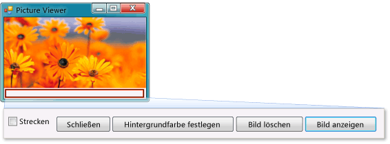

# Tutorial 1: Erstellen eines Bildanzeigeprogramms

In diesem Lernprogramm erstellen Sie ein Programm, das ein Bild aus einer Datei lädt und in einem Fenster anzeigt. Sie erfahren, wie Sie mithilfe des **Windows Forms-Designers** Steuerelemente, z.B. Schaltflächen und Bildfelder, auf das Formular ziehen, ihre Eigenschaften festlegen und mithilfe von Containern die Größe des Formulars stufenlos ändern können. Sie fangen auch an, Code zu schreiben. Sie lernen Folgendes:

- Erstellen Sie ein neues Projekt.

- Testen (Debuggen) einer Anwendung

- Hinzufügen grundlegender Steuerelemente, z. B. Kontrollkästchen und Schaltflächen, zu einem Formular

- Positionieren von Steuerelementen auf einem Formular mithilfe von Layouts

- Hinzufügen der Dialogfelder **Datei öffnen** und **Farbe** zu einem Formular.

- Schreiben von Code mithilfe von IntelliSense und Codeausschnitten

- Schreiben von Ereignishandlermethoden

Am Ende sieht das Programm wie in der folgenden Abbildung aus:

## Tutoriallinks

Informationen zum Herunterladen einer vollständigen Version des Beispiels finden Sie unter [Complete picture viewer tutorial sample (Tutorialbeispiel für vollständiges Bildanzeigeprogramm)](https://code.msdn.microsoft.com/Complete-Picture-Viewer-7d91d3a8).

Weitere Informationen erhalten Sie in der Videoversion dieses Themas unter [Tutorial 1: Create a Picture Viewer in Visual Basic - Video 1 (Tutorial 1: Erstellen eines Bildanzeigeprogramms in Visual Basic - Video 1)](http://go.microsoft.com/fwlink/?LinkId=205207) oder unter [Leitfaden für C#](http://go.microsoft.com/fwlink/?LinkId=205198).

> [!NOTE]
> Diese Videos verwenden eine frühere Version von Visual Studio, sodass Menübefehle und andere Benutzeroberflächenelemente geringfügig abweichen können. Allerdings funktionieren die Konzepte und Prozeduren in der aktuellen Version von Visual Studio auf ähnliche Weise. In diesem Lernprogramm wird sowohl Visual C# als auch Visual Basic behandelt. Achten Sie also auf die entsprechenden Informationen zu der Programmiersprache, die Sie verwenden.
>
> Um Code für Visual Basic anzuzeigen, wählen Sie die Registerkarte **VB** oben in den Codeblöcken aus. Um Code für Visual C# anzuzeigen, wählen Sie die Registerkarte **C#** aus. Wenn Sie Informationen zu Visual C++ benötigen, finden Sie diese unter [Erste Schritte](../ide/getting-started-with-cpp-in-visual-studio.md) und im [C++-Sprachtutorial](http://www.cplusplus.com/doc/tutorial/).
>
> Wenn Sie erfahren möchten, wie Sie UWP-Apps in Visual C# oder Visual Basic schreiben, lesen Sie [Entwickeln von UWP-Apps](https://developer.microsoft.com/windows/apps).

## Verwandte Themen

|Titel|Beschreibung|
|-----------|-----------------|
|[Schritt 1: Erstellen eines Windows Forms-Anwendungsprojekts](../ide/step-1-create-a-windows-forms-application-project.md)|Beginnen Sie, indem Sie ein Windows Forms-Anwendungsprojekt erstellen.|
|[Schritt 2: Ausführen des Programms](../ide/step-2-run-your-program.md)|Führen Sie das Windows Forms-Anwendungsprogramm aus, das Sie im vorherigen Schritt erstellt haben.|
|[Schritt 3: Festlegen der Formulareigenschaften](../ide/step-3-set-your-form-properties.md)|Ändern Sie das Aussehen des Formulars mit dem **Eigenschaftenfenster**.|
|[Schritt 4: Erstellen eines Layouts für das Formular mit einem TableLayoutPanel-Steuerelement](../ide/step-4-lay-out-your-form-with-a-tablelayoutpanel-control.md)|Fügen Sie Ihrem Formular ein `TableLayoutPanel`-Steuerelement hinzu.|
|[Schritt 5: Hinzufügen von Steuerelementen zum Formular](../ide/step-5-add-controls-to-your-form.md)|Fügen Sie dem Formular Steuerelemente hinzu, z.B. ein `PictureBox`-Steuerelement und ein `CheckBox`-Steuerelement. Fügen Sie dem Formular Schaltflächen hinzu.|
|[Schritt 6: Benennen der Schaltflächen-Steuerelemente](../ide/step-6-name-your-button-controls.md)|Benennen Sie die Schaltflächen um, damit die Namen aussagekräftiger sind.|
|[Schritt 7: Hinzufügen von Dialogfeldkomponenten zum Formular](../ide/step-7-add-dialog-components-to-your-form.md)|Fügen Sie dem Formular jeweils eine der Komponenten `OpenFileDialog` und `ColorDialog` hinzu.|
|[Schritt 8: Schreiben von Code für den Ereignishandler der Schaltfläche „Bild anzeigen“](../ide/step-8-write-code-for-the-show-a-picture-button-event-handler.md)|Schreiben Sie Code mit dem IntelliSense-Tool.|
|[Schritt 9: Überprüfen, Kommentieren und Testen des Codes](../ide/step-9-review-comment-and-test-your-code.md)|Prüfen und testen Sie den Code. Fügen Sie bei Bedarf Kommentare hinzu.|
|[Schritt 10: Schreiben von Code für zusätzliche Schaltflächen und ein Kontrollkästchen](../ide/step-10-write-code-for-additional-buttons-and-a-check-box.md)|Schreiben Sie mithilfe von IntelliSense Code, damit andere Schaltflächen und ein Kontrollkästchen funktionieren.|
|[Schritt 11: Ausführen des Programms und Ausprobieren weiterer Funktionen](../ide/step-11-run-your-program-and-try-other-features.md)|Führen Sie das Programm aus, und legen Sie die Hintergrundfarbe fest. Probieren Sie andere Funktionen aus. Ändern Sie z. B. Farben, Schriftarten und Rahmen.|
