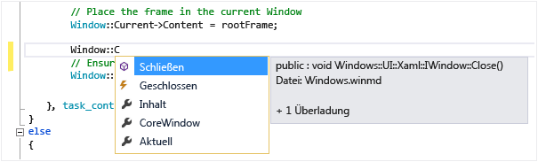

# <a name="intellisense-in-visual-studio"></a>IntelliSense in Visual Studio

IntelliSense ist ein Hilfsprogramm für die Codevervollständigung, das folgende Features umfasst: Auflisten von Membern, Parameterinformationen, QuickInfo und Wortvervollständigung. Mithilfe dieser Features erfahren Sie mehr über den verwendeten Code. Sie können die eingegebenen Parameter verfolgen und mit wenigen Tastaturanschlägen Eigenschaften und Methoden zu Aufrufen hinzufügen.

Viele Aspekte von IntelliSense sind sprachspezifisch. Weitere Informationen zu IntelliSense für verschiedene Sprachen finden Sie in den Artikeln, die im Abschnitt [Siehe auch](#see-also) aufgeführt sind.

## <a name="list-members"></a>Member auflisten

Eine Liste gültiger Member von einem Typ (oder Namespace) wird angezeigt, nachdem Sie ein Triggerzeichen eingegeben haben, beispielsweise einen Punkt (`.`) im verwalteten Code oder `::` in C++. Wenn Sie weitere Zeichen eingeben, wird die Liste nach Membern gefiltert, deren Namen mit den Zeichen beginnen oder die ein *beliebiges Wort* enthalten, das mit diesen Zeichen anfängt. IntelliSense führt außerdem einen Abgleich für Zeichenketten mit gemischter Groß- und Kleinschreibung durch, sodass Sie nur den ersten Buchstaben des klein oder groß geschriebenen Worts innerhalb der Zeichenkette eingeben müssen, damit Ihnen die Membernamen angezeigt werden.

Sobald Sie ein Element ausgewählt haben, können Sie es in den Code einfügen, indem Sie die **TAB-TASTE** drücken oder einen Leerraum eingeben. Wenn Sie ein Element auswählen und einen Punkt eingeben, wird das Element gefolgt von dem Punkt angezeigt. Dadurch wird eine andere Memberliste aufgerufen. Wenn Sie ein Element auswählen, bevor Sie es einfügen, erhalten Sie QuickInfos über das Element.

In der Memberliste stellt das Symbol auf der linken Seite den Membertyp dar, z. B. Namespace, Klasse, Funktion oder Variable. Eine Liste der Symbole finden Sie unter [Symbole in der Klassenansicht und im Objektkatalog](../ide/class-view-and-object-browser-icons.md). Die Liste kann ziemlich lang sein, aber Sie können **BILD-AUF** und **BILD-AB** drücken, um nach oben oder unten zu navigieren.



Sie können das Feature **Members auflisten** manuell aufrufen, indem Sie **STRG**+**J** drücken, auf **Bearbeiten** > **IntelliSense** > **Members auflisten** klicken, oder indem Sie auf die Schaltfläche **Members auflisten** auf der Symbolleiste des Editors klicken. Wenn die Memberliste in einer Leerzeile oder außerhalb eines erkennbaren Gültigkeitsbereichs aktiviert wird, werden Symbole im globalen Namespace angezeigt.

Rufen Sie **Extras** > **Optionen** > **Alle Sprachen** auf, und deaktivieren Sie **Members automatisch auflisten**, um die Auflistung der Members standardmäßig zu deaktivieren (sodass sie nur noch nach einem speziellem Aufruf angezeigt wird). Wenn Sie die Auflistung der Member nur für eine bestimmte Sprache deaktivieren möchten, wechseln Sie zu den Einstellungen **Allgemein** für diese Sprache.

Sie können auch in den Vorschlagsmodus wechseln, in dem nur der von Ihnen eingegebene Text in den Code eingefügt wird. Wenn Sie beispielsweise einen Bezeichner eingeben, der sich nicht in der Liste befindet, und dann die **TAB-TASTE** drücken, ersetzt der Eintrag im Beendigungsmodus den typisierten Bezeichner. Um zwischen dem Vervollständigungsmodus und dem Vorschlagsmodus zu wechseln, drücken Sie **STRG**+**ALT**+**LEERTASTE**, oder klicken Sie auf **Bearbeiten** > **IntelliSense** > **Vervollständigungsmodus umschalten**.

## <a name="parameter-info"></a>Parameterinfo

Die Parameterinfo liefert Informationen über die Anzahl, Namen und Typen der Parameter, die von einer Methode, einem attributgenerischen Typparameter (in C#) oder einer Vorlage (in C++) benötigt werden.

Der Parameter, den Sie beim Eingeben der Funktion als Nächstes angeben müssen, ist fett dargestellt. Bei überladenen Funktionen können Sie die **NACH-OBEN-TASTE** und **NACH-UNTEN-TASTE** verwenden, um alternative Parameterinformationen für die Funktionsüberladungen anzuzeigen.


Wenn Sie Funktionen und Parameter mit XML-Dokumentationskommentaren versehen, werden die Kommentare als Parameterinfo angezeigt. Weitere Informationen finden Sie unter [Anzeigen von XML-Codekommentaren](reference/generate-xml-documentation-comments.md).

Sie können die Parameterinformation manuell aufrufen, indem Sie auf **Bearbeiten** > **IntelliSense** > **Parameterinfo** klicken, indem Sie **STRG**+**UMSCHALT**+**LEERTASTE** drücken, oder indem Sie auf die Schaltfläche **Parameterinfo** auf der Symbolleiste des Editors klicken.

## <a name="quick-info"></a>QuickInfo

QuickInfo zeigt die vollständige Deklaration eines beliebigen Bezeichners im Code an.


Wenn Sie einen Member im Feld **Member auflisten** auswählen, wird ebenfalls eine QuickInfo angezeigt.


Sie können die QuickInfo manuell aufrufen, indem Sie auf **Bearbeiten** > **IntelliSense** > **QuickInfo** klicken, indem Sie **STRG**+**I** drücken, oder indem Sie auf die Schaltfläche **QuickInfo** auf der Symbolleiste des Editors klicken.

Wenn eine Funktion überladen ist, zeigt IntelliSense u. U. nicht für alle Formulare der überladenen Funktion Informationen an.

Sie können „QuickInfo“ für C++-Code deaktivieren, indem Sie zu **Extras** > **Optionen** > **Text-Editor** > **C/C++** > **Erweitert** navigieren und **Auto QuickInfo** auf `false` festlegen.

## <a name="complete-word"></a>Wort vervollständigen

Die Option „Wort vervollständigen“ ergänzt den Rest eines Variablen-, Befehls- oder Funktionsnamens, sobald Sie so viele Zeichen eingegeben haben, dass der Name eindeutig erkannt werden kann. Sie können „Wort vervollständigen“ aufrufen, indem Sie auf **Bearbeiten** > **IntelliSense** > **Wort vervollständigen** klicken, **STRG**+**LEERTASTE** drücken oder auf die Schaltfläche **Wort vervollständigen** auf der Symbolleiste des Editors klicken.

## <a name="intellisense-options"></a>IntelliSense-Optionen

IntelliSense-Optionen sind standardmäßig aktiviert. Um sie zu deaktivieren, klicken Sie auf **Extras** > **Optionen** > **Text-Editor**, und deaktivieren Sie **Parameterinformationen** oder **Members automatisch auflisten**, wenn Sie die Funktion „Members auflisten“ nicht verwenden möchten.

## <a name="troubleshoot-intellisense"></a>Problembehandlung für IntelliSense

In bestimmten Fällen kann es vorkommen, dass IntelliSense-Optionen nicht wie erwartet funktionieren.

**Der Cursor befindet sich unter einem Codefehler.** Sie können IntelliSense möglicherweise nicht verwenden, wenn eine unvollständige Funktion oder ein anderer Fehler im Code über dem Cursor vorhanden ist, weil IntelliSense die Codeelemente eventuell nicht analysieren kann. Sie können dieses Problem beheben, indem Sie den betreffenden Code auskommentieren.

**Der Cursor befindet sich in einem Codekommentar.** Sie können IntelliSense nicht verwenden, wenn sich der Cursor in einem Kommentar in Ihrer Quelldatei befindet.

**Der Cursor befindet sich in einem Zeichenfolgenliteral.** Sie können IntelliSense nicht verwenden, wenn sich der Cursor innerhalb der Anführungszeichen um ein Zeichenfolgenliteral befindet, wie im folgenden Beispiel dargestellt:

```cpp
MessageBox( hWnd, "String literal|")
```

**Die automatischen Optionen sind deaktiviert.** Standardmäßig funktioniert IntelliSense automatisch, Sie können es jedoch deaktivieren. Auch wenn die automatische Anweisungsvervollständigung deaktiviert ist, können Sie eine IntelliSense-Funktion aufrufen.

## <a name="see-also"></a>Siehe auch

- [Visual Basic-IntelliSense](../ide/visual-basic-specific-intellisense.md)
- [C#-IntelliSense](../ide/visual-csharp-intellisense.md)
- [JavaScript IntelliSense](../ide/javascript-intellisense.md)
- [Schreiben und Refactoring von Code (C++)](/cpp/ide/writing-and-refactoring-code-cpp)
- [Anzeigen von XML-Codekommentaren](reference/generate-xml-documentation-comments.md)