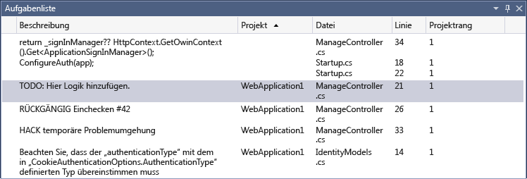
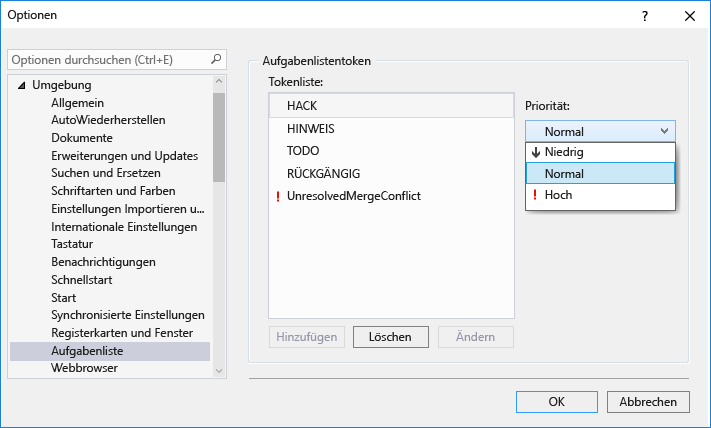

# <a name="using-the-task-list"></a>Verwenden der Aufgabenliste
Verwenden Sie die **Aufgabenliste** , um Codekommentare, die Token wie `TODO` und `HACK`verwenden, nachzuverfolgen und um Verknüpfungen zu verwalten, mit denen Sie direkt zu einem vordefinierten Speicherort im Code gelangen. Klicken Sie auf das Element in der Liste, um an die entsprechende Position im Quellcode zu gelangen.  
  
 In diesem Thema:  
  
-   [Das Fenster "Aufgabenliste"](../ide/using-the-task-list.md#taskListWindow)  
  
-   [Benutzeraufgaben](../ide/using-the-task-list.md#userTasks)  
  
-   [Token und Kommentare](../ide/using-the-task-list.md#tokensComments)  
  
-   [Benutzerdefinierte Token](../ide/using-the-task-list.md#customTokens)  
  
-   [C++-TODO-Kommentare](../ide/using-the-task-list.md#cppComments)  
  
-   [Verknüpfungen](../ide/using-the-task-list.md#shortcuts)  
  
##  <a name="taskListWindow"></a> Das Fenster "Aufgabenliste"  
 Wird die **Aufgabenliste** geöffnet, wird sie unten im Anwendungsfenster angezeigt.  
  
#### <a name="to-open-the-task-list"></a>So öffnen Sie die Aufgabenliste  
  
-   Klicken Sie im Menü **Ansicht** auf die Option **Aufgabenliste** (Tastatur: STRG+\\,T).  
  
       
  
#### <a name="to-change-the-sort-order-of-the-list"></a>So ändern Sie die Sortierreihenfolge der Liste  
  
-   Klicken Sie auf den Header einer beliebigen Spalte. Um die Suchergebnisse weiter zu verfeinern, drücken Sie die UMSCHALTTASTE und klicken auf einen zweiten Spaltenheader.  
  
     Sie können auch im Kontextmenü die Option **Sortieren nach**und dann einen Header auswählen. Um die Suchergebnisse weiter zu verfeinern, drücken Sie die UMSCHALTTASTE, und wählen Sie einen zweiten Header.  
  
#### <a name="to-show-or-hide-columns"></a>So blenden Sie Spalten ein oder aus  
  
-   Klicken Sie im Kontextmenü auf **Spalten einblenden**. Wählen Sie die Spalten aus, die Sie ein- oder ausblenden möchten.  
  
#### <a name="to-change-the-order-of-the-columns"></a>So ändern Sie die Reihenfolge der Spalten  
  
-   Ziehen Sie einen Spaltenheader an die gewünschte Position.  
  
##  <a name="userTasks"></a> Benutzeraufgaben  
 Das Feature „Benutzeraufgabe“ wurde aus Visual Studio 2015 entfernt. Wenn Sie eine Projektmappe aus Visual Studio 2013 oder früher, die Benutzeraufgabendaten enthält, in Visual Studio 2015 öffnen, bleiben die Benutzeraufgabendaten in Ihrer SUO-Datei davon unberührt, aber die Benutzeraufgaben werden nicht in der Aufgabenliste angezeigt.  
  
 Um weiterhin auf Ihre Benutzeraufgabendaten zugreifen und diese aktualisieren zu können, sollten Sie das Projekt in Visual Studio 2013 öffnen und den Inhalt aller Benutzeraufgaben in Ihr bevorzugtes Projektmanagementtool (z. B. Team Foundation Server) kopieren.  
  
##  <a name="tokensComments"></a> Token und Kommentare  
 Ein Kommentar im Code, dem ein Kommentarzeichen und ein vordefiniertes Token vorangestellt ist, wird auch im Fenster **Aufgabenliste** angezeigt. Der folgende C#-Kommentar setzt sich beispielsweise aus drei verschiedenen Teilen zusammen:  
  
-   Kommentarzeichen (`//`)  
  
-   Das Token, z. B. (`TODO`)  
  
-   Kommentar (der restliche Text)  
  
```  
// TODO: Load state from previously suspended application  
```  
  
 Da `TODO` ein vordefiniertes Token ist, wird dieser Kommentar als eine `TODO` -Aufgabe in der Liste angezeigt.  
  
###  <a name="customTokens"></a> Benutzerdefinierte Token  
 Standardmäßig enthält Visual Studio die folgenden Token: HACK, TODO, UNDONE, NOTE. Hierbei wird die Groß-/Kleinschreibung nicht berücksichtigt.  
  
 Sie können außerdem eigene benutzerdefinierte Token erstellen.  
  
##### <a name="to-create-a-custom-token"></a>So erstellen Sie ein benutzerdefiniertes Token  
  
1.  Wählen Sie im Menü **Extras** den Befehl **Optionen**.  
  
2.  Öffnen Sie den Ordner **Umgebung** , und wählen Sie dann **Aufgabenliste**aus.  
  
     [Task List, Environment, Options Dialog Box](../ide/reference/task-list-environment-options-dialog-box.md) wird angezeigt.  
  
       
  
3.  Geben Sie in der Kategorie **Token** im Textfeld **Name** den Tokennamen ein, z. B. „BUG“.  
  
4.  Wählen Sie in der Dropdownliste **Priorität** eine Standardpriorität für das neue Token aus. Wählen Sie die Schaltfläche **Hinzufügen** aus.  
  
###  <a name="cppComments"></a> C++-TODO-Kommentare  
 Standardmäßig werden C++-TODO-Kommentare im Fenster **Aufgabenliste** angezeigt. Sie können dieses Verhalten ändern.  
  
##### <a name="to-turn-off-c-todo-comments"></a>So deaktivieren Sie die C++-TODO-Kommentare  
  
1.  Wechseln Sie im Menü **Extras** zu **Optionen > Text-Editor > C/C++ > Ansicht > Kommentaraufgaben aufzählen**, und legen Sie den Wert auf FALSE fest.  
  
2.  Rufen Sie im Dialogfeld **Optionen** die Option **Text-Editor**auf.  
  
3.  Wählen Sie unter **C/C++**die Option **Ansicht**aus, und legen Sie dann **Kommentaraufgaben aufzählen** auf **False**fest.  
  
##  <a name="shortcuts"></a> Verknüpfungen  
 Eine *Verknüpfung* ist ein Lesezeichen im Code, das in der **Aufgabenliste**nachverfolgt wird. Es weist ein anderes Symbol als ein reguläres Lesezeichen auf. Doppelklicken Sie auf die Verknüpfung in der **Aufgabenliste** , um an die entsprechende Position im Code zu gelangen.  
  
   
  
#### <a name="to-create-a-shortcut"></a>So erstellen Sie eine Verknüpfung  
  
-   Fügen Sie den Zeiger in den Code ein, in dem Sie eine Verknüpfung platzieren möchten. Wählen Sie **Bearbeiten > Lesezeichen > Verknüpfung für Aufgabenliste hinzufügen** aus, oder drücken Sie STRG+K, STRG+H.  
  
     Um durch die Verknüpfungen im Code zu navigieren, wählen Sie eine Verknüpfung in der Liste und dann im Kontextmenü **Nächste Aufgabe** oder **Vorherige Aufgabe** aus.  
  
## <a name="see-also"></a>Siehe auch  
 [Aufgabenliste, Umgebung, Dialogfeld „Optionen“](../ide/reference/task-list-environment-options-dialog-box.md)