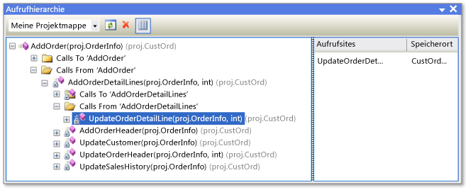

# Anzeigen der Codestruktur mithilfe verschiedener Toolfenster

Sie können in Visual Studio Klassen und deren Member mithilfe verschiedener Toolfenster untersuchen, darunter **Klassenansicht**, **Aufrufhierarchie**, **Objektkatalog** und **Codedefinition** (nur C++). Mit diesen Toolfenstern können Sie Code in Visual Studio-Projekten, .NET-Komponenten, COM-Komponenten, Dynamic Link Librarys (DLLs) und Typbibliotheken (TLBs) untersuchen.

Sie können auch den **Projektmappen-Explorer** verwenden, um die Typen und Member in Ihren Projekten zu durchsuchen, nach Symbolen, Symbolverweisen und weiteren Inhalten zu suchen und die Aufrufhierarchie einer Methode anzuzeigen, ohne zwischen mehreren Toolfenstern wechseln zu müssen.

Wenn Sie über die Edition Visual Studio Enterprise verfügen, können Sie zum Visualisieren der Struktur des Codes und seiner Abhängigkeiten in der gesamten Projektmappe entsprechende *Code Maps* verwenden. Weitere Informationen finden Sie unter [Map dependencies with code maps (Zuordnen von Abhängigkeiten mit Code Maps)](../modeling/map-dependencies-across-your-solutions.md).

## Klassenansicht (Visual Basic, C#, C++)

Die **Klassenansicht** wird als Teil des **Projektmappen-Explorers** und in einem separaten Fenster angezeigt. **Klassenansicht** zeigt die Elemente einer Anwendung an. Im oberen Bereich werden Namespaces, Typen, Schnittstellen, Enumerationen und Klassen angezeigt, während der untere Bereich die Member auflistet, die zum Typ gehören, der im oberen Bereich ausgewählt ist. Mithilfe dieses Fensters können Sie im Quellcode zu Memberdefinitionen wechseln (oder im **Objektkatalog**, wenn das Element außerhalb der Projektmappe definiert ist).

Sie müssen ein Projekt nicht kompilieren, um seine Elemente in der **Klassenansicht** anzuzeigen. Das Fenster wird aktualisiert, wenn Sie im Projekt Änderungen am Code vornehmen.

Sie können Code zu Ihrem Projekt hinzufügen, indem Sie den Projektknoten und dann die Schaltfläche **Hinzufügen** auswählen, um das Dialogfeld **Neues Element hinzufügen** zu öffnen. Der Code wird in einer separaten Datei hinzugefügt.

Wenn Ihr Projekt in die Quellcodeverwaltung eingecheckt wird, zeigt jedes **Klassenansicht**-Element ein Symbol an, das den Quellcodestatus der Datei angibt. Allgemeine Befehle zur Quellcodeverwaltung wie **Auschecken**, **Einchecken** und **Letzte Version abrufen** sind auch im Kontextmenü für das entsprechende Element verfügbar.

### Klassenansicht: Symbolleiste

Die Symbolleiste der **Klassenansicht** enthält die folgenden Befehle:

|||
|-|-|
|**Neuer Ordner**|Erstellt einen virtuellen Ordner oder Unterordner, in dem Sie häufig verwendete Elemente organisieren können. Sie werden in der aktiven Projektmappendatei (*SUO*) gespeichert. Nach dem Umbenennen oder Löschen eines Elements in Ihrem Code wird es in einem virtuellen Ordner möglicherweise als Fehlerknoten angezeigt. Löschen Sie den Fehlerknoten, um dieses Problem zu beheben. Wenn Sie ein Element umbenannt haben, können Sie es aus der Projekthierarchie erneut in den Ordner verschieben.|
|**Zurück**|Navigiert zum zuvor ausgewählten Element.|
|**Vorwärts**|Navigiert zum nächsten ausgewählten Element.|
|**Klassendiagramm anzeigen** (nur Projekte mit verwaltetem Code)|Dieser Befehl wird verfügbar, wenn Sie in der **Klassenansicht** einen Namespace oder Typ auswählen. Wenn ein Namespace ausgewählt ist, zeigt das Klassendiagramm alle darin enthaltenen Typen an. Wenn ein Typ ausgewählt ist, zeigt das Klassendiagramm nur diesen Typ an.|

### Klassenansicht: Einstellungen

Die Schaltfläche **Klassenansicht: Einstellungen** auf der Symbolleiste weist die folgenden Einstellungen auf:

|||
|-|-|
|**Basistypen anzeigen**|Es werden die Basistypen angezeigt.|
|**Projektverweise anzeigen**|Projektverweise werden angezeigt.|
|**Ausgeblendete Typen und Member anzeigen**|Es werden ausgeblendete Typen und Member in hellgrauer Textfarbe angezeigt (nicht für die Verwendung von Clients vorgesehen).|
|**Öffentliche Member anzeigen**|Es werden öffentliche Member angezeigt.|
|**Geschützte Member anzeigen**|Es werden geschützte Member angezeigt.|
|**Private Member anzeigen**|Es werden private Member angezeigt.|
|**Andere Member anzeigen**|Es werden andere Arten von Member angezeigt, einschließlich der internen Member (oder „Friend“ in Visual Basic).|
|**Geerbte Member anzeigen**|Es werden geerbte Member angezeigt.|

### Klassenansicht: Kontextmenü

Das Kontextmenü in der **Klassenansicht** kann in Abhängigkeit des ausgewählten Projekts die folgenden Befehle enthalten:

|||
|-|-|
|**Gehe zu Definition**|Sucht nach der Definition des Elements im Quellcode oder im **Objektkatalog**, wenn das Element nicht im geöffneten Projekt definiert ist.|
|**Definition durchsuchen**|Zeigt das ausgewählte Element im **Objektkatalog** an.|
|**Alle Verweise suchen**|Sucht das aktuell ausgewählte Objektelement und zeigt die Ergebnisse im Fenster **Suchergebnisse** an.|
|**Für Typ filtern** (nur verwalteter Code)|Zeigt nur den ausgewählten Typ oder Namespace an. Sie können den Filter entfernen, indem Sie auf die Schaltfläche **Suchergebnisse löschen** (**X**) neben dem Feld **Suchen** klicken.|
|**Kopieren**|Kopiert den vollqualifizierten Namen des Objekts.|
|**Alphabetisch sortieren**|Listet Typen und Member alphabetisch nach Namen auf.|
|**Nach Membertyp sortieren**|Listet Typen und Member nach Typ sortiert auf (sodass Klassen vor Schnittstellen, Schnittstellen vor Delegaten und Methoden vor Eigenschaften stehen).|
|**Nach Memberzugriff sortieren**|Listet Typen und Member nach Zugriffstyp sortiert auf, z. B. öffentlich oder privat.|
|**Nach Membertyp gruppieren**|Gruppiert Typen und Member nach Objekttyp.|
|**Gehe zu Deklaration** (nur C++-Code)|Zeigt die Deklaration des Typs oder Members im Quellcode an, falls verfügbar.|
|**Gehe zu Definition**|Zeigt die Definition des Typs oder Members im Quellcode an, falls verfügbar.|
|**Gehe zu Verweis**|Zeigt einen Verweis auf den Typ oder Member im Quellcode an, falls verfügbar.|
|**Aufrufhierarchie anzeigen**|Zeigt die ausgewählte Methode im Fenster **Aufrufhierarchie** an.|

## Fenster „Aufrufhierarchie“ (Visual Basic, C#, C++)

Das Fenster **Aufrufhierarchie** zeigt, wo eine bestimmte Methode oder Eigenschaft aufgerufen wird. Außerdem werden die Methoden aufgeführt, die von dieser Methode aufgerufen werden. Sie können mehrere Ebenen des Aufrufdiagramms anzeigen, in dem die Beziehung zwischen Aufrufer und Aufgerufenem zwischen den Methoden in einem angegebenen Bereich angezeigt wird.

Sie können das Fenster **Aufrufhierarchie** anzeigen, indem Sie eine Methode (oder Eigenschaft oder einen Konstruktor) im Editor auswählen und dann im Kontextmenü auf **Aufrufhierarchie anzeigen** klicken. Die Anzeige sollte in etwa der folgenden Abbildung entsprechen:

Mithilfe der Dropdownliste auf der Symbolleiste können Sie den Bereich der Hierarchie angeben: die Projektmappe, das aktuelle Projekt oder das aktuelle Dokument.

Im Hauptbereich werden die Aufrufe zur und von der Methode angezeigt. Im Bereich **Aufrufort** wird die Position des ausgewählten Aufrufs angezeigt. Für Member, die virtuell oder abstrakt sind, wird ein Knoten zur **Außerkraftsetzung des Methodennamens** angezeigt. Für Schnittstellenmember wird ein Knoten zum **Implementieren des Methodennamens** angezeigt.

Das Fenster **Aufrufhierarchie** findet keine Methodengruppenverweise, die Stellen enthalten, an denen eine Methode als Ereignishandler hinzugefügt oder einem Delegaten zugewiesen wird. Verwenden Sie den Befehl **Alle Verweise suchen**, um diese Verweise zu suchen.

Das Kontextmenü im Fenster **Aufrufhierarchie** enthält die folgenden Befehle:

|||
|-|-|
|**Als neuen Stamm hinzufügen**|Fügt den ausgewählten Knoten als neuer Stammknoten hinzu.|
|**Stamm entfernen**|Entfernt den ausgewählten Stammknoten aus dem Strukturansichtsbereich.|
|**Gehe zu Definition**|Navigiert zur ursprünglichen Definition einer Methode.|
|**Alle Verweise suchen**|Sucht im Projekt alle Verweise auf die ausgewählte Methode.|
|**Kopieren**|Kopiert den ausgewählten Knoten (aber nicht dessen untergeordnete Knoten).|
|**Aktualisieren**|Aktualisiert die Informationen.|

##  Objektkatalog

Das Fenster **Objektkatalog** zeigt Beschreibungen des Codes in Ihren Projekten an.

Sie können die Komponenten, die Sie anzeigen möchten, mithilfe der Dropdownliste im oberen Bereich des Fensters filtern. Benutzerdefinierte Komponenten können ausführbare Dateien von verwaltetem Code, Bibliothekassemblys, Typbibliotheken und *OCX*-Dateien umfassen. Es ist nicht möglich, benutzerdefinierte C++-Komponenten hinzufügen.

::: moniker range="vs-2017"

Benutzerdefinierte Einstellungen werden im Visual Studio-Benutzeranwendungsverzeichnis *%APPDATA%\Microsoft\VisualStudio\15.0\ObjBrowEX.dat* gespeichert.

::: moniker-end

::: moniker range=">=vs-2019"

Benutzerdefinierte Einstellungen werden im Visual Studio-Benutzeranwendungsverzeichnis *%APPDATA%\Microsoft\VisualStudio\16.0\ObjBrowEX.dat* gespeichert.

::: moniker-end

Der linke Bereich des **Objektbrowsers** zeigt Assemblys. Sie können die Assemblys erweitern, um die darin enthaltenen Namespaces anzuzeigen, und dann die Namespaces erweitern, um die darin enthaltenen Typen anzuzeigen. Wenn Sie einen Typ auswählen, werden seine Member (z. B. Eigenschaften und Methoden) im rechten Bereich aufgeführt. Im unteren rechten Bereich werden ausführliche Informationen zum ausgewählten Objekt angezeigt.

Sie können über das Feld **Suchen** am oberen Rand des Fensters nach einem bestimmten Objekt suchen. Bei den Suchvorgängen wird die Groß-/Kleinschreibung nicht beachtet. Suchergebnisse werden im linken Bereich angezeigt. Klicken Sie zum Löschen einer Suche auf die Schaltfläche **Suchergebnisse löschen** (**X**) neben dem Feld **Suchen**.

Der **Objektkatalog** verfolgt die von Ihnen vorgenommene Auswahl, und Sie können zwischen Ihren Auswahlmöglichkeiten navigieren, indem Sie die Schaltflächen **Weiter** und **Zurück** auf der Symbolleiste verwenden.

Sie können den **Objektkatalog** zum Hinzufügen eines Assemblyverweises auf eine geöffnete Projektmappe verwenden, indem Sie ein Objekt auswählen (Assembly, Namespace, Typ oder Member) und dann die Schaltfläche **Verweis hinzufügen** auf der Symbolleiste verwenden.

### Objektkatalog: Einstellungen

Mithilfe der Schaltfläche **Objektkatalog: Einstellungen** auf der Symbolleiste können Sie eine der folgenden Ansichten festlegen:

|||
|-|-|
|**Namespaces anzeigen**|Zeigt im linken Bereich anstelle von physischen Containern die Namespaces an. Die in mehreren physischen Containern gespeicherten Namespaces werden zusammengeführt.|
|**Container anzeigen**|Zeigt im linken Bereich anstelle von Namespaces die physischen Container an. **Namespaces anzeigen** und **Container anzeigen** sind sich gegenseitig ausschließende Einstellungen.|
|**Basistypen anzeigen**|Zeigt Basistypen an.|
|**Ausgeblendete Typen und Member anzeigen**|Ausgeblendete Typen und Member werden in hellgrauer Textfarbe angezeigt (nicht für die Verwendung von Clients vorgesehen).|
|**Öffentliche Member anzeigen**|Zeigt öffentliche Member an.|
|**Geschützte Member anzeigen**|Zeigt geschützte Member an.|
|**Private Member anzeigen**|Zeigt private Member an.|
|**Andere Member anzeigen**|Zeigt andere Arten von Member an, einschließlich der internen Member (oder „Friend“ in Visual Basic).|
|**Geerbte Member anzeigen**|Zeigt geerbte Member an.|
|**Erweiterungsmethoden anzeigen**|Zeigt Erweiterungsmethoden an.|

### Objektkatalog: Kontextmenübefehle

Das Kontextmenü im **Objektkatalog** kann in Abhängigkeit des ausgewählten Projekts die folgenden Befehle enthalten:

|||
|-|-|
|**Definition durchsuchen**|Zeigt den primären Knoten für das ausgewählte Objekt an.|
|**Alle Verweise suchen**|Sucht das aktuell ausgewählte Objektelement und zeigt die Ergebnisse im Fenster **Suchergebnisse** an.|
|**Für Typ filtern**|Zeigt nur den ausgewählten Typ oder Namespace an. Sie können den Filter entfernen, indem Sie die Schaltfläche **Suche löschen** auswählen.|
|**Kopieren**|Kopiert den vollqualifizierten Namen des Objekts.|
|**Entfernen**|Wenn der Bereich einem benutzerdefinierten Komponentensatz entspricht, wird die ausgewählte Komponente aus dem Bereich entfernt.|
|**Alphabetisch sortieren**|Listet Typen und Member alphabetisch nach Namen auf.|
|**Nach Objekttyp sortieren**|Listet Typen und Member nach Typ sortiert auf (sodass Klassen vor Schnittstellen, Schnittstellen vor Delegaten und Methoden vor Eigenschaften stehen).|
|**Nach Objektzugriff sortieren**|Listet Typen und Member nach Zugriffstyp sortiert auf, z. B. öffentlich oder privat.|
|**Nach Objekttyp gruppieren**|Gruppiert Typen und Member nach Objekttyp.|
|**Gehe zu Deklaration** (nur C++-Projekte)|Zeigt die Deklaration des Typs oder Members im Quellcode an, falls verfügbar.|
|**Gehe zu Definition**|Zeigt die Definition des Typs oder Members im Quellcode an, falls verfügbar.|
|**Gehe zu Verweis**|Zeigt einen Verweis auf den Typ oder Member im Quellcode an, falls verfügbar.|
|**Aufrufhierarchie anzeigen**|Zeigt die ausgewählte Methode im Fenster **Aufrufhierarchie** an.|

## Fenster „Codedefinition“ (C#, C++)

Im Fenster **Codedefinition** wird die Definition eines ausgewählten C++-Typs oder -Members im aktiven Projekt angezeigt. Der Typ oder Member kann im Code-Editor oder in einem Codeansichtsfenster ausgewählt werden.

Obwohl dieses Fenster schreibgeschützt ist, können Sie darin Haltepunkte oder Lesezeichen festlegen. Wählen Sie im Kontextmenü die Option **Definition bearbeiten** aus, um die angezeigte Definition zu ändern. Daraufhin wird die Quelldatei im Code-Editor geöffnet und die Einfügemarke in die Zeile verschoben, in der die Definition beginnt.

> [!NOTE]
> Ab Visual Studio 2015 kann das Fenster **Codedefinition** nur mit C++-Code verwendet werden.

### Kontextmenü der Codedefinition

Das Kontextmenü in der **Codedefinition** kann die folgenden Befehle enthalten:

|||
|-|-|
|**Schnellaktionen und Refactorings**||
|**Umbenennen**||
|**Diagramm für Includedateien generieren**||
|**Definition einsehen**||
|**Gehe zu Definition**|Sucht die Definition (oder Definitionen, für partielle Klassen) und zeigt sie im Fenster **Suchergebnisse** an.|
|**Gehe zu Deklaration**||
|**Alle Verweise suchen**|Sucht die Verweise auf den Typ oder Member in der Projektmappe.|
|**Aufrufhierarchie anzeigen**|Zeigt die Methode im Fenster **Aufrufhierarchie** an.|
|**Header-/Codedatei umschalten**||
|**Tests ausführen**|Wenn Komponententests im Projekt vorhanden sind, werden die Tests für den ausgewählten Code ausgeführt.|
|**Tests debuggen**||
|**Haltepunkt**|Fügt einen Haltepunkt (oder einen Ablaufverfolgungspunkt) hinzu.|
|**Ausführen bis Cursor**|Führt das Programm bis zur Position des Cursors im Debugmodus aus.|
|**Codeausschnitt**||
|**Ausschneiden**, **Kopieren**, **Einfügen**||
|**Anmerkung**||
|**Gliedern**|Standardbefehle für die Gliederung.|
|**Neu einlesen**||
|**Definition bearbeiten**|Verschiebt die Einfügemarke an die Definition im Codefenster.|
|**Codierung auswählen**|Öffnet das Fenster **Codierung**, damit Sie eine Codierung für die Datei festlegen können.|

## Fenster Dokumentgliederung

Sie können das Fenster **Dokumentgliederung** in Verbindung mit Designeransichten verwenden, z.B. mit dem Designer für XAML-Seiten oder einem Windows Form-Designer oder mit HTML-Seiten. Dieses Fenster zeigt die Elemente in einer Strukturansicht an, damit Sie die logische Struktur des Formulars oder der Seite betrachten und Steuerelemente finden können, die tief eingebettet oder ausgeblendet sind.

## Siehe auch

- [Symbole in der Klassenansicht und im Objektbrowser](../ide/class-view-and-object-browser-icons.md)
