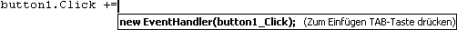

# Visual C#-IntelliSense
Visual C# IntelliSense ist beim Codieren im Editor und beim Debuggen im Befehlsfenster [Unmittelbarer Modus](../ide/reference/immediate-window.md) verfügbar.  
  
## Vervollständigungslisten  
 Die IntelliSense-Vervollständigungslisten in Visual C# enthalten Token von „Member auflisten“, „Wort vervollständigen“ und mehr. Die Listen ermöglichen schnellen Zugriff auf:  
  
-   Member eines Typs oder Namespaces  
  
-   Variablen-, Befehls- und Funktionsnamen  
  
-   [Codeausschnitte](#CodeSnippets)  
  
-   [Sprachschlüsselwörter](#Keywords)  
  
-   [Erweiterungsmethoden](#ExtensionMethods)  
  
 Die Vervollständigungsliste in C# ist darüber hinaus intelligent genug, irrelevante Token herauszufiltern und auf der Grundlage des Kontexts eine Vorauswahl unter den Token zu treffen. Weitere Informationen finden Sie unter [Gefilterte Vervollständigungslisten](#filtered-completion-lists).  
  
###   Codeausschnitte in Vervollständigungslisten  
 In Visual C# enthält die Vervollständigungsliste Codeausschnitte, um Ihnen das einfache Einfügen vordefinierter Codetexte in das Programm zu ermöglichen. Codeausschnitte werden in der Vervollständigungsliste als [Shortcut-Element (IntelliSense-Codeausschnitte)](http://msdn.microsoft.com/en-us/052cc97a-5c70-42f8-b398-4c3adf670cfa) des Ausschnitts angezeigt.  Weitere Informationen über standardmäßig in Visual C# verfügbare Codeausschnitte finden Sie unter [Visual C#-Codeausschnitte](../ide/visual-csharp-code-snippets.md).  
  
###   Sprachschlüsselwörter in Vervollständigungslisten  
 In Visual C# umfasst die Vervollständigungsliste zusätzlich Sprachschlüsselwörter. Weitere Informationen über Sprachschlüsselwörter in C# finden Sie unter [C#-Schlüsselwörter](/dotnet/csharp/language-reference/keywords/index).  
  
###   Erweiterungsmethoden in Vervollständigungslisten  
 In Visual C# enthält die Vervollständigungsliste Erweiterungsmethoden innerhalb des jeweiligen Gültigkeitsbereichs.  
  
> [!NOTE]
>  Von der Vervollständigungsliste werden nicht alle Erweiterungsmethoden für <xref:System.String>-Objekte angezeigt.  
  
 Für Erweiterungsmethoden wird ein anderes Symbol als für Instanzenmethoden verwendet. Eine Liste der Symbole finden Sie unter [Symbole in der Klassenansicht und im Objektbrowser](../ide/class-view-and-object-browser-icons.md). Wenn sich eine Instanzenmethode und eine Erweiterungsmethode mit identischem Namen im selben Bereich befinden, zeigt die Vervollständigungsliste das Symbol für die Erweiterungsmethode an.  
  
###  Gefilterte Vervollständigungslisten  
 Unnötige Member werden von IntelliSense mithilfe von Filtern aus der Vervollständigungsliste entfernt.  
  
 In Visual C# werden die Vervollständigungslisten für folgende Elemente gefiltert:  
  
-   **Schnittstellen und Basisklassen** IntelliSense entfernt automatisch Elemente aus den Vervollständigungslisten für Schnittstellen und Basisklassen, und zwar sowohl aus Basisklassen- und Schnittstellenlisten für die Klassendeklaration als auch aus Einschränkungslisten. So werden Enumerationen in der Vervollständigungsliste für Basisklassen beispielsweise nicht angezeigt, da Enumerationen für Basisklassen nicht verwendet werden können. Die Vervollständigungsliste für Basisklassen enthält nur Schnittstellen und Namespaces.  Wenn Sie in der Liste ein Element auswählen und anschließend ein Komma eingeben, entfernt IntelliSense Basisklassen aus der Vervollständigungsliste, da Visual C# mehrfache Vererbung nicht unterstützt. Das gleiche Verhalten gilt auch für Einschränkungsklauseln.  
  
-   **Attribute:** Beim Anwenden eines Attributs auf einen Typ wird die Vervollständigungsliste gefiltert, sodass sie nur die Typen enthält, die von den Namespaces abgeleitet werden, in denen diese Typen enthalten sind, z.B. <xref:System.Attribute>.  
  
-   `as`- und `is`-Operatoren  
  
-   **Catch-Klauseln**  
  
-   **Objektinitialisierer:** Nur Member, die initialisiert werden können, werden in der Vervollständigungsliste angezeigt.  
  
-   **Neues Schlüsselwort:** Wenn Sie `new` eingeben und dann die LEERTASTE drücken, wird eine Vervollständigungsliste angezeigt. Auf der Grundlage des Kontexts im Code wird in der Liste automatisch ein Element ausgewählt. Beispielsweise werden in den Vervollständigungslisten automatisch Elemente für Deklarationen und return-Anweisungen in Methoden ausgewählt.  
  
-   **enum-Schlüsselwort**: Wenn Sie nach einem Gleichheitszeichen für eine enum-Zuweisung die LEERTASTE drücken, wird eine Vervollständigungsliste angezeigt. Auf der Grundlage des Kontexts im Code wird in der Liste automatisch ein Element ausgewählt. Beispielsweise werden automatisch Elemente in der Vervollständigungsliste ausgewählt, nachdem Sie das return-Schlüsselwort eingegeben oder eine Deklaration erstellt haben.  
  
-   **as- und is-Operatoren:** Eine gefilterte Vervollständigungsliste wird automatisch eingeblendet, wenn Sie nach Eingabe des Schlüsselworts `as` oder `is` die LEERTASTE drücken.  
  
-   Ereignisse: Wenn Sie das Schlüsselwort `event` eingeben, sind in der Vervollständigungsliste nur Delegattypen enthalten.  
  
-   Mit Parametern kann automatisch nach der ersten Methodenüberladung gefiltert werden, die den Parametern während der Eingabe entspricht. Falls mehrere Methodenüberladungen verfügbar sind, können Sie die NACH-OBEN- bzw. NACH-UNTEN-TASTE verwenden, um in der Liste zur nächsten möglichen Überladung zu navigieren.  
  
## Zuletzt verwendete Member  
 IntelliSense speichert, welche Member Sie in der Popupliste [Member auflisten](../ide/using-intellisense.md) zuletzt ausgewählt haben, um die automatische Vervollständigung von Objektnamen zu ermöglichen. Bei der nächsten Verwendung der Memberliste werden die zuletzt verwendeten Member oben angezeigt. Der Verlauf der zuletzt verwendeten Member wird nach jeder Sitzung in der Entwicklungsumgebung (IDE) gelöscht.  
  
## override  
 Bei der Eingabe von [override](/dotnet/csharp/language-reference/keywords/override) und Drücken der LEERTASTE zeigt IntelliSense alle zulässigen Basisklassenmember an, die Sie in einem Popuplistenfeld überschreiben können. Durch die Eingabe des Rückgabetyps der Methode nach `override` wird IntelliSense angewiesen, nur Methoden anzuzeigen, die denselben Typ zurückgeben. Wenn IntelliSense keine Übereinstimmung findet, werden alle Basisklassenmember angezeigt.  
  
## Automatische Codegenerierung  
  
### Hinzufügen mit  
 Mithilfe des IntelliSense-Vorgangs "Hinzufügen mit" können Sie den Schwerpunkt auf den zu schreibenden Code legen, statt den Schwerpunkt auf einen anderen Teil des Codes zu legen.  
  
 Um den Vorgang "Hinzufügen mit" zu initiieren, positionieren Sie den Cursor auf einem Typverweis, der nicht aufgelöst werden kann. Wenn Sie beispielsweise eine Konsolenanwendung erstellen und dann `XmlTextReader` zum Text der `Main`-Methode hinzufügen, erscheint ein Smarttag unter dem äußersten rechten Zeichen von `XmlTextReader`, da es als ein Typverweis angezeigt wird, der nicht aufgelöst werden kann.  
  
   
  
 Sie können dann die Option „Hinzufügen mit“ aufrufen, indem Sie sie im Untermenü **Auflösen** des **IntelliSense**-Menüs oder des Kontextmenüs auswählen. Mithilfe des Smarttags kann die Option „Hinzufügen mit“ auch aufgerufen werden. Das Smarttag ist nur sichtbar, wenn der Cursor sich auf oder neben dem ungebundenen Typ befindet.  
  
   
  
### Using-Direktiven organisieren  
 Mit den Optionen unter **Using**-Direktiven organisieren können Sie `using`- und `extern`-Deklarationen sortieren und entfernen, ohne das Verhalten des Quellcodes zu ändern. Im Laufe der Zeit können Quelldateien aufgrund von nicht benötigten und unorganisierten `using`-Direktiven sehr groß werden und schwer zu lesen sein. Die Optionen **Using-Anweisungen organisieren** komprimieren Quellcode, in dem sie nicht verwendete `using`-Anweisungen entfernen, und verbessern die Lesbarkeit durch Sortieren.  
  
 Um die verfügbaren Optionen in der Visual Studio-IDE anzuzeigen, zeigen Sie im Menü **Bearbeiten** auf **IntelliSense** und dann auf **Using-Direktiven organisieren**. Die IDE bietet die folgenden Optionen zum Organisieren und Entfernen von `usings`-Direktiven:  
  
### Schnittstelle implementieren  
 IntelliSense bietet die Möglichkeit, [Schnittstellen](/dotnet/csharp/language-reference/keywords/interface) bei der Arbeit im Code-Editor zu implementieren. Um eine Schnittstelle ordnungsgemäß zu implementieren, müssen Sie normalerweise eine Methodendeklaration für jeden Schnittstellenmember in der Klasse erstellen. Nachdem Sie den Namen einer Schnittstelle unter Verwendung von IntelliSense in einer Klassendeklaration eingegeben haben, wird ein Smarttag angezeigt. Mithilfe des Smarttags können Sie die Schnittstelle mit expliziten oder impliziten Namen automatisch implementieren. Bei expliziten Namen weisen die Methodendeklarationen den Namen der Schnittstelle auf, während sie bei impliziten Namen keinen Hinweis auf die Schnittstelle enthalten, der sie angehören. Auf eine explizit benannte Schnittstellenmethode kann nur über eine Schnittstelleninstanz zugegriffen werden, und nicht über eine Klasseninstanz. Weitere Informationen finden Sie unter [Explizite Schnittstellenimplementierung](/dotnet/csharp/programming-guide/interfaces/explicit-interface-implementation).  
  
 Bei der Schnittstellenimplementierung wird die Mindestanzahl von Methodenstubs generiert, die für die Schnittstelle benötigt werden. Wenn eine Basisklasse Teile der Schnittstelle implementiert, werden diese Stubs nicht neu generiert.  
  
### Implementieren abstrakter Basisklassen  
 IntelliSense bietet eine Option zum automatischen Implementieren von Membern einer abstrakten Basisklasse während der Arbeit im Code-Editor. Normalerweise erfordert das Implementieren von Membern einer abstrakten Basisklasse das Erstellen einer neuen Methodendefinition für jede Methode der abstrakten Basisklasse in der abgeleiteten Klasse. Mithilfe von IntelliSense wird nach der Eingabe des Namens einer abstrakten Basisklasse in einer Klassendeklaration ein Smarttag angezeigt. Das Smarttag bietet Ihnen die Möglichkeit, die Basisklassenmethoden automatisch zu implementieren.  
  
 Die durch das Feature zum Implementieren einer abstrakten Basisklasse generierten MethodStubs werden durch den in der Datei „MethodStub.snippet“ definierten Codeausschnitt modelliert. Codeausschnitte können geändert werden. Weitere Informationen finden Sie unter [Exemplarische Vorgehensweise: Erstellen eines Codeausschnitts](../ide/walkthrough-creating-a-code-snippet.md).  
  
  
  
### Aus Verwendung generieren  
 Mit der Funktion **Aus Verwendung generieren** können Sie Klassen und Member verwenden, bevor Sie sie definieren. Sie können ein Stub für alle Klassen, Konstruktoren, Methoden, Eigenschaften, Felder oder Enumerationen generieren, die Sie verwenden möchten, aber noch nicht definiert haben. Sie können neue Typen und Member generieren, ohne Ihre aktuelle Position im Code zu verlassen. Dies verringert die Unterbrechung des Workflows.  
  
 Unter jedem nicht definierten Bezeichner wird eine wellenförmige Unterstreichung angezeigt. Wenn Sie den Mauszeiger auf den Bezeichner bewegen, wird eine Fehlermeldung als QuickInfo angezeigt.  
  
 Sie können eines der folgenden Verfahren verwenden, um die entsprechenden Optionen anzuzeigen:  
  
-   Klicken Sie auf den nicht definierten Bezeichner. Unter dem äußersten linken Zeichen wird ein kurzer Unterstrich angezeigt. Wenn Sie den Mauszeiger auf den kurzen Unterstrich bewegen, wird ein Smarttag (Symbol) angezeigt. Klicken Sie auf das Smarttag.  
  
-   Klicken Sie auf den nicht definierten Bezeichner, und drücken Sie STRG+. (Punkt).  
  
-   Klicken Sie mit der rechten Maustaste auf den nicht definierten Bezeichner, und klicken Sie auf **Generieren**.  
  
 Die angezeigten Optionen können Folgendes umfassen:  
  
-   **Eigenschaftenstub generieren**  
  
-   **Feldstub generieren**  
  
-   **Methodenstub generieren**  
  
-   **Klasse generieren**  
  
-   **Neuen Typ generieren** (für Klasse, Struktur, Schnittstelle oder Enumeration)  
  
## Ereignishandler generieren  
 Im Code-Editor kann IntelliSense Sie beim Verknüpfen von Methoden (Ereignishandlern) mit Ereignisfeldern unterstützen.  
  
 Wenn Sie den `+=`-Operator nach einem Ereignisfeld in einer CS-Datei eingeben, zeigt IntelliSense die Option zum Drücken der TAB-TASTE an. Hierbei wird eine neue Instanz eines Delegaten eingefügt, der auf die Methode zum Behandeln des Ereignisses zeigt.  
  
   
  
 Wenn Sie die TAB-TASTE drücken, schließt IntelliSense die Anweisung automatisch für Sie ab und zeigt den Ereignishandlerverweis als ausgewählten Text im Code-Editor an. Um die automatische Ereigniseinbindung abzuschließen, fordert IntelliSense Sie erneut zum Drücken der TAB-TASTE auf, um einen leeren Stub für den Ereignishandler zu erstellen.  
  
   
  
> [!NOTE]
>  Wenn ein neuer Delegat, der von IntelliSense erstellt wird, auf einen vorhandenen Ereignishandler verweist, vermittelt IntelliSense diese Informationen über die QuickInfo. Sie können diesen Verweis dann ändern. Der Text ist im Code-Editor bereits ausgewählt. Andernfalls ist die automatische Ereigniseinbindung an diesem Punkt abgeschlossen.  
  
 Wenn Sie die TAB-TASTE drücken, versieht IntelliSense eine Methode per Stub mit der richtigen Signatur und fügt den Cursor in den Text Ihres Ereignishandlers ein.  
  
> [!NOTE]
>  Verwenden Sie im Menü **Ansicht** (STRG+-) den Befehl **Rückwärts navigieren**, um zurück zur Anweisung für die Ereigniseinbindung zu wechseln.  
  
## Siehe auch  
 [Visual Studio-IDE](../ide/visual-studio-ide.md)
