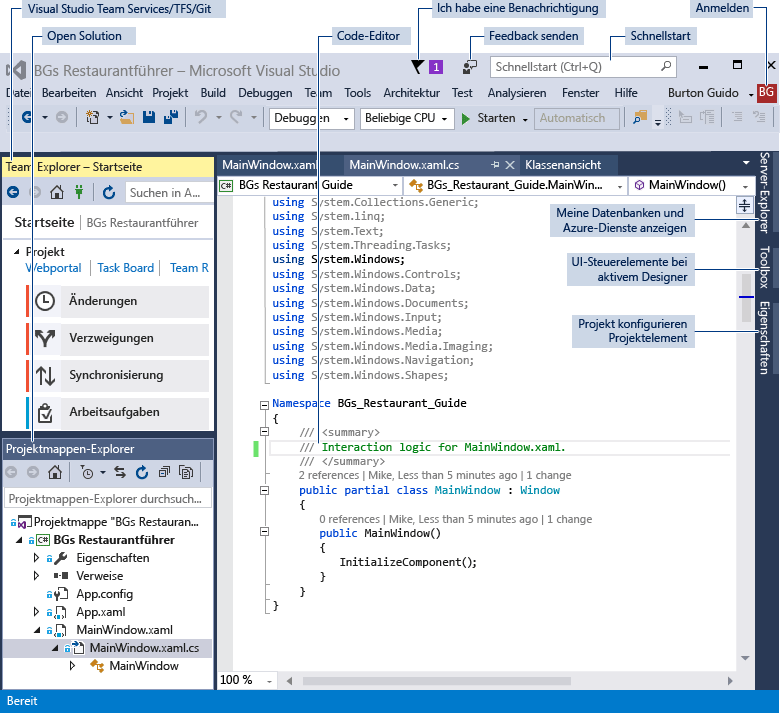
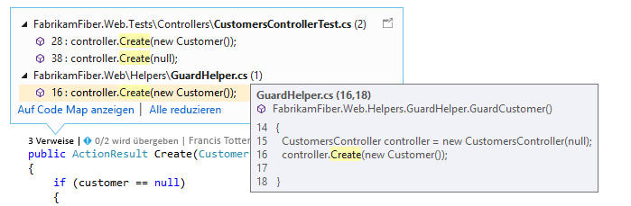
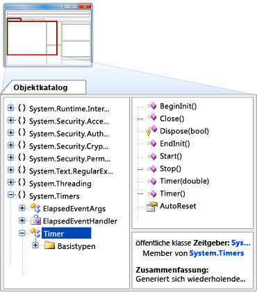
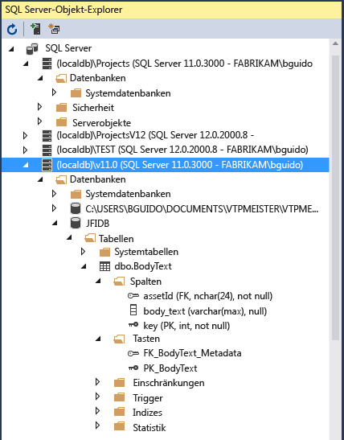

# Führung durch Features von Visual Studio-IDE
In diesem Thema werden die Features von Visual Studio-IDE vorgestellt. Visual Studio-IDE ist eine interaktive Entwicklungsumgebung (IDE) – eine kreative Startplattform, mit der Sie nahezu jede Art von Code anzeigen und bearbeiten und dann Apps für Android, iOS, Windows, Web und Cloud debuggen, erstellen und veröffentlichen können. Es sind Versionen für Mac und Windows verfügbar. Wir zeigen Ihnen Einiges, was Sie mit Visual Studio realisieren können, sowie die Installation und Verwendung, führen Sie durch das Erstellen eines einfachen Projekts und machen Sie mit dem Festlegen von Zeigern zum Debuggen sowie Bereitstellen von Code und den verschiedenen Toolfenstern vertraut.

## Welche Möglichkeiten bietet mir die Visual Studio-IDE?
Möchten Sie eine App für ein Android-Telefon erstellen? Das können Sie. Wie sieht es mit dem Erstellen eines topmodernen Spiels mit C++ aus? Auch das können Sie – und vieles mehr. Visual Studio enthält Vorlagen, die Ihnen das Erstellen von Websites, Spielen, Desktop-Apps, mobilen Apps, Apps für Office und mehr erleichtern.

Sie können auch mühelos nahezu jeden Code öffnen, den Sie aus beliebigen Quellen erhalten, und damit arbeiten. Sie haben auf GitHub ein Projekt gefunden, das Ihnen gefällt? Klonen Sie einfach das Repository, öffnen Sie es in Visual Studio, und beginnen Sie mit der Kodierung!

### Erstellen mobiler Apps
Sie können native mobile Apps für verschiedene Plattformen mit Visual C# und Xamarin bzw. Visual C++ erstellen, oder Hybrid-Apps mit Apache Cordova unter Verwendung von JavaScript. Sie können mobile Spiele für Unity, Unreal, DirectX, Cocos und Sonstige schreiben. Visual Studio enthält einen Android-Emulator, der Ihnen das Ausführen und Debuggen von Android-Apps erleichtert.

Sie können die Leistungsfähigkeit der Cloud für Ihre mobilen Apps nutzen, indem Sie Azure-App-Dienste erstellen. Mit Azure-App-Diensten können Ihre Apps Daten in der Cloud speichern, sicher Benutzer authentifizieren und automatisch ihre Ressourcen nach oben oder unten skalieren, damit die App den Anforderungen Ihres Unternehmens gerecht wird. Weitere Informationen finden Sie unter [Entwicklung mobiler Apps](https://www.visualstudio.com/vs/mobile-app-development/).

### Erstellen von Cloud-Apps für Azure
Visual Studio bietet eine integrierte Sammlung von Tools, die Ihnen das einfache Entwickeln von cloudaktivierten Anwendungen in Microsoft Azure ermöglichen. Sie können Anwendungen und Dienste in Microsoft Azure direkt von der IDE aus konfigurieren, erstellen, debuggen, packen und bereitstellen. Nutzen Sie Azure-Dienste für Ihre Apps mit Verbundenen Diensten. Um Azure-Tools für .NET zu erhalten, wählen Sie bei der Installation von Visual Studio die Arbeitsauslastung zur **Azure-Entwicklung**. Weitere Informationen finden Sie unter [Visual Studio-Tools für Azure](https://www.visualstudio.com/vs/azure-tools/).

### Erstellen von Apps für das Web
Das Web bestimmt unsere moderne Welt, und Visual Studio kann Ihnen helfen, Apps dafür zu schreiben. Sie können Web-Apps mit ASP.NET, Node.js, Python, JavaScript und TypeScript erstellen. Visual Studio erkennt Webframeworks wie Angular, jQuery, Express und mehr. ASP.NET Core und .NET Core sind unter Windows, Mac und Linux ausführbar. Weitere Informationen finden Sie unter [Moderne Tools für die Entwicklung von Webanwendungen](https://www.visualstudio.com/vs/modern-web-tooling/).

### Schreiben von Code in einer Arbeitsumgebung von Weltklasse
Dank Visual Studio schreiben Sie Code mit Features wie Syntaxfarbgebung, Anweisungsvervollständigung, IntelliSense (Popupbeschreibungen des ausgewählten Codeelements), Codegliederung, Festlegen von Haltepunkten zum Debuggen und vielem mehr schnell und mühelos.

Weitere Informationen finden Sie unter [Schreiben von Code im Code- und Text-Editor](https://docs.microsoft.com/visualstudio/ide/writing-code-in-the-code-and-text-editor).

Visual Studio kann Sie noch in vielen weiteren Punkten unterstützen. Eine detailliertere Liste finden Sie unter [Visual Studio-IDE](https://www.visualstudio.com/vs/).

## Installieren von Visual Studio-IDE
Laden Sie zum Einstieg Visual Studio herunter und installieren Sie es auf Ihrem System. Sie können es unter [Visual Studio 2017](https://www.visualstudio.com/vs/visual-studio-2017/) herunterladen.

Visual Studio ist jetzt kompakter als je zuvor! Mit dem neuen modularen Installationsprogramm können Sie *Arbeitsauslastungen* auswählen und installieren, welche Gruppen von Funktionen sind, die für Ihre bevorzugte Programmiersprache oder Plattform erforderlich sind. Diese Strategie hält den Platzbedarf der Visual Studio-Installation kleiner als je zuvor, d.h. Updates werden auch schneller installiert und aktualisiert.

Neben der verbesserten Installationsleistung wurden viele weitere Verbesserungen in Visual Studio 2017 vorgenommen, um die gesamte Start- und Projektmappen-Ladedauer von IDE zu optimieren. Die Auswahl der neuen Funktion „Lightweight-Ladevorgang für Projektmappen“ im Hauptmenü unter **Tools**, **Optionen**, **Projekte und Projektmappen** ermöglicht z.B., größere Projektmappen schneller zu laden. Weitere Informationen zum Einrichten von Visual Studio auf Ihrem System finden Sie unter [Installieren von Visual Studio 2017 RC](https://docs.microsoft.com/visualstudio/install/install-visual-studio).

## Anmelden
Wenn Sie Visual Studio zum ersten Mal starten, können Sie sich optional mit Ihrem Microsoft-Konto oder Ihrem Arbeits- oder Schulkonto anmelden. Wenn Sie angemeldet sind, können Sie Visual Studio-Einstellungen, z.B. Fensterlayouts, auf mehreren Geräten synchronisieren. Es wird auch automatisch Ihre Verbindung mit den Diensten hergestellt, die Sie möglicherweise benötigen, z.B. Azure-Abonnements und Visual Studio Team Services.

## Erstellen eines Programms

Sie lernen etwas am besten kennen, wenn Sie damit arbeiten! Darum werden wir mit Ihnen jetzt ein neues, einfaches Programm erstellen.

1. Öffnen Sie Visual Studio. Wählen Sie im Menü **Datei**, **Neu**, **Projekt** aus. (Verwenden Sie die standardmäßigen Projektwerte.)

  

  Als Alternative können Sie mithilfe der Startseite ein neues Projekt erstellen. Weitere Informationen finden Sie unter [Harness the Power of the Redesigned Start Page (blog) (Nutzen Sie die Macht der neu gestaltenen Startseite (Blog))](https://blogs.msdn.microsoft.com/visualstudio/2016/11/29/harness-the-power-of-the-redesigned-start-page/).

1. Im Dialogfeld **Neues Projekt** werden mehrere Projektvorlagen angezeigt. Wählen Sie die Kategorie **Windows Universal** unter **Visual C#**, die Vorlage **Leere App (Universelle Windows-App)** und dann die Schaltfläche **OK**.

  

  Damit wird ein neues leeres Universelle Windows-App-Projekt mit Visual C# und XAML als Programmiersprachen erstellt. Warten Sie ein wenig, während Visual Studio das Projekt für Sie einrichtet. Wenn Sie zur Eingabe von Informationen aufgefordert werden, übernehmen Sie vorläufig einfach die Standardwerte.

1. Bald sollten Sie etwas sehen, was dem folgenden Screenshot ähnelt. Auf der rechten Seite im Fenster „Projektmappen-Explorer“ werden die Projektdateien aufgeführt.

  

1. Wählen Sie im Projektmappen-Explorer das kleine schwarze Dreieck neben der Datei „MainPage.xaml“ aus, um es zu erweitern, und darunter sollten Sie die Datei „MainPage.xaml.cs“ sehen. Wählen Sie diese (C#-Code enthaltende) Datei aus, um sie zu öffnen.

  Der C#-Code in „MainPage.xaml.cs“ wird im Code-Editor auf der linken Seite des Bildschirms angezeigt. Beachten Sie, dass die Codesyntax automatisch farbig hervorgehoben wird, um verschiedene Arten von Code anzuzeigen, z.B. Anweisungen oder Kommentare. Darüber hinaus zeigen kleine, vertikale gestrichelte Linien im Code an, welche geschweiften Klammern zusammengehören, und anhand der Zeilennummern können Sie sich später im Code orientieren. Sie können die kleinen Minuszeichen in Kästchen auswählen, um Code ein- oder auszublenden. Mit dieser Codegliederungsfunktion können Sie Code ausblenden, den Sie nicht benötigen, um die Übersichtlichkeit des Bildschirms zu optimieren.

  

  Es sind noch mehr Menüs und Toolfenster verfügbar, aber für den Moment wenden wir uns Anderem zu.

1. Fügen Sie dem XAML-Formular eine Schaltfläche hinzu, um Benutzern eine Möglichkeit zur Interaktion mit Ihrer App zu geben. Öffnen Sie hierzu die Datei „MainPage.xaml“. Sie sehen nun eine geteilte Ansicht: oben einen Designer zur visuellen Platzierung von Steuerelementen und darunter eine Codeansicht, die den XAML-Code hinter dem Designer zeigt. Wenn Sie das Programm später ausführen, ist das, was Sie im Designer sehen, ein Fenster, das der Benutzer sieht, ein „Formular“, und der zugrunde liegende XAML-Code bestimmt, was im Formular angezeigt wird.

1. Wählen Sie auf der linken Seite des Bildschirms die Registerkarte **Toolbox**, um die Toolbox zu öffnen. Die Toolbox enthält eine Reihe von visuellen Steuerelementen, die Sie Formularen hinzufügen können. Jetzt fügen wir nur ein Schaltflächensteuerelement hinzu.

1. Erweitern Sie den Abschnitt **Häufig verwendete XAML-Steuerelemente**, und ziehen Sie dann das Schaltflächensteuerelement etwa zur Mitte des Formulars. (Die genaue Position spielt keine Rolle.)

  

  Was dann angezeigt wird, sollte dem Folgenden ähneln.

  

  Die Schaltfläche befindet sich im Designer, und der zugrunde liegende (hervorgehobene) Code wird dem XAML-Code des Designers automatisch hinzugefügt.

1. Wir ändern nun einen Teil des XAML-Codes. Benennen Sie den Text im Schaltflächencode von `Button` in `Hello!` um.

  

1. Starten Sie nun die App. Wählen Sie dazu die Schaltfläche **Start** () auf der Symbolleiste oder die F5-Taste, oder wählen Sie im Menü **Debuggen**, **Debuggen starten**.

  

  Der Buildprozess der App beginnt, und im Fenster „Ausgabe“ werden Statusmeldungen angezeigt. Bald sehen Sie das Formular mit Ihrer Schaltfläche darin. Sie haben nun eine funktionierende App!

  

  Zugegeben, da passiert noch nicht viel, aber wenn Sie möchten, können Sie ihre Funktionalität später erweitern.

1. Wählen Sie nach Ausführung des Programms die Schaltfläche „Stopp“ () auf der Symbolleiste, um es zu beenden.

Fassen wir zusammen: Sie haben ein neues C#-Windows Universal-Projekt in Visual Studio erstellt, seinen Code angezeigt, dem Designer ein Steuerelement hinzugefügt, einen Teil des XAML-Codes geändert und dann das Projekt ausgeführt. Obwohl der Prozess für dieses Beispiel vereinfacht wurde, zeigt er Ihnen einige gängige Bestandteile der Visual Studio-IDE, die Sie verwenden, wenn Sie Ihre eigenen Apps entwickeln. Weitere Details zu diesem Beispiel finden Sie unter [Erstellen der App „Hello, world“ (XAML)](https://docs.microsoft.com/windows/uwp/get-started/create-a-hello-world-app-xaml-universal).

## Debuggen, Testen und Verbessern Ihres Codes
Nichts läuft immer perfekt. Wenn Sie Code schreiben, müssen Sie ihn auszuführen und auf Fehler und Leistung prüfen. Das dem neuesten Entwicklungsstand entsprechende Debugsystem von Visual Studio ermöglicht Ihnen, Code in Ihrem lokalen Projekt, auf einem Remotegerät oder in einem Emulator wie dem für Android- oder Windows Phone-Geräte zu debuggen. Sie können die Anweisungen schrittweise durchlaufen und jeweils die Variablen überprüfen, Sie können Anwendungen mit mehreren Threads durchlaufen und Sie können Haltepunkte festlegen, die nur erreicht werden, wenn eine angegebene Bedingung "true" ist. Sie können u.a. die Werte von Variablen während der Codeausführung überwachen. All dies kann im Code-Editor selbst verwaltet werden, sodass Sie den Code nicht verlassen müssen.

In Visual Studio sind Komponententests, IntelliTest, Auslastungs- sowie Leistungstests und mehr möglich. Weitere Informationen über den Debugprozess in Visual Studio finden Sie unter [Debugger Feature Tour](../debugger/debugger-feature-tour.md) (Führung zu Debuggerfunktionen). Weitere Informationen zum Testen finden Sie unter [Testtools](https://www.visualstudio.com/vs/testing-tools/). Weitere Informationen zum Verbessern der Leistung von Apps finden Sie unter [Tour zur Profilerstellungsfunktion](../profiling/profiling-feature-tour.md).

## Bereitstellen der fertigen Anwendung  
Wenn Ihre Anwendung für die Bereitstellung bei Benutzern oder Kunden bereit ist, bietet Visual Studio die dazu benötigten Tools, unabhängig davon, ob Sie sie im Windows Store, auf einer SharePoint-Website oder mit InstallShield- oder Windows Installer-Technologien bereitstellen möchten. Sie können über die IDE auf alle Tools zugreifen. Weitere Informationen finden Sie unter [Bereitstellen von Anwendungen, Diensten und Komponenten](../deployment/deploying-applications-services-and-components.md).

## Kurze Übersicht der IDE
Damit Sie eine visuelle Übersicht von Visual Studio bekommen, zeigt die folgende Abbildung Visual Studio mit einem geöffneten Projekt zusammen mit mehreren wichtigen Toolfenstern, die Sie höchstwahrscheinlich verwenden werden.
 - Im [Projektmappen-Explorer](../ide/solutions-and-projects-in-visual-studio.md) können Sie Ihre Codedateien anzeigen, in ihnen navigieren und sie verwalten.
 - Das [Editor](../ide/writing-code-in-the-code-and-text-editor.md)-Fenster zeigt Ihren Code an, sodass Sie Quellcode und Designerdaten bearbeiten können.
 - Das Fenster [Ausgabe](../ide/reference/output-window.md) zeigt u.a. beim Kompilieren, Ausführen und Debuggen ausgegebene Meldungen an.
 - Im [Team Explorer](https://www.visualstudio.com/docs/connect/work-team-explorer) können Sie Arbeitsaufgaben nachverfolgen und Code mithilfe von Techniken zur Versionskontrolle, wie etwa [Git](https://git-scm.com/) und [Team Foundation-Versionskontrolle (Team Foundation Version Control, TFVC)](https://www.visualstudio.com/docs/tfvc/overview) mit anderen teilen.
 - Im [Cloud-Explorer](https://azure.microsoft.com/documentation/articles/vs-azure-tools-resources-managing-with-cloud-explorer/) können Sie Ihre Azure-Ressourcen anzeigen und verwalten, wie etwa virtuelle Computer, Tabellen, SQL--Datenbanken und mehr.

  

Im Folgenden werden einige weitere allgemeine Produktivitätsfunktionen in Visual Studio vorgestellt.  

- Mit dem Suchfeld [Schnellstart](https://docs.microsoft.com/en-us/visualstudio/ide/reference/quick-launch-environment-options-dialog-box) finden Sie in Visual Studio schnell, was Sie suchen. Geben Sie einfach den Namen dessen ein, was Sie suchen, und Visual Studio bietet Ihnen Optionen, mit denen Sie genau ans gewünschte Ziel gelangen. „Schnellstart“ zeigt auch Links an, die den Visual Studio-Installer für jede beliebige Arbeitsauslastung oder einzelne Komponente starten.

  

-  [Refactoring](../ide/refactoring-in-visual-studio.md) beinhaltet Vorgänge wie etwa das intelligente Umbenennen von Variablen, das Verschieben von ausgewählten Codezeilen in eine separate Funktion, das Verschieben von Code an eine andere Position, das Neuanordnen von Funktionsparametern und mehr.

   

-  **IntelliSense** ist der Oberbegriff für einen Satz von beliebten Features, mit denen Typinformationen über den Code direkt im Editor angezeigt und in einigen Fällen kleine Codeabschnitte für Sie geschrieben werden. Damit verfügen Sie über eine grundlegende Dokumentation, die in den Editor integriert ist, sodass Sie die Typinformationen nicht mehr in einem separaten Hilfefenster nachschauen müssen. Die Features von IntelliSense variieren je nach Sprache. Weitere Informationen finden Sie unter [Visual C# IntelliSense](../ide/visual-csharp-intellisense.md), [Visual C++ Intellisense](../ide/visual-cpp-intellisense.md), [JavaScript IntelliSense](../ide/javascript-intellisense.md), [Visual Basic-Specific IntelliSense](../ide/visual-basic-specific-intellisense.md). Die folgende Abbildung zeigt einige IntelliSense-Features:  

    

-  **Wellenlinien** sind gewellte rote Unterstriche, die Sie in Echtzeit auf Fehler oder mögliche Probleme in Ihrem Code hinweisen. So können Sie diese sofort beheben, ohne zu warten, bis der Fehler während der Kompilierung oder zur Laufzeit ermittelt wird. Wenn Sie auf die Wellenlinie zeigen, werden zusätzliche Informationen zum Fehler angezeigt. Am linken Rand wird u. U. auch eine Glühbirne mit Vorschlägen zum Beheben des Fehlers angezeigt. Weitere Informationen finden Sie unter [Perform quick actions with light bulbs](../ide/perform-quick-actions-with-light-bulbs.md).  

   

-  Das Fenster [Aufrufhierarchie](../ide/reference/call-hierarchy.md) kann über das Text-Editor-Kontextmenü geöffnet werden. Es zeigt, welche Methoden die Methode unter dem Caretzeichen (Einfügemarke) aufrufen bzw. von ihr aufgerufen werden.

 

-  Mit [CodeLens](../ide/find-code-changes-and-other-history-with-codelens.md) können Sie nach Codeverweisen, Änderungen an Ihrem Code, verknüpften Fehlern, Arbeitsaufgaben, Codeüberprüfungen und Komponententests suchen, ohne den Editor verlassen zu müssen.

 

-  Das Fenster [Definitionsvorschau](../ide/how-to-view-and-edit-code-by-using-peek-definition-alt-plus-f12.md) zeigt integriert eine Methode oder eine Typdefinition, ohne den aktuellen Kontext verlassen zu müssen.  

 

-  Über die Kontextmenüoption **Gehe zu Definition** gelangen Sie direkt an die Stelle, an der die Funktion oder das Objekt definiert ist. Durch einen Klick mit der rechten Maustaste im Editor sind auch andere Navigationsbefehle verfügbar.

 

- Ein verwandtes Tool, der [Objektkatalog](http://msdn.microsoft.com/f89acfc5-1152-413d-9f56-3dc16e3f0470), ermöglicht Ihnen, .NET- oder Windows-Runtime-Assemblys auf Ihrem System zu überprüfen, um zu ermitteln, welche Typen sie enthalten, und welche Member (Eigenschaften, Methoden, Ereignisse) diese Typen enthalten.

    

## Verarbeiten Ihres Quellcodes und Zusammenarbeiten mit anderen
Sie können Ihren Quellcode in Git-Repositorys verwalten, die von beliebigen Anbietern gehostet werden, einschließlich GitHub. Oder verwenden Sie [Visual Studio Team Services (VSTS)](https://www.visualstudio.com/team-services/), um Code zusammen mit Programmfehlern und Arbeitsaufgaben für Ihr gesamtes Projekt zu verwalten. Weitere Informationen zur Verwaltung von Git-Repositorys in Visual Studio mithilfe von Team Explorer finden Sie unter [Get Started with Git and Team Services (Erste Schritte mit Git und Team Services)](https://www.visualstudio.com/en-us/docs/git/gitquickstart-vs2017).  Visual Studio verfügt auch über andere integrierte Quellcodeverwaltungsfunktionen. Weitere Informationen dazu finden Sie unter [New Git Features in Visual Studio 2017 (blog) (Neue Git-Funktionen in Visual Studio 2017 (Blog))](https://blogs.msdn.microsoft.com/visualstudioalm/2017/03/06/new-git-features-in-visual-studio-2017/).

Visual Studio Online Team Services ist ein cloudbasierter Dienst zum Hosten von Softwareprojekten und für die Zusammenarbeit in Teams. VSTS unterstützt Git- und Team Foundation-Quellcodeverwaltungssysteme sowie die Scrum-, CMMI- und Agile-Entwicklungsmethoden. Team Foundation-Versionskontrolle (TFVC) verwendet ein einzelnes, zentralisiertes Serverrepository zum Nachverfolgen von Versionsdateien. Lokale Änderungen werden immer beim zentralen Server eingecheckt, damit andere Entwickler die neuesten Änderungen abrufen können.

Team Foundation Server (TFS) ist der Anwendungslebenszyklus-Verwaltungshub für Visual Studio. Auf diese Weise können alle am Entwicklungsprozess beteiligten Personen mithilfe einer einzigen Projektmappe am Prozess teilnehmen. TFS ist auch nützlich für die Verwaltung heterogener Teams und Projekte.

Wenn Sie in Ihrem Netzwerk über ein Visual Studio Team Services-Konto oder einen Team Foundation Server verfügen, können Sie über das Fenster „Team Explorer“ eine Verbindung mit dem Konto bzw. Server in Visual Studio herstellen. Über dieses Fenster können Sie Code in die Quellcodeverwaltung einchecken oder daraus auschecken, Arbeitsaufgaben verwalten, Builds starten und auf Teamräume und Arbeitsbereiche zugreifen. Öffnen Sie Team Explorer über das Feld **Schnellstart** oder über das Hauptmenü unter **Ansicht, Team Explorer** oder **Team, Verbindungen verwalten**.
Die folgende Abbildung zeigt das Team Explorer-Fenster für eine Projektmappe, die in VSTS gehostet wird:

  

Weitere Informationen zu Visual Studio Team Services finden Sie unter [Visual Studio Team Services](https://www.visualstudio.com/team-services/). Weitere Informationen über Team Foundation Server finden Sie unter [Team Foundation Server](https://www.visualstudio.com/products/tfs-overview-vs).

## Herstellen einer Verbindung mit Diensten, Datenbanken und cloudbasierten Ressourcen
Die Cloud ist wichtig für die moderne Onlinewelt, und Visual Studio bietet Ihnen die Möglichkeit, sie zu nutzen. Mit dem Feature „Verbundene Dienste“ können Sie z.B. Ihre App mit Diensten verbinden. Ihre Apps können es u.a. zum Speichern von Daten im Azure-Speicher verwenden.

Die Auswahl eines Diensts auf der Seite **Verbundene Dienste** ruft den Assistenten zum Hinzufügen eines verbundenen Diensts auf, der Ihr Projekt konfiguriert und die erforderlichen NuGet-Pakete herunterlädt, damit Sie mühelos mit der Programmierung für Ihren Dienst beginnen können.

Sie können Ihre Azure-basierten Cloudressourcen innerhalb von Visual Studio mit dem [Cloud-Explorer](https://azure.microsoft.com/documentation/articles/vs-azure-tools-resources-managing-with-cloud-explorer/) anzeigen und verwalten. Cloud-Explorer zeigt die Azure-Ressourcen aller Konten an, die unter dem Azure-Abonnement, bei dem Sie angemeldet sind, verwaltet werden. Um den Cloud-Explorer zu erhalten, wählen Sie die Arbeitsauslastung zur Azure-Entwicklung im Visual Studio Installer aus.

**Server-Explorer** unterstützt Sie bei der Suche nach und Verwaltung von SQL Server-Instanzen und -Ressourcen auf Azure, Salesforce.com, Office 365 und Websites. Wählen Sie zum Öffnen von Server-Explorer im Hauptmenü **Ansicht**, **Server-Explorer**. Unter [Neue Verbindung hinzufügen](https://docs.microsoft.com/visualstudio/data-tools/add-new-connections) finden Sie weitere Informationen zur Verwendung von Server-Explorer.

[SQL Server Data Tools (SSDT)](https://docs.microsoft.com/sql/ssdt/download-sql-server-data-tools-ssdt) ist eine leistungsstarke Entwicklungsumgebung für SQL Server, Azure SQL-Datenbank und Azure SQL Data Warehouse. Damit können Sie Datenbanken erstellen, debuggen, verwalten und umgestalten. Sie können mit einem Datenbankprojekt oder direkt mit einer Instanz einer verbundenen Datenbank lokal oder extern arbeiten.

**SQL Server-Objekt-Explorer** in Visual Studio bietet eine Anzeige der Datenbankobjekte ähnlich der von SQL Server Management Studio. Mit dem SQL Server-Objekt-Explorer können Sie leichte Verwaltungs- und Designarbeiten für Datenbanken durchführen, darunter Bearbeiten von Tabellendaten, Vergleichen von Schemas und Ausführen von Abfragen mithilfe von Kontextmenüs direkt aus dem SQL Server-Objekt-Explorer. Unter [Manage Objects by Using Object Explorer](https://docs.microsoft.com/sql/ssms/object/manage-objects-by-using-object-explorer) (Verwalten von Objekten mit dem Objekt-Explorer) finden Sie weitere Informationen.

  

## Erweitern von Visual Studio
Wenn Visual Studio nicht genau die Funktionalität besitzt, die Sie benötigen, können Sie sie hinzufügen! Sie können die IDE basierend auf Ihrem Workflow und Stil personalisieren, Unterstützung für externe Tools hinzufügen, die noch nicht in Visual Studio integriert sind, und vorhandene Funktionalität ändern, um Ihre Produktivität zu steigern. Visual Studio bietet Tools, Steuerelemente und Vorlagen von Microsoft, unseren Partnern und der Community. Weitere Informationen zum Erweitern von Visual Studio finden Sie unter [Erweitern der Visual Studio-IDE](https://www.visualstudio.com/vs/extend/).

## Weitere Informationen und Neuigkeiten
Wenn Sie Visual Studio noch nie verwendet haben, lernen Sie zuerst die Grundlagen mit [Erste Schritte mit Visual Studio](../ide/get-started-with-visual-studio.md), oder sehen Sie sich die kostenlosen Visual Studio-Kurse der [Microsoft Virtual Academy](https://mva.microsoft.com/product-training/visual-studio-courses#!index=2&lang=1033).
Wenn Sie die neuen Funktionen in Visual Studio 2017 RC ausprobieren möchten, finden Sie Informationen unter [Neues in Visual Studio 2017 RC](../ide/whats-new-in-visual-studio.md).

Sie haben die Führung zu Visual Studio-IDE erfolgreich absolviert! Wir hoffen, dass Sie nützliche Kenntnisse von einigen der wichtigsten Features gewonnen haben.

## Siehe auch
* [Visual Studio-IDE](https://www.visualstudio.com/vs/)
* [Visual Studio-Downloads](https://www.visualstudio.com/downloads/)
* [Der Visual Studio-Blog](https://blogs.msdn.microsoft.com/visualstudio/)
* [Visual Studio-Foren](https://social.msdn.microsoft.com/Forums/vstudio/en-US/home?category=visualstudio%2Cvsarch%2Cvsdbg%2Cvstest%2Cvstfs%2Cvsdata%2Cvsappdev%2Cvisualbasic%2Cvisualcsharp%2Cvisualc)
* [Microsoft Virtual Academy](https://mva.microsoft.com/)
* [Channel 9](https://channel9.msdn.com/)

