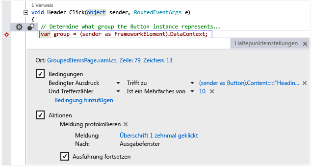

# Visual Studio-IDE
Microsoft Visual Studio 2017 RC ist eine Suite von Tools zum Erstellen von Software, von der Planungsphase über das Entwerfen, Codieren, Testen und Debuggen der Benutzeroberfläche und das Analysieren der Codequalität und -leistung bis hin zur Bereitstellung beim Kunden und zum Sammeln von Telemetriedaten hinsichtlich der Nutzung. Diese Tools wurden für eine möglichst reibungslose Zusammenarbeit konzipiert und werden alle über die integrierte Entwicklungsumgebung (Integrated Development Environment, IDE) von Visual Studio bereitgestellt.  

 Sie können Visual Studio verwenden, um verschiedene Anwendungen zu erstellen, von einfachen Store-Apps und Spielen für mobile Clients bis hin zu großen, komplexen Systemen für den Betrieb von Unternehmen und Datencentern. Sie können Folgendes erstellen:  

 - Apps und Spiele, die nicht nur unter Windows ausgeführt werden können, sondern auch unter Android und iOS.

 - Websites und Webdienste basierend auf ASP.NET, JQuery, AngularJS und anderen beliebten Frameworks.

 - Anwendungen für so unterschiedliche Plattformen und Geräte wie Azure, Office, Sharepoint, Hololens, Kinect und das Internet der Dinge, um nur einige zu nennen.

 - Spiele und grafikintensive Anwendungen für eine Vielzahl von Windows-Geräten, die DirectX verwenden, darunter auch die Xbox.

 Visual Studio unterstützt standardmäßig C#, C und C++, JavaScript, TypeScript, F# und Visual Basic. Visual Studio lässt sich mithilfe von [Xamarin für Visual Studio](https://www.xamarin.com/visual-studio) problemlos mit Xamarin und Drittanbieteranwendungen einsetzen und in diese integrieren. Nutzen Sie für Unity die Erweiterung [Visual Studio Tools für Unity](../cross-platform/visual-studio-tools-for-unity.md) und für Apache Cordova [Visual Studio Tools für Apache Cordova](../misc/get-started-with-visual-studio-tools-for-apache-cordova2.md). Mithilfe des [Visual Studio-SDKs](../extensibility/visual-studio-sdk.md) können Sie Visual Studio selbst erweitern, indem Sie benutzerdefinierte Tools erstellen, die spezielle Aufgaben ausführen.

## Neue Funktionen
 Wenn Sie Visual Studio noch nie verwendet haben, erlernen Sie ausgehend von [Erste Schritte mit Visual Studio](../ide/get-started-with-visual-studio.md) die Grundlagen.
Informationen zu den neuen Funktionen in Visual Studio 2017 RC finden Sie unter [Neues in Visual Studio 2017 RC](../ide/whats-new-in-visual-studio.md).

## Einrichten von Visual Studio
 Informationen darüber, welche Edition von Visual Studio die für Sie passende ist, finden Sie unter [Visual Studio-Produkte](https://www.visualstudio.com/products/).

 Sie können Visual Studio 2017 RC installieren, indem Sie es von [Visual Studio Downloads](https://www.visualstudio.com/vs/)herunterladen. Weitere Informationen zum Installationsvorgang finden Sie unter [Installieren von Visual Studio 2017 RC](https://go.microsoft.com/fwlink/?linkid=833223).

## Kurze Übersicht der IDE
 Das folgende Bild zeigt die Visual Studio-IDE mit einem geöffneten Projekt und einigen wichtigen Toolfenstern.
 - Im [Projektmappen-Explorer](../ide/solutions-and-projects-in-visual-studio.md) können Sie Ihre Codedateien anzeigen und in ihnen navigieren.
 - Im [Team Explorer](https://www.visualstudio.com/en-us/docs/connect/work-team-explorer) können Sie Arbeitsaufgaben nachverfolgen und Code mithilfe von Techniken zur Versionskontrolle, wie etwa [Git](https://git-scm.com/) und [Team Foundation-Versionskontrolle (Team Foundation Version Control, TFVC)](https://www.visualstudio.com/en-us/docs/tfvc/overview) mit anderen teilen.
 - Im [Cloud-Explorer](https://azure.microsoft.com/en-us/documentation/articles/vs-azure-tools-resources-managing-with-cloud-explorer/) können Sie Ihre Azure-Ressourcen anzeigen und verwalten, wie etwa virtuelle Computer, Tabellen, SQL--Datenbanken und mehr.
 - Im [Editor](../ide/writing-code-in-the-code-and-text-editor.md)-Fenster können Sie Quellcode und Designerdaten anzeigen und bearbeiten.
 - Das Fenster [Ausgabe](../ide/reference/output-window.md) zeigt Ausgaben vom Kompilieren, Ausführen, Debuggen und mehr an.

   

 ### Anmelden
  Wenn Sie Visual Studio zum ersten Mal starten, können Sie sich mit Ihrem Microsoft-Konto oder Ihrem Arbeits- oder Schulkonto anmelden. Durch die Anmeldung können Sie Ihre Einstellungen, wie z.B. Fensterlayouts, auf mehreren Geräten synchronisieren und automatisch eine Verbindung mit den benötigten Diensten herstellen, z.B. Azure-Abonnements und Visual Studio Team Services. Bei einer abonnementbasierten Lizenz müssen Sie sich regelmäßig bei Visual Studio anmelden, um den Lizenztoken aktuell zu halten. Wenn Sie über eine Product Key-Lizenz verfügen, müssen Sie sich nicht anmelden; eine Anmeldung vereinfacht jedoch das Herstellen einer Verbindung mit Visual Studio Team Services und Ihren Konten bei Azure, Office 365 und Salesforce.com. Weitere Informationen finden Sie unter [Anmelden bei Visual Studio](../ide/signing-in-to-visual-studio.md).

  Wenn Sie über mehrere Visual Studio Team Services-Konten, Azure-Konten oder MSDN-Abonnements verfügen, können Sie sie verknüpfen und mittels einmaliger Anmeldung auf die Ressourcen und Dienste in all Ihren Konten zugreifen. Weitere Informationen finden Sie unter [Arbeiten mit mehreren Benutzerkonten](../ide/work-with-multiple-user-accounts.md).

 ### Auf dem Laufenden bleiben
  Das Flaggen-Benachrichtigungssymbol in der oberen Ecke der Titelleiste zeigt Ihnen, dass Updates für Visual Studio oder andere zugehörige Komponenten, die Sie installiert haben, verfügbar sind. Sie können auswählen, ob Sie diese Benachrichtigungen verwerfen oder darauf reagieren möchten. Weitere Informationen finden Sie unter [Visual Studio-Benachrichtigungen](../ide/visual-studio-notifications.md).

 ### Suchen von Elementen und Anfordern von Hilfe
  Das Fenster [Schnellstart](../ide/reference/quick-launch-environment-options-dialog-box.md), das auf dem nachfolgenden Screenshot mit einer roten Umrisslinie markiert ist, bietet eine schnelle Möglichkeit, um Befehle, Tools, Funktionen usw. von Visual Studio zu suchen, wenn Sie die Tastenkombination oder die Menüposition nicht kennen. Geben Sie einfach ein, wonach Sie suchen, damit „Schnellstart“ Ihnen einen Link zur gewünschten Option bereitstellen kann.

 

 Drücken Sie in Visual Studio die Taste **F1**, um zur Onlinehilfe für das aktive Fenster zu gelangen. Sie können auch im Code-Editor **F1** drücken, um die Hilfeseite für die API oder das Schlüsselwort an der aktuellen Position der Einfügemarke aufzurufen. Platzieren Sie beispielsweise in einer C#-Datei die Einfügemarke an einer beliebigen Stelle in oder am Ende einer `System.String`-Deklaration, und drücken Sie **F1**, um die Hilfeseite für [String](assetId:///T:System.String?qualifyHint=False&autoUpgrade=True) zu öffnen.

### Feedback geben
 Sie können uns problemlos jederzeit Feedback zu Visual Studio geben. Klicken Sie auf der Titelleiste neben **QuickLaunch** auf das Feedback-Symbol, und klicken Sie dann auf die Option zum **Melden eines Problems** oder zum **Unterbreiten eines Vorschlags**.

 Vorabversionen von Visual Studio weisen auch eine Option zum **Bewerten des Produkts** auf. Wir sehen uns alle Kommentare an und verwenden sie, um das Produkt zu verbessern. Weitere Informationen finden Sie unter [Sprechen Sie mit uns](../ide/talk-to-us.md).

### Personalisieren der IDE
 Sie können das Fensterlayout an Ihren Entwicklungsstil anpassen. Sie können jedes Fenster jederzeit ausblenden, andocken oder die Verankerung aufheben. Sie können den Editor auch im Vollbildmodus ausführen. Sie können mehrere benutzerdefinierte Fensterlayouts erstellen und speichern, die nur die Fenster anzeigen, die Sie für den jeweiligen Kontext benötigen. Sie können z. B. ein Vollbildlayout erstellen, sodass Sie nur den Code-Editor sehen. Darüber hinaus können Sie unterschiedliche Layouts für das Debuggen und für Teamvorgänge erstellen. Weitere Informationen finden Sie unter [Anpassen der Fensterlayouts](../ide/customizing-window-layouts-in-visual-studio.md).

 Sie können Visual Studio in vielerlei Hinsicht anpassen und Ihre Einstellungen übertragen, wenn Sie mit mehreren Computern arbeiten. Weitere Informationen finden Sie unter [Personalisieren der IDE](../ide/personalizing-the-visual-studio-ide.md).

 Es gibt für nahezu jede Option eine Tastenkombination, die Sie ebenfalls anpassen können. Um neue Tastaturkombinationen zu erstellen, geben Sie im Fenster „Schnellstart“ „Tastatur“ ein, um das Dialogfeld „Tastatur“ zu öffnen. Dort können Sie F1 drücken, um die Hilfeseite aufzurufen, wenn Sie weitere Informationen zu den Optionen benötigen. Weitere Informationen finden Sie unter [Standardtastenkombinationen in Visual Studio](../ide/default-keyboard-shortcuts-in-visual-studio.md).

## Herstellen einer Verbindung zu Visual Studio Team Services und Team Foundation Server
  Visual Studio Online Team Services (VSTS) ist ein cloudbasierter Dienst zum Hosten von Softwareprojekten und für die Zusammenarbeit in Teams. VSTS unterstützt Git- und Team Foundation-Quellcodeverwaltungssysteme sowie die Scrum-, CMMI- und Agile-Entwicklungsmethoden. Team Foundation-Versionskontrolle (TFVC) verwendet ein einzelnes, zentralisiertes Serverrepository zum Nachverfolgen von Versionsdateien. Lokale Änderungen werden immer beim zentralen Server eingecheckt, damit andere Entwickler die neuesten Änderungen abrufen können. Team Foundation Server (TFS) 2015 ist der Anwendungslebenszyklus-Verwaltungshub für Visual Studio. Auf diese Weise können alle am Entwicklungsprozess beteiligten Personen mithilfe einer einzigen Projektmappe am Prozess teilnehmen. TFS ist auch nützlich für die Verwaltung heterogener Teams und Projekte.

  Wenn Sie in Ihrem Netzwerk über ein Visual Studio Team Services-Konto oder einen Team Foundation Server verfügen, können Sie über das Fenster "Team Explorer" eine Verbindung mit dem Konto bzw. Server herstellen. Über dieses Fenster können Sie Code in die Quellcodeverwaltung einchecken oder daraus auschecken, Arbeitsaufgaben verwalten, Builds starten und auf Teamräume und Arbeitsbereiche zugreifen. Öffnen Sie Team Explorer über **Schnellstart** oder über das Hauptmenü unter **Ansicht | Team Explorer** oder **Team | Verbindungen verwalten**.  Weitere Informationen zu Visual Studio Team Services finden Sie unter [www.visualstudio.com](https://www.visualstudio.com/). Weitere Informationen über Team Foundation Server finden Sie unter [Team Foundation Server](https://www.visualstudio.com/products/tfs-overview-vs).

  Die folgende Abbildung zeigt den Team Explorer-Bereich für eine Projektmappe, die in VSTS gehostet wird:

   

## Erstellen von Projektmappen und Projekten
  Auch wenn Sie Visual Studio zum Durchsuchen einzelner Codedateien verwenden können, so arbeiten Sie jedoch meist in einem *Projekt*. Ein Visual Studio-Projekt ist eine Sammlung von Dateien und Ressourcen, die zu einer einzelnen ausführbaren Binärdatei für Anwendungen (z. B. eine EXE-, DLL- oder APPX-Datei) kompiliert werden. Bei Nicht-ASP.NET-Websites wird keine ausführbare Datei erstellt und das Projekt enthält nur die HTML- und JavaScript-Dateien sowie Bilder. Da Sie gelegentlich mehrere Binärdateien oder Websites erstellen möchten, die eng miteinander verknüpft sind, gibt es in Visual Studio das Konzept der Projektmappe, die mehrere Projekte oder Websites enthalten kann. Wenn Sie ein Projekt erstellen, erstellen Sie im Grunde ein Projekt in einer Projektmappe, der Sie später bei Bedarf weitere Projekte hinzufügen können. Wenn Sie beispielsweise über ein DLL-Projekt verfügen, können Sie der Projektmappe ein EXE-Projekt hinzufügen, das diese DLL lädt und nutzt.

  Eine *Projektvorlage* ist eine Sammlung von vorgegebenen Codedateien und Konfigurationseinstellungen, die Sie schnell einrichten können, um eine bestimmte Art von Anwendung zu erstellen. Visual Studio enthält viele Projektvorlagen. Wenn keine der Standardvorlagen für Sie geeignet ist, können Sie eine eigene erstellen. Nachdem Sie ein Projekt mit einer Vorlage erstellt haben, können Sie darin Ihren eigenen Code schreiben, sprich entweder in den bereitgestellten Dateien oder in neuen, von Ihnen hinzugefügten Dateien. Weitere Informationen finden Sie unter [Projektmappen und Projekte](../ide/solutions-and-projects-in-visual-studio.md). Die folgende Abbildung zeigt das Dialogfeld "Neues Projekt" mit den Projektvorlagen, die für ASP.NET-Anwendungen verfügbar sind.

   

## Erstellen von Code, Navigation in Code und Verstehen von Code  
 Als Entwickler arbeiten Sie hauptsächlich mit dem Editor-Fenster. Visual Studio enthält integrierte Bearbeitungsunterstützung für C#, C++, Visual Basic, F#, JavaScript, TypeScript, XML, HTML und CSS. Visual Studio unterstützt darüber hinaus Bearbeiten und Kompilieren für viele weitere Sprachen.

 Einzelne Dateien können Sie im Text-Editor bearbeiten, indem Sie **Datei | Öffnen | Datei** auswählen. Zum Bearbeiten von Dateien in einem geöffneten Projekt wählen Sie im Projektmappen-Explorer den Dateinamen aus und öffnen die Datei. Der Code wird eingefärbt, und Sie können das Farbschema durch Eingabe von „Farben“ in der Schnellstartleiste personalisieren. Sie können im Text-Editor viele Fenster im Registerkartenformat gleichzeitig geöffnet haben. Sie können jedes Fenster unabhängig teilen. Sie können den Text-Editor auch im Vollbildmodus ausführen.  

   

 Der Text-Editor ist hochgradig interaktiv (falls Sie dies wünschen) und bietet viele Produktivitätsfeatures, mit denen Sie schneller besseren Code schreiben können. Die Features sind je nach Sprache unterschiedlich, und Sie müssen keine davon verwenden (geben Sie in der Schnellstartleiste "Editor" ein), um Funktionen zu aktivieren oder zu deaktivieren. Im Folgenden finden Sie einige der allgemeinen Produktivitätsfeatures:  

-  [Refactoring](../ide/refactoring-in-visual-studio.md) beinhaltet Vorgänge wie etwa das intelligente Umbenennen von Variablen, das Verschieben von ausgewählten Codezeilen in eine separate Funktion, das Verschieben von Code an eine andere Position, das Neuanordnen von Funktionsparametern und mehr.

    

-  **IntelliSense** ist der Oberbegriff für einen Satz von beliebten Features, mit denen Typinformationen über den Code direkt im Editor angezeigt und in einigen Fällen kleine Codeabschnitte für Sie geschrieben werden. Damit verfügen Sie über eine grundlegende Dokumentation, die in den Editor integriert ist, sodass Sie die Typinformationen nicht mehr in einem separaten Hilfefenster nachschauen müssen. Die Features von IntelliSense variieren je nach Sprache. Weitere Informationen finden Sie unter [Visual C# IntelliSense](../ide/visual-csharp-intellisense.md), [Visual C++ Intellisense](../ide/visual-cpp-intellisense.md), [JavaScript IntelliSense](../ide/javascript-intellisense.md), [Visual Basic-Specific IntelliSense](../ide/visual-basic-specific-intellisense.md). Die folgende Abbildung zeigt einige IntelliSense-Features:  

       

-  Mit**Wellenlinien** werden Sie in Echtzeit auf Fehler oder mögliche Probleme in Ihrem Code hingewiesen, sodass Sie diese unmittelbar und noch vor der Kompilierung oder der Laufzeit beheben können. Wenn Sie auf die Wellenlinie zeigen, werden zusätzliche Informationen zum Fehler angezeigt. Am linken Rand wird u. U. auch eine Glühbirne mit Vorschlägen zum Beheben des Fehlers angezeigt. Weitere Informationen finden Sie unter [Ausführen von schnellen Aktionen mit Glühbirnen](../ide/perform-quick-actions-with-light-bulbs.md).  

    

-  [Textmarken](../ide/setting-bookmarks-in-code.md) ermöglichen es Ihnen, schnell zu bestimmten Zeilen in Dateien zu navigieren, an denen Sie aktiv arbeiten.

    

-  Das Fenster [Aufrufhierarchie](../ide/reference/call-hierarchy.md) kann über das Text-Editor-Kontextmenü geöffnet werden. Es enthält die von der Methode unter der Einfügemarke aufzurufenden bzw. aufgerufenen Methoden.

    

-  Mit **CodeLens** können Sie nach Codeverweisen, Änderungen an Ihrem Code, verknüpften Fehlern, Arbeitsaufgaben, Codeüberprüfungen und Komponententests suchen, ohne den Editor verlassen zu müssen.

    

  Weitere Informationen finden Sie unter [Ermitteln von Änderungen am Code und anderer Verläufe](../ide/find-code-changes-and-other-history-with-codelens.md).  

-  Das Fenster **Definitionsvorschau** zeigt integriert eine Methode oder eine Typdefinition, ohne den aktuellen Kontext verlassen zu müssen. Dieses Fenster unterstützt jetzt auch XAML.  

    

-  Über die Kontextmenüoption **Gehe zu Definition** gelangen Sie direkt an die Stelle, an der die Funktion oder das Objekt definiert ist. Durch einen Klick mit der rechten Maustaste im Editor sind auch andere Navigationsbefehle verfügbar.

    

- Ein verwandtes Tool, der [Objektkatalog](http://msdn.microsoft.com/en-us/f89acfc5-1152-413d-9f56-3dc16e3f0470), ermöglicht es Ihnen, .NET- oder Windows-Runtime-Assemblys auf Ihrem System zu überprüfen, um zu ermitteln, welche Typen sie enthalten und welche Methoden und Eigenschaften diese Typen enthalten.  

       

 Die meisten Elemente im Menü "Bearbeiten" und im Menü "Ansicht" beziehen sich in irgendeiner Form auf den Code-Editor. Weitere Informationen zum Editor finden Sie unter [Codeerstellung](../ide/writing-code-in-the-code-and-text-editor.md) und [Codebearbeitung](https://www.visualstudio.com/features/ide-vs).  

## Kompilieren und Erstellen Ihres Codes  
 Zum Erstellen eines Projekts müssen Sie den Quellcode kompilieren und alle Schritte durchführen, die erforderlich sind, um die ausführbare Datei zu erstellen. Für verschiedene Sprachen sind verschiedene Buildvorgänge erforderlich, und reguläre Websites lassen sich gar nicht erstellen. Unabhängig vom Projekttyp finden sich diese Befehle standardmäßig im Menü **Build**. Zum Kompilieren und Ausführen des Codes mit einer einzigen Tastatureingabe drücken Sie die F5-Taste. Alle Compiler sind über die IDE vollständig konfigurierbar. Über die Build-Symbolleiste können Sie angeben, ob eine Debugversion des Programms mit Symbolen und zusätzlicher Fehlerprüfung zur Unterstützung von Haltepunkten und Einzelschritten im Debugger oder ob ein Releasebuild erstellt werden soll, der letztendlich den Benutzern bereitgestellt wird. Auf der Eigenschaftenseite eines Projekts können Sie weitere Einstellungen für das Erstellen sowie viele andere Einstellungen konfigurieren. Wählen Sie das Kontextmenü (rechter Mausklick) des Projektknotens im Projektmappen-Explorer und dann den Befehl „Eigenschaften“ aus. Sie können Builds auch von der Befehlszeile aus ausführen.  

 Die Ausgabe des Builds, einschließlich der Fehler- oder Erfolgsbenachrichtigungen, wird im Ausgabefenster angezeigt. Die Fehlerliste (siehe Abbildung unten) bietet ausführliche Informationen zu Buildfehlern.  

   

## Debuggen Ihres Codes  
 Der Debugger von Visual Studio auf dem neuesten Entwicklungsstand ermöglicht es Ihnen, Code in Ihrem lokalen Projekt, auf einem Remotegerät oder in einem Emulator wie dem für Android- oder Windows Phone-Geräte zu debuggen. Sie können die Anweisungen schrittweise durchlaufen und jeweils die Variablen überprüfen, Sie können Anwendungen mit mehreren Threads durchlaufen und Sie können Haltepunkte festlegen, die nur erreicht werden, wenn eine angegebene Bedingung "true" ist. Sie können die Werte von Variablen während der Codeausführung überwachen. All dies kann im Code-Editor selbst verwaltet werden, sodass Sie den Codekontext nicht verlassen müssen.  

   

 Der Debugger selbst verfügt über verschiedene Fenster, mit denen Sie lokale Variablen, die Aufrufliste und andere Aspekte der Laufzeitumgebung anzeigen und bearbeiten können. Sie können diese Fenster über das Menü **Debuggen** aufrufen.  

 Das [Direktfenster](../ide/reference/immediate-window.md) ermöglicht es Ihnen, einen Ausdruck einzugeben und unmittelbar das Ergebnis zu sehen.

 Das [IntelliTrace](../debugger/intellitrace.md)-Fenster zeichnet jeden Aufruf einer Methode und andere Ereignisse in einem laufenden .NET-Programm auf und kann Ihnen dabei helfen, schnell herauszufinden, was die Ursache für ein Problem ist.

 Weitere Informationen finden Sie unter [Debuggen in Visual Studio](../debugger/debugging-in-visual-studio.md).  

## Testen des Codes  
 Visual Studio enthält ein Komponententest-Framework für verwalteten Code (.NET) und eins für systemeigenes C++. Zum Erstellen von Komponententests fügen Sie der Projektmappe einfach ein Testprojekt hinzu, schreiben die Tests und führen sie im Fenster "Test-Explorer" aus. Weitere Informationen finden Sie unter [Komponententests des Codes](../test/unit-test-your-code.md).  

   

## Analysieren von Codequalität und Leistung  
 Visual Studio umfasst leistungsstarke Tools für die statische Analyse und die Laufzeitanalyse. Die Tools für eine statische Analyse können Ihnen dabei helfen, potenzielle Fehler hinsichtlich des Entwurfs, der Globalisierung, Interoperabilität, Leistung, Sicherheit und anderer Kategorien zu identifizieren. Mithilfe von Leistungstests oder der Profilerstellung können Sie messen, wie Ihr Programm ausgeführt wird. Rufen Sie diese Tools über das Menü **Analysieren** auf. Weitere Informationen finden Sie unter [Qualitätsverbesserung mit Visual Studio-Diagnosetools](../test/improve-code-quality.md).  

## Herstellen einer Verbindung mit Clouddiensten und Datenbanken  
 Der [Cloud-Explorer](https://azure.microsoft.com/en-us/documentation/articles/vs-azure-tools-resources-managing-with-cloud-explorer/) in Visual Studio zeigt die Azure-Ressourcen aller Konten an, die unter dem Azure-Abonnement, bei dem Sie angemeldet sind, verwaltet werden. Sie erhalten den Cloud-Explorer, indem Sie das [Azure-SDK](https://azure.microsoft.com/en-us/downloads/) installieren.

 

 [Server-Explorer](https://msdn.microsoft.com/en-us/library/cd2cz7yy.aspx) ist ebenfalls verfügbar und unterstützt Sie bei der Suche nach und Verwaltung von SQL Server-Instanzen und -Ressourcen auf Azure, Salesforce.com, Office 365 und Websites.

 Visual Studio enthält [Microsoft SQL Server Data Tools](https://msdn.microsoft.com/en-us/data/tools.aspx) (SSDT), die es Ihnen ermöglichen, Datenbanken zu erstellen, zu debuggen, zu verwalten und umzugestalten. Sie können mit einem Datenbankprojekt oder direkt mit einer Instanz einer verbundenen Datenbank lokal oder extern arbeiten.  

 Der [SQL Server-Objekt-Explorer](https://msdn.microsoft.com/en-us/library/hh231250.aspx) in Visual Studio bietet eine Anzeige der Datenbankobjekte ähnlich der von SQL Server Management Studio. Mit dem Objekt-Explorer von SQL Server können Sie leichte Verwaltungs- und Designarbeiten für Datenbanken durchführen, darunter Bearbeiten von Tabellendaten, Vergleichen von Schemas und Ausführen von Abfragen mithilfe von Kontextmenüs direkt aus dem Objekt-Explorer von SQL Server. SSDT enthalten auch spezielle Projekttypen und Tools zum Entwickeln von SQL Server 2012 Analysis Services-, Reporting Services- und Integration Services Business Intelligence-Lösungen (BI, ehemals Business Intelligence Development Studio).  

   

## Bereitstellen der fertigen Anwendung  
 Wenn Ihre Anwendung für die Bereitstellung beim Kunden bereit ist, bietet Visual Studio die dazu benötigten Tools, unabhängig davon, ob Sie sie im Windows Store, auf einer Sharepoint-Website oder mit InstallShield- oder Windows Installer-Technologien bereitstellen möchten. Sie können auf alle Tools über die IDE zugreifen. Weitere Informationen finden Sie unter [Bereitstellen von Anwendungen, Diensten und Komponenten](../deployment/deploying-applications-services-and-components.md).  

## Architektur- und Modellierungstools (nur Enterprise)  
 Sie können die Visual Studio-Tools für Architektur und Modellierung verwenden, um Ihre App zu entwerfen und zu modellieren. Mit diesen Tools können Sie die Struktur, das Verhalten und Beziehungen Ihres Codes visualisieren. Sie können im Rahmen des Entwicklungsprozesses Modelle unterschiedlichen Detaillierungsgrads während des gesamten Lebenszyklus der Anwendung erstellen. Sie können Anforderungen, Aufgaben, Testfälle, Fehler oder andere Arbeitsschritte nachverfolgen, die den Modellen zugeordnet sind, indem Sie Modellelemente mit Team Foundation Server-Arbeitsaufgaben und dem Entwicklungsplan verknüpfen. Weitere Informationen finden Sie unter [Entwerfen und Modellieren Ihrer App](../modeling/analyze-and-model-your-architecture.md).  

## Erweitern von Visual Studio mit dem Visual Studio SDK  
 Visual Studio ist eine erweiterbare Plattform. Eine Visual Studio-Erweiterung ist ein benutzerdefiniertes Tool, das in die IDE integriert werden kann. Sie können Erweiterungen von Drittanbietern hinzufügen oder eigene erstellen. Weitere Informationen finden Sie unter [Einstieg in die Entwicklung von Visual Studio-Erweiterungen](../extensibility/starting-to-develop-visual-studio-extensions.md).  

 Die [Visual Studio-Leitfäden für benutzerfreundliche Entwicklung](../extensibility/ux-guidelines/visual-studio-user-experience-guidelines.md) sind eine wichtige Referenz für jeden, der Erweiterungen für Visual Studio schreibt. Diese plattformspezifischen Leitfäden bieten Informationen Design, Schriftarten, Farben, Symbolen, Steuerelementen in Dialogfeldern sowie zu weiteren Interaktionsmustern, die dazu beitragen, dass Ihr neues Feature sich nahtlos in Visual Studio integrieren lässt.  

## Siehe auch  
 [Installieren von Visual Studio 2017 RC](../install/install-visual-studio.md)   
 [Codebearbeitung](https://www.visualstudio.com/features/ide-vs)   
 [Neues in Visual Studio 2017 RC](../ide/whats-new-in-visual-studio.md)   
 [Portieren, Migrieren und Upgraden von Visual Studio-Projekten](../porting/porting-migrating-and-upgrading-visual-studio-projects.md)   
 [Sprechen Sie mit uns](../ide/talk-to-us.md)

<!--HONumber=Feb17_HO4-->

