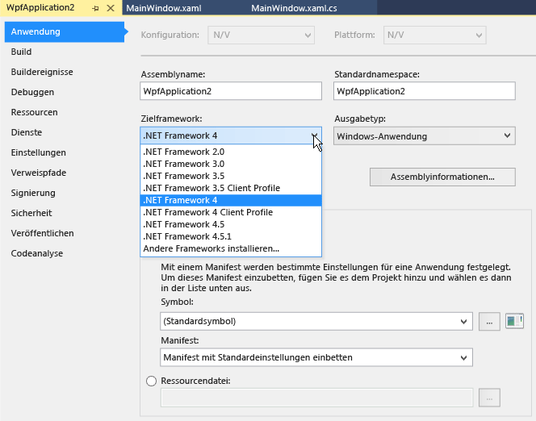

# Übersicht über Frameworkziele

In Visual Studio können Sie die Version von .NET angeben, auf die Sie das Projekt ausrichten möchten. Durch Frameworkziele wird gewährleistet, dass die Anwendung nur diejenigen Funktionen verwendet, die in der angegebenen Frameworkversion verfügbar sind. Damit .NET Framework-Apps auf einem anderen Computer ausgeführt werden können, muss die Frameworkversion, auf die die Anwendung ausgerichtet ist, mit der Frameworkversion kompatibel sein, die auf dem Computer installiert ist.

Eine Visual Studio-Projektmappe kann Projekte für verschiedene Versionen von .NET enthalten.

Weitere Informationen zu Zielframeworks finden Sie unter [Zielframeworks](/dotnet/standard/frameworks).

> [!TIP]
> Sie können auch Anwendungen für unterschiedliche Plattformen als Ziel verwenden. Weitere Informationen finden Sie unter [Multitargeting](../msbuild/msbuild-multitargeting-overview.md) (Festlegen von Zielversionen).

## Frameworkzielfunktionen

Frameworkziele umfassen folgende Funktionen:

- Wenn Sie ein Projekt öffnen, das auf eine frühere Frameworkversion ausgerichtet ist, kann Visual Studio automatisch ein Upgrade des Projekts durchführen oder die Zielversion unverändert lassen.

- Beim Erstellen eines .NET Framework-Projekts können Sie die gewünschte .NET Framework-Zielversion angeben.

- Sie können in einem einzelnen Projekt [mehrere Frameworks als Ziel](/dotnet/standard/frameworks#how-to-specify-target-frameworks) verwenden.

- Sie können für jedes der verschiedenen Projekte in der gleichen Projektmappe eine andere .NET-Version als Ziel festlegen.

- Sie können die .NET-Version ändern, auf die ein vorhandenes Projekt ausgerichtet ist.

   Wenn Sie die Version von .NET ändern, auf die ein Projekt ausgerichtet ist, führt Visual Studio alle erforderlichen Änderungen an Verweisen und Konfigurationsdateien durch.

Visual Studio ändert die Entwicklungsumgebung dynamisch, wenn Sie an einem Projekt arbeiten, das eine frühere Frameworkversion als Ziel hat. Dazu zählen u.a. folgende Aktionen:

- Filtern von Elementen in den Dialogfeldern **Neues Element hinzufügen**, **Neuen Verweis hinzufügen** und **Dienstverweis hinzufügen**, um die Optionen auszulassen, die in der Zielversion nicht verfügbar sind.

- Filtern von benutzerdefinierten Steuerelementen in der **Toolbox**, um die Steuerelemente zu entfernen, die in der Zielversion nicht verfügbar sind, und um nur die neuesten Steuerelemente anzuzeigen, wenn mehrere Steuerelemente für die Zielversion verfügbar sind.

- Filtern von **IntelliSense**, um Sprachfeatures auszulassen, die in der Zielversion nicht verfügbar sind.

- Filtern von Eigenschaften im Fenster **Eigenschaften**, um Eigenschaften auszulassen, die in der Zielversion nicht verfügbar sind.

- Filtern von Menüoptionen, um Optionen auszulassen, die in der Zielversion nicht verfügbar sind.

- Für Builds werden die Version des Compilers und die Compileroptionen verwendet, die für die Zielversion geeignet sind.

> [!NOTE]
> - Durch Frameworkziele wird nicht garantiert, dass die Anwendung ordnungsgemäß ausgeführt wird. Sie müssen die Anwendung dennoch testen, um sicherzustellen, dass Sie mit der Zielversion ausgeführt wird.
> - Sie können keine Frameworkversionen als Ziel verwenden, die älter als .NET Framework 2.0 sind.

## Auswählen einer Zielframeworkversion

Wenn Sie ein .NET Framework-Projekt erstellen, können Sie die .NET Framework-Zielversion nach der Projektvorlage auswählen. Die Liste der verfügbaren Frameworks enthält die installierten Framework-Versionen, die auf den Typ der ausgewählten Vorlage anwendbar sind. Bei Projektvorlagen ohne .NET Framework, z.B. .NET Core-Vorlagen, wird die **Framework**-Dropdownliste nicht angezeigt.

::: moniker range="vs-2017"

::: moniker-end

::: moniker range=">=vs-2019"

::: moniker-end

## Ändern des Zielframeworks

In einem vorhandenen Visual Basic-, C#- oder F#-Projekt können Sie die .NET-Zielversion im Dialogfeld „Projekteigenschaften“ ändern. Weitere Informationen zum Ändern der Zielversion für C++-Projekte finden Sie stattdessen unter [Vorgehensweise: Ändern des Zielframeworks und des Plattformtoolsets](/cpp/build/how-to-modify-the-target-framework-and-platform-toolset).

1. Öffnen Sie im **Projektmappen-Explorer** das Kontextmenü für das zu ändernde Projekt, und wählen Sie **Eigenschaften** aus.

1. Klicken Sie in der linken Spalte des Fensters **Eigenschaften** auf die Registerkarte **Anwendung**.

   

   > [!NOTE]
   > Nachdem Sie eine UWP-App erstellt haben, können Sie weder die Windows-Zielversion noch die .NET-Zielversion ändern.

1. Wählen Sie in der Liste **Zielframework** die gewünschte Zielversion aus.

1. Wählen Sie im daraufhin angezeigten Überprüfungsdialogfeld die Schaltfläche **Ja** aus.

   Das Projekt wird entladen. Wenn es erneut geladen wird, verwendet es die .NET-Zielversion, die Sie soeben ausgewählt haben.

> [!NOTE]
> Sollte der Code Verweise auf eine .NET-Version enthalten, die nicht die Zielversion ist, werden möglicherweise Fehlermeldungen angezeigt, wenn Sie den Code kompilieren oder ausführen. Um diese Fehler zu beheben, müssen Sie die Verweise ändern. Weitere Informationen finden Sie unter [Problembehandlung bei .NET-Zielversionsfehlern](../msbuild/troubleshooting-dotnet-framework-targeting-errors.md).

> [!TIP]
> Je nach Zielframework kann es auf folgende Weise in der Projektdatei dargestellt werden:
>
> - Für eine .NET Core-App: `<TargetFramework>netcoreapp2.1</TargetFramework>`
> - Für eine .NET Standard-App: `<TargetFramework>netstandard2.0</TargetFramework>`
> - Für eine .NET Framework-App: `<TargetFrameworkVersion>v4.7.2</TargetFrameworkVersion>`

## Auflösen von System- und Benutzerassemblyverweisen

Um eine .NET-Version als Ziel zu verwenden, müssen Sie zunächst die entsprechenden Assemblyverweise installieren. Sie können Entwicklerpakete für verschiedene .NET-Versionen von der Website [.NET-Downloads](https://www.microsoft.com/net/download/windows) herunterladen.

Bei .NET Framework-Projekten deaktiviert das Dialogfeld **Verweis hinzufügen** Systemassemblys, die nicht zur .NET Framework-Zielversion gehören, sodass sie nicht versehentlich zu einem Projekt hinzugefügt werden können. (Systemassemblys sind *DLL*-Dateien, die in einer .NET Framework-Version enthalten sind.) Verweise, die zu einer Frameworkversion gehören, die höher ist als die Zielversion, werden nicht aufgelöst, und Steuerelemente, die von einem solchen Verweis abhängen, können nicht hinzugefügt werden. Wenn Sie einen solchen Verweis aktivieren möchten, setzen Sie das .NET Framework-Ziel des Projekts auf eine Version zurück, die den Verweis enthält.

Weitere Informationen zu Assemblyverweisen finden Sie unter [Auflösen von Assemblys zur Entwurfszeit](../msbuild/resolving-assemblies-at-design-time.md).

## Aktivieren von LINQ

Wenn Sie .NET Framework 3.5 oder eine höhere Version als Ziel verwenden, werden automatisch ein Verweis auf **System.Core** und ein Import auf Projektebene für <xref:System.Linq> (nur in Visual Basic) hinzugefügt. Wenn Sie LINQ-Features verwenden möchten, müssen Sie zusätzlich `Option Infer` aktivieren (nur in Visual Basic). Der Verweis und der Import werden automatisch entfernt, wenn Sie die Zielversion auf eine frühere .NET Framework-Version ändern. Weitere Informationen finden Sie unter [Arbeiten mit LINQ](/dotnet/csharp/tutorials/working-with-linq).

## Siehe auch

- [Zielframeworks](/dotnet/standard/frameworks)
- [Projekte für mehrere Zielframeworkversionen (MSBuild)](../msbuild/msbuild-multitargeting-overview.md)
- [Vorgehensweise: How to: Modify the target framework and platform toolset (Vorgehensweise: Ändern des Zielframeworks und des Plattformtoolsets)](/cpp/build/how-to-modify-the-target-framework-and-platform-toolset)
