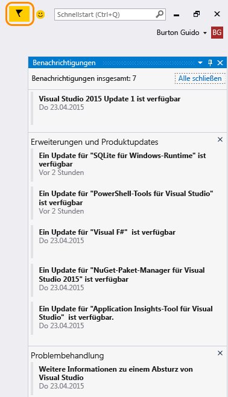

# Visual Studio-Benachrichtigungen
Visual Studio verfügt über ein Benachrichtigungssystem, das Sie auf verschiedene Ereignisse wie folgende aufmerksam macht:

- Ein Update für Visual Studio oder eine Komponente in Visual Studio ist verfügbar.  
- Es ist ein Umgebungsereignis aufgetreten, das Sie interessieren könnte.  
  
 Visual Studio benachrichtigt Sie, wenn ein Update für Visual Studio oder die installierten Komponenten verfügbar ist. Darüber hinaus werden Benachrichtigungen über bestimmte Arten von Ereignissen in der Visual Studio-Umgebung bereitgestellt. Beim Benachrichtigungssymbol handelt es sich um ein Kennzeichen in der oberen rechten Ecke der Visual Studio-Titelleiste. Wenn das Symbol rot ist, deutet dies auf ein Problem mit Ihrer Lizenz hin. Wenn es gelb ist, steht ein Visual Studio-Produktupdate für die Installation zur Verfügung. Wenn es „normal“ oder schwarz ist, werden informative oder optionale Nachrichten angezeigt, beispielsweise Abstürze, für die Sie möglicherweise eine Problemumgehung finden möchten. Sie können auf das Symbol klicken, um den **Benachrichtigungshub** zu öffnen und auszuwählen, welche verwendet werden sollen. Sie können auswählen, eine Benachrichtigung einmalig oder dauerhaft zu ignorieren (indem Sie mit dem Mauszeiger darauf zeigen). Im letzteren Fall zeigt Visual Studio die Meldung nie wieder an.  
  
 Wenn Sie festlegen, dass eine Benachrichtigung immer ignoriert werden soll, wird diese von Visual Studio nicht mehr angezeigt. Sie können die Liste der ignorierten Benachrichtigungen im Dialogfeld [Benachrichtigungen, Umgebung, Optionen](../ide/reference/notifications-environment-options-dialog-box.md) zurücksetzen.  
  
   
  
## Siehe auch  
 [Visual Studio-IDE](../ide/visual-studio-ide.md)

