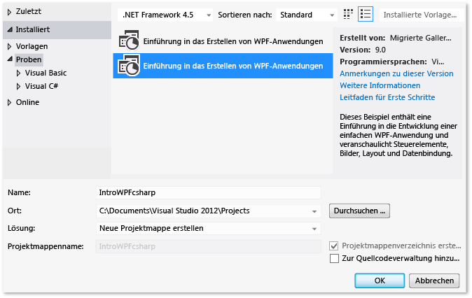
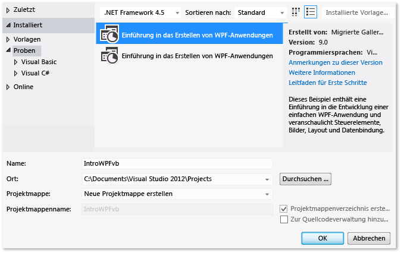

# Exemplarische Vorgehensweise: Erstellen einer Anwendung
[!INCLUDE[vs2017banner](../code-quality/includes/vs2017banner.md)]

Indem Sie diese exemplarische Vorgehensweise abschließen, werden Sie mit einigen der bei der Erstellung von Anwendungen mit Visual Studio konfigurierbaren Optionen vertrauter.  Sie führen unter anderem die folgenden Aufgaben für eine Beispielanwendung aus: Erstellen einer benutzerdefinierten Buildkonfiguration, Ausblenden bestimmter Warnmeldungen und Verbessern der Buildausgabeinformationen.  
  
 Dieses Thema enthält folgende Abschnitte:  
  
 [Installieren der Beispielanwendung](../ide/walkthrough-building-an-application.md#BKMK_installapp)  
  
 [Erstellen einer benutzerdefinierten Buildkonfiguration](../ide/walkthrough-building-an-application.md#BKMK_CreateBuildConfig)  
  
 [Erstellen der Anwendung](../ide/walkthrough-building-an-application.md#BKMK_building)  
  
 [Ausblenden von Compilerwarnungen](../ide/walkthrough-building-an-application.md#BKMK_hidewarning)  
  
 [Anzeigen zusätzlicher Builddetails im Ausgabefenster](../ide/walkthrough-building-an-application.md#BKMK_outputdetails)  
  
 [Erstellen eines Versionsbuilds](../ide/walkthrough-building-an-application.md#BKMK_releasebuild)  
  
##   Installieren der Beispielanwendung  
 Verwenden Sie das Dialogfeld **Erweiterungen und Updates**, um das [Einführung in das Erstellen von WPF\-Anwendungen](http://code.msdn.microsoft.com/Introduction-to-Building-b8d16419?SRC=VSIDE)\-Beispiel im Beispielkatalog auf der Microsoft\-Website zu suchen und zu installieren.  Der Beispielkatalog bietet eine Vielzahl von Beispielsprojekten und \-code, die bzw. den Sie beim Erstellen und Entwickeln von Anwendungen herunterladen und überprüfen können.  
  
#### So Installieren Sie die Beispielanwendung  
  
1.  Wählen Sie auf der Menüleiste **Tools**, **Erweiterungen und Updates** aus.  
  
2.  Wählen Sie die Kategorie **Online** und dann die Kategorie **Beispielgalerie** aus.  
  
3.  Geben Sie zum Suchen des Beispiels `Introduction` in das Suchfeld ein.  
  
       
  
4.  Wählen Sie in der Ergebnisliste entweder **Einführung in das Erstellen von Windows Presentation Foundation\-Anwendungen \(Visual C\#\)** oder **Einführung in das Erstellen von Windows Presentation Foundation\-Anwendungen \(Visual Basic\)** aus.  
  
5.  Klicken Sie auf die Schaltfläche **Herunterladen**, und wählen Sie dann die Schaltfläche **Schließen** aus.  
  
 Das Beispiel für die Einführung zum Erstellen von WPF\-Anwendungen wird im Dialogfeld **Neues Projekt** angezeigt.  
  
#### So erstellen Sie eine Projektmappe für die Beispielanwendung  
  
1.  Öffnen Sie das Dialogfeld **Neues Projekt**.  
  
       
  
2.  Wählen Sie in der Kategorie **Installiert** die Kategorie **Beispiele** aus, um das Beispiel für die Einführung zum Erstellen von WPF\-Anwendungen anzuzeigen.  
  
3.  Geben Sie der Projektmappe bei Visual C\# den Namen `IntroWPFcsharp`.  
  
       
  
     OR  
  
     Geben Sie der Projektmappe bei Visual Basic den Namen `IntroWPFvb`.  
  
       
  
4.  Klicken Sie auf die Schaltfläche **OK**.  
  
##   Erstellen einer benutzerdefinierten Buildkonfiguration  
 Wenn Sie eine Projektmappe erstellen, werden Debug\- und Releasebuildkonfigurationen und ihre Standardplattformziele für die Projektmappe automatisch definiert.  Sie können diese Konfigurationen dann anpassen oder eigene Konfigurationen erstellen.  Buildkonfigurationen geben den Buildtyp an.  Buildplattformen geben das Betriebssystem an, auf das eine Anwendung für diese Konfiguration ausgerichtet ist.  Weitere Informationen finden Sie unter [Grundlagen der Buildkonfiguration](../ide/understanding-build-configurations.md), [Grundlagen zu Buildplattformen](../ide/understanding-build-platforms.md) und [Debug and Release Project Configurations](http://msdn.microsoft.com/de-de/0440b300-0614-4511-901a-105b771b236e).  
  
 Sie können Konfigurationen und Plattformeinstellungen mithilfe des Dialogfelds **Konfigurations\-Manager** ändern oder erstellen.  In dieser Prozedur erstellen Sie eine Buildkonfiguration zum Testen.  
  
#### So erstellen Sie eine Buildkonfiguration  
  
1.  Öffnen Sie das Dialogfeld **Konfigurations\-Manager**.  
  
       
  
2.  Wählen Sie in der Liste **Konfiguration der aktuellen Projektmappe** den Eintrag **Neu** aus.  
  
3.  Geben Sie im Dialogfeld **Neue Projektmappenkonfiguration** den Namen `Test` für die neue Konfiguration ein, und kopieren Sie die Einstellungen aus der vorhandenen Debugkonfiguration. Wählen Sie dann die Schaltfläche **OK** aus.  
  
       
  
4.  Wählen Sie in der Liste **Aktive Projektmappenplattform** den Eintrag **Neu** aus.  
  
5.  Wählen Sie im Dialogfeld **Neue Projektmappenplattform** die Option **x64** aus, und kopieren Sie keine der Einstellungen für die x86\-Plattform.  
  
       
  
6.  Klicken Sie auf die Schaltfläche **OK**.  
  
 Die aktive Projektmappenkonfiguration wurde für einen Test mit der aktiven, auf x64\- festgelegten Projektmappenplattform geändert.  
  
   
  
 Sie können die aktive Projektmappenkonfiguration schnell überprüfen oder ändern, indem Sie die Liste **Projektmappenkonfigurationen** auf der Symbolleiste **Standard** verwenden.  
  
   
  
##   Erstellen der Anwendung  
 Danach erstellen Sie die Projektmappe mit der benutzerdefinierten Buildkonfiguration.  
  
#### So erstellen Sie die Projektmappe  
  
-   Wählen Sie in der Menüleiste **Erstellen**, **Projektmappe erstellen**.  
  
 Im Fenster **Ausgabe** wird das Ergebnis des Builds angezeigt.  Der Build ist erfolgreich, doch wurden einige Warnmeldungen erzeugt.  
  
 Abbildung 1: Visual Basic\-Warnungen  
  
   
  
 Abbildung 2: Visual C\#\-Warnungen  
  
   
  
##   Ausblenden von Compilerwarnungen  
 Sie können bestimmte Warnungen während eines Builds vorübergehend ausblenden, anstatt sie die Buildausgabe durcheinanderbringen zu lassen.  
  
#### So blenden Sie eine bestimmte Visual C\#\-Warnung aus  
  
1.  Wählen Sie im **Projektmappen\-Explorer** den Projektknoten der obersten Ebene aus.  
  
2.  Wählen Sie in der Menüleiste **Ansicht**, **Eigenschaftenseiten**.  
  
     Der **Projekt\-Designer** wird geöffnet.  
  
3.  Wählen Sie die Seite **Build**, und geben Sie im Feld **Warnungen unterdrücken** die Warnungsnummer `1762` an.  
  
       
  
     Weitere Informationen finden Sie unter [Seite "Erstellen", Projekt\-Designer \(C\#\)](../ide/reference/build-page-project-designer-csharp.md).  
  
4.  Erstellen Sie die Projektmappe.  
  
     Im Fenster **Ausgabe** werden nur Zusammenfassungsinformationen für den Build angezeigt.  
  
       
  
#### So unterdrücken Sie alle Visual Basic\-Buildwarnungen  
  
1.  Wählen Sie im **Projektmappen\-Explorer** den Projektknoten der obersten Ebene aus.  
  
2.  Wählen Sie in der Menüleiste **Ansicht**, **Eigenschaftenseiten**.  
  
     Der **Projekt\-Designer** wird geöffnet.  
  
3.  Aktivieren Sie auf der Seite **Kompilieren** das Kontrollkästchen **Alle Warnungen deaktivieren**.  
  
       
  
     Weitere Informationen finden Sie unter [Konfigurieren von Warnungen in Visual Basic](../ide/configuring-warnings-in-visual-basic.md).  
  
4.  Erstellen Sie die Projektmappe.  
  
 Im Fenster **Ausgabe** werden nur Zusammenfassungsinformationen für den Build angezeigt.  
  
   
  
 Weitere Informationen finden Sie unter [Gewusst wie: Unterdrücken von Compiler\-Warnungen](../ide/how-to-suppress-compiler-warnings.md).  
  
##   Anzeigen zusätzlicher Builddetails im Ausgabefenster  
 Sie können die Menge der im Fenster **Ausgabe** angezeigten Informationen über den Buildvorgang ändern.  Buildausführlichkeit wird normalerweise auf "Minimal" festgelegt. Das bedeutet, dass im Fenster **Ausgabe** nur eine Zusammenfassung des Buildprozesses zusammen mit allen Warnungen oder Fehlern mit hoher Priorität angezeigt werden.  Sie können mithilfe von [Optionen \(Dialogfeld\), Projekte und Projektmappen, Erstellen und Ausführen](../ide/reference/options-dialog-box-projects-and-solutions-build-and-run.md) mehr Informationen zum Build anzeigen lassen.  
  
> [!IMPORTANT]
>  Wenn Sie weitere Informationen anzeigen, dauert der Abschluss des Builds länger.  
  
#### So ändern Sie die Informationsmenge im Ausgabefenster  
  
1.  Öffnen Sie das Dialogfeld **Optionen**.  
  
       
  
2.  Wählen Sie die Kategorie **Projekte und Projektmappen**, und wählen Sie dann die Seite **Erstellen und Ausführen** aus.  
  
3.  Wählen Sie in der Liste **Ausführlichkeit der MSBuild\-Projektbuildausgabe** die Option **Normal** aus, und wählen Sie dann die Schaltfläche **OK** aus.  
  
4.  Wählen Sie in der Menüleiste **Build**, **Projektmappe bereinigen** aus.  
  
5.  Erstellen Sie die Projektmappe, und überprüfen Sie dann die Informationen im Fenster **Ausgabe**.  
  
     Die Buildinformationen umfassen die Uhrzeit, zu der der Build gestartet ist \(am Anfang\), Reihenfolge, in der die Dateien verarbeitet wurden, und die zum Abschließen des Prozesses erforderliche Zeit \(am Ende\).  Diese Informationen umfassen auch die von Visual Studio beim Build ausgeführt Compeliersyntax.  
  
     Im Visual C\#\-Build führt die [\/nowarn](/dotnet/visual-basic/reference/command-line-compiler/nowarn)\-Option z. B. den von Ihnen zuvor in diesem Thema angegebenen Warnungscode 1762 zusammen mit drei weiteren Warnungen auf.  
  
     Im Visual Basic\-Build umfasst [\/nowarn](/dotnet/visual-basic/reference/command-line-compiler/nowarn) keine bestimmten auszuschließenden Warnungen, sodass keine Warnungen angezeigt werden.  
  
    > [!TIP]
    >  Sie können den Inhalt des Fensters **Ausgabe** durchsuchen, wenn Sie das Dialogfeld **Suchen** mithilfe der Tastenkombination STRG\+F anzeigen.  
  
 Weitere Informationen finden Sie unter [Gewusst wie: Anzeigen, Speichern und Konfigurieren von Buildprotokolldateien](../ide/how-to-view-save-and-configure-build-log-files.md).  
  
##   Erstellen eines Versionsbuilds  
 Sie können eine Version der Beispielanwendung erstellen, die für das Versenden optimiert wird.  Beim Releasebuild geben Sie an, dass die ausführbare Datei auf eine Netzwerkfreigabe kopiert wird, bevor der Build gestartet wird.  
  
 Weitere Informationen finden Sie unter [Gewusst wie: Ändern des Buildausgabeverzeichnisses](../ide/how-to-change-the-build-output-directory.md) und [Erstellen und Bereinigen von Projekten und Projektmappen in Visual Studio](../ide/building-and-cleaning-projects-and-solutions-in-visual-studio.md).  
  
#### So geben Sie einen Releasebuild für Visual Basic an  
  
1.  Öffnen Sie den **Projekt\-Designer**.  
  
       
  
2.  Wählen Sie die Seite **Kompilieren** aus.  
  
3.  Wählen Sie in der Liste **Konfiguration** die Option **Release** aus.  
  
4.  Wählen Sie in der Liste **Plattform** die Option **x86** aus.  
  
5.  Geben Sie im Feld **Buildausgabepfad** einem Netzwerkpfad an.  
  
     Sie können z. B. "\\\\myserver\\builds" angeben.  
  
    > [!IMPORTANT]
    >  Möglicherweise wird ein Meldungsfeld angezeigt, in dem davor gewarnt wird, dass die von Ihnen angegebene Netzwerkfreigabe eventuell kein vertrauenswürdiger Speicherort ist.  Wenn Sie dem angegebenen Speicherort vertrauen, wählen Sie im Meldungsfeld die Schaltfläche **OK** aus.  
  
6.  Erstellen Sie die Anwendung.  
  
       
  
#### So geben Sie einen Releasebuild für Visual C\# an  
  
1.  Öffnen Sie den **Projekt\-Designer**.  
  
       
  
2.  Wählen Sie die Seite **Build** aus.  
  
3.  Wählen Sie in der Liste **Konfiguration** die Option **Release** aus.  
  
4.  Wählen Sie in der Liste **Plattform** die Option **x86** aus.  
  
5.  Geben Sie im Feld **Ausgabepfad** einem Netzwerkpfad an.  
  
     Sie könnten z. B. "\\\\myserver\\builds" angeben.  
  
    > [!IMPORTANT]
    >  Möglicherweise wird ein Meldungsfeld angezeigt, in dem davor gewarnt wird, dass die von Ihnen angegebene Netzwerkfreigabe eventuell kein vertrauenswürdiger Speicherort ist.  Wenn Sie dem angegebenen Speicherort vertrauen, wählen Sie im Meldungsfeld die Schaltfläche **OK** aus.  
  
6.  Erstellen Sie die Anwendung.  
  
       
  
 Die ausführbare Datei wird auf den von Ihnen angegebenen Netzwerkpfad kopiert.  Der Pfad ist "\\\\myserver\\builds \\*FileName*.exe".  
  
 Herzlichen Glückwunsch: Sie haben diese exemplarische Vorgehensweise erfolgreich abgeschlossen.  
  
## Siehe auch  
 [Exemplarische Vorgehensweise: Erstellen eines Projekts \(C\+\+\)](../Topic/Walkthrough:%20Building%20a%20Project%20\(C++\).md)   
 [ASP.NET Web Application Project Precompilation Overview](http://msdn.microsoft.com/de-de/b940abbd-178d-4570-b441-52914fa7b887)   
 [Walkthrough: Using MSBuild](../msbuild/walkthrough-using-msbuild.md)