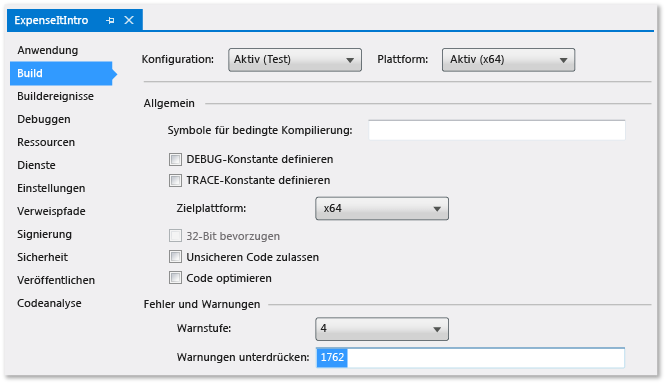
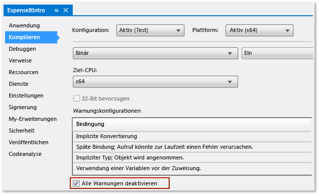

# Exemplarische Vorgehensweise: Erstellen einer Anwendung

Wenn Sie diese exemplarische Vorgehensweise durchführen, werden Sie mit einigen der bei der Erstellung von Anwendungen mit Visual Studio konfigurierbaren Optionen vertrauter. Sie führen die folgenden Aufgaben für eine Beispielanwendung aus: Erstellen einer benutzerdefinierten Buildkonfiguration, Ausblenden bestimmter Warnmeldungen und Verbessern der Buildausgabeinformationen.

## Installieren der Beispielanwendung

Laden Sie das Beispiel [Introduction to Building WPF Applications (Einführung in das Erstellen von WPF-Anwendungen)](https://code.msdn.microsoft.com/Introduction-to-Building-b8d16419) herunter. Entscheiden Sie sich zwischen C# und Visual Basic. Wenn der Download der ZIP-Datei abgeschlossen ist, extrahieren Sie diese, und öffnen Sie die Datei **ExpenseItIntro.sln** mit Visual Studio.

## Erstellen einer benutzerdefinierten Buildkonfiguration

Wenn Sie eine Projektmappe erstellen, werden Debug- und Releasebuildkonfigurationen und ihre Standardplattformziele für die Projektmappe automatisch definiert. Sie können diese Konfigurationen dann anpassen oder eigene Konfigurationen erstellen. Buildkonfigurationen geben den Buildtyp an. Buildplattformen geben das Betriebssystem an, auf das eine Anwendung für diese Konfiguration ausgerichtet ist. Weitere Informationen finden Sie unter [Grundlagen der Buildkonfiguration](../ide/understanding-build-configurations.md), [Grundlagen zu Buildplattformen](../ide/understanding-build-platforms.md) und [Gewusst wie: Festlegen von Debug- und Releasekonfigurationen in Visual Studio](../debugger/how-to-set-debug-and-release-configurations.md).

Sie können Konfigurationen und Plattformeinstellungen mithilfe des Dialogfelds **Konfigurations-Manager** ändern oder erstellen. In dieser Prozedur erstellen Sie eine Buildkonfiguration zum Testen.

### So erstellen Sie eine Buildkonfiguration

1. Öffnen Sie das Dialogfeld **Konfigurations-Manager**.

     

1. Wählen Sie in der Liste **Konfiguration der aktuellen Projektmappe** den Eintrag **\<Neu…\>** aus.

1. Geben Sie im Dialogfeld **Neue Projektmappenkonfiguration** den Namen `Test` für die neue Konfiguration ein, kopieren Sie die Einstellungen aus der vorhandenen Debugkonfiguration, und wählen Sie dann die Schaltfläche **OK** aus.

     

1. Wählen Sie in der Liste **Aktive Projektmappenplattform** den Eintrag **\<Neu…\>** aus.

1. Wählen Sie im Dialogfeld **Neue Projektmappenplattform** die Option **x64** aus, und kopieren Sie keine der Einstellungen der x86-Plattform.

     

1. Klicken Sie auf die Schaltfläche **OK** .

   Die aktive Projektmappenkonfiguration wurde für einen Test mit der aktiven, auf x64- festgelegten Projektmappenplattform geändert.

     

1. Klicken Sie auf **Schließen**.

Sie können die aktive Projektmappenkonfiguration schnell überprüfen oder ändern, indem Sie die Liste **Projektmappenkonfigurationen** auf der Symbolleiste **Standard** verwenden.
  
  
  
## Erstellen der Anwendung

Danach erstellen Sie die Projektmappe mit der benutzerdefinierten Buildkonfiguration.
  
### So erstellen Sie die Projektmappe
  
-   Wählen Sie auf der Menüleiste **Erstellen** > **Projektmappe erstellen** aus.
  
    Im Fenster **Ausgabe** wird das Ergebnis des Builds angezeigt. Der Buildvorgang war erfolgreich.
  
## Ausblenden von Compilerwarnungen

Als Nächstes wird Code eingeführt, der eine Warnung auslöst und vom Compiler generiert werden soll.

1. Öffnen Sie die Datei **ExpenseReportPage.xaml.cs** im C#-Projekt. Fügen Sie folgenden Code in die **ExpenseReportPage**-Methode ein: `int i;`.

    ODER

    Öffnen Sie im Visual Basic-Projekt die Datei **ExpenseReportPage.xaml.vb**. Fügen Sie im benutzerdefinierten Konstruktor **Public Sub New** den folgenden Code hinzu: `Dim i`.

1. Erstellen Sie die Projektmappe.

Im Fenster **Ausgabe** wird das Ergebnis des Builds angezeigt. Der Build wurde erfolgreich abgeschlossen, aber es wurden Warnungen ausgelöst:

Sie können bestimmte Warnungen während eines Builds vorübergehend ausblenden, anstatt sie die Buildausgabe durcheinanderbringen zu lassen.

### So blenden Sie eine bestimmte C#-Warnung aus

1. Wählen Sie im **Projektmappen-Explorer** den Projektknoten der obersten Ebene aus.

1. Wählen Sie in der Menüleiste **Ansicht**, **Eigenschaftenseiten**.
  
     Der **Projekt-Designer** wird geöffnet.

1. Klicken Sie auf die Seite **Erstellen**, und geben Sie im Feld **Warnungen unterdrücken** die Warnungsnummer **0168** an.
  
       
  
     Weitere Informationen finden Sie unter [Seite „Erstellen“, Projekt-Designer (C#)](../ide/reference/build-page-project-designer-csharp.md).

1. Erstellen Sie die Projektmappe.
  
     Im Fenster **Ausgabe** werden nur Zusammenfassungsinformationen für den Build angezeigt.
  
       
  
### So unterdrücken Sie alle Visual Basic-Buildwarnungen

1. Wählen Sie im **Projektmappen-Explorer** den Projektknoten der obersten Ebene aus.

1. Wählen Sie in der Menüleiste **Ansicht**, **Eigenschaftenseiten**.
  
     Der **Projekt-Designer** wird geöffnet.

1. Aktivieren Sie auf der Seite **Kompilieren** das Kontrollkästchen **Alle Warnungen deaktivieren**.
  
       
  
     Weitere Informationen finden Sie unter [Konfigurieren von Warnungen in Visual Basic](../ide/configuring-warnings-in-visual-basic.md).

1. Erstellen Sie die Projektmappe.
  
 Im Fenster **Ausgabe** werden nur Zusammenfassungsinformationen für den Build angezeigt.
  
   
  
 Weitere Informationen finden Sie unter [Vorgehensweise: Unterdrücken von Compiler-Warnungen](../ide/how-to-suppress-compiler-warnings.md).
  
## Anzeigen zusätzlicher Builddetails im Ausgabefenster

Sie können die Menge der im Fenster **Ausgabe** angezeigten Informationen über den Buildprozess ändern. Buildausführlichkeit wird normalerweise auf „Minimal“ festgelegt. Das bedeutet, dass im Fenster **Ausgabe** nur eine Zusammenfassung des Buildprozesses zusammen mit allen Warnungen oder Fehlern mit hoher Priorität angezeigt wird. Sie können mithilfe von [Optionen (Dialogfeld), Projekte und Projektmappen, Erstellen und Ausführen](../ide/reference/options-dialog-box-projects-and-solutions-build-and-run.md) weitere Informationen zum Build anzeigen lassen.
  
> [!IMPORTANT]
>  Wenn Sie weitere Informationen anzeigen, dauert der Abschluss des Builds länger.
  
### So ändern Sie die Informationsmenge im Ausgabefenster

1. Öffnen Sie das Dialogfeld **Optionen**.
  
       

1. Wählen Sie die Kategorie **Projekte und Projektmappen**, und wählen Sie dann die Seite **Erstellen und Ausführen** aus.

1. Wählen Sie in der Liste **Ausführlichkeit der MSBuild-Projektbuildausgabe** die Option **Normal** und dann die Schaltfläche **OK** aus.

1. Wählen Sie in der Menüleiste **Build**, **Projektmappe bereinigen** aus.

1. Erstellen Sie die Projektmappe, und überprüfen Sie dann die Informationen im Fenster **Ausgabe**.
  
     Die Buildinformationen umfassen die Uhrzeit, zu der der Build gestartet wurde (am Anfang), und die Reihenfolge, in der die Dateien verarbeitet wurden. Diese Informationen umfassen auch die von Visual Studio beim Build ausgeführt Compeliersyntax.
  
     Im C#-Build führt die Option [/nowarn](/dotnet/visual-basic/reference/command-line-compiler/nowarn) z.B. den von Ihnen zuvor in diesem Thema angegebenen Warnungscode 1762 zusammen mit drei weiteren Warnungen auf.
  
     Im Visual Basic-Build umfasst [/nowarn](/dotnet/visual-basic/reference/command-line-compiler/nowarn) keine bestimmten auszuschließenden Warnungen, sodass keine Warnungen angezeigt werden.
  
    > [!TIP]
    > Sie können den Inhalt des Fensters **Ausgabe** durchsuchen, wenn Sie das Dialogfeld **Suchen** mithilfe der Tastenkombination STRG+F anzeigen.

Weitere Informationen finden Sie unter [Vorgehensweise: Anzeigen, Speichern und Konfigurieren von Buildprotokolldateien](../ide/how-to-view-save-and-configure-build-log-files.md).
  
## Erstellen eines Releasebuilds

Sie können eine Version der Beispielanwendung erstellen, die für das Versenden optimiert wird. Beim Releasebuild geben Sie an, dass die ausführbare Datei auf eine Netzwerkfreigabe kopiert wird, bevor der Build gestartet wird.

Weitere Informationen finden Sie unter [Vorgehensweise: Ändern des Buildausgabeverzeichnisses](../ide/how-to-change-the-build-output-directory.md) und [Erstellen und Bereinigen von Projekten und Projektmappen in Visual Studio](../ide/building-and-cleaning-projects-and-solutions-in-visual-studio.md).

### So geben Sie einen Releasebuild für Visual Basic an

1. Öffnen Sie den **Projekt-Designer**.
  
       

1. Wählen Sie die Seite **Kompilieren** aus.

1. Wählen Sie in der Liste **Konfiguration** die Option **Release** aus.

1. Wählen Sie in der Liste **Plattform** die Option **x86** aus.

1. Geben Sie im Feld **Buildausgabepfad** einem Netzwerkpfad an.

     Sie können z.B. \\\myserver\builds angeben.

    > [!IMPORTANT]
    > Möglicherweise wird ein Meldungsfeld angezeigt, in dem davor gewarnt wird, dass die von Ihnen angegebene Netzwerkfreigabe eventuell kein vertrauenswürdiger Speicherort ist. Wenn Sie dem angegebenen Speicherort vertrauen, wählen Sie im Meldungsfeld die Schaltfläche **OK** aus.

1. Erstellen Sie die Anwendung.

       

### So geben Sie einen Releasebuild für C# an #

1. Öffnen Sie den **Projekt-Designer**.
  
       

1. Wählen Sie die Seite **Erstellen** aus.

1. Wählen Sie in der Liste **Konfiguration** die Option **Release** aus.

1. Wählen Sie in der Liste **Plattform** die Option **x86** aus.

1. Geben Sie im Feld **Ausgabepfad** einen Netzwerkpfad an.
  
     Sie könnten z.B. \\\myserver\builds angeben.
  
    > [!IMPORTANT]
    > Möglicherweise wird ein Meldungsfeld angezeigt, in dem davor gewarnt wird, dass die von Ihnen angegebene Netzwerkfreigabe eventuell kein vertrauenswürdiger Speicherort ist. Wenn Sie dem angegebenen Speicherort vertrauen, wählen Sie im Meldungsfeld die Schaltfläche **OK** aus.

1. Legen Sie auf der **Symbolleiste „Standard“** die Projektmappenkonfiguration auf **Release** und die Projektmappenplattformen auf **x86** fest.

1. Erstellen Sie die Anwendung.

       

   Die ausführbare Datei wird auf den von Ihnen angegebenen Netzwerkpfad kopiert. Der Pfad ist \\\myserver\builds\\*Dateiname*.exe.

Herzlichen Glückwunsch: Sie haben diese exemplarische Vorgehensweise erfolgreich abgeschlossen.
  
## Siehe auch

[Exemplarische Vorgehensweise: Erstellen eines Projekts (C++)](/cpp/ide/walkthrough-building-a-project-cpp)  
[Übersicht über die Vorkompilierung von ASP.NET-Webanwendungsprojekten](http://msdn.microsoft.com/b940abbd-178d-4570-b441-52914fa7b887)  
[Exemplarische Vorgehensweise: Verwenden von MSBuild](../msbuild/walkthrough-using-msbuild.md)
