# <a name="walkthrough-create-a-simple-application-with-c-or-visual-basic"></a>Exemplarische Vorgehensweise: Erstellen einer einfachen Anwendung mit C# oder Visual Basic
Wenn Sie diese exemplarische Vorgehensweise durcharbeiten, werden Sie mit vielen Tools, Dialogfeldern und Designern vertraut, die Sie für die Entwicklung von Anwendungen in Visual Studio verwenden können. Sie erstellen eine einfache „Hallo, Welt“-Anwendung, entwerfen die Benutzeroberfläche, fügen Code hinzu und debuggen Fehler. Gleichzeitig erfahren Sie mehr über das Arbeiten in der integrierten Entwicklungsumgebung (IDE).

##  <a name="BKMK_ConfigureIDE"></a> Konfigurieren der IDE  
Wenn Sie Visual Studio zum ersten Mal starten, werden Sie zur Anmeldung aufgefordert. Dieser Schritt ist für die exemplarische Vorgehensweise nicht unbedingt notwendig. Als Nächstes wird Ihnen möglicherweise ein Dialogfeld angezeigt, in dem Sie aufgefordert werden, Ihre Entwicklungseinstellungen und Farbdesigns festzulegen. Behalten Sie die Standardeinstellungen bei, und klicken Sie auf **Visual Studio starten**.  


Wenn sich Visual Studio öffnet, werden Toolfenster, die Menüs, Symbolleisten und der Hauptfensterbereich angezeigt. Mit **Schnellstart**werden Toolfenster auf der linken und rechten Seite des Anwendungsfensters und die Menüleiste und die Standardsymbolleiste oben angedockt. In der Mitte des Anwendungsfensters befindet sich die **Startseite**. Wenn Sie eine Projektmappe oder ein Projekt laden, werden Editoren und Designer dort angezeigt, wo sich die **Startseite** befindet. Wenn Sie eine Anwendung entwickeln, verbringen Sie die meiste Zeit in diesem zentralen Bereich.  

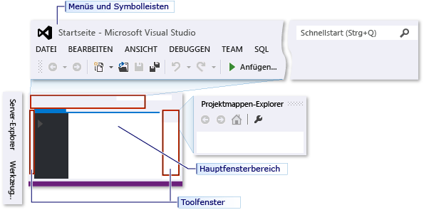  

##  <a name="BKMK_CreateApp"></a> Erstellen einer einfachen Anwendung  

### <a name="create-the-project"></a>Erstellen eines Projekts  
Wenn Sie eine Anwendung in Visual Studio erstellen, erstellen Sie zunächst ein Projekt und eine Projektmappe. In diesem Beispiel erstellen Sie eine Windows Presentation Foundations-Projektmappe (WPF).  

#### <a name="to-create-the-wpf-project"></a>So erstellen Sie das WPF-Projekt  

1.  Erstellen Sie ein neues Projekt. Wählen Sie in der Menüleiste **Datei**, **Neu**, **Projekt...**aus.  

     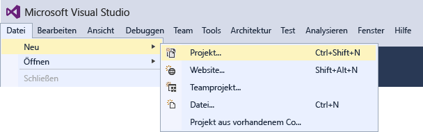  

2.  Wählen Sie die Visual Basic- oder Visual C# WPF-Anwendungsvorlage aus, indem Sie z.B. zunächst im linken Bereich auf **Installiert** > **Visual C#** > **Klassischer Windows-Desktop** klicken und dann im mittleren Bereich auf **WPF-App (.NET Framework)**.  Geben Sie dem Projekt am unteren Rand des Dialogfelds "Neues Projekt" den Namen "HelloWPFApp".  

     ![Create a C# WPF Project, HelloWPFApp] (Visual C#-WPF-Projekt „HelloWPFApp“ erstellen)(../ide/media/exploreide-newprojectcsharp.png "ExploreIDE-NewProjectcsharp")  

Visual Studio erstellt das „HelloWPFApp“-Projekt und die Projektmappe, woraufhin im **Projektmappen-Explorer** verschiedene Dateien angezeigt werden. Der WPF-Designer zeigt eine Entwurfsansicht und eine XAML-Ansicht der Datei MainWindow.xaml in einer geteilten Ansicht an. Ziehen Sie den Teiler, um mehr oder weniger der jeweiligen Ansichten anzuzeigen.  Sie können auch nur die visuelle Ansicht oder nur die XAML-Ansicht anzeigen. (Weitere Informationen finden Sie unter [Der WPF-Designer für Windows Forms-Entwickler](http://msdn.microsoft.com/47ad0909-e89b-4996-b4ac-874d929f94ca).) Die folgenden Elemente werden in **Projektmappen-Explorer**angezeigt:  

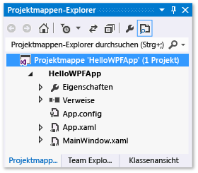  

Nachdem Sie das Projekt erstellt haben, können Sie es anpassen. Im Fenster **Eigenschaften** (Menü **Ansicht** ) können Sie Optionen für Projektelemente, Steuerelemente und andere Elemente in einer Anwendung anzeigen und ändern.  

#### <a name="to-change-the-name-of-mainwindowxaml"></a>Ändern des Namens der Datei "MainWindow.xaml"  
Geben Sie „MainWindow“ einen genaueren Namen.  

1. Wählen Sie in **Projektmappen-Explorer**MainWindow.xaml aus. Das Fenster **Eigenschaften** sollte nun angezeigt werden. Wenn dies nicht der Fall ist, klicken Sie auf das Menü **Ansicht** und das **Eigenschaftenfenster**-Element.  
2. Ändern Sie die Eigenschaft **Dateiname** in `Greetings.xaml`  

     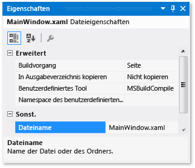  

     Im **Projektmappen-Explorer** wird angezeigt, dass der Name der Datei nun „Greetings.xaml“ und der Name der geschachtelten Codedatei nun „Greetings.xaml.vb“ oder „Greetings.xaml.cs“ lautet. Diese Codedatei ist unter dem XAML-Dateiknoten geschachtelt, um deren enge Verbindung miteinander darzustellen.  

### <a name="design-the-user-interface-ui"></a>Entwerfen der Benutzeroberfläche (UI)  
Nun fügen wir der Anwendung drei Arten von Steuerelementen hinzu: ein TextBlock-Steuerelement, zwei RadioButton-Steuerelemente und ein Button-Steuerelement.  

#### <a name="to-add-a-textblock-control"></a>Hinzufügen eines TextBlock-Steuerelements  

1.  Öffnen Sie den **Werkzeugkasten** durch Auswählen des Menüs **Ansicht** und der Option **Werkzeugkasten** .  

2.  Erweitern Sie in der **Toolbox** den Knoten **Häufig verwendete WPF-Steuerelemente**, damit das TextBlock-Steuerelement angezeigt wird.  

     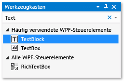  

3.  Fügen Sie auf der Entwurfsoberfläche ein TextBlock-Steuerelement hinzu, indem Sie das **TextBlock**-Element auswählen und in das Fenster auf der Entwurfsoberfläche ziehen. Zentrieren Sie das Steuerelement im oberen Bereich des Fensters.  

Das Fenster sollte der folgenden Abbildung entsprechen:  

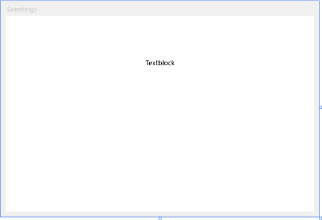  

Das XAML-Markup sollte in etwa der folgenden Darstellung entsprechen:  

```xaml  
<TextBlock HorizontalAlignment="Center" TextWrapping="Wrap" VerticalAlignment="Center" RenderTransformOrigin="4.08,2.312" Margin="237,57,221,238"><Run Text="TextBlock"/><InlineUIContainer><TextBlock TextWrapping="Wrap" Text="TextBlock"/>  
```  

#### <a name="to-customize-the-text-in-the-text-block"></a>Anpassen des Texts im Textblock  

1.  Suchen Sie in der XAML-Ansicht das Markup für TextBlock, und ändern Sie das Textattribut:  

   ```xaml
   Text="Select a message option and then choose the Display button."
   ```  

2.  Zentrieren Sie wenn nötig das TextBlock-Steuerelement erneut, und speichern Sie die Änderungen durch Drücken von **STRG+S** oder über das Menüelement **Datei**.  

Anschließend fügen Sie dem Formular zwei [RadioButton](/dotnet/framework/wpf/controls/radiobutton)-Steuerelemente hinzu.  

#### <a name="to-add-radio-buttons"></a>Hinzufügen von Optionsfeldern  

1.  Suchen Sie in der **Toolbox** nach dem **Optionsfeld**-Steuerelement.  

     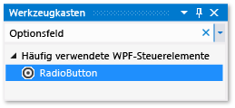  

2.  Fügen Sie auf der Entwurfsoberfläche zwei Optionsfeld-Steuerelemente hinzu, indem Sie auf das **Optionsfeld**-Element klicken und in das Fenster auf der Entwurfsoberfläche ziehen. Verschieben Sie die Schaltflächen (indem Sie darauf klicken und die Pfeiltasten drücken), sodass sie nebeneinander unter dem TextBlock-Steuerelement erscheinen.  

     Das Fenster sieht wie folgt aus:  

     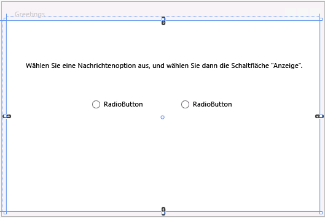  

3.  Ändern Sie im Fenster **Eigenschaften** für das Optionsfeld-Steuerelement im linken Bereich die Eigenschaft **Name** (die Eigenschaft im oberen Bereich des Fensters **Eigenschaften**) in **HelloButton**.  

       

4.  Ändern Sie im Fenster **Eigenschaften** für das rechte Optionsfeld-Steuerelement die Eigenschaft **Name** in **GoodbyeButton**, und speichern Sie dann die Änderungen.  

Sie können jetzt Anzeigetext für jedes RadioButton-Steuerelement hinzufügen. Die folgende Prozedur aktualisiert die Eigenschaft **Inhalt** für ein RadioButton-Steuerelement.  

#### <a name="to-add-display-text-for-each-radio-button"></a>Hinzufügen von Anzeigetext für jedes Optionsfeld  

1.  Öffnen Sie auf der Entwurfsoberfläche das Kontextmenü für „HelloButton“, indem Sie mit der rechten Maustaste auf „HelloButton“ klicken. Klicken Sie dann auf **Text bearbeiten**, und geben Sie anschließend „Hello“ ein.  

2.  Öffnen Sie auf der Entwurfsoberfläche das Kontextmenü für „GoodbyeButton“, indem Sie mit der rechten Maustaste auf „GoodbyeButton“ klicken. Klicken Sie dann auf **Text bearbeiten**, und geben Sie anschließend „Goodbye“ ein.  

### <a name="to-set-a-radio-button-to-be-checked-by-default"></a>Festlegen eines standardmäßig zu aktivierenden Optionsfelds  
In diesem Schritt legen Sie fest, dass „HelloButton“ standardmäßig aktiviert wird, sodass eins der beiden Optionsfelder immer aktiviert ist.  

Suchen Sie in der XAML-Ansicht das Markup für „HelloButton“ und fügen Sie ein **IsChecked**-Attribut hinzu:

```xaml
IsChecked="True"
```  

Das letzte Benutzeroberflächenelement, das Sie hinzufügen, ist ein [Button](/dotnet/framework/wpf/controls/button)-Steuerelement.  

#### <a name="to-add-the-button-control"></a>Hinzufügen eines Button-Steuerelements  

1.  Suchen Sie in der **Toolbox** nach dem **Schaltflächen**-Steuerelement, und fügen Sie es auf der Entwurfsoberfläche dem Optionsfeld-Steuerelement hinzu, indem Sie es in der Entwurfsansicht in das Formular ziehen.  

2.  Ändern Sie in der XAML-Ansicht den Wert von **Inhalt** für das Schaltflächen-Steuerelement von `Content="Button"` in `Content="Display"`. Speichern Sie dann die Änderungen.  

     Das Markup sollte in etwa dem folgenden Beispiel entsprechen:  
     `<Button Content="Display" HorizontalAlignment="Left" VerticalAlignment="Top" Width="75" Margin="215,204,0,0"/>`  

     Das Fenster sollte der folgenden Abbildung entsprechen.  

     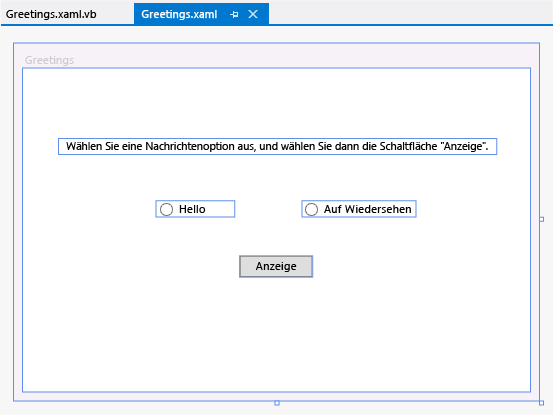  

### <a name="add-code-to-the-display-button"></a>Hinzufügen von Code zur Anzeigeschaltfläche  
Wenn die Anwendung ausgeführt wird, wird ein Meldungsfeld angezeigt, nachdem ein Benutzer zunächst ein Optionsfeld aktiviert und anschließend die Schaltfläche **Anzeigen** ausgewählt hat. Ein Meldungsfeld wird für die Begrüßung ("Hello") und ein anderes für die Verabschiedung ("Goodbye") angezeigt. Um dieses Verhalten zu erstellen, fügen Sie Code zum Button_Click-Ereignis in Greetings.xaml.vb oder in Greetings.xaml.cs hinzu.  

#### <a name="add-code-to-display-message-boxes"></a>Hinzufügen von Code zu Anzeigenmeldungsfeldern    
1.  Doppelklicken Sie auf der Entwurfsoberfläche auf die Schaltfläche **Anzeigen** .  

     Greetings.xaml.vb oder Greetings.xaml.cs wird geöffnet, der Cursor steht im Button_Click-Ereignis.

    ```vb  
    Private Sub Button_Click_1(sender As Object, e As RoutedEventArgs)  

    End Sub  
    ```    
    ```csharp  
    private void Button_Click_1(object sender, RoutedEventArgs e)  
    {  

    }  
    ```  

2.  Geben Sie den folgenden Code ein:  

    ```vb  
    If HelloButton.IsChecked = True Then  
        MessageBox.Show("Hello.")  
    ElseIf GoodbyeButton.IsChecked = True Then
        MessageBox.Show("Goodbye.")  
    End If  

    ```    
    ```csharp  
    if (HelloButton.IsChecked == true)
    {
         MessageBox.Show("Hello.");
    }
    else if (GoodbyeButton.IsChecked == true)
    {
        MessageBox.Show("Goodbye.");
    }
    ```  

3.  Speichern Sie die Anwendung.  

##  <a name="BKMK_DebugTest"></a> Debuggen und Testen der Anwendung  
Als Nächstes debuggen Sie die Anwendung, um nach Fehlern zu suchen und zu testen, ob beide Meldungsfelder ordnungsgemäß angezeigt werden. Die folgenden Anweisungen beschreiben, wie Sie den Debugger erstellen und starten. Lesen Sie jedoch später für weitere Informationen [Erstellen einer WPF-Anwendung (WPF)](/dotnet/framework/wpf/app-development/building-a-wpf-application-wpf) und [Debugging WPF](../debugger/debugging-wpf.md) .  

### <a name="find-and-fix-errors"></a>Suchen und Beheben von Fehlern  
In diesem Schritt finden Sie den Fehler, den Sie zuvor verursacht haben, indem Sie den Namen der Datei „MainWindow.xaml“ geändert haben.  

#### <a name="to-start-debugging-and-find-the-error"></a>Starten des Debugging und Suchen des Fehlers  

1.  Starten Sie den Debugger, indem Sie **Debuggen**, dann **Debugging starten**auswählen.  

     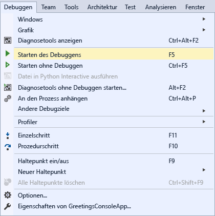  

     Ein **Unterbrechungsmodus**-Fenster erscheint, und das **Ausgabe**-Fenster deutet darauf hin, dass eine IOException aufgetreten ist: „Cannot locate resource 'mainwindow.xaml‘“ (Die Ressource „mainwindow.xaml“ kann nicht gefunden werden).  

2.  Beenden Sie den Debugger, indem Sie zuerst auf **Debuggen** und dann auf **Debuggen beenden** klicken.  

     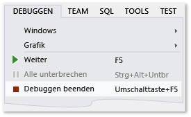  

Zu Beginn dieser exemplarischen Vorgehensweise wurde „Mainwindow.xaml“ in „Greetings.xaml“ umbenannt. Da der Code jedoch weiterhin auf „Mainwindow.xaml“ als Start-URI für die Anwendung verweist, kann das Projekt nicht gestartet werden.  

#### <a name="to-specify-greetingsxaml-as-the-startup-uri"></a>Angeben von Greetings.xaml als Start- URI  

1.  Öffnen Sie im **Projektmappen-Explorer** die Datei „App.xaml“ (im C#-Projekt) oder die Datei „Application.xaml“ (in Visual Basic-Projekten).  

2.  Ändern Sie `StartupUri="MainWindow.xaml"` zu `StartupUri="Greetings.xaml"`, und speichern Sie dann die Änderungen.  

Starten Sie den Debugger erneut (drücken Sie auf **F5**). Sie sollten das Greetings-Fenster der Anwendung sehen. Schließen Sie nun das Anwendungsfenster, um das Debuggen zu beenden.  

### <a name="to-debug-with-breakpoints"></a>Debuggen mit Haltepunkten  
Wenn Sie einige Haltepunkte hinzufügen, können Sie den Code während des Debuggens testen. Sie können Haltepunkte hinzufügen, indem Sie in der Menüleiste auf **Debuggen** und **Haltepunkt umschalten** klicken, indem Sie am linken Rand des Editors neben die Codezeile klicken, in der die Unterbrechung stattfinden soll, oder indem Sie **F9** drücken.  

#### <a name="to-add-breakpoints"></a>Hinzufügen von Haltepunkten  

1.  Öffnen Sie Greetings.xaml.vb oder Greetings.xaml.cs, und wählen Sie die folgende Zeile aus: `MessageBox.Show("Hello.")`  

2.  Fügen Sie einen Haltepunkt hinzu, indem Sie im Menü **Debuggen**und dann **Haltepunkt umschalten**auswählen.  

     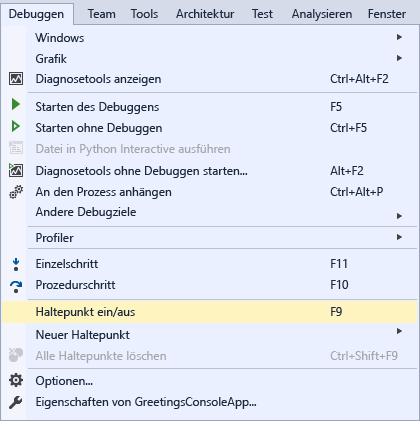  

     Am äußeren linken Rand des Editorfensters wird ein roter Kreis neben der Codezeile angezeigt.  

3.  Wählen Sie folgende Zeile aus: `MessageBox.Show("Goodbye.")`.  

4.  Drücken Sie die Taste **F9**, um einen Haltepunkt hinzuzufügen, und drücken Sie anschließend **F5**, um das Debuggen zu starten.  

5.  Aktivieren Sie im Fenster **Greetings** das Optionsfeld **Hello** , und wählen Sie dann die Schaltfläche **Anzeigen** aus.  

     Die Zeile wird `MessageBox.Show("Hello.")` gelb hervorgehoben. Am unteren Rand der IDE werden die Fenster "Auto", "Lokal" und "Überwachen" auf der linken Seite zusammengedockt, und die Fenster "Aufrufliste", "Haltepunkte", "Befehl", "Direkt" und "Ausgabe" werden auf der rechten Seite zusammengedockt.  

6.  Wählen Sie in der Menüleiste **Debuggen**die Option **Rücksprung**aus.  

     Die Anwendung wird weiter ausgeführt, und ein Meldungsfeld mit dem Wort „Hello“ wird angezeigt.  

7.  Wählen Sie die Schaltfläche **OK** im Meldungsfeld, um es zu schließen.  

8.  Aktivieren Sie im Fenster **Greetings** das Optionsfeld **Goodbye** , und wählen Sie dann die Schaltfläche **Anzeigen** aus.  

     Die Zeile wird `MessageBox.Show("Goodbye.")` gelb hervorgehoben.  

9. Drücken Sie die Taste **F5**, um das Debuggen fortzusetzen. Wenn das Meldungsfeld angezeigt wird, wählen Sie die Schaltfläche **OK** im Meldungsfeld, um es zu schließen.  

10. Schließen Sie das Anwendungsfenster, um das Debuggen zu beenden.  

11. Klicken Sie in der Menüleiste **Debuggen**auf **Alle Haltepunkte deaktivieren**.  

### <a name="build-a-release-version-of-the-application"></a>Version der Anwendung erstellen  
 Nachdem Sie überprüft haben, dass alles funktioniert, können Sie einen Releasebuild der Anwendung vorbereiten.  

#### <a name="to-clean-the-solution-files-and-build-a-release-version"></a>Bereinigen der Projektmappendateien und Erstellen einer Releaseversion  

1.  Klicken Sie im Hauptmenü auf **Erstellen**und **Projektmappe bereinigen**, um Zwischendateien und Ausgabedateien zu löschen, die bei vorherigen Builds erstellt wurden. Dies ist nicht erforderlich, bereinigt jedoch die Ausgaben des Builddebugvorgangs.  

     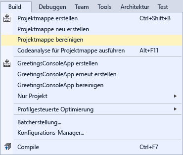  

2.  Ändern Sie die Build-Konfiguration für HelloWPFApp über das Dropdown-Steuerelement in der Symbolleiste (derzeit „Debug“) von **Debug** in **Release**.  

     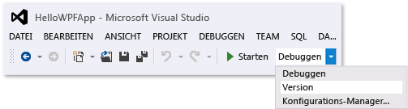  

3.  Erstellen Sie die Projektmappe, indem Sie zuerst auf **Erstellen** und dann auf **Projektmappe erstellen** klicken.  

       

Herzlichen Glückwunsch, Sie haben diese exemplarischen Vorgehensweise abgeschlossen! Sie finden die EXE-Datei, die Sie erstellt haben, in Ihrer Projektmappe und im Projektverzeichnis (...\HelloWPFApp\HelloWPFApp\bin\Release\\). Weitere Beispiele zum Durcharbeiten finden Sie unter [Visual Studio Samples](../ide/visual-studio-samples.md).  

## <a name="see-also"></a>Siehe auch
[Neues in Visual Studio 2017](../ide/whats-new-in-visual-studio.md)   
[Get Started Developing with Visual Studio (Erste Schritte bei der Entwicklung mit Visual Studio)](../ide/get-started-developing-with-visual-studio.md)   
[Produktivitätstipps](../ide/productivity-tips-for-visual-studio.md)
