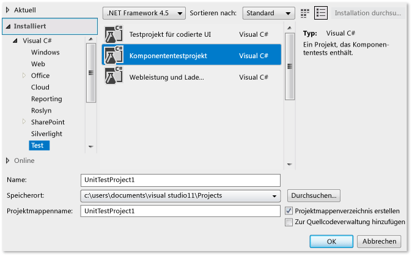
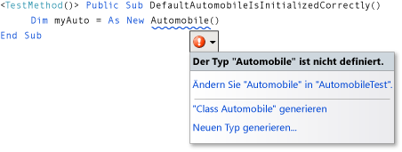
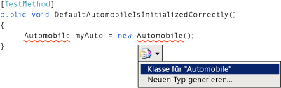
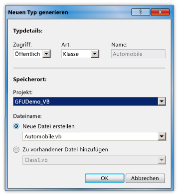
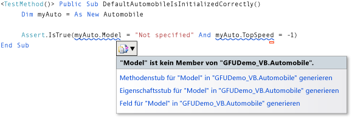
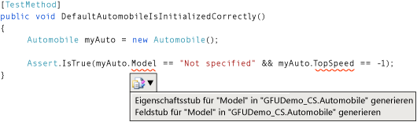
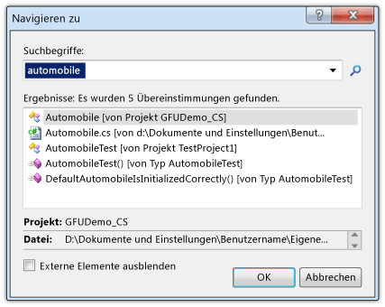
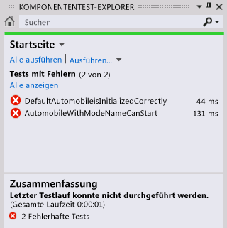
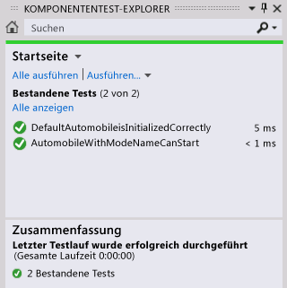

# Exemplarische Vorgehensweise: Test-First-Unterstützung mit der Funktion „Generate From Usage“
In diesem Thema wird die Verwendung der [Generate From Usage](../ide/visual-csharp-intellisense.md#generate-from-usage)-Funktion veranschaulicht, die die Test-First-Entwicklung unterstützt.  
  
 Die*testgetriebene Entwicklung* ist eine Methode des Softwareentwurfs, bei der zuerst Unittests basierend auf Produktspezifikationen und dann der Quellcode geschrieben wird, der erforderlich ist, damit die Tests erfolgreich ausgeführt werden. [!INCLUDE[vsprvs](../code-quality/includes/vsprvs_md.md)] unterstützt die testgetriebene Entwicklung, indem neue Typen und Member im Quellcode generiert werden, sowie Sie sie in Ihren Testfällen auf diese verweisen, noch bevor sie definiert werden.  
  
 [!INCLUDE[vsprvs](../code-quality/includes/vsprvs_md.md)] generiert die neuen Typen und Member mit nur minimaler Unterbrechung des Workflows. Sie können Stubs für Typen, Methoden, Eigenschaften, Felder oder Konstruktoren erstellen, ohne die aktuelle Position im Code zu verlassen. Wenn Sie ein Dialogfeld zum Angeben von Optionen für die Typgenerierung öffnen, kehrt der Fokus sofort zur aktuell geöffneten Datei zurück, wenn das Dialogfeld geschlossen wird.  
  
 Die Funktion "Aus Verwendung generieren" kann mit Testframeworks verwendet werden, die in [!INCLUDE[vsprvs](../code-quality/includes/vsprvs_md.md)]integriert werden können. In diesem Thema wird das Microsoft-Unittestframework veranschaulicht.  
  
 [!INCLUDE[note_settings_general](../data-tools/includes/note_settings_general_md.md)]  
  
### So erstellen Sie ein Projekt für eine Windows-Klassenbibliothek und ein Testprojekt  
  
1.  Erstellen Sie in [!INCLUDE[csprcs](../data-tools/includes/csprcs_md.md)] oder [!INCLUDE[vbprvb](../code-quality/includes/vbprvb_md.md)]ein neues Projekt für eine Windows-Klassenbibliothek. Nennen Sie es `GFUDemo_VB` oder `GFUDemo_CS`, je nachdem, welche Sprache Sie verwenden.  
  
2.  Klicken Sie im **Projektmappen-Explorer**mit der rechten Maustaste oben auf das Projektmappen-Symbol, zeigen Sie auf **Hinzufügen**, und klicken Sie dann auf **Neues Projekt**. Klicken Sie im Dialogfeld **Neues Projekt** links im Bereich **Projekttypen** auf **Test**.  
  
3.  Klicken Sie im Bereich **Vorlagen** auf **Unittestprojekt** , und übernehmen Sie den Standardnamen "UnitTestProject1". Die folgende Abbildung zeigt das Dialogfeld, wenn es in [!INCLUDE[csprcs](../data-tools/includes/csprcs_md.md)]geöffnet wird. In [!INCLUDE[vbprvb](../code-quality/includes/vbprvb_md.md)] sieht das Dialogfeld ähnlich aus.  
  
       
Dialogfeld "Neues Projekt"  
  
4.  Klicken Sie auf **OK** , um das Dialogfeld **Neues Projekt** zu schließen.

5.  Klicken Sie im **Projektmappen-Explorer** mit der rechten Maustaste auf den Eintrag **Verweise**, und klicken Sie dann auf **Verweis hinzufügen**.

6.  Wählen Sie im Dialogfeld **Verweis-Manager** die Option **Projekte** und dann das Komponententestprojekt aus.

7.  Klicken Sie auf **OK**, um das Dialogfeld **Verweis-Manager** zu schließen.

8.  Fügen Sie in der Datei **Class1** direkt nach der letzten vorhandenen **using**-Anweisung eine **using**-Anweisung für das Testprojekt ein:

    * In Visual Basic fügen Sie `Using UnitTestProject1` hinzu.
    
    * In C# fügen Sie `using UnitTestProject1;` hinzu.
    
9.  Speichern Sie die Projektmappe. Sie können nun mit dem Schreiben von Tests beginnen.  
  
### So generieren Sie aus einem Unittest eine neue Klasse  
  
1.  Das Testprojekt enthält eine Datei mit dem Namen "UnitTest1". Doppelklicken Sie auf diese Datei im **Projektmappen-Explorer** , um sie im Code-Editor zu öffnen. Eine Testklasse und eine Testmethode wurden generiert.  
  
2.  Suchen Sie die Deklaration für die Klasse `UnitTest1` , und benennen Sie sie um in `AutomobileTest`. Benennen Sie sie in C# bei Vorhandensein eines `UnitTest1()` -Konstruktors um in `AutomobileTest()`.  
  
    > [!NOTE]
    >  IntelliSense bietet jetzt zwei Alternativen für die IntelliSense-Anweisungsvervollständigung: *Beendigungsmodus* und *Vorschlagsmodus*. Verwenden Sie den Vorschlagsmodus für Situationen, in denen Klassen und Member verwendet werden, bevor sie definiert werden. Um bei geöffnetem IntelliSense-Fenster zwischen Beendigungsmodus und Vorschlagsmodus zu wechseln, drücken Sie STRG+ALT+LEERTASTE. Weitere Informationen finden Sie unter [Using IntelliSense](../ide/using-intellisense.md) . Der Vorschlagsmodus ist hilfreich, wenn Sie im nächsten Schritt `Automobile` eingeben.  
  
3.  Suchen Sie die `TestMethod1()` -Methode, und benennen Sie sie um in `DefaultAutomobileIsInitializedCorrectly()`. Erstellen Sie innerhalb dieser Methode eine neue Instanz einer Klasse namens `Automobile`, wie in den folgenden Abbildungen dargestellt. Eine wellenförmige Unterstreichung wird angezeigt, die auf einen Fehler während der Kompilierung hinweist, und unter dem Typnamen wird ein Smarttag angezeigt. Die genaue Position des Smarttags variiert abhängig davon, ob Sie [!INCLUDE[vbprvb](../code-quality/includes/vbprvb_md.md)] oder [!INCLUDE[csprcs](../data-tools/includes/csprcs_md.md)] verwenden.  
  
       
Visual Basic  
  
       
Visual C#  
  
4.  Halten Sie den Mauszeiger auf dem Smarttag, um eine Fehlermeldung anzuzeigen, die besagt, dass noch kein Typ mit dem Namen `Automobile` definiert wurde. Klicken Sie auf das Smarttag, oder drücken Sie STRG+. (STRG+Punkt), um das Kontextmenü "Aus Verwendung generieren" zu öffnen, wie in den folgenden Abbildungen dargestellt.  
  
       
Visual Basic  
  
       
Visual C#  
  
5.  Sie haben nun zwei Möglichkeiten: Sie können auf **“Class Automobile“ generieren** klicken, um eine neue Datei im Testprojekt zu erstellen und diese mit einer leeren Klasse mit dem Namen `Automobile`aufzufüllen. Dies ist eine schnelle Möglichkeit, um eine neue Klasse in einer neuen Datei mit standardmäßigen Zugriffsmodifizierern im aktuellen Projekt zu erstellen. Sie können auch auf **Neuen Typ generieren** klicken, um das Dialogfeld **Neuen Typ generieren** zu öffnen. Dies bietet Optionen wie das Platzieren der Klasse in einer vorhandenen Datei und das Hinzufügen der Datei zu einem anderen Projekt.  
  
     Klicken Sie auf **Neuen Typ generieren** , um das Dialogfeld **Neuen Typ generieren** zu öffnen, das in der folgenden Abbildung dargestellt ist. Klicken Sie in der Liste **Projekt** auf **GFUDemo_VB** oder **GFUDemo_CS** , um [!INCLUDE[vsprvs](../code-quality/includes/vsprvs_md.md)] anzuweisen, die Datei statt dem Testprojekt dem Quellcodeprojekt hinzuzufügen.  
  
       
Dialogfeld "Neuen Typ generieren"  
  
6.  Klicken Sie auf **OK** , um das Dialogfeld zu schließen und die neue Datei zu erstellen.  
  
7.  Überprüfen Sie im **Projektmappen-Explorer**unter dem Projektknoten "GFUDemo_VB" oder "GFUDemo_CS", ob die neue Datei "Automobile.vb" oder "Automobile.cs" vorhanden ist. Im Code-Editor befindet sich der Fokus nach wie vor in `AutomobileTest.DefaultAutomobileIsInitializedCorrectly`. Sie können mit dem Schreiben des Tests bei minimaler Unterbrechung fortfahren.  
  
### So generieren Sie einen Eigenschaftsstub  
  
1.  Angenommen, die Produktspezifikation gibt an, dass die `Automobile` -Klasse über zwei öffentliche Eigenschaften namens `Model` und `TopSpeed`verfügt. Diese Eigenschaften müssen mit den Standardwerten von `"Not specified"` und `-1` durch den Standardkonstruktor initialisiert werden. Im folgenden Unittest wird überprüft, ob der Standardkonstruktor die Eigenschaften auf ihre richtigen Standardwerte festlegt.  
  
     Fügen Sie `DefaultAutomobileIsInitializedCorrectly`folgende Codezeile hinzu.  
  
     [!code-cs[VbTDDWalkthrough#1](../ide/codesnippet/CSharp/walkthrough-test-first-support-with-the-generate-from-usage-feature_1.cs)]  [!code-vb[VbTDDWalkthrough#1](../ide/codesnippet/VisualBasic/walkthrough-test-first-support-with-the-generate-from-usage-feature_1.vb)]  
  
     Da der Code auf zwei nicht definierte Eigenschaften in `Automobile`verweist, wird ein Smarttag angezeigt. Klicken Sie auf das Smarttag für `Model` , und klicken Sie dann auf **Eigenschaftsstub generieren**. Generieren Sie auch einen Eigenschaftsstub für die `TopSpeed` -Eigenschaft.  
  
     In der `Automobile` -Klasse werden die Typen der neuen Eigenschaften ordnungsgemäß aus dem Kontext abgeleitet.  
  
     Die folgende Abbildung zeigt das Kontextmenü des Smarttags.  
  
       
Visual Basic  
  
       
Visual C#  
  
### So finden Sie den Quellcode  
  
1.  Verwenden Sie die Funktion **Navigieren zu** , um zur Quellcodedatei "Automobile.cs" oder "Automobile.vb" zu navigieren, damit Sie überprüfen können, ob die neuen Eigenschaften generiert wurden.  
  
     Die Funktion **Navigieren zu** ermöglicht Ihnen, schnell eine Textzeichenfolge einzugeben, z. B. einen Typnamen oder einen Teil des Namens, und durch Klicken auf das Element in der Ergebnisliste zu der gewünschten Position zu wechseln.  
  
     Öffnen Sie das Dialogfeld **Navigieren zu** , indem Sie im Code-Editor klicken und STRG+, (STRG+Komma) drücken. Geben Sie in das Textfeld `automobile`ein. Klicken Sie in der Liste auf die Klasse **Automobile** , und klicken Sie dann auf **OK**.  
  
     Das Fenster **Navigieren zu** wird in der folgenden Abbildung gezeigt.  
  
       
Fenster "Navigieren zu"  
  
### So generieren Sie einen Stub für einen neuen Konstruktor  
  
1.  In dieser Testmethode generieren Sie einen Konstruktorstub, der die Eigenschaften `Model` und `TopSpeed` initialisiert, damit diese von Ihnen angegebene Werte aufweisen. Später fügen Sie weiteren Code hinzu, um den Test abzuschließen. Fügen Sie die folgende zusätzliche Testmethode zur `AutomobileTest` -Klasse hinzu.  
  
     [!code-cs[VbTDDWalkthrough#2](../ide/codesnippet/CSharp/walkthrough-test-first-support-with-the-generate-from-usage-feature_2.cs)]  [!code-vb[VbTDDWalkthrough#2](../ide/codesnippet/VisualBasic/walkthrough-test-first-support-with-the-generate-from-usage-feature_2.vb)]  
  
2.  Klicken Sie auf das Smarttag unter dem neuen Klassenkonstruktor, und klicken Sie dann auf **Konstruktorstub generieren**. In der `Automobile` -Klassendatei hat der neue Konstruktor die Namen der lokalen Variablen geprüft, die im Konstruktoraufruf verwendet werden, Eigenschaften gefunden, die die gleichen Namen in der `Automobile` -Klasse aufweisen, und Code im Konstruktortext zum Speichern der Argumentwerte in den Eigenschaften `Model` und `TopSpeed` bereitgestellt. (In [!INCLUDE[vbprvb](../code-quality/includes/vbprvb_md.md)]sind die Felder `_model` und `_topSpeed` im neuen Konstruktor implizit definierte Unterstützungsfelder für die Eigenschaften `Model` und `TopSpeed` .)  
  
3.  Nachdem Sie den neuen Konstruktor generiert haben, wird eine wellenförmige Unterstreichung unter dem Aufruf des Standardkonstruktors in `DefaultAutomobileIsInitializedCorrectly`angezeigt. Die Fehlermeldung gibt an, dass die `Automobile` -Klasse über keinen Konstruktor verfügt, der keine Argumente annimmt. Um einen expliziten Standardkonstruktor zu generieren, der nicht über Parameter verfügt, klicken Sie auf das Smarttag, und klicken Sie dann auf **Konstruktorstub generieren**.  
  
### So generieren Sie einen Stub für eine Methode  
  
1.  Angenommen, die Spezifikation gibt an, dass ein neues `Automobile` in einen Ausführzustand gesetzt werden kann, wenn die zugehörigen Eigenschaften `Model` und `TopSpeed` auf andere als die Standardwerte festgelegt werden. Fügen Sie der `AutomobileWithModelNameCanStart` -Methode die folgenden Zeilen hinzu.  
  
     [!code-cs[VbTDDWalkthrough#3](../ide/codesnippet/CSharp/walkthrough-test-first-support-with-the-generate-from-usage-feature_3.cs)]  [!code-vb[VbTDDWalkthrough#3](../ide/codesnippet/VisualBasic/walkthrough-test-first-support-with-the-generate-from-usage-feature_3.vb)]  
  
2.  Klicken Sie auf das Smarttag für den `myAuto.Start` -Methodenaufruf, und klicken Sie dann auf **Methodenstub generieren**.  
  
3.  Klicken Sie auf das Smarttag für die `IsRunning` -Eigenschaft, und klicken Sie dann auf **Eigenschaftsstub generieren**. Die `Automobile` -Klasse beinhaltet nun folgenden Code:  
  
     [!code-cs[VbTDDWalkthrough#4](../ide/codesnippet/CSharp/walkthrough-test-first-support-with-the-generate-from-usage-feature_4.cs)]  [!code-vb[VbTDDWalkthrough#4](../ide/codesnippet/VisualBasic/walkthrough-test-first-support-with-the-generate-from-usage-feature_4.vb)]  
  
### So führen Sie die Tests aus  
  
1.  Zeigen Sie im Menü **Unittest** auf **Unittests ausführen**, und klicken Sie dann auf **Alle Tests**. Mit diesem Befehl werden alle Tests in sämtlichen Testframeworks ausgeführt, die für die aktuelle Projektmappe geschrieben werden.  
  
     In diesem Fall sind zwei Tests vorhanden, und beide schlagen erwartungsgemäß fehl. Der `DefaultAutomobileIsInitializedCorrectly` -Test schlägt fehl, weil die `Assert.IsTrue` -Bedingung `False`zurückgibt. Der `AutomobileWithModelNameCanStart` -Test schlägt fehl, weil die `Start` -Methode in der `Automobile` -Klasse eine Ausnahme auslöst.  
  
     Das Fenster **Testergebnisse** wird in der folgenden Abbildung gezeigt.  
  
       
Testergebnisse (Fenster)  
  
2.  Doppelklicken Sie im Fenster **Testergebnisse** auf jede Testergebniszeile, um zur Position der einzelnen Testfehler zu gelangen.  
  
### So implementieren Sie den Quellcode  
  
1.  Fügen Sie den folgenden Code dem Standardkonstruktor hinzu, sodass die Eigenschaften `Model`, `TopSpeed` und `IsRunning` mit den richtigen Standardwerten von `"Not specified"`, `-1`, und `True` (`true`) initialisiert werden.  
  
     [!code-cs[VbTDDWalkthrough#5](../ide/codesnippet/CSharp/walkthrough-test-first-support-with-the-generate-from-usage-feature_5.cs)]  [!code-vb[VbTDDWalkthrough#5](../ide/codesnippet/VisualBasic/walkthrough-test-first-support-with-the-generate-from-usage-feature_5.vb)]  
  
2.  Wenn die `Start` -Methode aufgerufen wird, sollte das `IsRunning` -Flag nur auf "true" festgelegt werden, wenn die Eigenschaft `Model` oder `TopSpeed` auf einen anderen als den Standardwert festgelegt sind. Entfernen Sie die `NotImplementedException` aus dem Methodentext, und fügen Sie den folgenden Code hinzu.  
  
     [!code-cs[VbTDDWalkthrough#6](../ide/codesnippet/CSharp/walkthrough-test-first-support-with-the-generate-from-usage-feature_6.cs)]  [!code-vb[VbTDDWalkthrough#6](../ide/codesnippet/VisualBasic/walkthrough-test-first-support-with-the-generate-from-usage-feature_6.vb)]  
  
### So führen Sie die Tests erneut aus  
  
1.  Zeigen Sie im Menü **Test** auf **Ausführen**, und klicken Sie dann auf **Alle Tests in der Projektmappe**. Dieses Mal werden die Tests bestanden. Das Fenster **Testergebnisse** wird in der folgenden Abbildung gezeigt.  
  
       
Testergebnisse (Fenster)  
  
## Siehe auch  
 [Aus Verwendung generieren](../ide/visual-csharp-intellisense.md#generate-from-usage)   
 [Schreiben von Code](../ide/writing-code-in-the-code-and-text-editor.md)   
 [Verwenden von IntelliSense](../ide/using-intellisense.md)   
 [Komponententest für Code](../test/unit-test-your-code.md)
