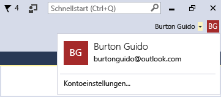

# Arbeiten mit mehreren Benutzerkonten

Wenn Sie mehrere Microsoft-Konten und/oder Geschäfts- oder Schulkonten haben, können Sie all diese Konten zu Visual Studio hinzufügen, sodass Sie über jedes Konto auf die Ressourcen zugreifen können, ohne sich separat anmelden zu müssen. Für Azure, Application Insights, Azure DevOps und Office 365 wird die optimierte Anmeldung unterstützt.

Wenn Sie auf einem Computer mehrere Benutzerkonten hinzufügen, sind diese Konten auch dann verfügbar, wenn Sie sich auf einem anderen Computer bei Visual Studio anmelden.

> [!NOTE]
> Es werden zwar die Namen der Konten übernommen, jedoch nicht die Anmeldeinformationen. Sie werden aufgefordert, die Anmeldeinformationen für die anderen Konten einzugeben, wenn Sie zum ersten Mal versuchen, die dazugehörigen Ressourcen auf einem neuen Computer zu verwenden.

In diesem Artikel erfahren Sie, wie Sie mehrere Konten zu Visual Studio hinzufügen können. Außerdem wird erläutert, wie Sie die über diese Konten zugänglichen Ressourcen an Stellen wie dem Dialogfeld **Verbundenen Dienst hinzufügen**, im **Server-Explorer** und im **Team Explorer** abrufen können.

## Anmelden bei Visual Studio

Melden Sie sich mit einem Microsoft-Konto oder einem Unternehmenskonto bei Visual Studio an. Ihr Benutzername sollte oben im Fenster angezeigt werden, etwa folgendermaßen:

### Zugreifen auf Ihr Azure-Konto in Server-Explorer

Drücken Sie **Strg**+**Alt**+**S**, um **Server-Explorer** zu öffnen. Erweitern Sie den Knoten **Azure**. Dann sollten Ihnen die in dem Azure-Konto verfügbaren Ressourcen angezeigt werden, die dem Konto zugeordnet sind, das Sie zur Anmeldung in Visual Studio verwendet haben. Dies sollte in etwa wie folgt aussehen:

Wenn Sie Visual Studio auf einem bestimmten Gerät zum ersten Mal verwenden, zeigt das Dialogfeld nur die Abonnements an, die unter dem Konto registriert sind, mit dem Sie sich angemeldet haben. Auf die Ressourcen Ihrer anderen Konten können Sie direkt über den **Server-Explorer** zugreifen, indem Sie mit der rechten Maustaste auf den **Azure**-Knoten klicken, **Manage and Filter Subscriptions** (Abonnements verwalten und filtern) auswählen und Ihre Konten über das Steuerelement zur Kontoauswahl hinzufügen. Um ein anderes Konto auszuwählen, klicken Sie auf den Pfeil nach unten, und wählen Sie das gewünschte Konto aus der Liste aus. Wenn Sie das Konto ausgewählt haben, können Sie bearbeiten, welche Abonnements dieses Kontos im **Server-Explorer** angezeigt werden sollen.

Wenn Sie den **Server-Explorer** dann das nächste Mal öffnen, werden die Ressourcen für dieses Abonnement angezeigt.

### Zugreifen auf Ihr Azure-Konto über das Dialogfeld "Verbundenen Dienst hinzufügen"

1. Wählen Sie ein bereits vorhandenes Projekt aus, oder erstellen Sie ein neues.

1. Wählen Sie im **Projektmappen-Explorer** den Projektknoten aus, und klicken Sie anschließend mit der rechten Maustaste auf **Hinzufügen** > **Verbundener Dienst**.

   Dann wird im Assistenten **Verbundenen Dienst hinzufügen** die Liste der Dienste in dem Azure-Konto angezeigt, das mit Ihrem Visual Studio-Personalisierungskonto verknüpft ist. Sie müssen sich nicht separat bei Azure anmelden. Allerdings müssen Sie sich beim ersten Versuch, von einem anderen Computer auf die Ressourcen eines anderen Kontos zuzugreifen, bei diesem Konto anmelden.

### Zugreifen auf Azure Active Directory in einem Webprojekt

Azure Active Directory (Azure AD) unterstützt das einmalige Anmelden für Endbenutzer in MVC-Webanwendungen in ASP.NET oder die AD-Authentifizierung in Web-API-Diensten. Die Domänenauthentifizierung unterscheidet sich von der Authentifizierung einzelner Benutzerkonten. Benutzer, die Zugriff auf Ihre Azure AD-Domäne haben, können ihre bereits vorhandenen Azure AD-Konten verwenden, um eine Verbindung mit Ihren Webanwendung herzustellen. Auch Office 365-Anwendungen können die Domänenauthentifizierung verwenden.

Um dies in Aktion zu sehen, erstellen Sie ein neues Projekt **ASP.NET-Webanwendung**. Wählen Sie im Dialogfeld **Neues ASP.NET-Projekt** die Option **Authentifizierung ändern** aus. Der Authentifizierungsassistent wird angezeigt und ermöglicht es Ihnen, die Art der Authentifizierung in Ihrer Anwendung auszuwählen.

Weitere Informationen über die verschiedenen Authentifizierungsarten in ASP.NET finden Sie unter [Create ASP.NET web projects in Visual Studio (Erstellen von ASP.NET-Webprojekten in Visual Studio)](/aspnet/visual-studio/overview/2013/creating-web-projects-in-visual-studio#authentication-methods).

### Zugreifen auf Ihre Azure DevOps-Organisation

Klicken Sie im Hauptmenü auf **Team** > **Verbindungen verwalten**, um das Fenster **Team Explorer - Connect** (Team Explorer – Verbinden) zu öffnen. Klicken Sie auf **Verbindungen verwalten** > **Verbindung mit einem Projekt herstellen**. Wählen Sie im Dialogfeld **Verbindung mit einem Projekt herstellen** ein Projekt aus der Liste aus, oder klicken Sie auf **TFS-Server hinzufügen**, und geben Sie die URL zu Ihrem Server ein. Wenn Sie eine URL auswählen, werden Sie angemeldet, ohne Ihre Anmeldeinformationen erneut eingeben zu müssen.

Weitere Informationen finden Sie unter [Herstellen einer Verbindung mit Projekten im Team Explorer](connect-team-project.md).

## Hinzufügen eines weiteren Kontos zu Visual Studio

Gehen Sie wie folgt vor, um ein weiteres Konto zu Visual Studio hinzuzufügen:

1. Klicken Sie auf **Datei** > **Kontoeinstellungen**.

1. Klicken Sie unter **Alle Konten** auf **Konto hinzufügen**.

1. Wählen Sie auf der Seite **Bei Ihrem Konto anmelden** das entsprechende Konto aus, oder klicken Sie auf **Anderes Konto verwenden**. Folgen Sie den Anweisungen, um die neuen Anmeldeinformationen für das Konto einzugeben.

(Optional) Wenn Sie jetzt zum **Server-Explorer** wechseln, werden die Azure-Dienste angezeigt, die dem Konto zugeordnet sind, das Sie gerade hinzugefügt haben. Klicken Sie im **Server-Explorer** erst mit der rechten Maustaste auf den **Azure**-Knoten und anschließend mit der linken auf **Manage and Filter Subscriptions** (Abonnements verwalten und filtern). Wählen Sie das neue Konto durch Klicken auf den Dropdownpfeil neben dem aktuellen Konto aus, und wählen Sie dann aus, welche Abonnements Sie im **Server-Explorer** anzeigen möchten. Es sollten alle Dienste angezeigt werden, die dem angegebenen Abonnement zugeordnet sind. Auch wenn Sie mit dem zweiten Konto gerade nicht bei Visual Studio angemeldet sind, sind Sie bei den Diensten und Ressourcen dieses Kontos angemeldet. Dies gilt auch für **Projekt** > **Verbundenen Dienst hinzufügen** und **Team** > **Verbindung mit Team Foundation Server herstellen**.

### Hinzufügen eines Kontos mithilfe eines Gerätecodeflows

Manchmal kann es vorkommen, dass Sie sich nicht wie gewöhnlich anmelden oder ein Konto hinzufügen können. Dieser Fall kann eintreten, wenn der Internet Explorer aus einem beliebigen Grund blockiert wird oder sich das Netzwerk hinter einer Firewall befindet. Sie können dies umgehen, indem Sie die Option *device code flow* (Gerätecodeflow) aktivieren, um ein Konto hinzuzufügen oder ein Konto neu zu authentifizieren. Über den Gerätecodeflow können Sie sich in einem anderen Browser oder auf einem anderen Computer anmelden. Sie können dafür entweder einen physischen oder einen virtuellen Computer verwenden.

Gehen Sie wie folgt vor, um sich über den Gerätecodeflow anzumelden:

1. Öffnen Sie die Seite [**Konten**](reference/accounts-environment-options-dialog-box.md) unter **Extras** > **Optionen** > **Umgebung**, und wählen Sie die Option **Enable device code flow when adding or re-authenticating an account** (Gerätecodeflow beim Hinzufügen oder erneutem Authentifizieren eines Kontos aktivieren) aus. Klicken Sie auf **OK**, um die Seite „Optionen“ zu schließen.

1. Klicken Sie auf **Datei** > **Kontoeinstellungen**, um die Seite „Kontoverwaltung“ zu öffnen.

1. Klicken Sie unter **Alle Konten** auf **Konto hinzufügen**.

   In einem Dialogfeld werden eine URL und ein Code angezeigt, den Sie in einen Webbrowser einfügen können.

   

1. Drücken Sie **STRG**+**C**, um den Text aus dem Dialogfeld zu kopieren, und klicken Sie anschließend auf **OK**, um dieses zu schließen. Fügen Sie den kopierten Text z. B. in Editor ein. Dadurch wird es im nächsten Schritt einfacher, den Code zu kopieren.

1. Navigieren Sie zu der URL für die Geräteanmeldung auf dem Computer oder dem Webbrowser, den Sie zur Anmeldung bei Visual Studio verwenden möchten. Fügen oder geben Sie den kopierten Code anschließend in das Feld **Code** ein.

   Dann sollte der App-Name für **Visual Studio** weiter unten auf der Seite angezeigt werden.

1. Klicken Sie unter **Visual Studio** auf **Weiter**.

   

1. Folgen Sie den Anweisungen, um Ihre Anmeldeinformationen für das Konto einzugeben.

   Dann wird eine Seite angezeigt, auf der die Anmeldung bei Visual Studio auf Ihrem Gerät bestätigt wird. Daraufhin können Sie das Browserfenster schließen.

   

1. Kehren Sie zurück zur Seite „Kontoverwaltung“ in Visual Studio. Dann sollten die neu hinzugefügten Konten unter **Alle Konten** aufgeführt werden. Klicken Sie auf **Schließen**.

## Siehe auch

- [Anmelden bei Visual Studio](signing-in-to-visual-studio.md)
- [Anmelden bei Visual Studio für Mac](/visualstudio/mac/signing-in)
