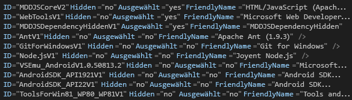

# Gewusst wie: Erstellen und Ausf&#252;hren einer unbeaufsichtigten Installation von Visual Studio
[!INCLUDE[vs2017banner](../code-quality/includes/vs2017banner.md)]

Sie können die Installationsanwendung für [!INCLUDE[vsprvs](../code-quality/includes/vsprvs_md.md)] als unbeaufsichtigte Installation \(d. h. benutzerdefinierte automatische Installation\) über ein Intranet anstatt von Medien wie DVDs ausführen. In diesem Thema wird erläutert, wie [!INCLUDE[vsprvs](../code-quality/includes/vsprvs_md.md)] auf die Installation von einer Netzwerkfreigabe vorbereitet wird.  
  
## Erstellen eines Netzwerkabbilds  
 Erstellen Sie zuerst ein Netzwerkabbild der [!INCLUDE[vsprvs](../code-quality/includes/vsprvs_md.md)]\-Medien.  
  
#### So erstellen Sie ein Netzwerkabbild  
  
1.  Erstellen Sie einen Ordner auf dem Server \(z. B. „*Laufwerk*:\\IDEinstall\\“\).  
  
2.  Führen Sie einen der folgenden Schritte aus:  
  
    -   Laden Sie den Web\-Bootstrapper herunter, und führen Sie dann „*Product*.exe \/Layout *Laufwerk*:\\IDEinstall\\“ aus.  
  
         ODER  
  
    -   Kopieren Sie den Inhalt der Medien für Visual Studio in den Ordner IDEinstall. Nachdem Sie den Inhalt kopiert haben, müssen Sie noch Software von Drittanbietern herunterladen, die Sie installieren möchten.  
  
3.  Geben Sie den Ordner IDEinstall im Netzwerk frei, und legen Sie die entsprechenden Sicherheitseinstellungen fest.  
  
     Der Netzwerkpfad der Installationsanwendung für [!INCLUDE[vsprvs](../code-quality/includes/vsprvs_md.md)] entspricht „\\\\*ServerName*\\IDEinstall\\*Product*.exe“.  
  
    > [!NOTE]
    >  Die Installation schlägt möglicherweise fehl, wenn eine Pfad\- und Dateinamenkombination 260 Zeichen überschreitet. Die maximale Länge eines Pfads in [!INCLUDE[vsprvs](../code-quality/includes/vsprvs_md.md)] beträgt 221 Zeichen.  Der Name des lokalen Pfads sollte 70 Zeichen nicht überschreiten, und der Name des Netzwerkpfads sollte 39 Zeichen nicht überschreiten.  
  
     Bei der Installation treten möglicherweise auch dann Fehler auf, wenn die Ordnernamen im Pfad eingebettete Leerzeichen aufweisen \(beispielsweise „\\\\*ServerName*\\IDE install“ oder „\\\\*ServerName*\\Visual Studio\\\)“.  
  
## Bereitstellen von Visual Studio im unbeaufsichtigten Modus  
 Zum Bereitstellen von [!INCLUDE[vsprvs](../code-quality/includes/vsprvs_md.md)] im unbeaufsichtigten Modus müssen Sie die Datei „AdminDeployment.xml“ ändern. Dafür müssen Sie die Datei „AdminDeployment.xml“ erstellen, indem Sie den Befehlszeilenparameter `/CreateAdminFile <Dateispeicherort>` verwenden. Mit dieser Datei können Sie dann entweder eine Bereitstellung von Visual Studio mithilfe von Push in das Netzwerk übertragen oder die Datei mithilfe von Pull in eine Installation übertragen, wenn Sie die Datei in das Verzeichnis "*Laufwerk*:\\IDEinstall\\packages" einfügen. Die Datei AdminDeployment.xml ist nicht spezifisch für ein Betriebssystem, eine Architektur, eine Edition von Visual Studio oder eine Betriebssystemsprache.  
  
> [!CAUTION]
>  In manchen Fällen werden Elemente, die in der Datei "AdminDeployment.xml" als ausgewählt aufgeführt sind, nicht installiert. Um dieses Problem zu beheben, platzieren sie die mit "Selected\="yes"" markierten Elemente am **Ende** der Datei "AdminDeployment.xml".  
>   
>  Wenn Sie die optionalen Abhängigkeiten eines Elements nicht installieren möchten, müssen Sie zuerst das übergeordnete Element auswählen und dann die Auswahl der optionalen Abhängigkeiten nach dem übergeordneten Element aufheben, wie im folgenden Screenshot gezeigt:  
>   
>    
>   
>  Eine weitere Möglichkeit besteht darin, die optionalen untergeordneten Elemente eines übergeordneten Elements einfach auszuschließen, d. h., keine mit "Selected\="no"" markierten Elemente einzuschließen. Allerdings müssen alle Elemente mit "Selected\="yes"" weiterhin am Ende der Datei "AdminDeployment.xml" platziert werden.  
  
> [!IMPORTANT]
>  Während der Installation startet der Computer möglicherweise mehrere Male erneut. Nach dem Neustart müssen Sie zum Ausführen der Installation sich wieder mit demselben Benutzerkonto anmelden, mit dem Sie angemeldet waren, bevor der Computer neu gestartet wurde. Automatische Neustarts können vermieden werden, indem die erforderlichen Komponenten vor dem Ausführen einer unbeaufsichtigten Installation vorinstalliert werden. Weitere Informationen finden Sie im Abschnitt: "Vermeiden eines Neustarts während des Setups" im [Administratorhandbuch für Visual Studio](../install/visual-studio-administrator-guide.md).  
  
 Das AdminDeployment\-Dateischema enthält die folgenden Elemente:  
  
|Element|Attribut|Werte|Beschreibung|  
|-------------|--------------|-----------|------------------|  
|BundleCustomizations|TargetDir|*Pfad*|Identisches Verhalten wie beim Überschreiben eines Pfades in der Benutzeroberfläche der Installationsanwendung. Dieses Element wird ignoriert, wenn Visual Studio bereits installiert ist.|  
|BundleCustomizations|NoWeb|ja&#124;Standard|Wenn der Wert dieses Elements "Ja" lautet, versucht die Installationsanwendung nie, während der Setupaktion ins Internet zu wechseln.|  
|SelectableItemCustomization|Hidden|Ja&#124;Nein|Wenn der Wert dieses Elements "Ja" lautet, wird ein wählbares Element in der Anpassungsstruktur ausgeblendet.|  
|SelectableItemCustomization|Ausgewählt|Ja&#124;Nein|Wählt ein wählbares Element in der Anpassungsstruktur aus oder löscht dieses.|  
|BundleCustomizations|Feed|Pfad|Speicherort des Feeds, den der Benutzer verwenden möchte.  Dieser Feed wird für nachfolgende Änderungsvorgänge auf dem Computer verwendet \(standardmäßig "Default"\).|  
|BundleCustomizations|SuppressRefreshPrompt|ja&#124;Standard|Verhindert, dass der Benutzer aufgefordert wird, das Setup zu aktualisieren, wenn eine neuere Version verfügbar ist.|  
|BundleCustomizations|NoRefresh|ja&#124;Standard|Das Setup wird nicht aktualisiert, wenn eine neuere Version verfügbar ist.|  
|BundleCustomizations|NoCacheOnlyMode|ja&#124;Standard|Verhindert, dass der Paket\-Cache vorab gefüllt wird.|  
  
> [!WARNING]
>  Die Installationsanwendung berücksichtigt den Auswahlzustand eines auswählbaren Elements, selbst wenn es ausgeblendet ist. Wenn Sie beispielsweise ein wählbares Element immer installieren möchten, können Sie es als ausgeblendet und ausgewählt markieren.  
  
#### Erstellen einer unbeaufsichtigten Installation von Visual Studio  
  
1.  Ändern Sie in der Datei „*Laufwerk*:\\IDEinstall\\AdminDeployment.xml“ den Wert des „NoWeb“\-Attributs des „BundleCustomizations“\-Elements von „default“ in „yes“, wie im folgenden Beispiel gezeigt:  
  
     Ändern Sie `<BundleCustomizations TargetDir="default" NoWeb="default"/>` in `<BundleCustomizations TargetDir="default" NoWeb="yes"/>`  
  
2.  Ändern Sie das SelectableItemCustomizations\-Attribut ggf. für optionale Komponenten, und speichern Sie die Datei.  
  
## Ausführen der unbeaufsichtigten Installation  
 Sie können eine unbeaufsichtigte Installation ausführen, indem Sie die Installationsanwendung für Visual Studio entweder automatisch auf Clientcomputern ausführen oder indem Sie zulassen, dass Benutzer die Anwendung selbst mit Einstellungen auszuführen, die Sie definieren.  
  
#### Ausführen einer unbeaufsichtigten Installation auf einem Clientcomputer  
  
-   Öffnen Sie das Menü **Start**, wählen Sie **Ausführen** aus, und geben Sie dann `\\ServerName\IDEinstall\vs_Product.exe /adminfile PathOfTheAdmindeployment.xmlFile` *AdditionalParametersAsNeeded* ein.  
  
     Beispielsweise können Sie die folgende Befehlszeile angeben: `\\server1\IDEinstall\vs_ultimate.exe /adminfile \\server1\ IDEinstall\AdminDeployment.xml /quiet /norestart`  
  
#### Aktivieren von Clients, um Visual Studio mit vordefinierten Einstellungen manuell zu installieren  
  
1.  Kopieren Sie die benutzerdefinierte Datei „AdminDeployment.xml“ in eine schreibgeschützte Netzwerkfreigabe \(beispielsweise „\\\\*ServerName*\\IDEinstall\\packages\\AdminDeployment.xml\)“\).  
  
2.  Aktivieren Sie Benutzer für die Installation von dieser Freigabe.  
  
## Verwalten einer Installation  
 Wenn Sie **Systemsteuerung** öffnen und die Installationsanwendung erneut ausführen, können Sie Funktionen von Visual Studio ändern, Programmiersprachen deinstallieren und Visual Studio reparieren bzw. deinstallieren.  
  
> [!NOTE]
>  Sie müssen über Administratoranmeldeinformationen auf dem lokalen Computer verfügen, um den Wartungsmodus zu verwenden.  
  
#### Verwalten einer Installation auf einem Clientcomputer  
  
-   Öffnen Sie **Systemsteuerung**, und wählen Sie dann **Programme und Funktionen** aus.  
  
-   Wählen Sie [!INCLUDE[vsprvs](../code-quality/includes/vsprvs_md.md)] und dann **Ändern** aus.  
  
#### Ändern der AdminDeployment\-Einstellungen auf einem Clientcomputer nach der Installation von Visual Studio  
  
1.  Aktualisieren Sie ggf. "AdminDeployment.xml".  
  
2.  Öffnen Sie das Menü **Start**, und wählen Sie dann **Ausführen** aus.  
  
3.  Geben Sie folgenden Text ein:  
  
     `\\ServerName\IDEinstall\vs_Product.exe /AdminFile PathToAdmindeployment.xmlFile` AdditionalParametersAsNeeded  
  
     Beispielsweise können Sie die folgende Befehlszeile angeben: `\\server1\IDEinstall\vs_ultimate.exe /adminfile \\server1\IDEinstall\AdminDeployment.xml /quiet /norestart`  
  
 "Reparieren" ist der Standardparameter nach der Installation von Visual Studio. Wenn Sie Visual Studio mit aktualisierter \/AdminFile reparieren, überschreiben Sie die aktuellen Administrator\-Bereitstellungs\-Einstellungen mit den Einstellungen, die die aktualisierte AdminDeployment.xml aufruft.  
  
## Registrieren des Produkts  
 Nachdem die Installation abgeschlossen ist, können Sie Ihre Version von [!INCLUDE[vsprvs](../code-quality/includes/vsprvs_md.md)] aus [!INCLUDE[vsprvs](../code-quality/includes/vsprvs_md.md)] heraus registrieren.  
  
#### Zum Registrieren führen Sie Folgendes aus:  
  
1.  Öffnen Sie das Menü **Hilfe**, und wählen Sie dann die Option **Produkt registrieren** aus.  
  
2.  Geben Sie den Product Key ein.  
  
## Siehe auch  
 [Installieren von Visual Studio](../Topic/Installing%20Visual%20Studio%202015.md)