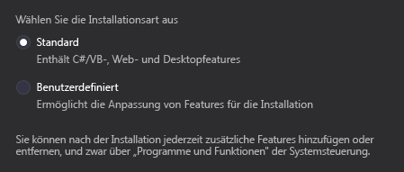

# Installieren von Visual Studio
[!INCLUDE[vs2017banner](../code-quality/includes/vs2017banner.md)]

Diese Seite enthält detaillierte Informationen zum Installieren von Visual Studio 2015, der integrierten Suite von Produktivitätstools für Entwickler. Wir haben auch Links eingefügt, sodass Sie schnell auf Informationen zu [Funktionen](https://www.visualstudio.com/en-us/news/vs2015-vs.aspx), [Editionen](http://go.microsoft.com/fwlink/?LinkID=242142), [Systemanforderungen](https://www.visualstudio.com/products/visual-studio-2015-compatibility-vs), [Downloads](http://go.microsoft.com/fwlink/?LinkId=517106) usw. zugreifen können.  
  
> [!TIP]
>  Klicken Sie zum Anzeigen von Informationen zur Installation früherer Versionen von Visual Studio oben auf der Seite auf „Andere Versionen“.  
  
## Quicklinks  
 Bevor wir auf die Details eingehen, finden Sie hier die am häufigsten aufgerufenen Links.  
  
|Features|  
|--------------|  
|Weitere Informationen zu neuen oder aktualisierten Funktionen in Visual Studio 2015 finden in den Versionshinweisen zu [Visual Studio 2015 RTM](https://www.visualstudio.com/en-us/news/vs2015-vs.aspx) und [Visual Studio 2015 Update 1](https://www.visualstudio.com/news/vs2015-update1-vs).|  
|Informationen zu den in den einzelnen Editionen von Visual Studio 2015 verfügbaren Funktionen finden Sie unter [Visual Studio\-Editionen im Vergleich](http://go.microsoft.com/fwlink/?LinkID=242142).|  
|Die Systemanforderungen der einzelnen Editionen von Visual Studio 2015 finden Sie unter [Visual Studio 2015 – Kompatibilität](https://www.visualstudio.com/products/visual-studio-2015-compatibility-vs).|  
|Um Visual Studio 2015 zu installieren, laden Sie die Anwendung unter [Visual Studio\-Downloads](http://go.microsoft.com/fwlink/?LinkId=517106) herunter, oder verwenden Sie den Installationsdatenträger des erworbenen Produkts.|  
|Informationen dazu, wie Sie Ihren Product Key ermitteln können, finden Sie unter [Gewusst wie: Suchen des Visual Studio Product Key](../install/how-to-locate-the-visual-studio-product-key.md).|  
|Informationen zu Lizenzierungsoptionen für Einzel\- und Enterprise\-Kunden finden Sie im Whitepaper [Visual Studio and MSDN Licensing](https://www.microsoft.com/download/details.aspx?id=13350) \(Visual Studio und MSDN – Lizenzierung\) \(möglicherweise in englischer Sprache\).|  
  
##   Standardsetup oder Benutzerdefiniertes Setup  
 Bei der Installation von Visual Studio 2015 können Sie Komponenten, die Sie täglich verwenden, ein\- und ausschließen. Dies bedeutet, dass eine Standardinstallation oft kleiner und schneller erfolgt als eine benutzerdefinierte Installation. Dies bedeutet zudem, dass in früheren Versionen viele standardmäßig installierte Komponenten nun als benutzerdefinierte Komponenten erachtet werden, die Sie explizit in dieser Version auswählen müssen.  
  
   
  
 Zu benutzerdefinierten Komponenten zählen Visual C\+\+, Visual F\#, SQL Server\-Datentools, plattformübergreifende mobile Tools und SDKs sowie SDKs und Erweiterungen von Drittanbietern. Sie können jede der benutzerdefinierten Komponenten zu einem späteren Zeitpunkt installieren, wenn Sie sie während des ersten Setups nicht auswählen.  
  
> [!NOTE]
>  Bei einer benutzerdefinierten Installation werden die in einer Standardinstallation enthaltenen Komponenten automatisch mit aufgenommen.  
  
 Die vollständige Liste der benutzerdefinierten Komponenten lautet wie folgt:  
  
-   **Programmiersprachen**  
  
    -   Visual C\+\+\-Compiler, \-Bibliotheken und \-Tools  
  
    -   Visual F\#  
  
    -   Python\-Tools für Visual Studio  
  
-   **Windows\- und Webentwicklung**  
  
    -   ClickOnce\-Tools für die Veröffentlichung  
  
    -   Microsoft SQL Server\-Datentools  
  
    -   Microsoft Web Developer Tools  
  
    -   PowerShell\-Tools für Visual Studio  
  
    -   Silverlight Development Kit  
  
    -   Universal Windows App\-Entwicklungstools  
  
    -   Windows 10\-Tools und \-SDKs  
  
    -   Windows 8.1\- und Windows Phone 8.0\/8.1\-Tools  
  
    -   Windows 8.1\-Tools und \-SDKs  
  
-   **Plattformübergreifende mobile Entwicklung**  
  
    -   Xamarin \(C\#\/.NET\)  
  
    -   Apache Cordova \(HTML\/JavaScript\)  
  
    -   Mobile Visual C\+\+\-Entwicklung für iOS \/ Android  
  
-   **Allgemeine Tools und SDKs**  
  
    -   Systemeigenes Development Kit für Android \(R10E, 32 Bit\)  
  
    -   Android\-SDK  
  
    -   Android SDK\-Installation \(API\-Ebene 19 und 21\)  
  
    -   Android SDK\-Installation \(API\-Ebene 22\)  
  
    -   Apache Ant \(1.9.3\)  
  
    -   Java SE Development Kit \(7.0.550.13\)  
  
    -   Joyent Node.js  
  
-   **Häufig verwendete Tools**  
  
    -   Git für Windows  
  
    -   GitHub\-Erweiterungen für Visual Studio  
  
    -   Visual Studio\-Erweiterbarkeitstools  
  
##   Installieren von Visual Studio  
 Sie benötigen Administratoranmeldeinformationen, um [!INCLUDE[vsprvs](../code-quality/includes/vsprvs_md.md)] zu installieren. Sie benötigen sie allerdings nicht, um [!INCLUDE[vsprvs](../code-quality/includes/vsprvs_md.md)] nach der Installation zu verwenden.  
  
 Ihr lokales Administratorkonto benötigt die folgenden Berechtigungen, damit Sie alles in Visual Studio installieren können.  
  
|Angezeigter Name des lokalen Richtlinienobjekts|Benutzerrechte|  
|-----------------------------------------------------|--------------------|  
|Sichern von Dateien und Verzeichnissen|SeBackupPrivilege|  
|Debuggen von Programmen|SeDebugPrivilege|  
|Verwalten von Überwachungs\- und Sicherheitsprotokollen|SeSecurityPrivilege|  
  
 Weitere Informationen zu den Anforderungen an das lokale Administratorkonto finden Sie im Knowledge Base\-Artikel [SQL Server\-Installation schlägt fehl, wenn das Setupkonto nicht über bestimmte Benutzerrechte verfügt](https://support.microsoft.com/en-us/kb/2000257).  
  
###   Installieren mithilfe der Installationsmedien  
  
-   Führen Sie zum Installieren von [!INCLUDE[vsprvs](../code-quality/includes/vsprvs_md.md)] die Installationsdatei für die gewünschte Edition im Stammverzeichnis des [!INCLUDE[vsprvs](../code-quality/includes/vsprvs_md.md)]\-Installationsmediums aus:  
  
    |Edition|Installationsdatei|  
    |-------------|------------------------|  
    |Visual Studio Enterprise|vs\_enterprise.exe|  
    |Visual Studio Professional|vs\_professional.exe|  
    |Visual Studio\-Community|vs\_community.exe|  
  
###   Installieren durch Herunterladen von der Produktwebsite  
  
-   Besuchen Sie [Visual Studio\-Downloads](http://go.microsoft.com/fwlink/?LinkId=517106) auf der Website "VisualStudio.com".  
  
###   Herunterladen von Visual Studio für eine Offlineinstallation  
 In den meisten Fällen können sie Visual Studio problemlos über die Downloadsite installieren. In einigen Fällen können Sie alle Updatepakete vor dem Installieren herunterladen, \(beispielsweise zum Installieren auf mehreren Computern oder auf einem Computer, der offline ist\). Die folgenden Schritte zeigen, wie alle Updatepakete heruntergeladen werden, die Sie für eine Offlineinstallation benötigen.  
  
1.  Nachdem Sie die ausführbare Datei für das Update von der MSDN\-Website in einen Speicherort auf dem Dateisystem heruntergeladen haben, führen Sie den folgenden Befehl über die Eingabeaufforderung aus: `<executable name> /layout`.  
  
     Mit diesem Befehl werden alle Pakete für die Installation heruntergeladen.  
  
     Mit dem `/layout`\-Switch können Sie fast alle Kerninstallationspakete herunterladen und nicht nur diejenigen, die für den Downloadcomputer vorgesehen sind. Mit diesem Ansatz erhalten Sie alle Dateien, die Sie benötigen, um dieses Update überall ausführen. Darüber hinaus sind sie möglicherweise hilfreich, wenn Sie Komponenten installieren möchten, die ursprünglich nicht installiert wurden.  
  
2.  Nach Ausführen des Befehls sollten Sie zur Angabe des Downloadspeicherorts dazu aufgefordert werden. Geben Sie den Speicherort ein, und wählen Sie dann **Herunterladen** aus.  
  
3.  Wenn der Paketdownload erfolgreich durchgeführt wurde, sollte ein Visual Studio\-Bildschirm mit folgender Meldung angezeigt werden: **Setup wurde erfolgreich abgeschlossen\! Alle angegebenen Komponenten wurden erfolgreich abgerufen.**  
  
4.  Die ausführbare Datei und der Paketordner befinden sich am angegebenen Speicherort. Dies ist alles, was Sie zum Kopieren an einen freigegebenen Speicherort oder zum Installieren von Medien benötigen.  
  
    > [!CAUTION]
    >  Aktuell unterstützt das Android SDK keine Oberfläche zur Offlineinstallation. Wenn Sie die Setupelemente des Android SDKs auf einem Computer installieren, der keine Internetverbindung aufweist, tritt bei der Installation möglicherweise ein Fehler auf.  
  
5.  Sie können jetzt die Installation vom Dateispeicherort oder den installierten Medien ausführen.  
  
###   Installieren von Visual Studio in virtualisierten Umgebungen  
 **Videoprobleme mit Hyper\-V**  
  
 Das Ausführen von Windows Server 2008 R2 mit aktiviertem Hyper\-V und beschleunigter Grafikkarte führt möglicherweise zu Systemverlangsamungen.  
  
 Weitere Informationen finden Sie auf der folgenden Seite der Microsoft\-Website: [Die Videoleistung eines Computers mit Windows Server 2008 oder Windows Server 2008 R2 ist bei aktivierter Hyper\-V\-Rolle und installierter beschleunigter Grafikkarte möglicherweise verringert](http://go.microsoft.com/fwlink/?LinkID=231084).  
  
 **Emulieren von Geräten mit Hyper\-V**  
  
 Bei der Installation von Visual Studio 2015 auf echter Hardware ohne Virtualisierung können Sie Features auswählen, die eine Emulation von Windows\- und Android\-Geräten mithilfe von Hyper\-V ermöglichen. Bei der Installation in Hyper\-V können Sie keine Windows\- oder Android\-Geräte emulieren. Der Grund hierfür ist, dass die Emulatoren selbst virtuelle Computer sind, und Sie können derzeit keine virtuellen Computer auf anderen virtuellen Computern hosten. Als Problemumgehung verwenden Sie echte Windows\- oder Android\-Geräte, auf denen Sie Ihre Anwendung direkt bereitstellen und debuggen können .  
  
## Verwenden von Befehlszeilenparametern  
 Wenn Sie die Installationsanwendung ausführen, können Sie die folgenden Befehlszeilenparameter verwenden. Bei diesen wird die Groß\-\/Kleinschreibung nicht beachtet.  
  
|Parameter|Beschreibung|  
|---------------|------------------|  
|**\/?**   **\/help**   **\/h**|Zeigt die Befehlszeilenparameter an.|  
|**\/AddRemoveFeatures**|Gibt an, welche Funktionen vom installierten Produkt entfernt oder zu diesem hinzugefügt werden.|  
|**\/AdminFile** *AdminDeployment.xml*|Installiert Visual Studio mithilfe der von Ihnen für administrative Installation angegebenen Datendatei.|  
|**\/CEIPConsent**|Berechtigungen für das Erfassen von Informationen zur Verbesserung der Kundenerfahrung in Übereinstimmung mit der Datenschutzrichtlinie des Produkts.|  
|**\/ChainingPackage** *BundleName*|Gibt an, welches Bündel dieses Bündel verkettet. Dies kann auch zum Angeben einer Customer Improvement Experience\-Gruppe verwendet werden.|  
|**\/CreateAdminFile \<filename\>**|Gibt den Speicherort an, um eine Kontrolldateien zu erstellen, die mit „\/AdminFile“ verwendet werden kann.|  
|**\/CustomInstallPath** *InstallationDirectory*|Installiert alle alternativen Pakete in dem von Ihnen angegebenen Verzeichnis.|  
|**\/ForceRestart**|Startet den Computer nach der Installation immer neu.|  
|**\/full**|Installiert alle Produktfunktionen.|  
|**\/InstallSelectableItems \<item name 1\>\[;\<item name 2\>\]**|Liste der Auswahlstrukturelemente, die auf dem Auswahlbildschirm des Installations\-Assistenten aktiviert werden sollen.|  
|**\/l**   **\/Log** *Filename*|Gibt einen Speicherort für die Protokolldatei an.|  
|**\/layout** *Directory*|Kopiert die Dateien auf dem Installationsmedium in das von Ihnen angegebene Verzeichnis.|  
|**\/NoCacheOnlyMode**|Verhindert, dass der Paket\-Cache vorab gefüllt wird.|  
|**\/NoRefresh**|Verhindert die Überprüfung auf neuere erforderliche oder empfohlene Versionen dieses Produkts.|  
|**\/norestart**|Hindert die Installationsanwendung während oder nach der Installation am Neustart des Computers. Im Abschnitt "Rückgabecodes" im [Administratorhandbuch für Visual Studio](../install/visual-studio-administrator-guide.md) finden Sie Informationen zu den Rückgabecodes, nach denen Sie suchen müssen.|  
|**\/noweb**|Verhindert Installation aus dem Internet.|  
|**\/OverrideFeedUri \<path to feed file\>**|Pfad zu einem lokalen, externen Feed mit einer Beschreibung der Softwareelemente.|  
|**\/ProductKey**   *ProduktKey*|Legt einen benutzerdefinierten Product Key fest, der keine Bindestriche und nicht mehr als 25 Zeichen enthält.|  
|**\/PromptRestart**|Fordert vor Neustart des Computers den Benutzer auf.|  
|**\/q**   **\/quiet**   **\/s**   **\/silent**|Unterdrückt die Benutzeroberfläche \(UI\) für die Installationsanwendung. Wenn Visual Studio bereits installiert ist und Sie keine weiteren Parameter angeben, wird die Installationsanwendung in Wartungsmodus ausgeführt.|  
|**\/qb**   **\/passive**|Zeigt den Fortschritt an, erwartet jedoch keine Benutzereingaben.|  
|**\/repair**|Repariert Visual Studio.|  
|**\/SuppressRefreshPrompt**|Verhindert die Anzeige des Dialogfeld über verfügbare Updates im Installations\-Assistenten. Der Installations\-Assistent nimmt automatisch alle erforderlichen und empfohlenen aktualisierten Versionen an.|  
|**\/u**   **\/Uninstall**|Deinstalliert [!INCLUDE[vsprvs](../code-quality/includes/vsprvs_md.md)].|  
|**\/Uninstall \/Force**   **\/u \/force**|Deinstalliert Visual Studio und alle Funktionen, die mit anderen Produkten gemeinsam genutzt werden. **Warning:**  Wenn Sie diesen Parameter verwenden, beeinträchtigt dies möglicherweise die Funktionalität anderer Produkte auf dem Computer.|  
  
 Wenn das Setup von der Befehlszeile aus ausgeführt wird, sollten Sie den Rückgabecode erfassen und verarbeiten, um die Steuerung über die Befehlszeile zu vereinfachen.  Weitere Informationen finden Sie unter [Administratorhandbuch für Visual Studio](../install/visual-studio-administrator-guide.md).  
  
##   Problembehandlung bei der Installation  
 In den folgenden Ressourcen finden Sie Hilfe für Setup\- und Installationsprobleme:  
  
-   [Einrichtung und Installation in Visual Studio](http://go.microsoft.com/fwlink/?LinkID=151190) – Forum. Lesen Sie Fragen und Antworten von anderen Personen in der Visual Studio\-Community. Wenn Sie die gesuchte Antwort nicht finden, stellen Sie eigene Fragen.  
  
-   [Microsoft Support für Visual Studio](http://go.microsoft.com/fwlink/?LinkID=251019)\-Website. Lesen Sie Artikel der Knowledge Base \(KB\), und erfahren Sie, wie Sie sich an den Microsoft Support wenden, um Informationen zu Problemen bei der Installation von Visual Studio zu erhalten.  
  
-   Für Visual Studio 2015\-Versionen können Sie Ihr Problem mithilfe der Connect\-Website unter [https:\/\/connect.microsoft.com\/visualstudio](https://connect.microsoft.com/visualstudio) melden.  
  
     Es wird empfohlen, beim Melden von Problemen die Installationsprotokolle beizufügen. Sie können Ihre Protokolle mithilfe des Log Collector Tools von Microsoft Visual Studio und .NET Framework für den Problembericht vorbereiten. Dies wird in den folgenden Schritten beschrieben.  
  
    1.  Laden Sie das Diagnoseprogramm für die Installation unter [http:\/\/aka.ms\/vscollect](http://aka.ms/vscollect) herunter.  
  
    2.  Führen Sie über eine Eingabeaufforderung mit erhöhten Rechten das Programm "collect.exe" aus.  
  
    3.  Rufen Sie nach Abschluss des Programms "collect.exe" die Datei "vslogs.cab" aus dem temporären Verzeichnis ab, und laden Sie sie in den Problembericht.  
  
##   Bereitstellung im Unternehmensnetzwerk  
 Informationen zum Bereitstellen von [!INCLUDE[vsprvs](../code-quality/includes/vsprvs_md.md)] über ein Netzwerk finden Sie unter [Administratorhandbuch für Visual Studio](../install/visual-studio-administrator-guide.md).  
  
##   Nach der Installation von Visual Studio  
 Nachdem Sie [!INCLUDE[vsprvs](../code-quality/includes/vsprvs_md.md)] installiert haben, sollten Sie Ihr Produktexemplar registrieren.  
  
###   Registrieren von Visual Studio  
  
##### So registrieren Sie Visual Studio  
  
1.  Wählen Sie in der Menüleiste **Hilfe** dann **Info** aus.  
  
     Im Dialogfeld **Info** wird die Produkt\-ID \(PID\) angezeigt. Sie benötigen die PID und die Anmeldeinformationen für das Windows\-Konto \(z. B. eine E\-Mail\-Adresse und das zugehörige Kennwort von Hotmail oder Outlook.com\), um das Produkt registrieren zu können.  
  
2.  Wählen Sie in der Menüleiste **Hilfe** dann **Produkt registrieren**.  
  
###   Installieren von Offlinehilfeinhalt  
 Nach der Installation von [!INCLUDE[vsprvs](../code-quality/includes/vsprvs_md.md)] können Sie zusätzliche Hilfeinhalte herunterladen, damit diese offline zur Verfügung stehen.  
  
##### So installieren oder deinstallieren Sie Hilfeinhalt  
  
1.  Klicken Sie in der [!INCLUDE[vsprvs](../code-quality/includes/vsprvs_md.md)]\-Menüleiste auf **Hilfe**, **Hilfeinhalte hinzufügen und entfernen**.  
  
2.  Wählen Sie in der Registerkarte **Inhalt verwalten** in **Microsoft Help Viewer** die Installationsquelle für den Hilfeinhalt aus.  
  
3.  Wenn Sie nach einem bestimmten Hilfethema suchen, geben Sie den Namen oder ein Schlüsselwort in das Textfeld **Suchen** ein und drücken dann die EINGABETASTE.  
  
4.  Klicken Sie neben dem Namen des Hilfethemas, das Sie installieren möchten, auf **Hinzufügen** oder **Entfernen**.  
  
5.  Wählen Sie die Schaltfläche **Aktualisieren**.  
  
 Weitere Informationen zur Offlinehilfe finden Sie unter [Hilfe für Microsoft Help Viewer 2.2](../ide/microsoft-help-viewer.md)  
  
###   Reparieren von Visual Studio  
  
##### So reparieren Sie Visual Studio  
  
1.  Wählen Sie in der **Systemsteuerung** auf der Seite **Programme und Funktionen** die Produktversion aus, die Sie reparieren möchten, und wählen Sie anschließend **Ändern** aus.  
  
2.  Wählen Sie im Setup\-Assistenten **Reparieren** aus, wählen Sie **Weiter** aus, und befolgen Sie anschließend die übrigen Anweisungen.  
  
##### So reparieren Sie Visual Studio im unbeaufsichtigten oder im passiven Modus \(Reparatur von der Quelle\)  
  
1.  Öffnen Sie die Windows\-Eingabeaufforderung auf dem Computer, auf dem Visual Studio installiert ist.  
  
2.  Geben Sie folgende Parameter ein:  
  
     *DVD\-Stammverzeichnis*\\\<Installationsdatei\> \<\/quiet&#124;\/passive\> \[\/norestart\]\/Repair  
  
###   Installieren wählbarer Elemente  
  
##### So installieren Sie wählbare Elemente  
  
1.  Wählen Sie in der **Systemsteuerung** auf der Seite **Programme und Funktionen** die Produktversion aus, zu der Sie mindestens eine Komponente hinzufügen möchten, und wählen Sie anschließend **Deinstallieren\/Ändern** aus.  
  
2.  Wählen Sie im Setup\-Assistenten **Ändern** aus, und wählen Sie anschließend die Komponenten aus, die Sie installieren möchten.  
  
3.  Wählen Sie **Weiter** aus, und befolgen Sie anschließend die übrigen Anweisungen.  
  
###   Suchen nach Service Releases und Produktupdates  
 Visual Studio aktualisiert keine Erweiterungen automatisch, wenn Sie ein Upgrade von früheren Versionen durchführen, da nicht alle Erweiterungen kompatibel sind. Installieren Sie erneut die Erweiterungen aus der [Visual Studio Gallery](http://go.microsoft.com/fwlink/?LinkId=178891) oder vom Herausgeber der Software.  
  
##### So suchen Sie automatisch nach Service Releases  
  
1.  Wählen Sie in der Menüleiste **Extras**, **Optionen**.  
  
2.  Erweitern Sie **Umgebung** im Dialogfeld **Optionen** und klicken Sie dann auf **Erweiterungen und Updates**. Stellen Sie sicher, dass das Kontrollkästchen **Automatisch nach Updates suchen** markiert ist, und klicken Sie auf **OK**.  
  
##   Deinstallieren von Visual Studio  
 Verwenden Sie die folgenden Vorgehensweisen, um Visual Studio 2015 zu deinstallieren.  
  
#### So deinstallieren Sie Visual Studio  
  
1.  Wählen Sie in der **Systemsteuerung** auf der Seite **Programme und Funktionen** die Produktversion aus, die Sie deinstallieren möchten, und wählen Sie anschließend **Ändern** aus.  
  
2.  Wählen Sie im Setup\-Assistenten **Deinstallieren** aus, wählen Sie **Ja** aus, und befolgen Sie anschließend die übrigen Anweisungen des Assistenten.  
  
#### So deinstallieren Sie Visual Studio im unbeaufsichtigten oder im passiven Modus \(Deinstallation von der Quelle\)  
  
1.  Öffnen Sie die Windows\-Eingabeaufforderung auf dem Computer, auf dem Visual Studio installiert ist.  
  
2.  Geben Sie folgende Parameter ein:  
  
     *DVDRoot* \\\<Installationsdatei\> \<\/quiet&#124;\/passive\> \[\/norestart\]\/uninstall  
  
 Wenn Sie [!INCLUDE[vsprvs](../code-quality/includes/vsprvs_md.md)] mit dem entsprechenden Hilfsprogramm nicht deinstallieren können, können Sie eine manuelle Deinstallation durch Entfernen von [!INCLUDE[vsprvs](../code-quality/includes/vsprvs_md.md)] und anschließendes Entfernen von verwandten Komponenten ausführen. Weitere Informationen finden Sie im Artikel [How to uninstall Visual Studio](https://support.microsoft.com/en-us/kb/2771441) \(Deinstallieren von Visual Studio\) \(möglicherweise in englischer Sprache\) in der Microsoft Knowledge Base \(KB\) oder im Beitrag [Removing Visual Studio components left behind after an uninstall](http://blogs.msdn.com/b/heaths/archive/2015/07/17/removing-visual-studio-components-left-behind-after-an-uninstall.aspx) \(Entfernen von Visual Studio\-Komponenten nach einer Deinstallation\) \(möglicherweise in englischer Sprache\) auf der Microsoft Server & Tools Blogs\-Website.  
  
##   Verwandte Themen  
  
|Titel|Beschreibung|  
|-----------|------------------|  
|[Parallele Installation mehrerer Visual Studio\-Versionen](../Topic/Installing%20Visual%20Studio%20Versions%20Side-by-Side.md)|Stellt Informationen zum Installieren mehrerer Versionen von Visual Studio auf demselben Computer bereit.|  
|[Visual Studio Bildbibliothek](../designers/the-visual-studio-image-library.md)|Stellt Informationen zum Installieren von Grafiken bereit, die in Visual Studio\-Anwendungen verwendet werden können.|  
|[Administratorhandbuch für Visual Studio](../install/visual-studio-administrator-guide.md)|Stellt Informationen zu Bereitstellungsoptionen für Visual Studio bereit.|  
|[Installieren mehrerer Sprachversionen von Visual Studio](../Topic/Installing%20Multiple%20Language%20Versions%20of%20Visual%20Studio.md)|Stellt Informationen zum Installieren unterschiedlicher Sprachversionen von Visual Studio bereit.|  
|[Gewusst wie: Suchen des Visual Studio Product Key](../install/how-to-locate-the-visual-studio-product-key.md)|Bietet Informationen zum Suchen des Product Keys für die Installation von Visual Studio.|  
|[Erste Schritte](../ide/get-started-developing-with-visual-studio.md)|Stellt eine Verknüpfung mit Dokumenten her, die Informationen zur effektiven Verwendung von Visual Studio beinhalten.|  
  
## Siehe auch  
 [Anpassen der Entwicklungseinstellungen in Visual Studio](http://msdn.microsoft.com/de-de/22c4debb-4e31-47a8-8f19-16f328d7dcd3)