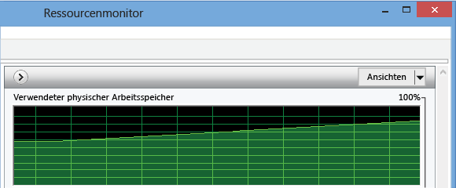
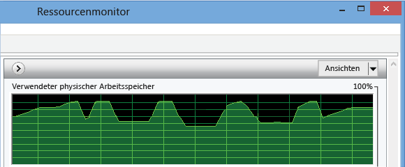
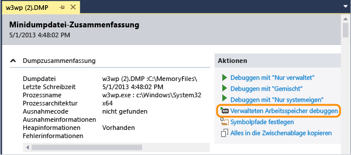
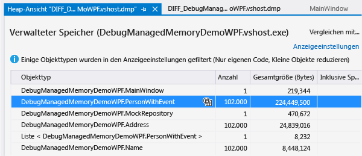
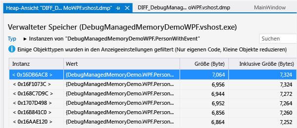
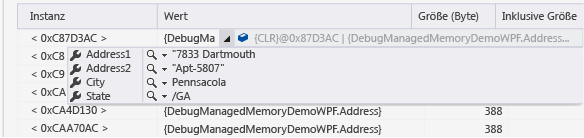
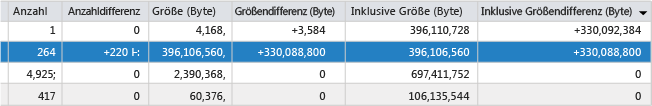

# Analysieren von .NET Framework-Arbeitsspeicherproblemen
Ermitteln Sie mithilfe des Analyzers für verwalteten Speicher von Visual Studio Speicherverluste und ineffiziente Arbeitsspeichernutzung in .NET Framework\-Code.  Die mindestens erforderliche .NET Framework\-Version für den Zielcode ist .NET Framework 4.5.  
  
 Das Arbeitsspeicheranalysetool analysiert Informationen in *Dumpdateien mit Heapdaten*, eine Kopie der Objekte im Speicher einer App.  Sie können Dumpdateien \(.dmp\) von der Visual Studio IDE oder mit anderen Systemtools sammeln.  
  
-   Sie können eine einzelne Momentaufnahme analysieren, um die relativen Auswirkungen der Objekttypen auf die Arbeitsspeichernutzung zu verstehen und Code in der App zu suchen, die Arbeitsspeicher auf ineffiziente Weise verwendet.  
  
-   Sie können auch einen Vergleich \(*diff*\) zweier Momentaufnahmen einer App durchführen, um Bereiche im Code aufzuspüren, die dazu führen, dass die Arbeitsspeichernutzung im Zeitverlauf zunimmt.  
  
 Eine exemplarische Vorgehensweise des Analyzers für verwalteten Arbeitsspeicher finden Sie unter [Using Visual Studio 2013 to Diagnose .NET Memory Issues in Production](http://blogs.msdn.com/b/visualstudioalm/archive/2013/06/20/using-visual-studio-2013-to-diagnose-net-memory-issues-in-production.aspx) im Blog zu Visual Studio ALM \+ Team Foundation Server.  
  
##   Inhalt  
 [Arbeitsspeichernutzung in .NET Framework-Apps](#BKMK_Memory_use_in__NET_Framework_apps)  
  
 [Erkennen eines Arbeitsspeicherproblems in einer App](#BKMK_Identify_a_memory_issue_in_an_app)  
  
 [Sammeln von Momentaufnahmen des Arbeitsspeichers](#BKMK_Collect_memory_snapshots)  
  
 [Analysieren der Arbeitsspeichernutzung](#BKMK_Analyze_memory_use)  
  
##   Arbeitsspeichernutzung in .NET Framework\-Apps  
 .NET Framework ist eine speicherbereinigte Laufzeitumgebung, sodass die Speichernutzung in den meisten Apps kein Problem darstellt.  In Anwendungen mit langer Laufzeit jedoch, wie z. B. Webdienste und Anwendungen, sowie auf Geräten, die einen begrenzten Arbeitsspeicher haben, kann die Ansammlung von Objekten im Arbeitsspeicher die Leistung der App und auch das Gerät, auf dem sie ausgeführt wird, beeinträchtigen.  Übermäßige Arbeitsspeichernutzung kann die Anwendung und den Computer durch Ressourcen blockieren, wenn der Garbage Collector zu häufig ausgeführt wird oder wenn das Betriebssystem gezwungen wird, Arbeitsspeicher zwischen RAM und Datenträger zu verschieben.  Im ungünstigsten Fall kann eine Anwendung bei einer Ausnahme aufgrund "nicht genügend Arbeitsspeicher" abstürzen.  
  
 Die *verwaltete Heap* von .NET ist ein Bereich des virtuellen Arbeitsspeichers, in dem die Verweisobjekte, die von einer Anwendung erstellt werden, gespeichert werden.  Die Lebensdauer der Objekte wird vom Garbage Collector \(GC\) verwaltet.  Der Garbage Collector verwendet Verweise, um Objekte zu verfolgen, die Speicherblöcke belegen.  Ein Verweis wird erstellt, wenn ein Objekt erstellt und einer Variablen zugewiesen wird.  Ein einzelnes Objekt kann mehrere Verweise haben.  Beispielsweise können zusätzliche Verweise auf ein Objekt erstellt werden, indem das Objekt einer Klasse, Auflistung oder anderen Datenstruktur hinzufügt wird oder indem das Objekt einer zweiten Variable zugeordnet wird.  Eine weniger offensichtliche Methode zum Erstellen eines Verweises besteht darin, dass ein Objekt einen Handler zum Ereignis eines anderen Objekts hinzufügt.  In diesem Fall behält das zweite Objekt den Verweis zum ersten Objekt, bis der Handler explizit entfernt ist oder das zweite Objekt vernichtet wird.  
  
 Für jede Anwendung verwaltet das GC eine Verweisstruktur, die die Objekte verfolgt, auf die von der Anwendung verwiesen wird.  Die *Verweisstruktur* verfügt über eine Reihe von Stammelementen, die globale und statische Objekte umfassen, sowie zugeordnete Threadstapel und dynamisch instanziierte Objekte.  Ein Objekt verfügt über einen Stamm, wenn das Objekt mindestens ein übergeordnetes Objekt hat, das einen Verweis darauf enthält.  Das GC kann den Arbeitsspeicher eines Objekts nur dann freigeben, wenn kein anderes Objekt oder keine andere Variable in der Anwendung über einen Verweis darauf verfügt.  
  
  [Inhalt](#BKMK_Contents)  
  
##   Erkennen eines Arbeitsspeicherproblems in einer App  
 Das sichtbarste Symptom von Arbeitsspeicherproblemen ist die Leistung der App, insbesondere dann, wenn die Leistung im Zeitverlauf abnimmt.  Eine Verringerung der Leistung anderer Apps während der Ausführung Ihrer App kann ebenfalls auf ein Arbeitsspeicherproblem hinweisen.  Wenn Sie ein Arbeitsspeicherproblem vermuten, verwenden Sie ein Tool wie Task\-Manager oder [Windows\-Systemmonitor](http://technet.microsoft.com/library/cc749249.aspx), um dem Problem auf den Grund zu gehen.  Schauen Sie beispielsweise, ob die Gesamtgröße des Speichers angestiegen ist, was sich aber nicht als potenzielle Quelle von Arbeitsspeicherverlusten erklären lässt:  
  
   
  
 Sie können auch Arbeitsspeicherspitzen beobachten, die größer sind, als sie es Ihrer Kenntnis des Codes nach vermuten würden, was möglicherweise auf eine ineffiziente Arbeitsspeicherverwendung in einer Prozedur hinweist:  
  
   
  
##   Sammeln von Momentaufnahmen des Arbeitsspeichers  
 Das Arbeitsspeicheranalysetool analysiert Informationen in *Dumpdateien*, die Heapinformationen enthalten.  Sie können Dumpdateien in Visual Studio erstellen oder ein Tool wie [ProcDump](http://technet.microsoft.com/sysinternals/dd996900.aspx) von [Windows Sysinternals](http://technet.microsoft.com/sysinternals) verwenden.  Siehe [What is a dump, and how do I create one?](http://blogs.msdn.com/b/debugger/archive/2009/12/30/what-is-a-dump-and-how-do-i-create-one.aspx) im Blog des Visual Studio Debugger Teams.  
  
> [!NOTE]
>  Die meisten Tools können Dumpinformationen mit oder ohne vollständige Heapspeicherdaten sammeln.  Die Speicheranalyse von Visual Studio erfordert vollständige Heapinformationen.  
  
 **So erfassen Sie einen Dump von Visual Studio**  
  
1.  Sie können eine Dumpdatei für einen Prozess erstellen, der von einem Visual Studio\-Projekt gestartet wurde, oder Sie fügen den Debugger an einen laufenden Prozess an.  Siehe [Anhängen an laufende Prozesse](../debugger/attach-to-running-processes-with-the-visual-studio-debugger.md).  
  
2.  Beenden Sie die Ausführung.  Der Debugger wird beendet, wenn Sie im Menü **Debuggen** die Option **Alle unterbrechen** auswählen, oder bei einer Ausnahme oder einem Haltepunkt.  
  
3.  Wählen Sie im Menü **Debuggen** die Option **Dump speichern unter** aus.  Geben Sie im Dialogfeld **Dump speichern unter** einen Speicherort an, und stellen Sie sicher, dass **Minidump mit Heap** \(Standard\) in der Liste **Dateityp** ausgewählt ist.  
  
 **So vergleichen Sie zwei Speichermomentaufnahmen**  
  
 Um die gestiegene Arbeitsspeichernutzung einer App zu analysieren, erfassen Sie zwei Dumpdateien aus einer einzelnen Instanz der App.  
  
  [Inhalt](#BKMK_Contents)  
  
##   Analysieren der Arbeitsspeichernutzung  
 [Filtern der Objektliste](#BKMK_Filter_the_list_of_objects) **&#124;** [Analysieren der Arbeitsspeicherdaten von einer einzelnen Momentaufnahme](#BKMK_Analyze_memory_data_in_from_a_single_snapshot) **&#124;** [Vergleich von zwei Speichermomentaufnahmen](#BKMK_Compare_two_memory_snapshots)  
  
 So analysieren Sie eine Dumpdatei bei Problemen mit der Arbeitsspeichernutzung  
  
1.  Wählen Sie in Visual Studio **Datei** und dann **Öffnen** aus, und geben Sie die Dumpdatei an.  
  
2.  Wählen Sie auf der Seite **Zusammenfassung der Minidump\-Datei** die Option **Verwalteten Speicher debuggen** aus.  
  
       
  
 Die Speicheranalyse startet eine Debugsitzung, um die Datei zu analysieren, und zeigt die Ergebnisse auf der Seite "Heap\-Ansicht" an:  
  
  [Inhalt](#BKMK_Contents)  
  
###   Filtern der Objektliste  
 Standardmäßig wird die Liste der Objekte in einer Speichermomentaufnahme von der Speicheranalyse gefiltert, um nur die Typen und die Instanzen anzuzeigen, die Benutzercode sind, und nur die Typen darzustellen, deren inklusive Gesamtgröße einen prozentualen Schwellenwert der gesamten Heapgröße überschreitet.  Sie können diese Optionen in der Liste **Anzeigeeinstellungen** ändern:  
  
|||  
|-|-|  
|**Nur meinen Code aktivieren**|"Nur eigenen Code" blendet die häufigsten Systemobjekte aus, sodass nur die Typen, die Sie erstellen, in der Liste angezeigt werden.   Sie können die Option "Nur eigenen Code" auch im Visual Studio\-Dialogfeld **Optionen** festlegen.  Klicken Sie im Menü **Debuggen** auf **Optionen und Einstellungen**.  Aktivieren oder deaktivieren Sie in der Registerkarte **Debugging**\/**Allgemein** die Option **Nur eigenen Code**.|  
|**Kleine Objekte reduzieren**|**Kleine Objekte reduzieren** blendet alle Typen aus, deren inklusive Gesamtgröße weniger als 0,5 Prozent der gesamten Heapgröße beträgt.|  
  
 Sie können die Typenliste auch filtern, indem Sie eine Zeichenfolge im Feld **Suchen** eingeben.  Die Liste enthält nur die Typen, deren Namen die Zeichenfolge enthalten.  
  
  [Inhalt](#BKMK_Contents)  
  
###   Analysieren der Arbeitsspeicherdaten von einer einzelnen Momentaufnahme  
 Visual Studio beginnt eine neue Debugsitzung zur Analyse der Datei und zeigt die Speicherdaten in einem Fenster Heap\-Ansicht an.  
  
   
  
  [Inhalt](#BKMK_Contents)  
  
#### Objekttyptabelle  
 In der Tabelle ganz oben werden die Typen von Objekten aufgeführt, die im Arbeitsspeicher gespeichert werden.  
  
-   **Die Zahl** zeigt die Anzahl von Instanzen des Typs in der Momentaufnahme an.  
  
-   **Größe \(Byte\)** ist die Größe aller Instanzen des Typs, exklusive der Größe der Objekte, zu denen er Verweise enthält.  Die  
  
-   **Inklusive Größe \(Bytes\)** schließt die Größen von referenzierten Objekten ein.  
  
 Sie können das Instanzensymbol \(\) in der Spalte **Objekttyp** auswählen und eine Liste der Instanzen des Typs anzeigen.  
  
#### Instanztabelle  
   
  
-   **Instanz** ist die Speicheradresse des Objekts, die als Objektbezeichner des Objekts fungiert  
  
-   **Wert** zeigt den tatsächlichen Wert von Werttypen.  Sie können den Mauszeiger über den Namen eines Referenztyps bewegen, sodass sein Datenwert in einem Datentipp angezeigt wird.  
  
       
  
-   **Größe \(Byte\)** ist die Größe des Objekts, exklusive der Größe der Objekte, zu denen er Verweise enthält.  Die  
  
-   **Inklusive Größe \(Bytes\)** schließt die Größen von referenzierten Objekten ein.  
  
 Standardmäßig werden Typen und Instanzen nach **Inklusive Größe \(Bytes\)** sortiert.  Wählen Sie eine Spaltenüberschrift in der Liste aus, um die Sortierreihenfolge ändern.  
  
#### Pfade zum Stamm  
  
-   Für einen aus der Tabelle **Objekttyp** ausgewählten Typ enthält die Tabelle **Pfade zum Stamm** die eindeutigen Typhierarchien, die zu den Stammobjekten für alle Objekte des Typs führen, sowie die Anzahl der Verweise auf den Typ, der in der Hierarchie jeweils darüber liegt.  
  
-   Für ein von der Instanz des Typs ausgewähltes Objekt zeigt **Pfade zum Stamm** ein Diagramm der tatsächlichen Objekte an, die einen Verweis auf die Instanz enthalten.  Sie können den Mauszeiger über den Namen des Objekts bewegen, sodass sein Datenwert in einem Datentipp angezeigt wird.  
  
#### Referenzierte Typen \/ Referenzierte Objekte  
  
-   Für einen aus der Tabelle **Objekttyp** ausgewählten Typ zeigt die Registerkarte **Referenzierte Typen** die Größe und Anzahl der referenzierten Typen an, die für alle Objekte des ausgewählten Typs gespeichert werden.  
  
-   Für eine ausgewählte Instanz eines Typs zeigt **Referenzierte Objekte** die Objekte an, die von der ausgewählten gehalten werden.  Sie können den Mauszeiger über den Namen bewegen, sodass sein Datenwert in einem Datentipp angezeigt wird.  
  
 **Zirkelverweise**  
  
 Ein Objekt kann auf ein zweites Objekt verweisen, das direkt oder indirekt einen Verweis auf das erste Objekt enthält.  Wenn die Speicheranalyse auf diese Situation stößt, wird die Erweiterung des Verweispfads beendet und die Anmerkung **\[Schleife ermittelt\]** zur Auflistung des ersten Objekts hinzugefügt, und sie wird beendet.  
  
 **Stammtypen**  
  
 Die Speicheranalyse fügt Stammobjekten Anmerkungen hinzu, die die Art des gespeicherten Verweises beschreiben:  
  
|Anmerkung|Beschreibung|  
|---------------|------------------|  
|**Statische Variable** `VariableName`|Eine statische Variable.  `VariableName` ist der Name der Variablen.|  
|**Abschlusshandle**|Ein Verweis von der Finalizer\-Warteschlange|  
|**Lokale Variable**|Eine lokale Variable.|  
|**Starkes Handle**|Ein Handle für einen starken Verweis von der Objekthandletabelle.|  
|**Asynchr.  Fixiertes Handle**|Ein asynchrones angeheftetes Objekt von der Objekthandletabelle.|  
|**Abhängiges Handle**|Ein abhängiges Objekt von der Objekthandletabelle.|  
|**Fixiertes Handle**|Ein angehefteter starker Verweis von der Objekthandletabelle.|  
|**RefCount\-Handle**|Ein Objekt mit Verweiszählung von der Objekthandletabelle.|  
|**SizedRef\-Handle**|Ein starkes Handle, das eine ungefähre Größe des kollektiven Abschlusses aller Objekte und Objektstämme zur Garbage Collection\-Zeit enthält.|  
|**Angeheftete lokale Variable**|Eine angeheftete lokale Variable.|  
  
###   Vergleich von zwei Speichermomentaufnahmen  
 Sie können zwei Dumpdateien eines Prozesses vergleichen, um nach Objekten zu suchen, die möglicherweise die Ursache von Speicherverlusten sind.  Das Intervall zwischen der Auflistung aus der ersten \(früheren\) und zweiten \(späteren\) Datei sollte so groß sein, dass der Anstieg der Anzahl von Objekten, die Speicherverluste verursachen, leicht ersichtlich ist.  So vergleichen Sie die beiden Dateien  
  
1.  Öffnen Sie die zweite Dumpdatei, und wählen Sie dann auf der Seite **Zusammenfassung der Minidump\-Datei** die Option **Verwalteten Speicher debuggen** aus.  
  
2.  Öffnen Sie auf der Berichtsseite der Speicheranalyse die Liste **Baseline auswählen**, und wählen Sie dann **Durchsuchen** aus, um die erste Dumpdatei anzugeben.  
  
 Die Analyse fügt Spalten im oberen Bereich des Berichts hinzu, die den Unterschied zwischen **Anzahl**, **Größe** und **Inklusive Größe** der Typen zu den Werten in der früheren Momentaufnahme zeigen.  
  
   
  
 Außerdem wird die Spalte **Differenz Verweisanzahl** zur Tabelle **Pfade zum Stamm** hinzugefügt.  
  
  [Inhalt](#BKMK_Contents)  
  
## Siehe auch  
 [Using Visual Studio 2013 to Diagnose .NET Memory Issues in Production](http://blogs.msdn.com/b/visualstudioalm/archive/2013/06/20/using-visual-studio-2013-to-diagnose-net-memory-issues-in-production.aspx)   
 [Channel 9 &#124; Visual Studio TV &#124; Managed Memory Analysis](http://channel9.msdn.com/Series/Visual-Studio-2012-Premium-and-Ultimate-Overview/Managed-Memory-Analysis)   
 [Channel 9 &#124; Visual Studio Toolbox &#124; Managed Memory Analysis in Visual Studio 2013](http://channel9.msdn.com/Shows/Visual-Studio-Toolbox/Managed-Memory-Analysis-in-Visual-Studio-2013)