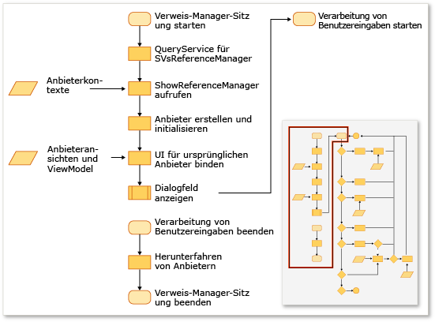
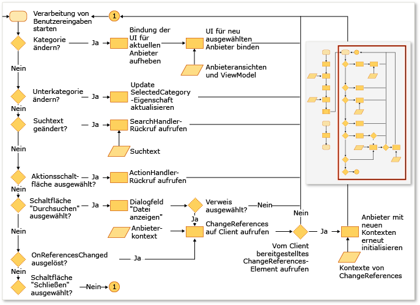

# Erweitern des Verweis-Managers
Sie können mithilfe des Verweis\-Managers in einer Visual Studio\-Erweiterung Verweise zu Ihrem Projekt hinzufügen. Bevor der Verweis\-Manager angezeigt wird, muss er von Ihrem Projekt konfiguriert werden, damit er die Daten der richtigen Speicherorte anzeigt. Ein auf das [!INCLUDE[net_v40_short](../code-quality/includes/net_v40_short_md.md)] ausgerichtetes Projekt muss z. B. Assemblys aus einem anderen Ordner auffüllen als ein Projekt, das auf das [!INCLUDE[net_v35_long](../misc/includes/net_v35_long_md.md)] ausgerichtet ist.  
  
 In der Regel konfigurieren Sie den Verweis\-Manager mithilfe einer ProviderContexts\-Auflistung der folgenden Anbieter:  
  
-   <xref:Microsoft.VisualStudio.Shell.Interop.IVsAssemblyReferenceProviderContext>  
  
-   <xref:Microsoft.VisualStudio.Shell.Interop.IVsComReferenceProviderContext>  
  
-   <xref:Microsoft.VisualStudio.Shell.Interop.IVsFileReferenceProviderContext>  
  
-   <xref:Microsoft.VisualStudio.Shell.Interop.IVsProjectReferenceProviderContext>  
  
-   <xref:Microsoft.VisualStudio.Shell.Interop.IVsPlatformReferenceProviderContext>  
  
 Eine Clientkomponente zeigt den Verweis\-Manager durch Aufrufen der ShowReferenceManager\-Methode für den Visual Studio\-Dienst „SVsReferenceManager“ an. Eine Auflistung von IVsReferenceProviderContext\-Klassen wird als Argument an diese Methode übergeben. Diese Kontexte bestimmen, welche Registerkarten auf der linken Seite des Dialogfelds des Verweis\-Managers angezeigt werden. Jeder Anbieter enthält alle für das Dialogfeld erforderlichen Informationen zum Auffüllen und Anzeigen der benötigten Daten, damit Sie Ihrem Projekt einen Verweis hinzufügen können.  
  
 Dieser Prozess wird in der folgenden Abbildung veranschaulicht.  
  
   
  
   
  
## Hinzufügen einer benutzerdefinierten Registerkarte  
 Sie müssen „IReferenceProvider“, „IVsReference“ und „IVsReferenceProviderContext“ implementieren, damit Sie eine benutzerdefinierte Registerkarte hinzufügen können.  
  
#### So fügen Sie eine benutzerdefinierte Registerkarte hinzu  
  
1.  Implementieren Sie die IReferenceProvider\-Schnittstelle, und exportieren Sie sie dann über das Managed Extensibility Framework \(MEF\), damit sie vom Verweis\-Manager verwendet werden kann.  
  
     Der Verweis\-Manager verwendet das ReferenceProvider\-Objekt zum Generieren der Elemente, die im Verweis\-Manager angezeigt werden. Die Schnittstelle für das Objekt wird in der Datei „Microsoft.VisualStudio.ReferenceManager.Contracts.dll“ definiert.  
  
2.  Implementieren Sie ein ProviderContext\-Objekt.  
  
     Der Verweis\-Manager verwendet die GUID\-Eigenschaft dieses Objekts, um den Kontext mit dem Anbieter zu vergleichen. Wenn der Verweis\-Manager initialisiert wird, übergibt er den in der ShowReferenceManager\-Methode übergebenen „ProviderContext“ an den Anbieter. „ProviderContext“ sollte alle Informationen enthalten, die der Anbieter zum Auflisten von „IVsReferences“ benötigt.  
  
3.  Erweitern Sie die StandardReferenceProviderContext\-Klasse.  
  
     Der Verweis\-Manager stellt einige Basisklassen wie die StandardReferenceProviderContext\-Klasse bereit, die Sie für die ersten Schritte verwenden können. „StandardReferenceProvider“ kann von Ihrer Anbieterklasse und „StandardReferenceItem“ vom Verweiselement erweitert werden.  
  
 Ihre Anbieterklasse könnte wie folgendes Beispiel aussehen:  
  
```  
[Export(typeof(IReferenceProvider))] [ExportMetadata("Name", "AssemblyReferenceProvider")] [ExportMetadata("Guid", VSConstants.AssemblyReferenceProvider_string)] internal class AssemblyReferenceProvider : StandardReferenceProvider { }  
```  
  
 Ihre Kontextklasse könnte wie folgendes Beispiel aussehen:  
  
```  
  
[Export(typeof(IVsReferenceProviderContext))] [Export(typeof(IVsAssemblyReferenceProviderContext))] [Export("AssemblyReferenceProviderContext", typeof(IVsReferenceProviderContext))] [Export(VSConstants.AssemblyReferenceProvider_string, typeof(IVsReferenceProviderContext))] [PartCreationPolicy(System.ComponentModel.Composition.CreationPolicy.NonShared)] [ExportMetadata("Name", "AssemblyReferenceProviderContext")] [ExportMetadata("Guid", VSConstants.AssemblyReferenceProvider_string)] public class AssemblyReferenceProviderContext : StandardReferenceProviderContext<IVsAssemblyReference, AssemblyIdentity>, IVsAssemblyReferenceProviderContext { }  
```  
  
 Es wird empfohlen, dass Sie „IWatchableReference“ für Ihre Referenzelementklasse implementieren und Ihre Klasse serialisierbar machen. Indem Sie diesem Ansatz folgen, können Sie die Methoden zur Cacheserialisierung in der StandardReferenceProvider\-Klasse zusätzlich zum ReferenceWatcher\-Dienst nutzen, der Elementprüfungen zwischen den verschiedenen Registerkarten im Dialogfeld automatisch synchronisiert:  
  
```  
[Serializable] public class StandardReferenceItem : IWatchableReference { }  
```  
  
 Die ReferenceProvider\-Klasse enthält zwei wichtige Methoden. Die erste Methode ist „Initialize“, die beim ersten Laden des Anbieters im Dialogfeld nur einmal aufgerufen wird. Die zweite Methode ist „SetContext“, die unmittelbar nach „Initialize“ aufgerufen wird. Sie kann jedoch erneut aufgerufen werden, wenn das Projektsystem nicht in der Lage ist, einen der Verweise hinzuzufügen, die Sie angegeben und für die Sie versucht haben, ein Commit auszuführen.  
  
> [!NOTE]
>  Da die Anbieter für die Dauer des Programms beibehalten werden, können sie den Zustand zwischen Sitzungen speichern. Es können jedoch Racebedingungen auftreten, wenn der Benutzer das Dialogfeld schließt und dann schnell erneut öffnet.  
  
## Überschreiben der vorhandenen Quelle für die Registerkartenenumeration  
 Einige Anbieterkontexte verfügen über eine Eigenschaft namens „Tabs“ mit dem Typ „uint“. Diese Eigenschaft ist eine Bitmaske und ihre Werte steuern, welche Registerkarten vom Anbieter angezeigt werden.  Die IVsAssemblyReferenceProviderContext\-Schnittstelle definiert z. B. eine Tabs\-Eigenschaft, für die die folgenden Werte festgelegt werden können:  
  
```  
namespace Microsoft.VisualStudio.Shell.Interop { public enum __VSASSEMBLYPROVIDERTAB { TAB_ASSEMBLY_FRAMEWORK = 1, TAB_ASSEMBLY_EXTENSIONS = 2, TAB_ASSEMBLY_ALL = 3, } }  
```  
  
 Die IVsPlatformReferenceProviderContext\-Klasse verfügt über eine ähnliche Eigenschaft. Sie können den Namen der Registerkarte nicht ändern, aber Sie können den Headertext steuern, der angezeigt wird, wenn der Benutzer die Registerkarte auswählt. Sie können diesen Wert über die folgenden Methoden für die IVsAssemblyProviderContext\-Klasse steuern:  
  
```  
void SetTabTitle(uint etabId, string szTabTitle);  
```  
  
## Überschreiben von Filtern im Dialogfeld „Durchsuchen“  
 Sie können für das Dialogfeld „Durchsuchen“ im Verweis\-Manager einen benutzerdefinierten Filter angeben, indem Sie den Wert der BrowseFilter\-Eigenschaft für das IFileReferenceProviderContext\-Objekt ändern.  Diese Vorgehensweise wird im folgenden Beispiel mithilfe von systemeigenen Code veranschaulicht:  
  
```  
  
// Holds a list of provider contexts CComSafeArray<LPUNKNOWN> spProviderContexts; // Creates the file reference context for Browse vsReferenceManager->CreateProviderContext(GUID_FileReferenceProvider, &pFileRefProviderContext)); // Sets the Browse filter pFileRefProviderContext->put_BrowseFilter(wszFilter); spProviderContexts.Add(pFileRefProviderContext); // Show the reference manager hr = srpRefMgr->ShowReferenceManager( spVsRefMgrUser, spProviderContexts, strTitle, HELPKEYWORD_AddReference, GUID_AssemblyReferenceProvider, wszFilter, m_bstrStartBrowse);  
```  
  
## Siehe auch  
 [Gewusst wie: Hinzufügen und Entfernen von Verweisen mit dem Verweis\-Manager](../ide/how-to-add-or-remove-references-by-using-the-reference-manager.md)