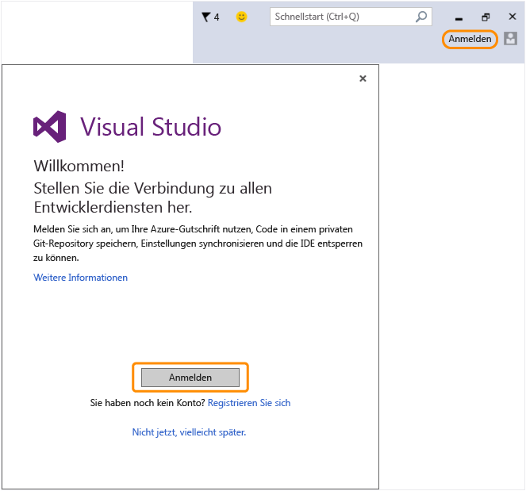

# Kehren Sie zu Visual Studio zur&#252;ck, um sich mit Ihrem neuen Microsoft-Konto bei der IDE anzumelden.
Ihr Microsoft\-Konto wurde erstellt. Kehren Sie zu Visual Studio zurück, und melden Sie sich beim ersten Start über den Willkommens\-Assistenten an. Danach können Sie sich jederzeit in der oberen rechten Ecke der IDE anmelden.  
  
 Melden Sie sich bei der IDE an, um Ihre Azure\-Gutschrift nutzen, Code in einem privaten Git\-Repository speichern, Einstellungen synchronisieren und die IDE entsperren zu können.[Erfahren Sie mehr](../ide/signing-in-to-visual-studio.md) über die verfügbaren Entwicklerdienste.  
  
 