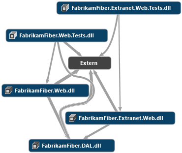

# Durchsuchen und Neuanordnen von Code Maps

Ordnen Sie Elemente in Codeübersichten neu an, damit sie leichter zu lesen sind und ihre Leistung gesteigert wird.

Sie können Codeübersichten ohne Auswirkungen auf den zugrunde liegenden Code in einer Projektmappe anpassen. Dies ist hilfreich, wenn Sie sich auf wichtige Elemente konzentrieren oder Ideen zum Code kommunizieren möchten. Um beispielsweise interessante Bereiche hervorzuheben, können Sie Codeelemente in der Übersicht auswählen und filtern, den Stil von Codeelemente und Links ändern, Codeelemente ausblenden oder löschen und Codeelemente mithilfe von Eigenschaften, Kategorien oder Gruppen organisieren.

 **Anforderungen**

- Um Codeübersichten erstellen zu können, müssen Sie über Visual Studio Enterprise verfügen.

- In Visual Studio Professional können Sie Codeübersichten anzeigen und diese im begrenzten Maße bearbeiten.

## Erste Schritte mit der Arbeit mit Codekarten

Erstellen Sie eine Codezuordnung (weitere Informationen finden Sie unter [Zuordnen von Abhängigkeiten in Ihren Lösungen).](../modeling/map-dependencies-across-your-solutions.md) Wenn Sie nicht warten möchten, bis die Karte mit der Generierung abgeschlossen ist, klicken Sie jederzeit auf den Link **Abbrechen,** um den Generierungsprozess zu beenden. Allerdings werden in diesem Fall nicht die Details aller Abhängigkeiten und Links angezeigt.

Nachdem Sie die Übersicht generiert haben, beginnen Sie mit diesen Tipps zum Überprüfen des Codes:

- Achten Sie auf die natürlichen Abhängigkeitscluster im Code. Wählen Sie auf der Kartensymbolleiste die Schaltfläche **Layout**,](../modeling/media/quickclustersicon.gif)Schnelle **Cluster**.

     

- Organisieren Sie die Übersicht in kleinere Bereiche, indem Sie verwandte Knoten gruppieren. Reduzieren Sie diese Gruppen, um nur die Abhängigkeiten zwischen den Gruppen zu sehen, die automatisch angezeigt werden. Siehe [Gruppenknoten](#OrganizeGroups).

- Verwenden Sie Filter, um die Übersicht zu vereinfachen und den Schwerpunkt auf die Typen von Knoten oder Links zu legen, an denen Sie interessiert sind. Siehe [Filterknoten und Links](#FilterNodes).

- Maximieren Sie die Leistung von großen Übersichten. Weitere Informationen finden Sie unter [Zuordnen von Abhängigkeiten in Ihren Lösungen.](../modeling/map-dependencies-across-your-solutions.md) Aktivieren Sie beispielsweise Build **auf** der Kartensymbolleiste, damit Visual Studio die Projektmappe nicht neu erstellt, wenn Sie Elemente auf der Karte aktualisieren.

## Ändern des Kartenlayouts

|**An**|**Auszuführende Schritte**|
|-|-|
|Ordnen Sie den Abhängigkeitsverlauf für die gesamte Übersicht in einer bestimmten Richtung an. Dies kann Ihnen helfen, Architekturebenen im Code zu finden.|Wählen Sie auf der Kartensymbolleiste **Layout**aus, und dann:   -   **Von oben nach unten**  -   **Von unten nach unten**  -   **Layout-Schaltfläche**  -   **Grafiktaste** |
|Zeigen Sie natürliche Abhängigkeitscluster im Code an, wobei die Knoten mit den meisten Abhängigkeiten in der Mitte der Cluster und die Knoten mit den wenigsten Abhängigkeiten an der Außenseite der Cluster angezeigt werden.|Wählen Sie auf der Kartensymbolleiste **Layout**aus, und dann die](../modeling/media/quickclustersicon.gif)Schaltfläche **Schnellcluster**![auf der Diagrammsymbolleiste .|
|Wählen Sie mindestens einen Knoten in der Übersicht aus.|Klicken Sie auf einen Knoten, um ihn auszuwählen. Um mehr als einen Knoten auszuwählen oder zu deaktivieren, halten Sie **STRG** gedrückt, während Sie darauf klicken.   Tastatur: Drücken Sie **TAB** oder verwenden Sie die Pfeiltasten, um das gepunktete Fokusrechteck auf einen Knoten zu verschieben, und drücken Sie **SPACE,** um es auszuwählen. Drücken Sie **STRG** + **SPACE,** um Knoten mit mehreren Auswahl- oder Deauswahlknoten auszuwählen.|
|Verschieben Sie bestimmte Knoten in der Übersicht.|Ziehen Sie die Knoten, um sie zu verschieben. Um andere Knoten und Links beim Ziehen von Knoten aus dem Weg zu verschieben, halten Sie die **UMSCHALTTASTE** gedrückt.   Tastatur: Halten Sie **STRG** gedrückt und drücken Sie die Pfeiltasten.|
|Ändern Sie das Layout in einer Gruppe unabhängig von den anderen Knoten und Gruppen in der Übersicht.|Wählen Sie einen Knoten aus, und öffnen Sie das Kontextmenü. Wählen Sie **Layout** und einen Layoutstil aus.   - oder -   Wählen Sie einen Knoten, und erweitern Sie, um die untergeordneten Knoten angezeigt. Klicken Sie auf den Knotentitel, um die Symbolleiste für das Gruppen-Popup anzuzeigen, und öffnen Sie den **Layoutstil des** Wählen Sie eines der Strukturlayouts, **Quick Clusters**oder **List View** (die den Inhalt der Gruppe in einer Liste anordnet).   Weitere Informationen finden Sie unter [Gruppenknoten.](#OrganizeGroups)|
|Machen Sie eine Aktion in der Übersicht rückgängig.|Drücken Sie **STRG** + **Z,** oder verwenden Sie den Befehl Visual Studio **Rückgängig.**|

## Durchsuchen der Karte

|**An**|**Auszuführende Schritte**|
|-|-|
|Überprüfen Sie die Übersicht.|Ziehen Sie die Übersicht mithilfe der Maus in eine beliebige Richtung.   - oder -   Halten Sie **die UMSCHALTTASTE** gedrückt, und drehen Sie das Mausrad, um horizontal zu scrollen. Halten Sie DIE + **UMSCHALT-STRG-Taste gedrückt,** und drehen Sie das Mausrad, um horizontal zu scrollen. **SHIFT**|
|Vergrößern oder verkleinern Sie die Übersicht.|Drehen Sie das Mausrad.   - oder -   Verwenden Sie die Dropdown-Liste **Zoom** auf der Codemap-Symbolleiste.   - oder -   Verwenden Sie die Tastenkombinationen. Um zu vergrößern, drücken Sie **STRG + UMSCHALT + .** (Punkt). Um die Verkleinerung zu verkleinern, drücken Sie **STRG + UMSCHALT + ,** (Komma).|
|Vergrößern Sie mit der Maus einen bestimmten Bereich.|Halten Sie die rechte Maustaste gedrückt, während Sie in diesem Bereich ein Rechteck um den für Sie interessanten Bereich aufziehen.|
|Ändern Sie die Größe der Übersicht, und passen Sie sie auf die Fenstergröße an.|Wählen Sie **Zoom in Fit** aus der **Zoom-Liste** auf der Codemap-Symbolleiste aus.   - oder -   Klicken **Zoom to fit** Sie auf  auf der Symbolleiste der Karte auf der Symbolleiste der Codezuordnung. Tastatur: drücken Sie **STRG + 0** (Null).|
|Suchen Sie anhand des Namens einen Knoten in der Übersicht. **Tipp:**  Dies funktioniert nur für Elemente auf der Karte. Um Elemente in der Projektmappe, aber nicht auf der Karte zu suchen, suchen Sie sie im **Projektmappen-Explorer**, und ziehen Sie sie dann in die Karte. (Ziehen Sie Ihre Auswahl, oder klicken Sie auf der Symbolleiste **des Projektmappen-Explorers** **auf Codemap anzeigen**).|1. Wählen **Find** Sie  auf der Symbolleiste der Karte auf der Symbolleiste der Codezuordnung (Tastatur: **STRG + F**), um das Suchfeld in der oberen rechten Ecke der Karte anzuzeigen. 2. Geben Sie den Elementnamen ein und drücken Sie **Return** oder klicken Sie auf das Symbol "Vergrößerung". Das erste Element, das mit dem Suchbegriff übereinstimmt, wird in der Übersicht hervorgehoben. 3. Um Ihre Suche anzupassen, öffnen Sie die Dropdown-Liste und wählen Sie eine Suchoption. Die Optionen **lauten:Next**suchen , **'Vorherige suchen**' und **Alle auswählen**. Klicken Sie auf die entsprechende Schaltfläche neben dem Textfeld „Suchen“.            Alternativ können Sie die Tastatur verwenden: Drücken Sie **F3,** um den nächsten übereinstimmenden Knoten auszuwählen, oder **UMSCHALT + F3,** um den vorherigen übereinstimmenden Knoten auszuwählen. 4. Wählen Sie eine der Optionen aus, die angeben, wie Suchbegriffe behandelt werden, indem Sie auf die Symbole unter dem Suchtextfeld klicken.            Die Optionen sind (von links nach rechts) für die Übereinstimmung unter Berücksichtigung der Groß-/Kleinschreibung, für die Übereinstimmung mit ganzem Wort, für die Verwendung der normalen .NET-Ausdruckssyntax und für das automatische Erweitern von Gruppen, um Übereinstimmungen für eingeschlossene Elemente anzuzeigen. **Wichtig:**  Sie können das Suchfeld nur verwenden, um Übereinstimmungen in reduzierten Gruppen zu finden, wenn diese Gruppen zuvor erweitert wurden. Wählen Sie diese Option unter dem Suchfeld aus, um diese Übereinstimmungen zu suchen und ihre übergeordneten Gruppen automatisch zu erweitern.|
|Wählen Sie alle nicht markierten Knoten aus.|Öffnen Sie das Kontextmenü für die ausgewählten Knoten. Wählen Sie **Auswählen**, **Auswahl invertieren**.|
|Wählen Sie weitere Knoten aus, die Links zu den ausgewählten Knoten aufweisen.|Öffnen Sie das Kontextmenü für die ausgewählten Knoten. Wählen Sie **Auswählen** und eine der folgenden Optionen:   - Um zusätzliche Knoten auszuwählen, die direkt mit dem ausgewählten Knoten verknüpft sind, wählen Sie **Eingehende Abhängigkeiten**aus. - Um zusätzliche Knoten auszuwählen, die direkt aus dem ausgewählten Knoten verknüpft sind, wählen Sie **Ausgehende Abhängigkeiten**aus. - Um zusätzliche Knoten auszuwählen, die direkt mit und aus dem ausgewählten Knoten verknüpft sind, wählen Sie **Both**. - Um alle Knoten auszuwählen, die mit und aus dem ausgewählten Knoten verknüpft sind, wählen Sie **Connected Subgraph**. - Um alle untergeordneten Elemente des ausgewählten Knotens auszuwählen, wählen Sie **Kinder**.|

## Filtern von Knoten und Links

|**An**|**Auszuführende Schritte**|
|-|-|
|Blenden Sie den Filterbereich ein oder aus.|Wählen Sie die Schaltfläche **Filter** auf der Codemap-Symbolleiste aus. Der Bereich **Filter** wird standardmäßig als Registerkarte im **Projektmappen-Explorer**angezeigt.|
|Filtern Sie die Typen von Knoten, die in der Übersicht angezeigt werden.|Legen Sie die Kontrollkästchen in der Liste **Codeelemente** im Bereich Filter fest, oder deaktivieren Sie sie.|
|Filtern Sie die Typen von Links, die in der Übersicht angezeigt werden.|Legen Sie die Kontrollkästchen in der Liste **Beziehungen** im Bereich Filter fest, oder deaktivieren Sie sie.|
|Blenden Sie Testprojektknoten in der Übersicht ein oder aus.|Legen Sie das Kontrollkästchen **Testelemente** in der Liste **Verschiedenes** im Bereich Filter fest, oder deaktivieren Sie es.|

Die im Bereich „Legende“ der Übersicht angezeigten Symbole spiegeln die von Ihnen in der Liste vorgenommenen Einstellungen wider. Um das Legendenbedienfeld ein- oder auszublenden, klicken Sie auf der Symbolleiste der Codezuordnung auf die Schaltfläche **Legende.**

## Überprüfen von Knoten und Verknüpfungen

In Codeübersichten werden die folgenden Arten von Links angezeigt:

- Ein einzelner Link stellt eine einzelne Beziehung zwischen zwei Knoten dar.

- Ein gruppenübergreifender Link stellt eine Beziehung zwischen zwei Knoten in unterschiedlichen Gruppen dar.

- Ein Aggregatlink stellt alle gleichgerichteten Beziehungen zwischen zwei Gruppen dar.

> [!TIP]
> Gruppenübergreifende Links werden in der Übersicht standardmäßig nur für ausgewählte Knoten angezeigt. Um dieses Verhalten so zu ändern, dass aggregierte Verknüpfungen zwischen Gruppen ein- oder ausgeblendet werden, klicken Sie auf der Codezuordnungssymbolleiste auf **Layout,** und wählen Sie **Erweitert**aus, und zeigen Sie dann **alle gruppenübergreifenden Links** an oder **blenden Sie alle gruppenübergreifenden Links aus.** Weitere Informationen finden Sie [unter Ausblenden oder Anzeigen](#HidingShowing) von Knoten und Links.

|**An**|**Auszuführende Schritte**|
|-|-|
|Zeigen Sie weitere Informationen zu einem Knoten oder Link an.|Bewegen Sie den Mauszeiger auf den Knoten oder Link, bis eine QuickInfo angezeigt wird.   Die QuickInfo eines Aggregatlinks enthält eine Liste der einzelnen Abhängigkeiten, die der Link darstellt.   - oder -   Öffnen Sie das Kontextmenü für den Knoten oder den Link. Wählen Sie **Bearbeiten**, **Eigenschaften**.|
|Zeigen Sie den Inhalt einer Gruppe an oder blenden Sie ihn aus.|- Um eine Gruppe zu erweitern, öffnen Sie das Kontextmenü für den Knoten und wählen Sie **Gruppe**, **Erweitern**.      - oder -      Bewegen Sie den Mauszeiger auf den Knoten, bis die Chevronschaltfläche (Pfeil nach unten) angezeigt wird. Klicken Sie auf diese Schaltfläche, um die Gruppe zu erweitern. Tastatur: Um die ausgewählte Gruppe zu erweitern**+** oder zu reduzieren,**-** drücken Sie die **PLUS-Taste** ( ) oder die **MINUS-Taste** ( ). - Um eine Gruppe zu reduzieren, öffnen Sie das Kontextmenü für den Knoten und wählen Sie **Gruppe**, **Reduzieren**.      - oder -      Bewegen Sie den Mauszeiger auf eine Gruppe, bis die Chevronschaltfläche (Pfeil nach oben) angezeigt wird. Klicken Sie auf diese Schaltfläche, um die Gruppe zu reduzieren. - Um alle Gruppen zu erweitern, drücken Sie **STRG** + **A,** um alle Knoten auszuwählen. Öffnen Sie das Kontextmenü für die Karte, und wählen Sie **Gruppe**, **Erweitern**. **Hinweis:**      Dieser Befehl ist nicht verfügbar, wenn das Erweitern aller Gruppen eine unbrauchbare Karte oder Speicherprobleme generiert. Es wird empfohlen, die Übersicht nur bis zu der Detailstufe zu erweitern, die Sie interessiert. - Um alle Gruppen zu reduzieren, öffnen Sie das Kontextmenü für einen Knoten oder für die Karte. Wählen Sie **Gruppe**, **Alle reduzieren**.|
|Zeigen Sie die Codedefinition für einen Namespace, einen Typ oder einen Member an.|Öffnen Sie das Kontextmenü für den Knoten, und wählen Sie **Go To Definition**.   Oder   Doppelklicken Sie auf den Knoten. Doppelklicken Sie bei erweiterten Gruppen auf den Header für die Gruppe.   Oder   Wählen Sie den Knoten aus und drücken **Sie F12**.   Beispiel:   - Für einen Namespace, der eine Klasse enthält, wird die Codedatei für die Klasse geöffnet, um die Definition dieser Klasse anzuzeigen. In anderen Fällen zeigt das Fenster **Symbolergebnisse suchen** eine Liste der Codedateien an. **Hinweis:**      Wenn Sie diese Aufgabe in einem Visual Basic-Namespace ausführen, wird die Codedatei hinter dem Namespace nicht geöffnet. Dieses Problem tritt auch auf, wenn Sie diese Aufgabe für eine Gruppe ausgewählter Knoten ausführen, die einen Visual Basic-Namespace enthalten. Sie können dieses Problem umgehen, indem Sie manuell zu der Codedatei hinter dem Namespace navigieren oder den Knoten für den Namespace nicht in die Auswahl einbeziehen. - Für eine Klasse oder eine Partielle Klasse wird die Codedatei für diese Klasse geöffnet, um die Klassendefinition anzuzeigen. - Für eine Methode wird die Codedatei für die übergeordnete Klasse geöffnet, um die Methodendefinition anzuzeigen.|
|Überprüfen Sie die Abhängigkeiten und Elemente, die Teil eines Aggregatlinks sind.|Wählen Sie die Links aus, die Sie interessieren, und öffnen Sie das Kontextmenü für Ihre Auswahl. Wählen Sie **Beitragslinks anzeigen** oder **Beitragslinks auf der neuen Codekarte anzeigen.**   Visual Studio erweitert die Gruppen an beiden Enden des Links und zeigt nur die Elemente und Abhängigkeiten an, die zu dem Link gehören. **Hinweis:**  Wenn Sie Abhängigkeiten zwischen Elementen in Teilgruppen untersuchen, wird möglicherweise dieses Verhalten angezeigt: <ul><li>Links zu Elementen, die nicht an der Prüfung teilnehmen, verschwinden von der Karte, obwohl diese Links noch vorhanden sind.</li><li>Angenommen, Sie überprüfen einen Link zu einem Element in einer partiellen Gruppe und überprüfen später einen anderen Link zum selben Element. Während der zweiten Überprüfung werden in der partiellen Gruppe des Ziels nur Elemente der ersten Prüfung angezeigt. Links und Zielelemente, die nicht an Ihrer ersten Prüfung, aber an Ihrer zweiten Prüfung teilgenommen haben, erscheinen nicht.</li></ul> Um fehlende Elemente aus einer Gruppe anzuzeigen, wählen](../modeling/media/dependencygraph_deletednodesicon.png) Sie Das Symbol **Kinder**![neu abrufen (was angibt, dass nicht alle Mitglieder einer Gruppe auf der Karte angezeigt werden). Sie können auch versuchen, Ihre Aktionen rückgängig zu machen (Tastatur: drücken **Sie STRG+Z**) und die Abhängigkeiten auf einer neuen Karte untersuchen.|
|Überprüfen Sie die Abhängigkeiten zwischen mehreren Knoten in unterschiedlichen Gruppen.|Erweitern Sie die Gruppen, sodass alle untergeordneten Elemente angezeigt werden. Wählen Sie alle für Sie interessanten Knoten aus – einschließlich der untergeordneten Elemente. In der Übersicht werden die gruppenübergreifenden Links zwischen den ausgewählten Knoten angezeigt.   Um alle Knoten in einer Gruppe auszuwählen, halten Sie die **UMSCHALTTASTE** und die linke Maustaste gedrückt, während Sie ein Rechteck um diese Gruppe zeichnen. Um alle Knoten auf einer Karte auszuwählen, drücken Sie **STRG**+**A**. **Tipp:**  Um gruppenübergreifende Links jederzeit anzuzeigen, wählen Sie **Layout** auf der Kartensymbolleiste, **Erweitert**, **Alle gruppenübergreifenden Links anzeigen**.|
|Zeigen Sie die Elemente an, auf die von einem Knoten oder Link verwiesen wird.|Öffnen Sie das Kontextmenü für den Knoten, und wählen Sie **Alle Referenzen suchen**aus. **Hinweis:**  Dies gilt `Reference` nur, wenn das Attribut für den Knoten oder Link in der .dgml-Datei der Karte festgelegt ist. Informationen zum Hinzufügen von Verweisen auf Elemente aus Knoten oder Verknüpfungen finden Sie unter [Anpassen von Codezuordnungen durch Bearbeiten der DGML-Dateien](../modeling/customize-code-maps-by-editing-the-dgml-files.md).|

## Ausblenden oder Anzeigen von Knoten und Links

Wenn Knoten ausgeblendet werden, werden sie von Layoutalgorithmen nicht berücksichtigt. Gruppenübergreifende Links werden standardmäßig ausgeblendet. Gruppenübergreifende Links sind einzelne Links, durch die Knoten über Gruppen hinweg verbunden sind. Beim Reduzieren von Gruppen werden alle gruppenübergreifenden Links in der Übersicht zu einzelnen Links zwischen Gruppen aggregiert. Wenn Sie eine Gruppe erweitern und Knoten in der Gruppe auswählen, werden gruppenübergreifende Links angezeigt, die die Abhängigkeiten in dieser Gruppe darstellen.

> [!CAUTION]
> Vergewissern Sie sich, dass alle Knoten bzw. gruppenübergreifenden Links, die andere Benutzer sehen sollen, eingeblendet sind, bevor Sie eine Übersicht für Benutzer von Visual Studio Professional freigeben, die in Visual Studio Enterprise erstellt wurde. Andernfalls können diese Benutzer diese Elemente nicht einblenden.

### So blenden Sie Knoten ein oder aus

|**An**|**Auszuführende Schritte**|
|-|-|
|Blenden Sie die ausgewählten Knoten aus.|1. Wählen Sie Knoten aus, die Sie ausblenden möchten. 2. Öffnen Sie das Kontextmenü für die ausgewählten Knoten oder für die Karte. Wählen Sie **Auswählen**, **Ausblende ausgewählt**.|
|Blenden Sie nicht ausgewählte Knoten aus.|1. Wählen Sie Knoten aus, die sichtbar bleiben sollen. 2. Öffnen Sie das Kontextmenü für die ausgewählten Knoten oder für die Karte. Wählen Sie **Auswählen**, **Ausblenden nicht ausgewählt**.|
|Zeigen Sie ausgeblendete Knoten an.|- Um alle ausgeblendeten Knoten innerhalb einer Gruppe anzuzeigen, stellen Sie zunächst sicher, dass die Gruppe erweitert wird. Öffnen Sie das Kontextmenü und wählen **Sie Auswählen**, **Einblenden von Kindern**.      - oder -      Klicken Sie in **der** linken Ecke der Gruppe auf das Symbol Kinder einblenden (dies ist nur sichtbar, wenn ausgeblendete untergeordnete Knoten vorhanden sind). - Um alle ausgeblendeten Knoten anzuzeigen, öffnen Sie das Kontextmenü für die Karte oder einen Knoten und wählen **Sie Auswählen**, **Alle einblenden**.|

### So blenden Sie Links ein oder aus

|**An**|**Wählen Sie auf der Übersichtssymbolleiste Layout, Erweitert und dann Folgendes aus:**|
|-|-|
|Dauerhaftes Anzeigen gruppenübergreifender Links.|**Alle gruppenübergreifenden Links anzeigen**. Bei Auswahl dieser Option werden Aggregatlinks zwischen Gruppen ausgeblendet.|
|Dauerhaftes ausblenden gruppenübergreifender Links.|**Alle gruppenübergreifenden Links ausblenden**|
|Anzeigen ausschließlich gruppenübergreifender Links für ausgewählte Knoten.|**Gruppenübergreifende Links für ausgewählte Knoten anzeigen**|
|Alle Links ausblenden.|**Alle Links ausblenden**. Wählen Sie eine der oben aufgeführten Optionen aus, um Links erneut anzuzeigen.|

## Gruppenknoten

|**An**|**Auszuführende Schritte**|
|-|-|
|Zeigen Sie Containerknoten als Gruppen- oder Blattknoten an.|Um Containerknoten als Blattknoten anzuzeigen: Wählen Sie die Knoten aus, öffnen Sie das Kontextmenü für Ihre Auswahl, und wählen Sie **Gruppe**, **In Blatt konvertieren**.   So zeigen Sie Containerknoten als Gruppenknoten an: Wählen Sie die Knoten aus, öffnen Sie das Kontextmenü für Ihre Auswahl, und wählen Sie **Gruppe**, **In Gruppe konvertieren**aus .|
|Ändern Sie das Layout in einer Gruppe.|Wählen Sie die Gruppe aus, öffnen Sie das Kontextmenü, wählen Sie **Layout**aus, und wählen Sie den gewünschten Layoutstil aus.   - oder -   1. Wählen Sie die Gruppe aus und stellen Sie sicher, dass sie erweitert wird. 2. Klicken Sie erneut auf den Gruppenkopf, und die Gruppensymbolleiste wird angezeigt.       3. Öffnen Sie den **Layoutstil der Gruppenliste**  &#45; Gruppensymbolleiste &#45; Layout und wählen Sie den gewünschten Layoutstil aus.   **In der Listenansicht** werden die Mitglieder der Gruppe in eine Liste neu angeordnet. **Graph Default** setzt das Gruppenlayout auf das Kartenstandardlayout zurück. Weitere Optionen finden Sie unter [Ändern des Kartenlayouts](#Selecting).|
|Fügen Sie einen Knoten zu einer Gruppe hinzu.|Ziehen Sie den Knoten auf die Gruppe.   Während Sie den Knoten ziehen, wird von Visual Studio durch einen Indikator angezeigt, dass Sie den Knoten verschieben.   Sie können Knoten auch aus einer Gruppe herausziehen.|
|Fügen Sie einen Knoten zu einem Knoten hinzu, der zu keiner Gruppe gehört.|Ziehen Sie den Knoten auf den Zielknoten. Sie können beliebige Zielknoten in eine Gruppe konvertieren, indem Sie ihm Knoten hinzufügen.|
|Gruppieren Sie ausgewählte Knoten.|1. Wählen Sie die Knoten aus, die Sie gruppieren möchten. Über dem zuletzt ausgewählten Knoten wird eine Popupsymbolleiste angezeigt.       2. Wählen Sie auf der Symbolleiste das vierte Symbol **Gruppe der ausgewählten Knoten** (wenn der Knoten erweitert wird, hat er fünf statt vier Symbole). Geben Sie den Namen für die neue Gruppe ein, und drücken Sie **Return**.      - oder -      Wählen Sie die zu gruppierenden Knoten aus, und öffnen Sie das Kontextmenü für Ihre Auswahl. Wählen Sie **Gruppe**, **Übergeordnete Gruppe hinzufügen**, geben Sie den Namen für die neue Gruppe ein, und drücken Sie **Return**.   Sie können eine Gruppe umbenennen. Öffnen Sie das Kontextmenü für die Gruppe, und wählen Sie **Bearbeiten**, **Eigenschaften** aus, um das Visual Studio-Eigenschaftenfenster zu öffnen. Benennen Sie die Gruppe in der **Label-Eigenschaft** nach Bedarf um.|
|Entfernen Sie Gruppen.|Wählen Sie die Gruppe oder die Gruppen aus, die Sie entfernen möchten. Öffnen Sie das Kontextmenü für Ihre Auswahl und wählen Sie **Gruppe**, **Gruppe entfernen**.|
|Entfernen Sie Knoten aus der übergeordneten Gruppe.|Wählen Sie die Knoten aus, die Sie verschieben möchten. Öffnen Sie das Kontextmenü für Ihre Auswahl und wählen Sie **Gruppe**, **Aus übergeordnet entfernen**. Dadurch werden Knoten bis zur zweiten übergeordneten Ebene oder außerhalb der Gruppe entfernt, wenn keine zweite übergeordnete Ebene vorhanden ist.   - oder -   Wählen Sie die Knoten aus, und ziehen Sie sie aus der Gruppe.|

## Hinzufügen, Entfernen oder Umbenennen von Knoten, Links und Kommentaren

Sie können in einer Übersicht mehr oder weniger Elemente anzeigen, um Detailinformationen einzublenden oder die Übersicht zu vereinfachen. Sie können Elemente auch entfernen und ihnen Kommentare hinzufügen.

> [!CAUTION]
> Vergewissern Sie sich vor dem Freigeben einer mit Visual Studio Enterprise erstellten Übersicht für Benutzer von Visual Studio Professional, dass alle Codeelemente in der Übersicht angezeigt werden, die für andere angezeigt werden sollen. Andernfalls können diese Benutzer gelöschte Codeelemente nicht abrufen.

### Hinzufügen eines Knotens für ein Codeelement

|**An**|**Auszuführende Schritte**|
|-|-|
|Fügen Sie einen neuen generischen Knoten an der aktuellen Position des Mauszeigers hinzu.|1. Bewegen Sie den Mauszeiger an die Stelle auf der Karte, an der Sie das neue Codeelement einfügen möchten, und drücken **Sie Einfügen**.      - oder -      Öffnen Sie das Kontextmenü für die Karte und wählen Sie **Bearbeiten**, **Hinzufügen**, **Generischer Knoten**. 2. Geben Sie den Namen für den neuen Knoten ein, und drücken Sie **Return**.|
|Fügen Sie eine bestimmte Art von Codeelementknoten an der aktuellen Position des Mauszeigers ein.|1. Bewegen Sie den Mauszeiger an die Stelle auf der Karte, an der Sie das neue Codeelement platzieren möchten, und öffnen Sie das Kontextmenü für die Karte. 2. Wählen Sie **Bearbeiten**, **Hinzufügen**, und wählen Sie den gewünschten Knotentyp aus. 3. Geben Sie den Namen für den neuen Knoten ein und drücken Sie **Return**.|
|Fügen Sie einen generischen oder eine bestimmte Art von Codeelementknoten zu einer Gruppe hinzu.|1. Wählen Sie den Gruppenknoten aus und öffnen Sie das Kontextmenü. 2. Wählen Sie **Bearbeiten**, **Hinzufügen**, und wählen Sie den gewünschten Knotentyp aus. 3. Geben Sie den Namen für den neuen Knoten ein und drücken Sie **Return**.|
|Fügen Sie einen neuen Knoten desselben Typs hinzu, der mit einem vorhandenen Knoten verknüpft ist.|1. Wählen Sie das Codeelement aus. Darüber wird eine Popupsymbolleiste angezeigt.       2. Wählen Sie auf der Symbolleiste das zweite Symbol **Erstellen eines Knotens mit derselben Kategorie wie dieser Node aus, und fügen Sie ihm einen neuen Link hinzu.** 3. Wählen Sie einen Ort auf der Karte, um das neue Code-Element zu setzen und klicken Sie auf die linke Maustaste. 4. Geben Sie den Namen für den neuen Knoten ein und drücken Sie **Return**.|
|Fügen Sie einen neuen generischen Knoten hinzu, der mit einem vorhandenen Codeleement verknüpft ist, das über den Fokus verfügt.|1. Drücken Sie mit der Tastatur die **Tabulatortaste,** bis das Codeelement, von dem aus eine Verknüpfung besteht, den Fokus (gepunktetes Rechteck) hat. 2. Drücken Sie **Alt**+**Insert**. 3. Geben Sie den Namen für den neuen Knoten ein und drücken Sie **Return**.|
|Fügen Sie einen neuen generischen Knoten hinzu, der mit einem vorhandenen Codeleement verknüpft ist, das über den Fokus verfügt.|1. Drücken Sie mit der Tastatur die **Tabulatortaste,** bis das Codeelement, mit dem eine Verknüpfung hergestellt werden soll, den Fokus (gepunktetes Rechteck) hat. 2. Drücken Sie **Alt**+**Shift**+**Insert**. 3. Geben Sie den Namen für den neuen Knoten ein und drücken Sie **Return**.|

|**So fügen Sie Codeelemente hinzu für**|**Auszuführende Schritte**|
|-|-|
|Codeelemente in der Projektmappe.|1. Suchen Sie das Codeelement im **Projektmappen-Explorer**. Verwenden Sie das Suchfeld **Projektmappen-Explorer,** oder durchsuchen Sie die Projektmappe. **Tipp:**      Um Codeelemente zu suchen, die von einem Typ oder einem Member abhängig sind, öffnen Sie das Kontextmenü für den Typ oder das Element im **Projektmappen-Explorer**. Wählen Sie die Beziehung aus, die Sie interessiert. **Der Projektmappen-Explorer** zeigt nur die Codeelemente mit den angegebenen Abhängigkeiten an. 2. Ziehen Sie die Codeelemente, die Sie interessieren, auf die Kartenoberfläche. Sie können Codeelemente auch aus der Klassenansicht oder dem Objektkatalog ziehen.      - oder -      Wählen Sie im **Projektmappen-Explorer**die Codeelemente aus, die Sie zuordnen möchten. Klicken Sie dann auf der **Symbolleiste des Projektmappen-Explorers** auf **Codemap**anzeigen .   Standardmäßig wird die übergeordnete Containerhierarchie für die neuen Codeelemente in der Übersicht angezeigt. Verwenden Sie die Schaltfläche **Eltern einschließen** auf der Codezuordnungssymbolleiste, um dieses Verhalten zu ändern. Wenn diese Option deaktiviert ist, wird nur das Codeelement zur Übersicht hinzugefügt. Um dieses Verhalten für nur eine Drag & Drop-Aktion umzukehren, halten Sie die **STRG-Taste** gedrückt, während Sie die Codeelemente auf die Karte ziehen.   Von Visual Studio werden Codeelemente für die Codeelemente der obersten Ebene in der Auswahl hinzugefügt. Bewegen Sie den Mauszeiger über dem Anfang des Codeelements, sodass das Chevron (Pfeil nach unten) angezeigt wird, um zu prüfen, ob ein Codeelement andere Codeelemente enthält. Wählen Sie das Chevron aus, um das Codeelement zu erweitern. Um alle Codeelemente zu erweitern, drücken Sie **STRG**+**A,** um alle Elemente auszuwählen, öffnen Sie das Kontextmenü für die Karte, und wählen Sie **Gruppe**, **Erweitern**. Dieser Befehl ist nicht verfügbar, wenn das Erweitern aller Gruppen zu einer nicht verwendbaren Übersicht oder zu Speicherproblemen führt.|
|Auf Codeelemente in der Übersicht bezogene Codeelemente.|Klicken Sie auf der Symbolleiste der Codezuordnung auf die Schaltfläche **"Verwandte anzeigen"** und wählen Sie den Typ der verknüpften Elemente aus, die Sie interessieren.   - oder -   Öffnen Sie das Kontextmenü für das Codeelement. Wählen Sie eines der **Show ...** Elemente im Menü, abhängig von der Art der Beziehung, die Sie interessiert. Beispielsweise können Sie Elemente, auf die das aktuelle Element verweist, Elemente, die auf das aktuelle Element verweisen, Basis- und abgeleitete Typen für Klassen, Methodenaufrufer und die enthaltenden Klassen, Namespaces sowie Assemblys anzeigen.   Weitere Informationen finden Sie in [diesem Thema](../modeling/map-dependencies-across-your-solutions.md).|
|Kompilierte .NET-Assemblys (DLL oder EXE) oder Binärdateien.|Ziehen Sie die Assemblys oder Binärdateien, die sich außerhalb von Visual Studio befinden, in eine Übersicht.   Das Ziehen aus Windows-Explorer oder Datei-Explorer ist nur möglich, wenn der betreffende Explorer und Visual Studio auf der gleichen Berechtigungsstufe der Benutzerkontensteuerung (User Account Control, UAC) ausgeführt werden. Beispiel: Wenn Sie Visual Studio bei aktivierter UAC als Administrator ausführen, wird der Ziehvorgang von Windows-Explorer oder Datei-Explorer blockiert.|

### 

#### Hinzufügen von Links zwischen vorhandenen Codeelementen

1. Wählen Sie das Quellcodeelement aus. Über dem Codeelement wird eine Symbolleiste angezeigt.

    

2. Wählen Sie auf der Symbolleiste das erste Symbol aus, **Erstellen eines neuen Links von diesem Knoten zu dem Knoten, auf den Sie als nächstes klicken.**

3. Wählen Sie das Zielcodeelement aus. Zwischen den beiden Codeelementen wird ein Link angezeigt.

**Oder**

1. Wählen Sie das Quellcodeelement in der Übersicht aus.

2. Wenn Sie eine Maus installiert haben, bewegen Sie den Mauszeiger außerhalb der Begrenzungen der Übersicht.

3. Öffnen Sie das Kontextmenü des Codeelements, und **wählen** > Sie**Generische Verknüpfung****hinzufügen** > bearbeiten aus.

4. Wechseln Sie mithilfe der TABULATORTASTE zum Zielknotenelement für den Link.

5. Drücken Sie die **EINGABETASTE**.

### 

#### Hinzufügen eines Kommentars zu einem vorhandenen Knoten in der Übersicht

1. Wählen Sie das Codeelement aus. Darüber wird eine Symbolleiste angezeigt.

     

2. Wählen Sie auf der Symbolleiste das dritte Symbol **aus, Erstellen eines neuen Kommentarknotens mit einem neuen Link zum ausgewählten Knoten**.

     \- oder –

     Öffnen Sie das Kontextmenü für das Codeelement, und wählen Sie**Neuer Kommentar** **bearbeiten** > aus.

3. Geben Sie Ihre Kommentare ein. Um in einer neuen Zeile einzugeben, drücken Sie **die Umschalteingabe** + **Enter**.

#### Hinzufügen eines Kommentars zur Übersicht

1. Öffnen Sie das Kontextmenü für die Karte und wählen Sie**Neue Kommentare** **bearbeiten** > aus.

2. Geben Sie Ihre Kommentare ein. Um in einer neuen Zeile einzugeben, drücken Sie **die Umschalteingabe** + **Enter**.

### 

#### Umbenennen eines Codeelements oder Links

1. Wählen Sie das Codeelement oder den Link aus, das bzw. der umbenannt werden soll.

2. Drücken Sie **F2**, oder öffnen Sie das Kontextmenü, und wählen Sie**Umbenennen** **bearbeiten** > aus.

3. Wenn das Eingabefeld in der Übersicht angezeigt wird, benennen Sie das Codeelement oder den Link um.

**Oder**

1. Öffnen Sie das Kontextmenü und wählen Sie**Eigenschaften** **bearbeiten** > .

2. Bearbeiten Sie die **Label-Eigenschaft** im Visual Studio-Eigenschaftenfenster.

#### Entfernen eines Codeelements oder Links aus der Übersicht

1. Wählen Sie das Codeelement oder den Link aus, und drücken Sie die **Taste Löschen.**

     \- oder –

     Öffnen Sie das Kontextmenü für das Codeelement oder den Link, und wählen Sie**Entfernen** **bearbeiten** > aus.

2. Wenn das Element oder der Link **Refetch Children** Teil einer  wird die Schaltfläche Kinder abrufen innerhalb der Gruppe angezeigt. Klicken Sie auf diese Option, um fehlende Elemente und Links abzurufen.

- Sie können Codeelemente und Links ohne Auswirkungen auf den zugrunde liegenden Code aus einer Übersicht entfernen. Wenn Sie diese löschen, werden die zugehörigen Definitionen aus der DGML-Datei (.dgml) entfernt.

- Die über die DGML-Datei durch Hinzufügen nicht definierter Codeelemente oder durch Verwenden früherer Versionen von Visual Studio erstellten Übersichten unterstützen diese Funktion nicht.

#### Kennzeichnen eines Codeelements zur Nachverfolgung

1. Wählen Sie das Codeelement oder den Link aus, das bzw. den Sie zur Nachverfolgung kennzeichnen möchten.

2. Öffnen Sie das Kontextmenü und wählen Sie**Flag für Follow Up** **bearbeiten** > .

- Das Codeelement erhält standardmäßig einen roten Hintergrund. Erwägen Sie, ihm einen Kommentar mit den entsprechenden Follow-up-Informationen [hinzuzufügen.](#AddComments)

- Ändern Sie die Hintergrundfarbe des Elements, oder löschen Sie das Nachverfolgungsflag, indem Sie**Andere Flaggenfarben** **bearbeiten** > auswählen.

## Ändern des Stils eines Codeelements oder einer Verknüpfung

Sie können die Symbole für Codeelemente und die Farben von Codeelementen und Links mithilfe vordefinierter Symbole und Farben ändern. Sie können z. B. eine Farbe auswählen, um Codeelemente und Links hervorzuheben, die eine bestimmte Kategorie oder Eigenschaft aufweisen. Dadurch können Sie bestimmte Bereiche der Übersicht kennzeichnen und sich auf diese Bereiche konzentrieren. Sie können benutzerdefinierte Symbole und Farben angeben, indem Sie die .dgml-Datei der Karte bearbeiten. siehe [Anpassen von Codezuordnungen durch Bearbeiten der DGML-Dateien](../modeling/customize-code-maps-by-editing-the-dgml-files.md).

### So wenden Sie eine vordefinierte Farbe oder ein vordefiniertes Symbol auf Codelemente oder Links mit einer bestimmten Kategorie oder Eigenschaft an

1. Wählen Sie auf der Kartensymbolleiste **Legende**aus.

2. Sehen Sie im Feld **Legende,** ob die Codeelementkategorie oder -eigenschaft bereits in der Liste angezeigt wird.

3. Wenn die Liste die Kategorie oder **+** Eigenschaft nicht enthält, wählen Sie im Feld **Legende** aus, und wählen Sie dann **Knoteneigenschaft**, **Knotenkategorie**, **Verknüpfungseigenschaft**oder **Verknüpfungskategorie aus.** Wählen Sie dann die Eigenschaft oder Kategorie aus. Die Kategorie oder Eigenschaft wird nun im Feld **Legende** angezeigt.

    > [!NOTE]
    > Um eine Kategorie oder eine Eigenschaft zu erstellen und einem Codeelement zuzuweisen, können Sie die .dgml-Datei der Karte bearbeiten. siehe [Anpassen von Codezuordnungen durch Bearbeiten der DGML-Dateien](../modeling/customize-code-maps-by-editing-the-dgml-files.md).

4. Klicken Sie im Feld **Legende** auf das Symbol neben der Kategorie oder Eigenschaft, die Sie hinzugefügt haben oder ändern möchten.

5. Orientieren Sie sich beim Auswählen des zu ändernden Stils an der folgenden Tabelle:

    |**Zu änderndes Merkmal**|**Wählen**|
    |-|-|
    |Hintergrundfarbe:|**Hintergrund**|
    |Umrissfarbe|**Takt**|
    |Textfarbe (ein Buchstabe "f" wird angezeigt, um das Ergebnis anzuzeigen)|**Vordergrund**|
    |Symbol|**Symbole**|

     Das Dialogfeld **Farbsatzauswahl** oder **Icon Set Picker** wird angezeigt, in dem Sie eine Farbe oder ein Symbol auswählen können.

6. Führen Sie im Dialogfeld **Farbsatzauswahl** oder **Icon Set Picker** eine der folgenden Schritte aus:

    |**Anzuwendendes Merkmal**|**Auszuführende Schritte**|
    |-|-|
    |Farbsatz oder Symbolsatz|Öffnen Sie die **Setliste** **Farbe** auswählen (oder **Symbol**). Wählen Sie einen Farbsatz oder Symbolsatz aus.|
    |Bestimmte Farbe oder bestimmtes Symbol|Öffnen Sie die Liste für Kategorie- bzw. Eigenschaftswerte. Wählen Sie eine Farbe oder ein Symbol aus.|

    > [!NOTE]
    > Sie können Stile im Feld **Legende** neu anordnen, löschen oder vorübergehend deaktivieren. Siehe [Bearbeiten des Felds Legende](#ModifyLegend).

## Bearbeiten des Felds Legende

Sie können Stile im Feld **Legende** neu anordnen, löschen oder vorübergehend deaktivieren:

1. Öffnen Sie das Kontextmenü für einen Stil im Feld **Legende.**

2. Führen Sie eine der folgenden Aufgaben aus:

    |**An**|**Wählen**|
    |-|-|
    |Deaktivieren des Codeelements|**Deaktivieren**|
    |Löschen des Codeelements|**Richtlinie**|
    |Verschieben des Stils nach oben|**Nach oben**|
    |Verschieben des Codeelements nach unten|**Nach unten**|

## Kopieren von Formatvorlagen von einer Karte in eine andere

1. Stellen Sie sicher, dass das Feld **Legende** auf der Quellkarte angezeigt wird. Wenn sie nicht sichtbar ist, klicken Sie auf der Symbolleiste der Karte auf **Legende**.

2. Öffnen Sie das Kontextmenü für das Feld **Legende.** Wählen Sie **Legende kopieren**.

3. Fügen Sie die Legende in der Zielübersicht ein.

## Zusammenführen von Codezuordnungen

Sie können Übersichten durch Kopieren und Einfügen von Codeelementen zwischen Übersichten zusammenführen. Wenn die Codeelementbezeichner übereinstimmen, entspricht das Einfügen von Codeelementen einem Zusammenführungsvorgang. Sie können diese Aufgabe vereinfachen, indem Sie alle zu visualisierenden Assemblys oder Binärdateien im selben Ordner ablegen, damit der vollständige Pfad jeder Assembly oder Binärdatei für jede Übersicht, die Sie zusammenführen möchten, gleich ist.

Alternativ können Sie diese Assemblys oder Binärdateien aus diesem Ordner in dieselbe Übersicht ziehen.

## Weitere Informationen

- [Projektmappenübergreifendes Zuordnen von Abhängigkeiten](../modeling/map-dependencies-across-your-solutions.md)
- [Verwenden von Code Maps zum Debuggen von Anwendungen](../modeling/use-code-maps-to-debug-your-applications.md)
- [Ermitteln potenzieller Probleme mithilfe von Code Map-Analyzern](../modeling/find-potential-problems-using-code-map-analyzers.md)
- [Anpassen von Code Maps durch Bearbeiten der DGML-Dateien](../modeling/customize-code-maps-by-editing-the-dgml-files.md)
- [Referenz zur Directed Graph Markup Language (DGML)](../modeling/directed-graph-markup-language-dgml-reference.md)
