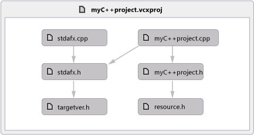
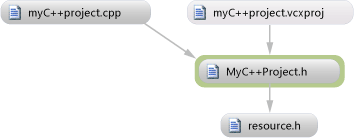

# Karten für C++-Projekte

Wenn Sie ausführlichere Code Maps für C++-Projekte erstellen möchten, aktivieren Sie für diese Projekte die Compileroption zum Durchsuchen von Informationen (**/FR**). Andernfalls werden Sie anhand einer Meldung aufgefordert, diese Option festzulegen. Bei Auswahl von **OK**wird die Option nur für die aktuelle Code Map festgelegt. Sie können angeben, dass die Meldung für alle späteren Code Maps ausgeblendet werden soll.

Wenn Sie eine Projektmappe öffnen, die Visual C++-Projekte enthält, könnte die Aktualisierung der IntelliSense-Datenbank etwas Zeit beanspruchen. Während dieser Zeit nicht möglicherweise Karten für Header erstellen (*h* oder `#include`) Dateien bis IntelliSense Datenbank Aktualisierung abgeschlossen ist. Sie können den Status der Aktualisierung in der Statusleiste von Visual Studio überwachen.

- Um eine Abhängigkeit zwischen allen Quelldateien und Headerdateien in der Projektmappe, aktivieren **Architektur** > **Diagramm von Includedateien generiert**.

   

- Um Abhängigkeiten zwischen den aktuell geöffneten Datei und zugehörige Quelldateien und Headerdateien anzuzeigen, öffnen Sie die Quelldatei oder die Header-Datei. Öffnen Sie das Kontextmenü "Datei" an einer beliebigen Stelle in der Datei. Wählen Sie **Diagramm für Includedateien generieren**aus.

   

## Problembehandlung bei Karten für C- und C++-code

Diese Elemente werden für C- und C++-Code nicht unterstützt:

- Basistypen werden in Code Maps, die die übergeordnete Hierarchie enthalten, nicht angezeigt.

- Die meisten Elemente im Menü **Anzeigen** sind für C- und C++-Code nicht verfügbar.

Diese Probleme können auftreten, wenn Sie Karten für C- und C++-Code erstellen:

|**Problem**|**Mögliche Ursache**|**Auflösung**|
|-|-|-|
|Fehler beim Generieren der Code Map.|Kein Projekt in der Projektmappe wurde erfolgreich erstellt.|Korrigieren Sie die aufgetretenen Buildfehler, und generieren Sie dann die Code Map erneut.|
|Visual Studio reagiert beim erzeugen einen Code aus der **Architektur** Menü.|Die Programmdatenbankdatei (.pdb) ist möglicherweise beschädigt.   In einer PDB-Datei werden Debuginformationen gespeichert, z. B. Typ, Methode und Quelldateiinformationen.|Erstellen Sie die Projektmappe neu, und versuchen Sie es dann erneut.|
|Bestimmte Einstellungen für die IntelliSense-Suchdatenbank sind deaktiviert.|IntelliSense Einstellungen können in Visual Studio deaktiviert **Optionen** Dialogfeld.|Aktivieren Sie die Einstellungen, um sie verfügbar zu machen.   Finden Sie unter [Optionen, Text-Editor, C/C++, erweitert](../ide/reference/options-text-editor-c-cpp-advanced.md).|
|Die Meldung **Unbekannte Methode** wird in einem Methodenknoten angezeigt.   Dieses Problem tritt auf, da der Name der Methode nicht aufgelöst werden kann.|Die Binärdatei weist möglicherweise keine Basisverschiebungstabelle auf.|Aktivieren Sie die Option **/FIXED:NO** im Linker.|
||Die Programmdatenbankdatei (.pdb) wird möglicherweise nicht erstellt.   In einer PDB-Datei werden Debuginformationen gespeichert, z. B. Typ, Methode und Quelldateiinformationen.|Aktivieren Sie die Option **/DEBUG** im Linker.|
||Die PDB-Datei kann an den erwarteten Speicherorten nicht geöffnet oder gefunden werden.|Stellen Sie sicher, dass die PDB-Datei an den erwarteten Speicherorten vorhanden ist.|
||Debuginformationen wurden aus der PDB-Datei entfernt.|Wenn die Option **/PDBSTRIPPED** im Linker verwendet wurde, schließen Sie stattdessen die vollständige PDB-Datei ein.|
||Der Aufrufer ist keine Funktion und ist entweder ein Thunk in der Binärdatei oder ein Zeiger im Datenabschnitt.|Wenn der Aufrufer ein Thunk ist, versuchen Sie, den Thunk mithilfe von `_declspec(dllimport)` zu vermeiden.|

## Siehe auch

- [Zuordnen von Abhängigkeiten mit Code maps](../modeling/map-dependencies-across-your-solutions.md)