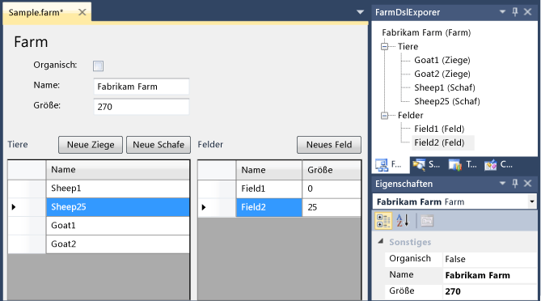
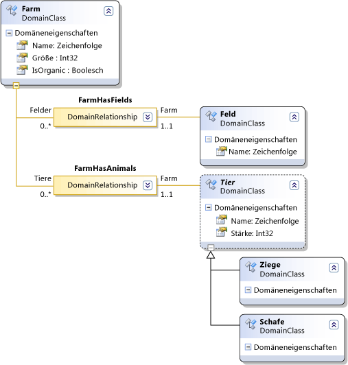
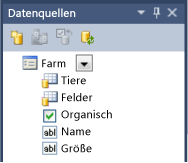

# <a name="creating-a-windows-forms-based-domain-specific-language"></a>Erstellen einer Windows Forms-basierten domänenspezifischen Sprache
Sie können Windows Forms verwenden, um den Status eines Modells mit einer domänenspezifischen Sprache (DSL), anstatt von einem DSL-Diagramm anzuzeigen. Dieses Thema führt Sie durch die Bindung von einem Windows Form an einer DSL, die mit dem Visual Studio-Visualisierungs und Modellierungs-SDK.

  ein DSL-Instanz, eine Windows-Formular-Benutzeroberfläche und den Modell-Explorer angezeigt.

## <a name="creating-a-windows-forms-dsl"></a>Erstellen einer Windows Forms-DSL
 Die **minimaler WinForm-Designer** DSL-Vorlage erstellt eine minimale DSL, die Sie ändern können, um Ihre eigenen Anforderungen anpassen.

#### <a name="to-create-a-minimal-winforms-dsl"></a>Um eine minimale WinForms-DSL erstellen

1. Erstellen Sie eine DSL aus der **minimaler WinForm-Designer** Vorlage.

    In dieser exemplarischen Vorgehensweise werden die folgenden Namen angenommen:


   | | |
   |-|-|
   | Namen von Projektmappen und DSL | FarmApp |
   | Namespace | Company.FarmApp |


2. Experimentieren Sie mit dem ersten Beispiel, das die Vorlage bereitstellt:

   1.  Transformieren Sie alle Vorlagen.

   2.  Erstellen und Ausführen des Beispiels (**STRG + F5**).

   3.  Öffnen Sie in der experimentellen Instanz von Visual Studio die `Sample` Datei im Projekt debuggen.

        Beachten Sie, dass er in einem Windows Forms-Steuerelement angezeigt wird.

        Sie sehen auch die Elemente des Modells im Explorer angezeigt.

        Fügen Sie einige Elemente in das Formular oder den Explorer, und beachten Sie, dass sie in der anderen Anzeige angezeigt werden.

   Beachten Sie in der Hauptinstanz von Visual Studio die folgenden Punkte bezüglich der DSL-Projektmappe aus:

-   `DslDefinition.dsl` enthält keine Diagrammelemente. Dies ist, da Sie DSL-Diagrammen nicht verwenden werden, um Modelle dieser DSL Instanz anzuzeigen. Stattdessen, binden Sie ein Windows-Formular für das Modell und die Elemente auf dem Formular werden das Modell angezeigt.

-   Zusätzlich zu den `Dsl` und `DslPackage` Projekte die Projektmappe enthält ein drittes Projekt mit dem Namen `UI.` **UI** Projekt enthält die Definition eines Windows Forms-Steuerelements. `DslPackage` hängt von `UI`, und `UI` hängt `Dsl`.

-   In der `DslPackage` Projekt `UI\DocView.cs` enthält den Code, in dem das Windows Forms-Steuerelement angezeigt, die in definiert ist die `UI` Projekt.

-   Die `UI` -Projekt enthält ein funktionstüchtiges Beispiel ein Formularsteuerelement gebunden an die DSL. Es funktioniert jedoch nicht, wenn Sie der DSL-Definition geändert haben. Die `UI` -Projekt enthält:

    -   Eine Windows Forms-Klasse, die mit dem Namen `ModelViewControl`.

    -   Eine Datei namens `DataBinding.cs` , enthält eine weitere partielle Definition der `ModelViewControl`. Um seinen Inhalt anzuzeigen **Projektmappen-Explorer**, öffnen Sie das Kontextmenü für die Datei, und wählen Sie **Ansichtscode**.

### <a name="about-the-ui-project"></a>Über das UI-Projekt
 Wenn Sie die DSL-Definitionsdatei definieren Ihrer eigenen DSL aktualisieren, müssen beim Aktualisieren des Steuerelements in der `UI` Projekts, der Ihre DSL angezeigt. Im Gegensatz zu den `Dsl` und `DslPackage` -Projekten, das Beispiel `UI` Projekt wird nicht von generiert `DslDefinitionl.dsl`. Sie können die TT-Dateien, um den Code generieren, wenn Sie möchten, obwohl, die in dieser exemplarischen Vorgehensweise nicht behandelt wird hinzufügen.

## <a name="updating-the-dsl-definition"></a>Aktualisieren der DSL-Definition
 Die folgenden, die die DSL-Definition in dieser exemplarischen Vorgehensweise verwendet wird.

 

#### <a name="to-update-the-dsl-definition"></a>Die DSL-Definition aktualisieren

1.  Öffnen Sie "DslDefinition.DSL" in der DSL-Designer an.

2.  Löschen Sie **ExampleElement**

3.  Benennen Sie die **ExampleModel** Domänenklasse `Farm`.

     Geben Sie ihm weitere Domäne-Eigenschaften, die mit der Bezeichnung `Size` des Typs **Int32**, und `IsOrganic` des Typs **booleschen**.

    > [!NOTE]
    >  Wenn Sie die Stammklasse für die Domäne zu löschen, und klicken Sie dann eine neue Stamm erstellen, müssen Sie die Editor-Stammklasse Eigenschaft zurückgesetzt. In **DSL-Explorer**Option **Editor**. Legen Sie dann im Fenster Eigenschaften **Stammklasse** zu `Farm`.

4.  Verwenden der **benannte Domänenklasse** Tool, um die folgenden Domänenklassen zu erstellen:

    -   `Field` -Geben Sie dieser eine weitere Domäne-Eigenschaft, die mit dem Namen `Size`.

    -   `Animal` -Die, legen Sie im Fenster **Vererbungsmodifizierer** zu **abstrakte**.

5.  Verwenden der **Domänenklasse** Tool, um die folgenden Klassen zu erstellen:

    -   `Sheep`

    -   `Goat`

6.  Verwenden der **Vererbung** Tool zum Erstellen von `Goat` und `Sheep` erben `Animal`.

7.  Verwenden der **Embedding** Tool zum Einbetten `Field` und `Animal` unter `Farm`.

8.  Möglicherweise möchten das Diagramm übersichtlicher zu machen. Verwenden Sie zum Verringern der Anzahl von doppelten Elementen der **Teilstruktur hier zu bringen** Befehl im Kontextmenü der untergeordneten Elemente.

9. **Alle Vorlagen transformieren** auf der Symbolleiste des Projektmappen-Explorer.

10. Erstellen der **Dsl** Projekt.

    > [!NOTE]
    >  In dieser Phase werden die anderen Projekte nicht fehlerfrei erstellt. Allerdings möchten wir die Dsl-Projekt erstellen, damit die Assembly für die Datenquellen-Assistenten verfügbar ist.

## <a name="updating-the-ui-project"></a>Aktualisieren das UI-Projekt
 Jetzt können Sie ein neues Benutzersteuerelement erstellen, das die Informationen angezeigt werden, die in das DSL-Modell gespeichert ist. Die einfachste Möglichkeit, die das Benutzersteuerelement mit dem Modell hergestellt wird, über datenbindungen. Die Adaptertyp mit dem Namen für die Datenbindung **ModelingBindingSource** wurde speziell für die Verbindung nicht VMSDK-Schnittstellen mit DSLs.

#### <a name="to-define-your-dsl-model-as-a-data-source"></a>Definieren Sie Ihre DSL-Modell als Datenquelle

1.  Auf der **Daten** Menü wählen **Datenquellen anzeigen**.

     Die **Datenquellen** Fenster wird geöffnet.

     Wählen Sie **neue Datenquelle hinzufügen**. Die **Assistenten zur Datenquellenkonfiguration** wird geöffnet.

2.  Wählen Sie **Objekt**, **Weiter**.

     Erweitern Sie **Dsl**, **Company.FarmApp**, und wählen Sie **Farm**, dies ist die Stammklasse des Modells. Klicken Sie auf **Fertig stellen**.

     Im Projektmappen-Explorer die **UI** Projekt enthält jetzt **Properties\DataSources\Farm.datasource**

     Die Eigenschaften und Beziehungen Ihrer Modellklasse, die in das Fenster "Datenquellen" angezeigt werden.

     

#### <a name="to-connect-your-model-to-a-form"></a>Um Ihr Modell zu einem Formular verbinden

1. In der **UI** Projekt, löschen Sie alle vorhandenen cs-Dateien.

2. Fügen Sie einen neuen **Benutzersteuerelement** Datei mit dem Namen `FarmControl` auf die **UI** Projekt.

3. In der **Datenquellen** Fenster im Dropdown-Menü auf **Farm**, wählen Sie **Details**.

    Übernehmen Sie die Standardeinstellungen für die anderen Eigenschaften aus.

4. Öffnen Sie in der Entwurfsansicht FarmControl.cs.

    Ziehen Sie **Farm** aus dem Fenster Datenquellen auf FarmControl.

    Eine Gruppe von Steuerelementen angezeigt wird, eine für jede Eigenschaft. Die Beziehungseigenschaften generieren keine Steuerelemente.

5. Löschen Sie **FarmBindingNavigator**. Dies wird auch automatisch generiert, der `FarmControl` -Designer, aber es ist nicht für diese Anwendung nützlich.

6. Verwenden der Toolbox, erstellen Sie zwei Instanzen von **DataGridView**, und nennen Sie diese `AnimalGridView` und `FieldGridView`.

   > [!NOTE]
   >  Ein alternativer Schritt werden die Tiere und Felder Elemente aus dem Fenster Datenquellen auf das Steuerelement ziehen. Dadurch wird automatisch erstellt, Datenraster und Bindungen zwischen der Rasteransicht und der Datenquelle. Allerdings funktioniert diese Bindung nicht für DSLs ordnungsgemäß. Aus diesem Grund ist es besser, erstellen Sie das Datenraster und Bindungen manuell.

7. Wenn keine die Toolbox enthält die **ModelingBindingSource** tool, fügen Sie es hinzu. Im Kontextmenü von der **Daten** Registerkarte **Elemente auswählen**. In der **Toolboxelemente** wählen Sie im Dialogfeld **ModelingBindingSource** aus der **Registerkarte ".NET Framework"**.

8. Verwenden der Toolbox, erstellen Sie zwei Instanzen von **ModelingBindingSource**, und nennen Sie diese `AnimalBinding` und `FieldBinding`.

9. Legen Sie die **DataSource** Eigenschaft der einzelnen **ModelingBindingSource** zu **FarmBindingSource**.

     Legen Sie die **DataMember** Eigenschaft **Tiere** oder **Felder**.

10. Festlegen der **DataSource** Eigenschaften `AnimalGridView` zu `AnimalBinding`, und der `FieldGridView` zu `FieldBinding`.

11. Das Layout des Steuerelements, das Ihren Geschmack Farm anpassen.

    Die **ModelingBindingSource** ist ein Adapter, die mehrere Funktionen ausführt, die spezifisch für DSLs sind:

- Er umschließt die Updates in einer Transaktion der VMSDK-Store.

   Wenn der Benutzer das Datenraster für die Sicht eine Zeile gelöscht, würde beispielsweise eine reguläre Bindung eine transaktionsausnahme führen.

- Dadurch wird sichergestellt, dass, wenn der Benutzer eine Zeile auswählt, werden im Eigenschaftenfenster die Eigenschaften der entsprechenden Modellelement anstelle der Datenzeile für das Raster angezeigt.

   Schema von Links zwischen Datenquellen und Ansichten.

#### <a name="to-complete-the-bindings-to-the-dsl"></a>Die Bindungen für die DSL abgeschlossen

1.  Fügen Sie den folgenden Code in einer separaten Codedatei in die **UI** Projekt:

    ```csharp
    using System.ComponentModel;
    using Microsoft.VisualStudio.Modeling;
    using Microsoft.VisualStudio.Modeling.Design;

    namespace Company.FarmApp
    {
      partial class FarmControl
      {
        public IContainer Components { get { return components; } }

        /// <summary>Binds the WinForms data source to the DSL model.
        /// </summary>
        /// <param name="nodelRoot">The root element of the model.</param>
        public void DataBind(ModelElement modelRoot)
        {
          WinFormsDataBindingHelper.PreInitializeDataSources(this);
          this.farmBindingSource.DataSource = modelRoot;
          WinFormsDataBindingHelper.InitializeDataSources(this);
        }
      }
    }
    ```

2.  In der **DslPackage** Projekt, bearbeiten **DslPackage\DocView.tt** zum Aktualisieren der folgenden Variablendefinition:

    ```csharp
    string viewControlTypeName = "FarmControl";
    ```

## <a name="testing-the-dsl"></a>Testen die DSL
 Die DSL-Projektmappe kann nun erstellen und ausführen, auch wenn Sie weitere Verbesserungen später hinzufügen möchten.

#### <a name="to-test-the-dsl"></a>So testen Sie die DSL

1.  Erstellen Sie die Projektmappe, und führen Sie sie aus.

2.  Öffnen Sie in der experimentellen Instanz von Visual Studio die **Beispiel** Datei.

3.  In der **FarmApp Explorer**, öffnen Sie das Kontextmenü für die **Farm** Stammknoten, und wählen **Hinzufügen neuer Ziege**.

     `Goat1` wird in der **Tiere** anzeigen.

    > [!WARNING]
    >  Müssen Sie das Kontextmenü verwenden, auf die **Farm** Knoten nicht die **Tiere** Knoten.

4.  Wählen Sie die **Farm** Stammknoten und Anzeigen seiner Eigenschaften.

     Ändern Sie in der Formularansicht die **Namen** oder **Größe** der Farm.

     Wenn Sie jedes Feld in der Form, die entsprechenden eigenschaftenänderungen im Eigenschaftenfenster verlassen.

## <a name="enhancing-the-dsl"></a>Erweitern die DSL

#### <a name="to-make-the-properties-update-immediately"></a>Zu den Eigenschaften, die sofort zu aktualisieren

1.  Wählen Sie in der Entwurfsansicht des FarmControl.cs z. B. Name, Größe oder IsOrganic ein einfaches Feld.

2.  Erweitern Sie im Eigenschaftenfenster **DataBindings** , und öffnen Sie **(Erweitert)**.

     In der **Formatierung und erweiterte Bindung** Dialogfeld unter **Datenquellen-Aktualisierungsmodus**, wählen Sie **OnPropertyChanged**.

3.  Erstellen Sie die Projektmappe, und führen Sie sie aus.

     Überprüfen Sie, wenn Sie den Inhalt des Felds, die entsprechende Eigenschaft von der Farm modelländerungen sofort ändern.

#### <a name="to-provide-add-buttons"></a>Bereitstellen von Schaltflächen

1. Verwenden Sie in der Entwurfsansicht des FarmControl.cs die Toolbox zum Erstellen einer Schaltfläche auf dem Formular ein.

    Bearbeiten Sie den Namen und den Text der Schaltfläche, z. B. `New Sheep`.

2. Öffnen Sie den Code hinter der Schaltfläche (z. B. durch Doppelklick) ein.

    Bearbeiten Sie sie wie folgt:

   ```csharp
   private void NewSheepButton_Click(object sender, EventArgs e)
   {
     using (Transaction t = farm.Store.TransactionManager.BeginTransaction("Add sheep"))
     {
       elementOperations.MergeElementGroup(farm,
         new ElementGroup(new Sheep(farm.Partition)));
       t.Commit();
     }
   }

   // The following code is shared with other add buttons:
   private ElementOperations operationsCache = null;
   private ElementOperations elementOperations
   {
     get
     {
       if (operationsCache == null)
       {
         operationsCache = new ElementOperations(farm.Store, farm.Partition);
       }
       return operationsCache;
     }
   }
   private Farm farm
   {
     get { return this.farmBindingSource.DataSource as Farm; }
   }
   ```

    Sie müssen auch die folgende Anweisung einfügen:

   ```csharp

   using Microsoft.VisualStudio.Modeling;
   ```

3. Fügen Sie ähnlich wie Schaltflächen für Ziegen und Felder hinzu.

4. Erstellen Sie die Projektmappe, und führen Sie sie aus.

5. Stellen Sie sicher, dass die Schaltfläche "neue" auf ein Element hinzufügt. Das neue Element sollte in den FarmApp-Explorer und in der Rasteransicht der Daten angezeigt werden.

    Sie sollten den Namen des Elements in der Rasteransicht der Daten bearbeiten können. Sie können es auch dort löschen.

   

### <a name="about-the-code-to-add-an-element"></a>Über den Code für ein Element hinzufügen
 Für das neue Element-Schaltflächen ist die folgende alternative Code etwas einfacher.

```csharp
private void NewSheepButton_Click(object sender, EventArgs e)
{
  using (Transaction t = farm.Store.TransactionManager.BeginTransaction("Add sheep"))
  {
    farm.Animals.Add(new Sheep(farm.Partition)); ;
    t.Commit();
  }
}
```

 Dieser Code ist jedoch kein Standardname für das neue Element festlegen. Er wird nicht ausgeführt, jeder benutzerdefinierten zusammenführen, die Sie möglicherweise im definiert haben die **Elementmerge-Anweisungen** der DSL, und es wird nicht ausgeführt, jeder benutzerdefinierten Merge-Code, der möglicherweise definiert wurden.

 Aus diesem Grund empfehlen wir die Verwendung <xref:Microsoft.VisualStudio.Modeling.ElementOperations> neue Elemente erstellen. Weitere Informationen finden Sie unter [Anpassen der Elementerstellung und-Verschiebung](../modeling/customizing-element-creation-and-movement.md).

## <a name="see-also"></a>Siehe auch

- [So definieren Sie eine domänenspezifische Sprache](../modeling/how-to-define-a-domain-specific-language.md)
- [Schreiben von Code zum Anpassen einer domänenspezifischen Sprache](../modeling/writing-code-to-customise-a-domain-specific-language.md)
- [Modellierungs-SDK für Visual Studio - Domänenspezifische Sprachen](../modeling/modeling-sdk-for-visual-studio-domain-specific-languages.md)