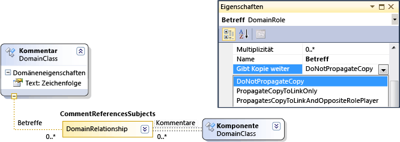
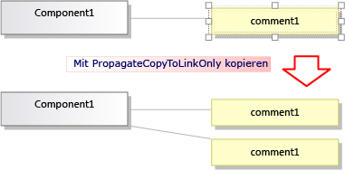
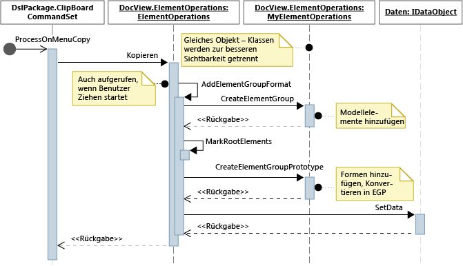
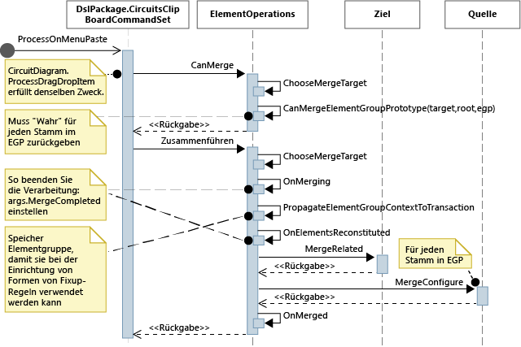

# <a name="customizing-copy-behavior"></a>Anpassen des Kopierverhaltens
In einer domänenspezifischen Sprache (DSL), die mit dem Visual Studio-Visualisierungs-und Modellierungs-SDK erstellt wurde, können Sie ändern, was geschieht, wenn der Benutzer Elemente kopiert und einfügt.

## <a name="standard-copy-and-paste-behavior"></a>Standardmäßiges Verhalten beim Kopieren und Einfügen
 Wenn Sie das kopieren aktivieren möchten, legen Sie im DSL-Explorer die Eigenschaft **Kopiervorgang aktivieren** des Knotens **Editor** fest.

 Wenn der Benutzer Elemente in die Zwischenablage kopiert, werden standardmäßig auch die folgenden Elemente kopiert:

- Eingebettete Nachfolger der ausgewählten Elemente. (Also Elemente, die Ziele von Einbettungsbeziehungen sind, deren Quelle kopierte Elemente sind.)

- Beziehungslinks zwischen kopierten Elementen.

  Diese Regel gilt rekursiv für die kopierten Elemente und Links.

  

  Die kopierten Elemente und Links werden serialisiert und in einem <xref:Microsoft.VisualStudio.Modeling.ElementGroupPrototype> (EGP) gespeichert, der in der Zwischenablage platziert wird.

  Ein Bild der kopierten Elemente wird ebenfalls in die Zwischenablage aufgenommen. Dies ermöglicht das Einfügen in andere Anwendungen wie Word.

  Der Benutzer kann kopierte Elemente in ein Ziel einfügen, das gemäß DSL-Definition die Elemente akzeptiert. In einer DSL, die aus der Projektmappenvorlage "Komponenten" generiert wurde, kann der Benutzer beispielsweise Ports in Komponenten einfügen, nicht aber in das Diagramm. Und er kann Komponenten in das Diagramm einfügen, nicht aber in andere Komponenten.

## <a name="customizing-copy-and-paste-behavior"></a>Anpassen des Verhaltens beim Kopieren und Einfügen
 Weitere Informationen zum Anpassen des Modells mit Programmcode finden Sie unter [navigieren und Aktualisieren eines Modells im Programmcode](../modeling/navigating-and-updating-a-model-in-program-code.md).

 **Aktivieren oder deaktivieren Sie das Kopieren, Ausschneiden und Einfügen.**
Legen Sie im DSL-Explorer die Eigenschaft **Kopiervorgang aktivieren** des Knotens **Editor** fest.

 **Kopieren Sie Links zum gleichen Ziel.**  Auf diese Weise können Sie beispielsweise ein kopiertes Kommentarfeld mit dem gleichen Betreffelement verknüpfen.
Legen Sie die Eigenschaft " **Kopieren** " der Rolle auf " **Kopieren" nur an den Link weiter**. Weitere Informationen finden Sie unter [Anpassen des Verhaltens](#customizeLinks)von Verknüpfungs Kopien.

 Kopieren Sie verknüpfte Elemente. Wenn Sie ein neues Element kopieren, werden beispielsweise auch Kopien verknüpfter Kommentarfelder erstellt.
Legen Sie die Eigenschaft **Kopie** Verteilen der Rolle auf **Kopie an Link und gegenteiligen Rollen**Inhaber weitergeben fest. Weitere Informationen finden Sie unter [Anpassen des Verhaltens](#customizeLinks)von Verknüpfungs Kopien.

 **Duplizieren Sie Elemente schnell durch Kopieren und Einfügen.**  Normalerweise ist das Element, das Sie gerade kopiert haben, noch ausgewählt, und Sie können nicht den gleichen Elementtyp darin einfügen.
Fügen Sie der Domänenklasse eine Direktive für Elementzusammenführungen hinzu, und legen Sie sie für vorwärts gerichtete Zusammenführungen in der übergeordneten Klasse fest. Dies hat die gleichen Auswirkungen auf Ziehvorgänge. Weitere Informationen finden Sie unter [Anpassen der Element Erstellung und-](../modeling/customizing-element-creation-and-movement.md)Verschiebung.

 \- oder -

 Wählen Sie vor dem Einfügen der Elemente das Diagramm aus, indem Sie `ClipboardCommandSet.ProcessOnPasteCommand()` überschreiben. Fügen Sie diesen Code in einer benutzerdefinierten Datei im DslPackage-Projekt hinzu:

```csharp
namespace Company.MyDsl {
using System.Linq;
using Microsoft.VisualStudio.Modeling.Diagrams;
using Microsoft.VisualStudio.Modeling.Shell;
partial class MyDslClipboardCommandSet
{
  protected override void ProcessOnMenuPasteCommand()
  {
 // Deselect the current selection after copying:
 Diagram diagram = (this.CurrentModelingDocView as SingleDiagramDocView).Diagram;
    this.CurrentModelingDocView
     .SelectObjects(1, new object[] { diagram }, 0);
  }
} }
```

 **Erstellen Sie weitere Links, wenn der Benutzer Einfügevorgänge im ausgewählten Ziel vornimmt.**  Wenn beispielsweise ein Kommentarfeld in ein Element eingefügt wird, wird zwischen beiden ein Link erstellt.
Fügen Sie der Zieldomänenklasse eine Direktive für Elementzusammenführungen hinzu, und legen Sie für sie fest, dass die Zusammenführung durch Hinzufügen von Links verarbeitet wird. Dies hat die gleichen Auswirkungen auf Ziehvorgänge. Weitere Informationen finden Sie unter [Anpassen der Element Erstellung und-](../modeling/customizing-element-creation-and-movement.md)Verschiebung.

 \- oder -

 Überschreiben Sie `ClipboardCommandSet.ProcessOnPasteCommand()`, um nach dem Aufruf der Basismethode weitere Links zu erstellen.

 **Passen Sie die Formate an, in denen Elemente in externe Anwendungen kopiert werden können** , z. b., um dem bitmapformular einen Rahmen hinzuzufügen.
Überschreiben Sie *myDSL* `ClipboardCommandSet.ProcessOnMenuCopyCommand()` im dslpackage-Projekt.

 **Passen Sie an, wie Elemente mit dem Kopierbefehl in die Zwischenablage kopiert werden, aber nicht in einem Ziehvorgang.**
Überschreiben Sie *myDSL* `ClipboardCommandSet.CopyModelElementsIntoElementGroupPrototype()` im dslpackage-Projekt.

 **Erhalten Sie das Formlayout beim Kopieren und Einfügen.**
Wenn der Benutzer mehrere Formen kopiert, können Sie deren relative Positionen beim Einfügen erhalten. Dieses Verfahren wird anhand des Beispiels unter [vmsdk: Circuit](https://code.msdn.microsoft.com/Visualization-Modeling-SDK-763778e8)Diagramms veranschaulicht.

 Sie können diesen Effekt erreichen, indem Sie dem kopierten ElementGroupPrototype Formen und Konnektoren hinzufügen. Für das Überschreiben empfiehlt sich ElementOperations.CreateElementGroupPrototype(). Fügen Sie dem Dsl-Projekt zu diesem Zweck den folgenden Code hinzu:

```csharp

public class MyElementOperations : DesignSurfaceElementOperations
{
  // Create an EGP to add to the clipboard.
  // Called when the elements to be copied have been
  // collected into an ElementGroup.
 protected override ElementGroupPrototype CreateElementGroupPrototype(ElementGroup elementGroup, ICollection<ModelElement> elements, ClosureType closureType)
  {
 // Add the shapes and connectors:
 // Get the elements already in the group:
    ModelElement[] mels = elementGroup.ModelElements
        .Concat(elementGroup.ElementLinks) // Omit if the paste target is not the diagram.
        .ToArray();
 // Get their shapes:
    IEnumerable<PresentationElement> shapes =
       mels.SelectMany(mel =>
            PresentationViewsSubject.GetPresentation(mel));
    elementGroup.AddRange(shapes);

 return base.CreateElementGroupPrototype
           (elementGroup, elements, closureType);
  }

 public MyElementOperations(IServiceProvider serviceProvider, ElementOps1Diagram diagram)
      : base(serviceProvider, diagram)
  { }
}

// Replace the standard ElementOperations
// singleton with your own:
partial class MyDslDiagram // EDIT NAME
{
 /// <summary>
 /// Singleton ElementOperations attached to this diagram.
 /// </summary>
 public override DesignSurfaceElementOperations ElementOperations
  {
 get
    {
 if (singleton == null)
      {
        singleton = new MyElementOperations(this.Store as IServiceProvider, this);
      }
 return singleton;
    }
  }
 private MyElementOperations singleton = null;
}
```

 **Fügen Sie Formen an einer ausgewählten Stelle ein, beispielsweise an der aktuelle Cursorposition.**
Wenn der Benutzer mehrere Formen kopiert, können Sie deren relative Positionen beim Einfügen erhalten. Dieses Verfahren wird anhand des Beispiels unter [vmsdk: Circuit](https://code.msdn.microsoft.com/Visualization-Modeling-SDK-763778e8)Diagramms veranschaulicht.

 Diesen Effekt erreichen Sie, indem Sie `ClipboardCommandSet.ProcessOnMenuPasteCommand()` überschreiben, sodass die positionsspezifische Version von `ElementOperations.Merge()` verwendet wird. Fügen Sie dem DslPackage-Projekt zu diesem Zweck den folgenden Code hinzu:

```csharp

partial class MyDslClipboardCommandSet // EDIT NAME
{
   /// <summary>
    /// This method assumes we only want to paste things onto the diagram
    /// - not onto anything contained in the diagram.
    /// The base method pastes in a free space on the diagram.
    /// But if the menu was used to invoke paste, we want to paste in the cursor position.
    /// </summary>
    protected override void ProcessOnMenuPasteCommand()
    {

  NestedShapesSampleDocView docView = this.CurrentModelingDocView as NestedShapesSampleDocView;

      // Retrieve data from clipboard:
      System.Windows.Forms.IDataObject data = System.Windows.Forms.Clipboard.GetDataObject();

      Diagram diagram = docView.CurrentDiagram;
      if (diagram == null) return;

      if (!docView.IsContextMenuShowing)
      {
        // User hit CTRL+V - just use base method.

        // Deselect anything that's selected, otherwise
        // pasted item will be incompatible:
        if (!this.IsDiagramSelected())
        {
          docView.SelectObjects(1, new object[] { diagram }, 0);
        }

        // Paste into a convenient spare space on diagram:
    base.ProcessOnMenuPasteCommand();
      }
      else
      {
        // User right-clicked - paste at mouse position.

        // Utility class:
        DesignSurfaceElementOperations op = diagram.ElementOperations;

        ShapeElement pasteTarget = diagram;

        // Check whether what's in the paste buffer is acceptable on the target.
        if (pasteTarget != null && op.CanMerge(pasteTarget, data))
        {

        // Although op.Merge would be a no-op if CanMerge failed, we check CanMerge first
          // so that we don't create an empty transaction (after which Undo would be no-op).
          using (Transaction t = diagram.Store.TransactionManager.BeginTransaction("paste"))
          {
            PointD place = docView.ContextMenuMousePosition;
            op.Merge(pasteTarget, data, PointD.ToPointF(place));
            t.Commit();
          }
        }
      }
    }
  }
```

 **Lassen Sie den Benutzer Elemente ziehen und ablegen.**
Weitere Informationen finden [Sie unter Gewusst wie: Hinzufügen eines Drag & Drop-Handlers](../modeling/how-to-add-a-drag-and-drop-handler.md).

## <a name="customizing-link-copy-behavior"></a><a name="customizeLinks"></a>Anpassen des Verhaltens von Verknüpfungs Kopien
 Wenn der Benutzer ein Element kopiert, ist das Standardverhalten, dass etwaige eingebettete Elemente ebenfalls kopiert werden. Sie können das standardmäßige Kopierverhalten ändern. Wählen Sie in der DSL-Definition eine Rolle auf der Seite einer Beziehung aus, und legen Sie in der Eigenschaftenfenster den Wert für die Weitergabe von **Kopieren** fest.

 

 Es gibt drei Werte:

- Kopie nicht übertragen

- Kopie nur an Link übertragen – Wenn die Gruppe eingefügt wird, verweist die neue Kopie dieses Links auf das vorhandene Element am anderen Ende des Links.

- Kopie an Link und Inhaber der Gegenrolle übertragen – Die kopierte Gruppe enthält eine Kopie des Elements am anderen Ende des Links.

  

  Die Änderungen, die Sie vornehmen, haben Auswirkungen auf die Elemente und das kopierte Bild.

## <a name="programming-copy-and-paste-behavior"></a>Programmieren des Verhaltens beim Kopieren und Einfügen
 Viele Aspekte des DSL-Verhaltens in Bezug auf das Kopieren, einfügen, erstellen und Löschen von Objekten werden von einer Instanz von gesteuert, die mit <xref:Microsoft.VisualStudio.Modeling.ElementOperations> dem Diagramm gekoppelt ist. Sie können das Verhalten ihrer DSL ändern, indem Sie eine eigene Klasse von ableiten <xref:Microsoft.VisualStudio.Modeling.ElementOperations> und die- <xref:Microsoft.VisualStudio.Modeling.Diagrams.Diagram.ElementOperations%2A> Eigenschaft ihrer Diagramm Klasse überschreiben.

> [!TIP]
> Weitere Informationen zum Anpassen des Modells mit Programmcode finden Sie unter [navigieren und Aktualisieren eines Modells im Programmcode](../modeling/navigating-and-updating-a-model-in-program-code.md).

 

 

#### <a name="to-define-your-own-elementoperations"></a>So definieren Sie eine eigene ElementOperations-Klasse

1. Erstellen Sie in einer neuen Datei in Ihrem DSL-Projekt eine Klasse, die von <xref:Microsoft.VisualStudio.Modeling.Diagrams.DesignSurfaceElementOperations> abgeleitet ist.

2. Fügen Sie eine partielle Klassendefinition für Ihre Diagrammklasse hinzu. Der Name dieser Klasse finden Sie unter **dsl\generatedcode\diagrams.cs**.

    Überschreiben Sie in der Diagram-Klasse, <xref:Microsoft.VisualStudio.Modeling.Diagrams.Diagram.ElementOperations%2A> um eine Instanz der Element Operations-Unterklasse zurückzugeben. Sie sollten bei jedem Aufruf die gleiche Instanz zurückgeben.

   Fügen Sie diesen Code in einer benutzerdefinierten Codedatei im DslPackage-Projekt hinzu:

```csharp

using Microsoft.VisualStudio.Modeling;
using Microsoft.VisualStudio.Modeling.Diagrams;
using Microsoft.VisualStudio.Modeling.Diagrams.ExtensionEnablement;

  public partial class MyDslDiagram
  {
    public override DesignSurfaceElementOperations ElementOperations
    {
      get
      {
        if (this.elementOperations == null)
        {
          this.elementOperations = new MyElementOperations(this.Store as IServiceProvider, this);
        }
        return this.elementOperations;
      }
    }
    private MyElementOperations elementOperations = null;
  }

  public class MyElementOperations : DesignSurfaceElementOperations
  {
    public MyElementOperations(IServiceProvider serviceProvider, MyDslDiagram diagram)
      : base(serviceProvider, diagram)
    { }
    // Overridden methods follow
  }
```

## <a name="receiving-items-dragged-from-other-models"></a>Empfangen von Elementen, die aus anderen Modellen gezogen wurden
 Mit ElementOperations kann auch das Verhalten von Kopier-, Verschiebe-, Lösch- und Drag &amp; Drop-Vorgängen definiert werden. Zur Veranschaulichung der Verwendung von ElementOperations wird im hier angegebenen Beispiel ein benutzerdefiniertes Drag &amp; Drop-Verhalten konfiguriert. Zu diesem Zweck können Sie jedoch den alternativen Ansatz in Gewusst [wie: Hinzufügen eines Drag & Drop-Handlers](../modeling/how-to-add-a-drag-and-drop-handler.md)in Erwägung ziehen, der erweiterbar ist.

 Definieren Sie zwei Methoden in Ihrer ElementOperations-Klasse:

- `CanMerge(ModelElement targetElement, System.Windows.Forms.IDataObject data)`, der bestimmt, ob das Quell Element auf die Zielform, den Connector oder das Diagramm gezogen werden kann.

- `MergeElementGroupPrototype(ModelElement targetElement, ElementGroupPrototype sourcePrototype)`, das das Quell Element in das Ziel kombiniert.

### <a name="canmerge"></a>CanMerge()
 `CanMerge()`wird aufgerufen, um Feedback zu ermitteln, das dem Benutzer beim Bewegen der Maus über das Diagramm zugewiesen werden soll. Die Parameter der Methode sind die Elemente, über die die Maus bewegt wird, sowie die Daten zur Quelle, aus der der Ziehvorgang durchgeführt wurde. Der Benutzer kann von überall auf dem Bildschirm ziehen. Daher kann das Quellobjekt viele verschiedene Typen aufweisen und in unterschiedlichen Formaten serialisiert werden. Wenn die Quelle ein DSL- oder UML-Modell ist, ist der Datenparameter die Serialisierung von <xref:Microsoft.VisualStudio.Modeling.ElementGroupPrototype>. Zieh-, Kopier- und Toolboxvorgänge verwenden ElementGroupPrototypes zur Darstellung von Fragmenten von Modellen.

 Ein Elementgruppenprototyp kann eine beliebige Anzahl von Elementen und Links enthalten. Elementtypen können anhand ihrer GUIDs identifiziert werden. Die GUID ist die Form, die gezogen wurde, und nicht das zugrunde liegende Modellelement. Im folgenden Beispiel gibt `CanMerge()` "true" zurück, wenn eine Klassenform aus einem UML-Diagramm in dieses Diagramm gezogen wird.

```csharp
public override bool CanMerge(ModelElement targetShape, System.Windows.Forms.IDataObject data)
 {
  // Extract the element prototype from the data.
  ElementGroupPrototype prototype = ElementOperations.GetElementGroupPrototype(this.ServiceProvider, data);
  if (targetShape is MyTargetShape && prototype != null &&
        prototype.RootProtoElements.Any(rootElement =>
          rootElement.DomainClassId.ToString()
          ==  "3866d10c-cc4e-438b-b46f-bb24380e1678")) // Guid of UML Class shapes
          // or SourceClass.DomainClassId
        return true;
   return base.CanMerge(targetShape, data);
 }
```

## <a name="mergeelementgroupprototype"></a>MergeElementGroupPrototype()
 Diese Methode wird aufgerufen, wenn der Benutzer ein Element auf einem Diagramm, einer Form oder einem Konnektor ablegt. Sie sollte den gezogenen Inhalt im Zielelement zusammenführen. In diesem Beispiel bestimmt der Code, ob die Kombination der Typen des Ziels und des Prototyps erkannt wird. Falls ja, konvertiert die Methode die gezogenen Elemente in einen Prototyp der Elemente, die dem Modell hinzugefügt werden sollen. Die Basismethode wird aufgerufen, um die Zusammenführung der konvertieren oder nicht konvertieren Elemente vorzunehmen.

```csharp
public override void MergeElementGroupPrototype(ModelElement targetShape, ElementGroupPrototype sourcePrototype)
{
  ElementGroupPrototype prototypeToMerge = sourcePrototype;
  MyTargetShape pel = targetShape as MyTargetShape;
  if (pel != null)
  {
    prototypeToMerge = ConvertDraggedTypeToLocal(pel, sourcePrototype);
  }
  if (prototypeToMerge != null)
    base.MergeElementGroupPrototype(targetShape, prototypeToMerge);
}
```

 In diesem Beispiel werden UML-Klassenelemente verarbeitet, die aus einem UML-Klassendiagramm gezogen werden. Die DSL ist nicht dafür vorgesehen, UML-Klassen direkt zu speichern. Stattdessen wird für jede gezogene UML-Klasse ein DSL-Element erstellt. Dies ist z. B. dann nützlich, wenn die DSL ein Instanzendiagramm ist. Der Benutzer könnte Klassen auf das Diagramm ziehen, um Instanzen dieser Klassen zu erstellen.

```csharp

private ElementGroupPrototype ConvertDraggedTypeToLocal (MyTargetShape snapshot, ElementGroupPrototype prototype)
{
  // Find the UML project:
  EnvDTE.DTE dte = snapshot.Store.GetService(typeof(EnvDTE.DTE)) as EnvDTE.DTE;
  foreach (EnvDTE.Project project in dte.Solution.Projects)
  {
    IModelingProject modelingProject = project as IModelingProject;
    if (modelingProject == null) continue; // not a modeling project
    IModelStore store = modelingProject.Store;
    if (store == null) continue;
    // Look for the shape that was dragged:
    foreach (IDiagram umlDiagram in store.Diagrams())
    {
      // Get modeling diagram that implements UML diagram:
      Diagram diagram = umlDiagram.GetObject<Diagram>();
      Guid elementId = prototype.SourceRootElementIds.FirstOrDefault();
      ShapeElement shape = diagram.Partition.ElementDirectory.FindElement(elementId) as ShapeElement;
      if (shape == null) continue;
      IClass classElement = shape.ModelElement as IClass;
      if (classElement == null) continue;

      // Create a prototype of elements in my DSL, based on the UML element:
      Instance instance = new Instance(snapshot.Store);
      instance.Type = classElement.Name;
      // Pack them into a prototype:
      ElementGroup group = new ElementGroup(instance);
      return group.CreatePrototype();
    }
  }
  return null;
}
```

## <a name="standard-copy-behavior"></a>Standardmäßiges Kopierverhalten
 Der Code in diesem Abschnitt veranschaulicht Methoden, die Sie überschreiben können, um das Kopierverhalten zu ändern. Um Ihnen zu zeigen, wie Sie eigene Anpassungen erreichen, wird in diesem Abschnitt Code dargestellt, mit dem die an Kopiervorgängen beteiligten Methoden überschrieben werden. Das Standardverhalten wird jedoch nicht geändert.

 Wenn der Benutzer STRG+C drückt oder den Menübefehl "Kopieren" verwendet, wird die Methode <xref:Microsoft.VisualStudio.Modeling.Shell.ClipboardCommandSet.ProcessOnMenuCopyCommand%2A> aufgerufen. Sie können sehen, wie dies in " **dslpackage\generated code\commandset.cs**" festgelegt ist. Weitere Informationen zum Einrichten von Befehlen finden Sie unter Gewusst [wie: Hinzufügen eines Befehls zum Kontextmenü](../modeling/how-to-add-a-command-to-the-shortcut-menu.md).

 Sie können processonmenucopycommand überschreiben, indem Sie eine partielle Klassendefinition von *myDSL* `ClipboardCommandSet` im dslpackage-Projekt hinzufügen.

```csharp
using System.Collections.Generic;
using System.Drawing;
using System.Windows.Forms;
using Microsoft.VisualStudio.Modeling;
using Microsoft.VisualStudio.Modeling.Diagrams;

partial class MyDslClipboardCommandSet
{
  /// <summary>
  /// Override ProcessOnMenuCopyCommand() to copy elements to the
  /// clipboard in different formats, or to perform additional tasks
  /// before or after copying - for example deselect the copied elements.
  /// </summary>
  protected override void ProcessOnMenuCopyCommand()
  {
    IList<ModelElement> selectedModelElements = this.SelectedElements;
    if (selectedModelElements.Count == 0) return;

    // System container for clipboard data.
    // The IDataObject can contain data in several formats.
    IDataObject dataObject = new DataObject();

    Bitmap bitmap = null; // For export to other programs.
    try
    {
      #region Create EGP for copying to a DSL.
      this.CopyModelElementsIntoElementGroupPrototype
                     (dataObject, selectedModelElements);
      #endregion

      #region Create bitmap for copying to another application.
      // Find all the shapes associated with this selection:
      List<ShapeElement> shapes = new List<ShapeElement>(
        this.ResolveExportedShapesForClipboardImages
              (dataObject, selectedModelElements));

      bitmap = this.CreateBitmapForClipboard(shapes);
      if (bitmap != null)
      {
        dataObject.SetData(DataFormats.Bitmap, bitmap);
      }
      #endregion

      // Add the data to the clipboard:
      Clipboard.SetDataObject(dataObject, true, 5, 100);
    }
    finally
    {
      // Dispose bitmap after SetDataObject:
      if (bitmap != null) bitmap.Dispose();
    }
  }
/// <summary>
/// Override this to customize the element group that is copied to the clipboard.
/// </summary>
protected override void CopyModelElementsIntoElementGroupPrototype(IDataObject dataObject, IList<ModelElement> selectedModelElements)
{
  return this.ElementOperations.Copy(dataObject, selectedModelElements);
}
}
```

 Jedes Diagramm weist eine Singleton-Instanz von ElementOperations auf. Sie können eigene Ableitungen bereitstellen. Diese Datei, die in das DSL-Projekt aufgenommen werden kann, verhält sich wie der Code, den sie überschreibt:

```csharp
using System;
using System.Collections.Generic;
using System.Linq;
using Microsoft.VisualStudio.Modeling;
using Microsoft.VisualStudio.Modeling.Diagrams;

namespace Company.MyDsl
{
  partial class MyDslDiagram
  {
    /// <summary>
    /// Singleton ElementOperations attached to this diagram.
    /// </summary>
    public override DesignSurfaceElementOperations ElementOperations
    {
      get
      {
        if (this.elementOperations == null)
        {
          this.elementOperations = new MyElementOperations(this.Store as IServiceProvider, this);
        }
        return this.elementOperations;
      }
    }
    private MyElementOperations elementOperations = null;
  }

  // Our own version of ElementOperations so that we can override:
  public class MyElementOperations : DesignSurfaceElementOperations
  {
    public MyElementOperations(IServiceProvider serviceProvider, ElementOps1Diagram diagram)
      : base(serviceProvider, diagram)
    { }

    /// <summary>
    /// Copy elements to the clipboard data.
    /// Provides a hook for adding custom data.
    /// </summary>
    public override void Copy(System.Windows.Forms.IDataObject data,
      ICollection<ModelElement> elements,
      ClosureType closureType,
      System.Drawing.PointF sourcePosition)
    {
      if (CanAddElementGroupFormat(elements, closureType))
      {
        AddElementGroupFormat(data, elements, closureType);
      }

      // Override these to store additional data:
      if (CanAddCustomFormat(elements, closureType))
      {
        AddCustomFormat(data, elements, closureType, sourcePosition);
      }
    }

    protected override void AddElementGroupFormat(System.Windows.Forms.IDataObject data, ICollection<ModelElement> elements, ClosureType closureType)
    {
      // Add the selected elements and those implied by the propagate copy rules:
      ElementGroup elementGroup = this.CreateElementGroup(elements, closureType);

      // Mark all the elements that are not embedded under other elements:
      this.MarkRootElements(elementGroup, elements, closureType);

      // Store in the clipboard data:
      ElementGroupPrototype elementGroupPrototype = this.CreateElementGroupPrototype(elementGroup, elements, closureType);
      data.SetData(ElementGroupPrototype.DefaultDataFormatName, elementGroupPrototype);
    }

    /// <summary>
    /// Override this to store additional elements in the element group:
    /// </summary>
    protected override ElementGroupPrototype CreateElementGroupPrototype(ElementGroup elementGroup, ICollection<ModelElement> elements, ClosureType closureType)
    {
      ElementGroupPrototype prototype = new ElementGroupPrototype(this.Partition, elementGroup.RootElements, elementGroup);
      return prototype;
    }

    /// <summary>
    /// Create an element group from the given starting elements, using the
    /// copy propagation rules specified in the DSL Definition.
    /// By default, this includes all the embedded descendants of the starting elements,
    /// and also includes reference links where both ends are already included.
    /// </summary>
    /// <param name="startElements">model elements to copy</param>
    /// <param name="closureType"></param>
    /// <returns></returns>
    protected override ElementGroup CreateElementGroup(ICollection<ModelElement> startElements, ClosureType closureType)
    {
      // ElementClosureWalker finds all the connected elements,
      // according to the propagate copy rules specified in the DSL Definition:
      ElementClosureWalker walker = new ElementClosureWalker(this.Partition,
        closureType, // Normally ClosureType.CopyClosure
        startElements,
        true, // Do not load other models.
        null, // Optional list of domain roles not to traverse.
        true); // Include relationship links where both ends are already included.

      walker.Traverse(startElements);
      IList<ModelElement> closureList = walker.ClosureList;
      Dictionary<object, object> closureContext = walker.Context;

      // create a group for this closure
      ElementGroup group = new ElementGroup(this.Partition);
      group.AddRange(closureList, false);

      // create the element group prototype for the group
      foreach (object key in closureContext.Keys)
      {
        group.SourceContext.ContextInfo[key] = closureContext[key];
      }

      return group;
    }
  }
}
```

## <a name="see-also"></a>Weitere Informationen

- [Anpassen der Elementerstellung und -verschiebung](../modeling/customizing-element-creation-and-movement.md)
- [Gewusst wie: Hinzufügen eines Drag & Drop-Handlers](../modeling/how-to-add-a-drag-and-drop-handler.md)
- [Beispiel: vmsdk-Verbindungs Diagramme (Beispiel)](https://code.msdn.microsoft.com/Visualization-Modeling-SDK-763778e8)

[!INCLUDE[modeling_sdk_info](includes/modeling_sdk_info.md)]
