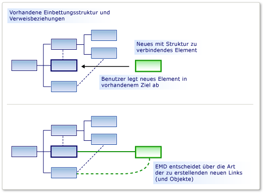
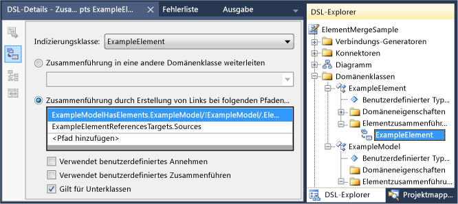

# <a name="customizing-element-creation-and-movement"></a>Anpassen der Elementerstellung und -verschiebung

Sie können zulassen, dass ein Element entweder aus der Toolbox oder einem Einfüge-oder verschiebe Vorgang auf ein anderes gezogen wird. Mithilfe der von Ihnen angegebenen Beziehungen können die verschoten Elemente mit den Ziel Elementen verknüpft werden.

Eine elementmerge-Direktive (EMD) gibt an, was geschieht, wenn ein Modellelement in einem anderen Modellelement *zusammengeführt* wird. Dies geschieht in folgenden Fällen:

- Der Benutzer zieht von der Toolbox auf das Diagramm oder eine Form.

- Der Benutzer erstellt ein Element mit einem Menü hinzufügen im Explorer oder in einer Depot-Form.

- Der Benutzer verschiebt ein Element von einem Swimlane zu einem anderen.

- Der Benutzer fügt ein Element ein.

- Der Programmcode Ruft die elementmerge-Direktive auf.

Obwohl sich die Erstellungs Vorgänge von den Kopier Vorgängen unterscheiden, funktionieren Sie tatsächlich auf dieselbe Weise. Wenn ein Element hinzugefügt wird, z. b. aus der Toolbox, wird ein Prototyp repliziert. Der Prototyp wird auf die gleiche Weise wie Elemente, die aus einem anderen Teil des Modells kopiert wurden, in das Modell zusammengeführt.

Eine EMD ist dafür verantwortlich zu entscheiden, wie ein Objekt oder eine Gruppe von Objekten an einer bestimmten Position im Modell zusammengeführt werden soll. Insbesondere wird entschieden, welche Beziehungen instanziiert werden müssen, um die zusammengeführte Gruppe mit dem Modell zu verknüpfen. Sie können Sie auch anpassen, um Eigenschaften festzulegen und zusätzliche Objekte zu erstellen.



Eine EMD wird automatisch generiert, wenn Sie eine Embedding Relationship definieren. Diese Standard-EMD erstellt eine Instanz der Beziehung, wenn Benutzer der übergeordneten Instanz neue untergeordnete Instanzen hinzufügen. Sie können diese Standard-EMDs ändern, z. b. durch Hinzufügen von benutzerdefiniertem Code.

Sie können auch eigene EMDs in der DSL-Definition hinzufügen, um Benutzern das ziehen oder Einfügen verschiedener Kombinationen von zusammengeführten und empfangenden Klassen zu ermöglichen.

## <a name="defining-an-element-merge-directive"></a>Definieren einer elementmerge-Direktive

Sie können elementmergedirektiven zu Domänen Klassen, Domänen Beziehungen, Formen, Connectors und Diagrammen hinzufügen. Sie können Sie im DSL-Explorer unter der empfangenden Domänen Klasse hinzufügen oder suchen. Die empfangende Klasse ist die Domänen Klasse des Elements, das bereits im Modell vorhanden ist und auf das das neue oder kopierte Element zusammengeführt wird.



Bei der **Indizierungs Klasse** handelt es sich um die Domänen Klasse von Elementen, die in Member der empfangenden Klasse zusammengeführt werden können. Instanzen von Unterklassen der Indizierungs Klasse werden auch von dieser EMD zusammengeführt, es sei denn, Sie legen für die **Unterklassen** auf false fest.

Es gibt zwei Arten von mergedirektiven:

- Eine **Process Merge** -Direktive gibt die Beziehungen an, nach denen das neue Element mit der Struktur verknüpft werden soll.

- Eine **Forward Merge** -Direktive leitet das neue Element an ein anderes empfangendes Element weiter, in der Regel ein übergeordnetes Element

Sie können benutzerdefinierten Code zu mergedirektiven hinzufügen:

- Set **verwendet benutzerdefiniertes akzeptieren** , um eigenen Code hinzuzufügen, um zu bestimmen, ob eine bestimmte Instanz des Indizierungs Elements mit dem Target-Element zusammengeführt werden soll. Wenn der Benutzer aus der Toolbox zieht, wird der "Ungültige" Zeiger angezeigt, wenn der Code den Merge nicht zulässt.

   Beispielsweise können Sie den Merge nur zulassen, wenn sich das empfangende Element in einem bestimmten Zustand befindet.

- Set **verwendet benutzerdefinierte** Zusammenführung zum Hinzufügen von eigenem Code zum Definieren der Änderungen, die beim Ausführen der Zusammenführung am Modell vorgenommen werden.

   Beispielsweise können Sie Eigenschaften im zusammengeführten Element festlegen, indem Sie Daten aus dem neuen Speicherort im Modell verwenden.

> [!NOTE]
> Wenn Sie benutzerdefinierten Zusammenführungs Code schreiben, wirkt sich dies nur auf Zusammenführungen aus, die mithilfe dieser EMD ausgeführt werden. Wenn andere EMDs vorhanden sind, die denselben Objekttyp zusammenführen, oder wenn ein anderer benutzerdefinierter Code vorhanden ist, der diese Objekte ohne Verwendung der EMD erstellt, wird der benutzerdefinierte Zusammenarbeits Code nicht beeinträchtigt.
>
> Wenn Sie sicherstellen möchten, dass ein neues Element oder eine neue Beziehung immer von Ihrem benutzerdefinierten Code verarbeitet wird, sollten Sie eine `AddRule` auf dem Embedding Relationship und eine `DeleteRule` in der Domänen Klasse des Elements definieren. Weitere Informationen finden Sie unter [Regeln verbreiten Änderungen innerhalb des Modells](../modeling/rules-propagate-changes-within-the-model.md).

## <a name="example-defining-an-emd-without-custom-code"></a>Beispiel: Definieren einer EMD ohne benutzerdefinierten Code

Im folgenden Beispiel können Benutzer gleichzeitig ein Element und einen Connector erstellen, indem Sie Sie aus der Toolbox auf eine vorhandene Form ziehen. Im Beispiel wird der DSL-Definition eine EMD hinzugefügt. Vor dieser Änderung können Benutzer Tools auf das Diagramm ziehen, jedoch nicht auf vorhandene Formen.

Benutzer können Elemente auch in andere Elemente einfügen.

### <a name="to-let-users-create-an-element-and-a-connector-at-the-same-time"></a>So können Benutzer gleichzeitig ein Element und einen Connector erstellen

1. Erstellen Sie eine neue DSL mithilfe der Vorlage für **minimale sprach** Lösungen.

    Wenn Sie diese DSL ausführen, können Sie Formen und Connectors zwischen den Formen erstellen. Sie können eine neue Form " **ExampleElement** " nicht aus der Toolbox auf eine vorhandene Form ziehen.

2. Um Benutzern das Zusammenführen von Elementen auf `ExampleElement` Formen zu ermöglichen, erstellen Sie eine neue EMD in der `ExampleElement` Domänen Klasse:

   1. Erweitern Sie im **DSL-Explorer** **Domänen Klassen**. Klicken Sie mit der rechten Maustaste auf `ExampleElement` und klicken Sie dann auf **Add New Element Merge Directive**.

   2. Stellen Sie sicher, dass das Fenster **DSL-Details** geöffnet ist, damit Sie die Details der neuen EMD sehen können. (Menü: **Ansicht**, **Weitere Fenster**, **DSL-Details**.)

3. Legen Sie die **Indizierungs Klasse** im Fenster "DSL-Details" fest, um zu definieren, welche Klasse von Elementen auf `ExampleElement` Objekten zusammengeführt werden kann.

    Wählen Sie in diesem Beispiel `ExampleElements` aus, damit der Benutzer neue Elemente auf vorhandene Elemente ziehen kann.

    Beachten Sie, dass die Indizierungs Klasse der Name der EMD im DSL-Explorer wird.

4. Fügen Sie unter **Prozess Zusammenführung durch Erstellen von Verknüpfungen**zwei Pfade hinzu:

   - Ein Pfad verknüpft das neue Element mit dem übergeordneten Modell. Der Pfad Ausdruck, der durch die Embedding Relationship zum übergeordneten Modell navigiert werden soll. Schließlich wird die Rolle in der neuen Verknüpfung angegeben, der das neue Element zugewiesen wird. Der Pfad lautet wie folgt:

      `ExampleModelHasElements.ExampleModel/!ExampleModel/.Elements`

   - Der andere Pfad verknüpft das neue-Element mit dem vorhandenen-Element. Der Pfad Ausdruck gibt die Verweis Beziehung und die Rolle an, der das neue Element zugewiesen wird. Dieser Pfad lautet wie folgt:

      `ExampleElementReferencesTargets.Sources`

      Mit dem Pfad Navigations Tool können Sie die einzelnen Pfade erstellen:

      1. Klicken Sie unter **Prozess Zusammenführung durch Erstellen von Links in Pfaden auf** **\<add Pfad >** .

      2. Klicken Sie auf den Dropdown Pfeil rechts neben dem Listenelement. Eine Strukturansicht wird angezeigt.

      3. Erweitern Sie die Knoten in der Struktur, um den Pfad zu bilden, den Sie angeben möchten.

5. Testen Sie die DSL:

   1. Drücken Sie **F5** , um die Projekt Mappe neu zu erstellen und auszuführen.

        Die Neuerstellung dauert länger als üblich, da der generierte Code von Textvorlagen entsprechend der neuen DSL-Definition aktualisiert wird.

   2. Wenn die experimentelle Instanz von Visual Studio gestartet wurde, öffnen Sie eine Modelldatei ihrer DSL. Erstellen Sie einige Beispiel Elemente.

   3. Ziehen Sie aus dem **Beispiel Element** Tool auf eine vorhandene Form.

        Es wird eine neue Form angezeigt, die mit der vorhandenen Form mit einem Connector verknüpft ist.

   4. Kopieren Sie eine vorhandene Form. Wählen Sie eine andere Form und dann einfügen aus.

        Eine Kopie der ersten Form wird erstellt.  Es verfügt über einen neuen Namen, der mit der zweiten Form mit einem Connector verknüpft ist.

Beachten Sie die folgenden Punkte dieses Verfahrens:

- Durch das Erstellen von elementmergedirektiven können Sie allen Klassen von Elementen gestatten, beliebige andere zu akzeptieren. Die EMD wird in der empfangenden Domänen Klasse erstellt, und die akzeptierte Domänen Klasse wird im Feld **Index Klasse** angegeben.

- Durch Definieren von Pfaden können Sie angeben, welche Links verwendet werden sollen, um das neue Element mit dem vorhandenen Modell zu verbinden.

     Die von Ihnen angegebenen Links sollten eine Embedding Relationship enthalten.

- Die EMD wirkt sich auf die Erstellung aus der Toolbox und auch auf Einfügevorgänge aus.

     Wenn Sie benutzerdefinierten Code schreiben, mit dem neue Elemente erstellt werden, können Sie die EMD mithilfe der `ElementOperations.Merge`-Methode explizit aufrufen. Dadurch wird sichergestellt, dass Ihr Code neue Elemente auf die gleiche Weise wie andere Vorgänge mit dem Modell verknüpft. Weitere Informationen finden Sie unter [Anpassen des Kopier Verhaltens](../modeling/customizing-copy-behavior.md).

## <a name="example-adding-custom-accept-code-to-an-emd"></a>Beispiel: Hinzufügen von benutzerdefiniertem Accept-Code zu einer EMD

Durch Hinzufügen von benutzerdefiniertem Code zu einer EMD können Sie ein komplexeres Zusammenstellungs Verhalten definieren. In diesem einfachen Beispiel wird verhindert, dass der Benutzer mehr als eine Fixed-Anzahl von Elementen zum Diagramm hinzufügt. Das Beispiel ändert die Standard-EMD, die eine Embedding Relationship begleitet.

### <a name="to-write-custom-accept-code-to-restrict-what-the-user-can-add"></a>So schreiben Sie benutzerdefinierten Accept-Code, um einzuschränken, was der Benutzer hinzufügen kann

1. Erstellen Sie eine DSL mithilfe der Vorlage für **minimale sprach** Lösungen. Öffnen Sie das DSL-Definitions Diagramm.

2. Erweitern Sie im DSL-Explorer **Domänen Klassen**, `ExampleModel` und **elementmergedirektiven**. Wählen Sie die elementmerge-Direktive mit dem Namen `ExampleElement` aus.

     Diese EMD steuert, wie der Benutzer neue `ExampleElement` Objekte im Modell erstellen kann, z. b. durchziehen aus der Toolbox.

3. Wählen Sie im Fenster **DSL-Details** die Option **verwendet benutzerdefiniertes akzeptieren**aus.

4. Generieren Sie die Projektmappe neu. Dies dauert länger als üblich, da der generierte Code aus dem Modell aktualisiert wird.

     Ein Buildfehler wird gemeldet, ähnlich wie: "Company. elementmergesample. ExampleElement enthält keine Definition für canmergeexampleelement..."

     Sie müssen die-Methode `CanMergeExampleElement` implementieren.

5. Erstellen Sie eine neue Codedatei im **DSL** -Projekt. Ersetzen Sie den Inhalt durch den folgenden Code, und ändern Sie den Namespace in den Namespace des Projekts.

    ```csharp
    using Microsoft.VisualStudio.Modeling;

    namespace Company.ElementMergeSample // EDIT.
    {
      partial class ExampleModel
      {
        /// <summary>
        /// Called whenever an ExampleElement is to be merged into this ExampleModel.
        /// This happens when the user pastes an ExampleElement
        /// or drags from the toolbox.
        /// Determines whether the merge is allowed.
        /// </summary>
        /// <param name="rootElement">The root element in the merging EGP.</param>
        /// <param name="elementGroupPrototype">The EGP that the user wants to merge.</param>
        /// <returns>True if the merge is allowed</returns>
        private bool CanMergeExampleElement(ProtoElementBase rootElement, ElementGroupPrototype elementGroupPrototype)
        {
          // Allow no more than 4 elements to be added:
          return this.Elements.Count < 4;
        }
      }
    }
    ```

    In diesem einfachen Beispiel wird die Anzahl der Elemente, die mit dem übergeordneten Modell zusammengeführt werden können, eingeschränkt. Für interessantere Bedingungen kann die-Methode alle Eigenschaften und Verknüpfungen des empfangenden Objekts überprüfen. Sie kann auch die Eigenschaften der zusammengeführten Elemente untersuchen, die in einer <xref:Microsoft.VisualStudio.Modeling.ElementGroupPrototype> übertragen werden. Weitere Informationen zu `ElementGroupPrototypes` finden Sie unter [Anpassen des Kopier Verhaltens](../modeling/customizing-copy-behavior.md). Weitere Informationen zum Schreiben von Code, der ein Modell liest, finden Sie unter [navigieren und Aktualisieren eines Modells im Programmcode](../modeling/navigating-and-updating-a-model-in-program-code.md).

6. Testen Sie die DSL:

    1. Drücken Sie **F5** , um die Projekt Mappe neu zu erstellen. Wenn die experimentelle Instanz von Visual Studio geöffnet wird, öffnen Sie eine Instanz Ihrer DSL.

    2. Erstellen Sie neue Elemente auf verschiedene Arten:

        - Ziehen Sie aus dem **Beispiel Element** Tool auf das Diagramm.

        - Klicken Sie im **Beispielmodell-Explorer**mit der rechten Maustaste auf den Stamm Knoten, und klicken Sie dann auf **Neues Beispiel Element hinzufügen**.

        - Kopieren Sie ein Element, und fügen Sie es in das Diagramm ein.

    3. Vergewissern Sie sich, dass Sie keine dieser Methoden verwenden können, um dem Modell mehr als vier Elemente hinzuzufügen. Dies liegt daran, dass Sie alle die elementmerge-Direktive verwenden.

## <a name="example-adding-custom-merge-code-to-an-emd"></a>Beispiel: Hinzufügen von benutzerdefiniertem Merge-Code zu einer EMD

In benutzerdefiniertem mergecode können Sie definieren, was geschieht, wenn der Benutzer ein Tool zieht oder auf ein Element einfügt. Es gibt zwei Möglichkeiten zum Definieren eines benutzerdefinierten Merge:

1. Set **verwendet benutzerdefinierte** Zusammenführung und stellt den erforderlichen Code bereit. Der Code ersetzt den generierten Zusammenschluss Code. Verwenden Sie diese Option, wenn Sie die Funktionsweise des Merge vollständig neu definieren möchten.

2. Überschreiben Sie die `MergeRelate`-Methode und optional die `MergeDisconnect`-Methode. Zu diesem Zweck müssen Sie die Eigenschaft **generiert Double abgeleitet** der Domänen Klasse festlegen. Der Code kann den generierten Merge-Code in der Basisklasse aufzurufen. Verwenden Sie diese Option, wenn Sie nach Ausführung des Merge weitere Vorgänge ausführen möchten.

   Diese Ansätze wirken sich nur auf Zusammenführungen aus, die mithilfe dieser EMD ausgeführt werden. Wenn Sie alle Methoden, in denen das zusammengeführte Element erstellt werden kann, beeinflussen möchten, besteht eine Alternative darin, eine `AddRule` auf dem Embedding Relationship und eine `DeleteRule` für die zusammengeführte Domänen Klasse zu definieren. Weitere Informationen finden Sie unter [Regeln verbreiten Änderungen innerhalb des Modells](../modeling/rules-propagate-changes-within-the-model.md).

### <a name="to-override-mergerelate"></a>So überschreiben Sie mergerelate

1. Stellen Sie in der DSL-Definition sicher, dass Sie die EMD definiert haben, der Sie Code hinzufügen möchten. Wenn Sie möchten, können Sie Pfade hinzufügen und benutzerdefinierten Accept-Code definieren, wie in den vorherigen Abschnitten beschrieben.

2. Wählen Sie im DslDefinition-Diagramm die empfangende Klasse des Merge aus. In der Regel ist es die-Klasse am Quellende einer Embedding Relationship.

     Wählen Sie z. b. in einer von der Lösung mit minimaler Sprache generierten DSL `ExampleModel` aus.

3. Legen Sie im Fenster **Eigenschaften** die Eigenschaft wird von **Double abgeleitet** auf **true**festgelegt fest.

4. Generieren Sie die Projektmappe neu.

5. Überprüfen Sie den Inhalt von " **dsl\generated files\domainclasses.cs**". Suchen Sie nach Methoden namens `MergeRelate`, und überprüfen Sie Ihren Inhalt. Dies hilft Ihnen beim Schreiben Ihrer eigenen Versionen.

6. Schreiben Sie in einer neuen Codedatei eine partielle Klasse für die empfangende Klasse, und überschreiben Sie die `MergeRelate`-Methode. Denken Sie daran, die Basis Methode aufzurufen. Beispiel:

    ```csharp
    partial class ExampleModel
    {
      /// <summary>
      /// Called when the user drags or pastes an ExampleElement onto the diagram.
      /// Sets the time of day as the name.
      /// </summary>
      /// <param name="sourceElement">Element to be added</param>
      /// <param name="elementGroup">Elements to be merged</param>
      protected override void MergeRelate(ModelElement sourceElement, ElementGroup elementGroup)
      {
        // Connect the element according to the EMD:
        base.MergeRelate(sourceElement, elementGroup);

        // Custom actions:
        ExampleElement mergingElement = sourceElement as ExampleElement;
        if (mergingElement != null)
        {
          mergingElement.Name = DateTime.Now.ToLongTimeString();
        }
      }
    }
    ```

### <a name="to-write-custom-merge-code"></a>So schreiben Sie benutzerdefinierten zusammenschreibungs Code

1. Überprüfen Sie unter **dsl\generated code\domainclasses.cs**die Methoden mit dem Namen `MergeRelate`. Diese Methoden erstellen Verknüpfungen zwischen einem neuen Element und dem vorhandenen Modell.

    Überprüfen Sie auch die Methoden mit dem Namen `MergeDisconnect`. Diese Methoden aufheben die Verknüpfung eines Elements aus dem Modell, wenn es gelöscht werden soll.

2. Wählen Sie im **DSL-Explorer**die elementmerge-Direktive aus, die Sie anpassen möchten, oder erstellen Sie Sie. Legen Sie im Fenster **DSL-Details** den Wert **benutzerdefinierte**Zusammenführung fest.

    Wenn Sie diese Option festlegen, werden die mergeoptionen zusammen **führen** und **weiterleiten** ignoriert. Der Code wird stattdessen verwendet.

3. Generieren Sie die Projektmappe neu. Es dauert länger als üblich, da die generierten Code Dateien aus dem Modell aktualisiert werden.

    Fehlermeldungen werden angezeigt. Doppelklicken Sie auf die Fehlermeldungen, um die Anweisungen im generierten Code anzuzeigen. In diesen Anweisungen werden Sie aufgefordert, zwei Methoden bereitzustellen, `MergeRelate`*yourdomainclass* und `MergeDisconnect`*yourdomainclass* .

4. Schreiben Sie die Methoden in einer partiellen Klassendefinition in einer separaten Codedatei. Die Beispiele, die Sie zuvor überprüft haben, sollten vorschlagen, was Sie benötigen.

   Benutzerdefinierter Zusammenarbeits Code wirkt sich nicht auf Code aus, der Objekte und Beziehungen direkt erstellt, und wirkt sich nicht auf andere EMDs aus. Um sicherzustellen, dass die zusätzlichen Änderungen unabhängig von der Art der Erstellung des Elements implementiert werden, sollten Sie stattdessen eine `AddRule` und eine `DeleteRule` schreiben. Weitere Informationen finden Sie unter [Regeln verbreiten Änderungen innerhalb des Modells](../modeling/rules-propagate-changes-within-the-model.md).

## <a name="redirecting-a-merge-operation"></a>Umleiten eines Mergevorgangs

Eine Forward-Merge-Direktive leitet das Ziel eines Mergevorgangs um. In der Regel ist das neue Ziel das Einbettungs übergeordnete Element des ursprünglichen Ziels.

Beispielsweise werden in einer DSL, die mit der Komponenten Diagramm Vorlage erstellt wurde, Ports in-Komponenten eingebettet. Ports werden als kleine Formen am Rand einer Komponentenform angezeigt. Der Benutzer erstellt Ports, indem er das porttool auf eine Komponentenform zieht. Manchmal zieht der Benutzer das Port Tool jedoch versehentlich auf einen vorhandenen Port anstatt auf die Komponente, und der Vorgang schlägt fehl. Dies ist ein einfacher Fehler, wenn mehrere vorhandene Ports vorhanden sind. Um dem Benutzer zu helfen, dieses Problem zu vermeiden, können Sie zulassen, dass Ports auf einen vorhandenen Port gezogen werden, aber die Aktion an die übergeordnete Komponente umgeleitet wird. Der Vorgang funktioniert so, als ob das Ziel Element die Komponente wäre.

Sie können eine Forward-Merge-Direktive in der Komponentenmodell-Projekt Mappe erstellen. Wenn Sie die ursprüngliche Projekt Mappe kompilieren und ausführen, sollten Sie sehen, dass Benutzer eine beliebige Anzahl von **Eingabe** -oder **Ausgabeport** -Elementen aus der **Toolbox** in ein **Komponenten** Element ziehen können. Es ist jedoch nicht möglich, einen Port auf einen vorhandenen Port zu ziehen. Der nicht verfügbare Zeiger warnt Sie darauf, dass diese Verschiebung nicht aktiviert ist. Sie können jedoch eine Forward-Merge-Direktive erstellen, sodass ein an einem vorhandenen **eingabeport** versehentlich gelöschter Port an das **Component** -Element weitergeleitet wird.

### <a name="to-create-a-forward-merge-directive"></a>So erstellen Sie eine Forward-Merge-Direktive

1. Erstellen Sie eine [!INCLUDE[dsl](../modeling/includes/dsl_md.md)] Lösung mithilfe der Vorlage Komponentenmodell.

2. Zeigen Sie den **DSL-Explorer** an, indem Sie DslDefinition. DSL öffnen.

3. Erweitern Sie im **DSL**-Explorer **Domänen Klassen**.

4. Die abstrakte Domänen Klasse **componentport** ist die Basisklasse von **InPort** und **Outport**. Klicken Sie mit der rechten Maustaste auf **componentport** , und klicken Sie dann auf **Add New Element Merge Directive**.

    Unter dem Knoten **elementmerge-Direktiven** wird ein neuer **elementmerge** -direktivenknoten angezeigt.

5. Wählen Sie den Knoten **elementmerge-Anweisung** aus, und öffnen Sie das Fenster **DSL-Details** .

6. Wählen Sie in der Liste Indizierungs Klasse die Option **componentport**aus.

7. Wählen Sie zusammen **führen in eine andere Domänen Klasse weiterleiten**aus.

8. Erweitern Sie in der Liste Pfad Auswahl den Eintrag **componentport**, **componenthasports**, und wählen Sie dann **Component**aus.

    Der neue Pfad sollte diesem ähneln:

    **Componenthasports. Component/!-Komponente**

9. Speichern Sie die Projekt Mappe, und transformieren Sie dann die Vorlagen, indem Sie auf der **Projektmappen-Explorer** Symbolleiste auf die Schaltfläche ganz rechts klicken.

10. Erstellen Sie die Projektmappe, und führen Sie sie aus. Eine neue Instanz von Visual Studio wird angezeigt.

11. Öffnen Sie in **Projektmappen-Explorer**Sample. myDSL. Das Diagramm und die **Komponenten Toolbox** werden angezeigt.

12. Ziehen Sie einen **eingabeport** aus der **Toolbox** auf einen anderen **eingabeport.** Ziehen Sie als nächstes einen **outputport** auf einen **inputport** und dann auf einen anderen **outputport**.

     Der nicht verfügbare Zeiger sollte nicht angezeigt werden, und Sie sollten in der Lage sein, den neuen **eingabeport** für den vorhandenen zu löschen. Wählen Sie den neuen **eingabeport** aus, und ziehen Sie ihn an einen anderen Punkt in der **Komponente**.

## <a name="see-also"></a>Siehe auch

- [Navigieren in und Aktualisieren von Modellen im Programmcode](../modeling/navigating-and-updating-a-model-in-program-code.md)
- [Anpassen der Tools und der Toolbox](../modeling/customizing-tools-and-the-toolbox.md)
- [Beispiel-DSL für Verbindungs Diagramme](https://code.msdn.microsoft.com/Visualization-Modeling-SDK-763778e8)