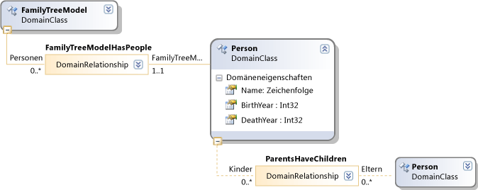
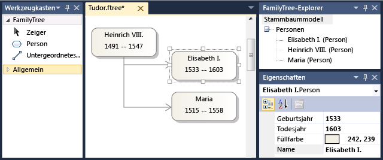

# <a name="customize-file-storage-and-xml-serialization"></a>Anpassen von Dateispeicher und XML-Serialisierung

Wenn der Benutzer eine Instanz oder ein *Modell*einer domänenspezifischen Sprache (DSL) in Visual Studio speichert, wird eine XML-Datei erstellt oder aktualisiert. Die Datei kann erneut geladen werden, um das Modell im Speicher neu zu erstellen.

Sie können das Serialisierungsschema anpassen, indem Sie die Einstellungen unter **XML-Serialisierungsverhalten** im DSL-Explorer anpassen. Es gibt unter XML- **Serialisierungsverhalten** einen Knoten für jede Domänen Klasse, jede Eigenschaft und jede Beziehung. Die Beziehungen befinden sich unter ihren Quell Klassen. Es gibt auch Knoten, die den Formen-, Connector-und Diagramm Klassen entsprechen.

Sie können auch Programmcode für eine erweiterte Anpassung schreiben.

> [!NOTE]
> Wenn Sie das Modell in einem bestimmten Format speichern möchten, Sie es jedoch nicht aus diesem Formular erneut laden müssen, empfiehlt es sich, Textvorlagen zu verwenden, um die Ausgabe des Modells anstelle eines benutzerdefinierten Serialisierungsschemas zu generieren. Weitere Informationen finden Sie unter [Erstellen von Code aus einer domänenspezifischen Sprache](../modeling/generating-code-from-a-domain-specific-language.md).

## <a name="model-and-diagram-files"></a>Modell-und Diagramm Dateien

Jedes Modell wird in der Regel in zwei Dateien gespeichert:

- Die Modelldatei hat einen Namen wie **Model1. myDSL**. Die Modellelemente und-Beziehungen und ihre Eigenschaften werden gespeichert. Die Dateierweiterung, z **. b. myDSL** , wird von der **FileExtension** -Eigenschaft des **Editor** -Knotens in der DSL-Definition bestimmt.

- Die Diagramm Datei hat einen Namen wie **Model1. myDSL. Diagram**. Es speichert die Formen, Connectors und ihre Positionen, Farben, Linienstärke und andere Details der Darstellung des Diagramms. Wenn der Benutzer eine **. Diagram** -Datei löscht, gehen die wesentlichen Informationen im Modell nicht verloren. Nur das Layout des Diagramms geht verloren. Wenn die Modelldatei geöffnet wird, wird ein Standardsatz von Formen und Connectors erstellt.

### <a name="to-change-the-file-extension-of-a-dsl"></a>So ändern Sie die Dateierweiterung einer DSL

1. Öffnen Sie die DSL-Definition. Klicken Sie im DSL-Explorer auf den Knoten Editor.

2. Bearbeiten Sie im Eigenschaftenfenster die Eigenschaft **FileExtension** . Schließen Sie nicht die ursprüngliche Dateinamenerweiterung "." ein.

3. Ändern Sie in Projektmappen-Explorer den Namen der beiden Element Vorlagen Dateien in " **dslpackage\projectitemtemplates**". Diese Dateien weisen Namen auf das folgende Format auf:

     `myDsl.diagram`

     `myDsl.myDsl`

## <a name="the-default-serialization-scheme"></a>Das Standardserialisierungsschema

Zum Erstellen eines Beispiels für dieses Thema wurde die folgende DSL-Definition verwendet.



Diese DSL wurde verwendet, um ein Modell zu erstellen, das auf dem Bildschirm die folgende Darstellung hat.



Dieses Modell wurde gespeichert und dann erneut im XML-Text-Editor geöffnet:

```xml
<?xml version="1.0" encoding="utf-8"?>
<familyTreeModel xmlns:dm0="http://schemas.microsoft.com/VisualStudio/2008/DslTools/Core" dslVersion="1.0.0.0" Id="f817b728-e920-458e-bb99-98edc469d78f" xmlns="http://schemas.microsoft.com/dsltools/FamilyTree">
  <people>
    <person name="Henry VIII" birthYear="1491" deathYear="1547" age="519">
      <children>
        <personMoniker name="/f817b728-e920-458e-bb99-98edc469d78f/Elizabeth I" />
        <personMoniker name="/f817b728-e920-458e-bb99-98edc469d78f/Mary" />
      </children>
    </person>
    <person name="Elizabeth I" birthYear="1533" deathYear="1603" age="477" />
    <person name="Mary" birthYear="1515" deathYear="1558" age="495" />
  </people>
</familyTreeModel>
```

Beachten Sie die folgenden Punkte zum serialisierten Modell:

- Jeder XML-Knoten weist einen Namen auf, der mit dem Domänen Klassennamen identisch ist, mit dem Unterschied, dass der ursprüngliche Buchstabe klein geschrieben ist. Beispiel: `familyTreeModel` und `person`.

- Domänen Eigenschaften, z. b. Name und BirthYear, werden als Attribute in den XML-Knoten serialisiert. Auch hier wird das erste Zeichen des Eigenschafts namens in Kleinbuchstaben konvertiert.

- Jede Beziehung wird als XML-Knoten serialisiert, der innerhalb des Quell Endes der Beziehung geschachtelt ist. Der Knoten hat denselben Namen wie die Quell Rollen Eigenschaft, jedoch mit einem Kleinbuchstaben.

     Beispielsweise wird in der DSL-Definition eine Rolle mit dem Namen **People** von der **FamilyTree** -Klasse stammen.  Im XML-Code wird dies durch den Knoten mit dem Namen `people` dargestellt, der im `familyTreeModel` Knoten geschachtelt ist.

- Das zielende der einzelnen Embedding Relationship wird als Knoten serialisiert, der unter der Beziehung eingebettet ist. Beispielsweise enthält der Knoten `people` mehrere `person` Knoten.

- Das zielende jeder Verweis Beziehung wird als *Moniker*serialisiert, der einen Verweis auf das Ziel Element codiert.

     Beispielsweise kann unter einem `person` Knoten eine `children` Beziehung vorhanden sein. Dieser Knoten enthält Moniker wie z. b.:

    ```xml
    <personMoniker name="/f817b728-e920-458e-bb99-98edc469d78f/Elizabeth I" />
    ```

## <a name="understand-monikers"></a>Grundlegendes zu Monikern

Moniker werden verwendet, um Querverweise zwischen verschiedenen Teilen der Modell-und Diagramm Dateien darzustellen. Außerdem werden Sie in der `.diagram`-Datei verwendet, um auf Knoten in der Modelldatei zu verweisen. Es gibt zwei Arten von Moniker:

- *ID-Moniker* gibt die GUID des Ziel Elements an. Beispiel:

    ```xml
    <personShapeMoniker Id="f79734c0-3da1-4d72-9514-848fa9e75157" />
    ```

- *Qualifizierte schlüsselmoniker* identifizieren das Target-Element anhand des Werts einer bestimmten Domänen Eigenschaft, die als monikerschlüssel bezeichnet wird. Dem Moniker des Target-Elements wird der Moniker seines übergeordneten Elements in der Struktur der Einbettungs Beziehungen vorangestellt.

     Die folgenden Beispiele stammen aus einer DSL, in der eine Domänen Klasse mit dem Namen "Album" vorhanden ist, die über eine Embedding Relationship zu einer Domänen Klasse namens "Song" verfügt:

    ```xml
    <albumMoniker title="/My Favorites/Jazz after Teatime" />
    <songMoniker title="/My Favorites/Jazz after Teatime/Hot tea" />
    ```

     Qualifizierte schlüsselmoniker werden verwendet, wenn die Zielklasse eine Domänen Eigenschaft aufweist, für die die Option **monikerschlüssel** auf `true` im **XML-Serialisierungsverhalten**festgelegt ist. Im Beispiel wird diese Option für Domänen Eigenschaften mit dem Namen "Title" in den Domänen Klassen "Album" und "Song" festgelegt.

Qualifizierte schlüsselmoniker sind einfacher zu lesen als ID-Moniker. Wenn Sie beabsichtigen, den XML-Code Ihrer Modelldateien von Personen zu lesen, sollten Sie die Verwendung qualifizierter schlüsselmoniker in Erwägung gezogen. Es ist jedoch möglich, dass der Benutzer mehr als ein Element so festlegen kann, dass es denselben monikerschlüssel hat. Doppelte Schlüssel können dazu führen, dass die Datei nicht ordnungsgemäß neu geladen wird. Wenn Sie eine Domänen Klasse definieren, auf die mit qualifizierten schlüsselmonikern verwiesen wird, sollten Sie daher verhindern, dass der Benutzer eine Datei mit doppelten Monikern speichert.

### <a name="to-set-a-domain-class-to-be-referenced-by-id-monikers"></a>So legen Sie eine Domänen Klasse fest, auf die von ID-Monikern verwiesen wird

1. Stellen Sie sicher, dass der **monikerschlüssel** für jede Domänen Eigenschaft in der-Klasse und deren Basisklassen `false` ist.

    1. Erweitern Sie im DSL-Explorer den Eintrag **XML-Serialisierung verhalt\class Data \\ \<the Domain class > \element Data**.

    2. Vergewissern Sie sich, dass der **monikerschlüssel** für jede Domänen Eigenschaft `false` ist.

    3. Wenn die Domänen Klasse über eine Basisklasse verfügt, wiederholen Sie die Prozedur in dieser Klasse.

2. Legen Sie die **serialize-ID**  =  `true` für die Domänen Klasse fest.

     Diese Eigenschaft befindet sich im **XML-Serialisierungsverhalten**.

### <a name="to-set-a-domain-class-to-be-referenced-by-qualified-key-monikers"></a>So legen Sie eine Domänen Klasse fest, auf die durch qualifizierte schlüsselmoniker verwiesen wird

- Set **ist der monikerschlüssel** für eine Domänen Eigenschaft einer vorhandenen Domänen Klasse. Der Typ der Eigenschaft muss `string` werden.

    1. Erweitern Sie im DSL-Explorer den Eintrag **XML-Serialisierung verhalten\class Data \\ \<the Domain class > \element Data**, und wählen Sie dann die Eigenschaft Domäne aus.

    2. Legen Sie in der Eigenschaftenfenster den **monikerschlüssel** auf `true` fest.

- \- oder -

     Erstellen Sie mit dem **benannten Domänen Klassen** Tool eine neue Domänen Klasse.

     Mit diesem Tool wird eine neue Klasse erstellt, die über eine Domänen Eigenschaft namens Name verfügt. Die Eigenschaften **Name des Elements ist Element Name** und **sind monikerschlüssel** dieser Domänen Eigenschaft werden initialisiert, um `true`.

- \- oder -

     Erstellen Sie eine Vererbungs Beziehung zwischen der Domänen Klasse und einer anderen Klasse, die über eine monikerschlüsseleigenschaft verfügt.

### <a name="avoid-duplicate-monikers"></a>Doppelte Moniker vermeiden

Wenn Sie qualifizierte schlüsselmoniker verwenden, kann es vorkommen, dass zwei Elemente im Modell eines Benutzers in der Schlüsseleigenschaft denselben Wert aufweisen können. Wenn Ihre DSL z. b. eine Klasse mit einem Eigenschaftsnamen aufweist, kann der Benutzer die Namen von zwei Elementen auf denselben Wert festlegen. Obwohl das Modell in einer Datei gespeichert werden kann, würde es nicht ordnungsgemäß neu geladen werden.

Es gibt verschiedene Methoden, um diese Situation zu vermeiden:

- Set **is Element Name**  =  `true` für die Schlüssel Domänen Eigenschaft. Wählen Sie im DSL-Definitions Diagramm die Eigenschaft Domäne aus, und legen Sie dann den Wert in der Eigenschaftenfenster fest.

     Wenn der Benutzer eine neue Instanz der-Klasse erstellt, bewirkt dieser Wert, dass der Domänen Eigenschaft automatisch ein anderer Wert zugewiesen wird. Das Standardverhalten fügt eine Zahl am Ende des Klassen namens hinzu. Dies verhindert nicht, dass der Benutzer den Namen in ein Duplikat ändert, aber dies ist hilfreich, wenn der Benutzer den Wert nicht vor dem Speichern des Modells festgelegt hat.

- Aktivieren Sie die Überprüfung für die DSL. Wählen Sie im DSL-Explorer die Option Editor \ Validierung aus, und legen Sie die Eigenschaften **verwendet...** auf `true` fest.

     Es gibt eine automatisch generierte Validierungsmethode, die auf Mehrdeutigkeiten prüft. Die-Methode befindet sich in der Kategorie `Load` Validierung. Dadurch wird sichergestellt, dass der Benutzer gewarnt wird, dass es möglicherweise nicht möglich ist, die Datei erneut zu öffnen.

     Weitere Informationen finden Sie unter [Validierung in einer domänenspezifischen Sprache](../modeling/validation-in-a-domain-specific-language.md).

### <a name="moniker-paths-and-qualifiers"></a>Monikerpfade und Qualifizierer

Ein qualifizierter schlüsselmoniker endet mit dem monikerschlüssel und wird dem Moniker seines übergeordneten Elements in der Einbettungs Struktur vorangestellt. Wenn der Moniker eines Albums beispielsweise:

```xml
<albumMoniker title="/My Favorites/Jazz after Teatime" />
```

Eines der Lieder in diesem Album könnte wie folgt lauten:

```xml
<songMoniker title="/My Favorites/Jazz after Teatime/Hot tea" />
```

Wenn jedoch stattdessen auf die-IDs verwiesen wird, lauten die Moniker wie folgt:

```xml
<albumMoniker Id="77472c3a-9bf9-4085-976a-d97a4745237c" />
<songMoniker title="/77472c3a-9bf9-4085-976a-d97a4745237c/Hot tea" />
```

Beachten Sie, dass eine GUID eindeutig ist, wenn Sie dem Moniker des übergeordneten Elements nie vorangestellt wird.

Wenn Sie wissen, dass eine bestimmte Domänen Eigenschaft immer einen eindeutigen Wert innerhalb eines Modells hat, können Sie für diese Eigenschaft den **monikerqualifizierer** für den `true` festlegen. Dies bewirkt, dass es als Qualifizierer verwendet wird, ohne den Moniker des übergeordneten Elements zu verwenden. Wenn Sie z. b. both **Moniker-Qualifizierer** und der **monikerschlüssel** für die Eigenschaft title Domain der Album-Klasse festlegen, wird der Name oder Bezeichner des Modells nicht in Monikern für das Album und seine eingebetteten untergeordneten Elemente verwendet:

```xml
<albumMoniker name="Jazz after Teatime" />
<songMoniker title="/Jazz after Teatime/Hot tea" />
```

## <a name="customize-the-structure-of-the-xml"></a>Anpassen der XML-Struktur

Um die folgenden Anpassungen vorzunehmen, erweitern Sie den Knoten **XML-Serialisierungsverhalten** im DSL-Explorer. Erweitern Sie unter einer Domänen Klasse den Knoten Element Daten, um die Liste der Eigenschaften und Beziehungen anzuzeigen, die für diese Klasse generiert werden. Wählen Sie eine Beziehung aus, und passen Sie die Optionen in der Eigenschaftenfenster an.

- Legen Sie das **Element** auf "true" fest, um den Quell Rollen Knoten auszulassen, und behalten Sie nur die Liste der Ziel Elemente. Diese Option sollte nicht festgelegt werden, wenn zwischen den Quell-und Ziel Klassen mehr als eine Beziehung besteht.

    ```xml
    <familyTreeModel ...>
      <!-- The following node is omitted by using Omit Element: -->
      <!-- <people> -->
        <person name="Henry VIII" .../>
        <person name="Elizabeth I" .../>
      <!-- </people> -->
    </familyTreeModel>
    ```

- Legen Sie **vollständiges Formular verwenden** zum Einbetten der Zielknoten in Knoten fest, die die Beziehungs Instanzen darstellen. Diese Option wird automatisch festgelegt, wenn Sie einer Domänen Beziehung Domänen Eigenschaften hinzufügen.

    ```xml
    <familyTreeModel ...>
      <people>
        <!-- The following node is inserted by using Use Full Form: -->
        <familyTreeModelHasPeople myRelationshipProperty="x1">
          <person name="Henry VIII" .../>
        </familyTreeModelHasPeople>
        <familyTreeModelHasPeople myRelationshipProperty="x2">
          <person name="Elizabeth I" .../>
        </familyTreeModelHasPeople>
      </people>
    </familyTreeModel>
    ```

- Legen Sie die **Darstellung**  = **Elements** fest, damit eine Domänen Eigenschaft nicht als Attribut Wert, sondern als Element gespeichert wird.

    ```xml
    <person name="Elizabeth I" birthYear="1533">
      <deathYear>1603</deathYear>
    </person>
    ```

- Um die Reihenfolge zu ändern, in der Attribute und Beziehungen serialisiert werden, klicken Sie mit der rechten Maustaste auf ein Element unter Element Daten, und verwenden Sie die Menübefehle nach **oben** oder **nach unten** .

## <a name="major-customization-using-program-code"></a>Wichtige Anpassung mithilfe von Programmcode

Sie können Teile oder alle serialisierungsalgorithmen ersetzen.

Es wird empfohlen, den Code in **dsl\generated code\serializer.cs** und **SerializationHelper.cs**zu untersuchen.

### <a name="to-customize-the-serialization-of-a-particular-class"></a>So passen Sie die Serialisierung einer bestimmten Klasse an

1. Set **ist Benutzer** definiert im-Knoten für diese Klasse unter **XML-Serialisierungsverhalten**.

2. Transformieren Sie alle Vorlagen, erstellen Sie die Projekt Mappe, und untersuchen Sie die resultierenden Kompilierungsfehler. Die Kommentare in der Nähe der einzelnen Fehler erläutern, welchen Code Sie bereitstellen müssen.

### <a name="to-provide-your-own-serialization-for-the-whole-model"></a>So stellen Sie eine eigene Serialisierung für das gesamte Modell bereit

1. Überschreibungs Methoden in dsl\generatedcode\serializationhelper.cs

## <a name="options-in-xml-serialization-behavior"></a>Optionen im XML-Serialisierungsverhalten

Im DSL-Explorer enthält der XML-serialisierungsverhaltenknoten einen untergeordneten Knoten für jede Domänen Klasse, Beziehung, Form, Connector und Diagramm Klasse. Unter jedem dieser Knoten befindet sich eine Liste von Eigenschaften und Beziehungen, die in diesem Element enthalten sind. Beziehungen werden sowohl eigenständig als auch unter ihren Quell Klassen dargestellt.

In der folgenden Tabelle werden die Optionen zusammengefasst, die Sie in diesem Abschnitt der DSL-Definition festlegen können. Wählen Sie in jedem Fall ein Element im DSL-Explorer aus, und legen Sie die Optionen in der Eigenschaftenfenster fest.

### <a name="xml-class-data"></a>XML-Klassen Daten

Diese Elemente finden Sie im DSL-Explorer unter **XML Serialization verhalt\class Data**.

|||
|-|-|
|property|Beschreibung|
|Hat ein benutzerdefiniertes Element Schema|True gibt an, dass die Domänen Klasse ein benutzerdefiniertes Element Schema besitzt.|
|Ist Benutzer definiert|Legen Sie diese Einstellung auf " **true** " fest, wenn Sie Ihren eigenen Serialisierungs-und Deserialisierungscode für diese Domänen Klasse schreiben möchten.<br /><br /> Erstellen Sie die Lösung, und untersuchen Sie die Fehler, um ausführliche Anweisungen zu finden.|
|Domänenklasse|Die Domänen Klasse, auf die dieser Klassen Datenknoten angewendet wird. Schreibgeschützt.|
|Elementname|Der Name des XML-Knotens für Elemente dieser Klasse. Der Standardwert ist eine Kleinbuchstaben Version des Domänen Klassen namens.|
|Name des monikerattributs|Der Name des Attributs, das in monikerelementen verwendet wird, um den Verweis zu enthalten. Wenn dieser Wert leer ist, wird der Name der Schlüsseleigenschaft oder-ID verwendet.<br /><br /> In diesem Beispiel lautet der Name "Name": `<personMoniker name="/Mike Nash"/>`|
|Name des monikerelements|Der Name des XML-Elements, das für Moniker verwendet wird, die auf Elemente dieser Klasse verweisen.<br /><br /> Der Standardwert ist eine Kleinbuchstaben Version des Klassen namens, die mit "Moniker" versehen ist. Beispielsweise `personMoniker`.|
|Monikertypname|Der Name des XSD-Typs, der für Moniker für Elemente dieser Klasse generiert wird. Die XSD befindet sich in " **dsl\generated Code \\ \*Schema. xsd".**|
|Serialisieren der ID|True gibt an, dass die Element-GUID in der Datei enthalten ist. Dies muss "true" sein, wenn keine Eigenschaft vorliegt, die als **monikerschlüssel** markiert ist, und die DSL Verweis Beziehungen zu dieser Klasse definiert.|
|Typname|Der Name des XML-Typs, der in der XSD-Datei aus der angegebenen Domänen Klasse generiert wird.|
|Notizen|Informelle Notizen, die diesem Element zugeordnet sind|

### <a name="xml-property-data"></a>XML-Eigenschaften Daten

XML-Eigenschaften Knoten werden unter den Klassen Knoten gefunden.

|||
|-|-|
|property|Beschreibung|
|Domänen Eigenschaft|Die Eigenschaft, für die die XML-serialisierungskonfigurationsdaten gelten. Schreibgeschützt.|
|Ist der monikerschlüssel|True gibt an, dass die Eigenschaft als Schlüssel für das Erstellen von Monikern verwendet wird, die auf Instanzen dieser Domänen Klasse verweisen.|
|Ist monikerqualifizierer|Wenn der Wert true ist, wird die-Eigenschaft zum Erstellen des Qualifizierers in Monikern verwendet. Wenn "false" und "SerializeId" für diese Domänen Klasse nicht "true" ist, werden Moniker durch den Moniker des übergeordneten Elements in der Einbettungs Struktur qualifiziert.|
|Darstellung|Wenn Attribute, wird die Eigenschaft als XML-Attribut serialisiert. Wenn Element, wird es als Element serialisiert. Wenn dies nicht der Fall ist, wird es nicht serialisiert.|
|XML-Name|Der Name für das XML-Attribut oder-Element, das die Eigenschaft darstellt. Standardmäßig handelt es sich hierbei um eine Kleinbuchstaben Version des Domänen Eigenschafts namens.|
|Notizen|Informelle Notizen, die diesem Element zugeordnet sind|

### <a name="xml-role-data"></a>XML-Rollen Daten

Rollen Datenknoten befinden sich unter den Quell Klassen Knoten.

|property|Beschreibung|
|-|-|
|Hat benutzerdefinierten Moniker|Legen Sie diese Einstellung auf "true" fest, wenn Sie Ihren eigenen Code zum Erstellen und Auflösen von Monikern bereitstellen möchten, die diese Beziehung überqueren.<br /><br /> Um ausführliche Anweisungen zu erhalten, erstellen Sie die Projekt Mappe, und doppelklicken Sie dann auf die Fehlermeldungen.|
|Domänenbeziehung|Gibt die Beziehung an, auf die diese Optionen angewendet werden. Schreibgeschützt.|
|Element auslassen|True gibt an, dass der XML-Knoten, der der Quell Rolle entspricht, im Schema weggelassen wird.<br /><br /> Wenn zwischen den Quell-und Ziel Klassen mehr als eine Beziehung besteht, unterscheidet dieser Rollen Knoten zwischen Verknüpfungen, die zu den beiden Beziehungen gehören. Daher wird empfohlen, diese Option in diesem Fall nicht festzulegen.|
|Rollen Element Name|Gibt den Namen des XML-Elements an, das von der Quell Rolle abgeleitet ist. Der Standardwert ist der Name der Rollen Eigenschaft.|
|Vollständiges Formular verwenden|True gibt an, dass jedes Ziel Element oder jeder Moniker in einem XML-Knoten eingeschlossen ist, der die Beziehung darstellt. Dieser Wert sollte auf true festgelegt werden, wenn die Beziehung über eigene Domänen Eigenschaften verfügt.|

## <a name="see-also"></a>Siehe auch

- [Navigieren in und Aktualisieren von Modellen im Programmcode](../modeling/navigating-and-updating-a-model-in-program-code.md)
- [Generieren von Code für eine domänenspezifische Sprache](../modeling/generating-code-from-a-domain-specific-language.md)