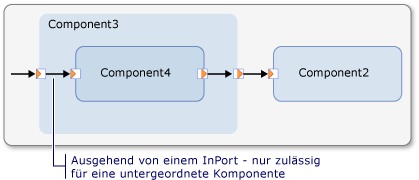
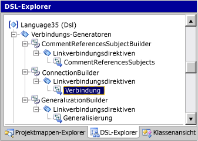
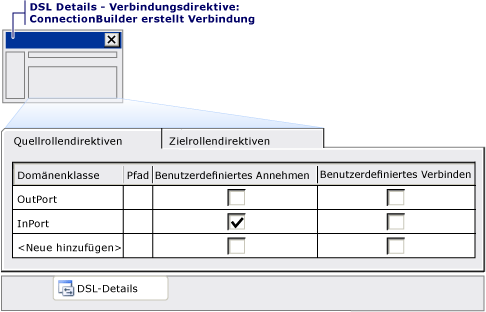

# <a name="customizing-tools-and-the-toolbox"></a>Anpassen der Tools und der Toolbox
Sie müssen Toolboxelemente für die Elemente definieren, die die Benutzer ihren Modellen hinzufügen dürfen. Es gibt zwei Arten von Tools: Elementtools und Verbindungstools. Im generierten Designer kann ein Benutzer ein Elementtool auswählen, um Formen auf das Diagramm zu ziehen. Dann kann der Benutzer ein Verbindungstool auswählen, um die Verbindungen zwischen den Formen zu zeichnen. Im Allgemeinen können Benutzer mit Elementtools ihren Modellen Instanzen von Domänenklassen hinzufügen, und mit Verbindungstools können sie Instanzen von Domänenbeziehungen hinzufügen.  
  
 In diesem Thema:  
  
-   [Wie wird die Toolbox definiert.](#ToolboxDef)  
  
-   [Anpassen von Elementtools](#customizing)  
  
-   [Erstellen von Gruppen von Elementen in einem Tool](#groups)  
  
-   [Anpassen von Tools für](#connections)  
  
##  <a name="ToolboxDef"></a>Wie wird die Toolbox definiert.  
 Erweitern Sie im DSL-Explorer den Knoten "Editor" und die darunter liegenden Knoten. Normalerweise wird eine Hierarchie wie die folgende angezeigt:  
  
```  
  
Editor  
     Toobox Tabs  
        MyDsl          //a tab  
           Tools  
               ExampleElement      // an element tool  
               ExampleRelationship // a connection tool  
  
```  
  
 In diesem Teil des DSL-Explorers können Sie folgende Aufgaben ausführen:  
  
-   Neue Registerkarten erstellen. Mit Registerkarten werden die Abschnittsüberschriften in der Toolbox definiert.  
  
-   Neue Tools erstellen.  
  
-   Kopieren Sie Tools, und fügen Sie sie ein.  
  
-   Tools in der Liste nach oben oder unten verschieben.  
  
-   Registerkarten und Tools löschen.  
  
> [!IMPORTANT]
>  Sie können in einem DSL-Explorer Elemente hinzufügen oder einfügen, indem Sie mit der rechten Maustaste auf die zweite übergeordnete Ebene klicken. Z. B. um ein Tool hinzuzufügen, mit der rechten Maustaste der Registerkarte ", und nicht die **Tools** Knoten. Zum Hinzufügen einer Registerkarte Maustaste die **Editor** Knoten.  
  
 Die **Symbol "Toolbox"** Eigenschaft jedes Tool verweist auf ein 16 x 16-Bitmap-Datei. Diese Dateien bleiben in der Regel der **Dsl\Resources** Ordner.  
  
 Die **Klasse** Eigenschaft von einem Elementtool bezieht sich auf eine konkrete Domain-Klasse. Standardmäßig erstellt das Tool Instanzen dieser Klasse. Sie können jedoch Code schreiben, damit das Tool Gruppen von Elementen oder Elemente unterschiedlicher Typen erstellt.  
  
 Die **Verbindungsgenerator** Eigenschaft eines Verbindungs-Tools bezieht sich auf einen verbindungsgenerator, der definiert, welche Arten von Elementen, die das Tool herstellen kann und welche Beziehungen zwischen ihnen erstellt. Verbindungs-Generatoren werden im DSL-Explorer als Knoten definiert. Verbindungs-Generatoren werden automatisch erstellt, wenn Sie Domänenbeziehungen definieren, aber Sie können sie über Code anpassen.  
  
#### <a name="to-add-a-tool-to-the-toolbox"></a>So fügen Sie der Toolbox ein Tool hinzu  
  
1.  Normalerweise erstellen Sie ein Elementtool, nachdem Sie eine Formklasse erstellt und einer Domänenklasse zugeordnet haben.  
  
     Normalerweise erstellen Sie ein Konnektortool, nachdem Sie eine Konnektorklasse erstellt und einer Verweisbeziehung zugeordnet haben.  
  
2.  Erweitern Sie im Explorer für DSL, die **Editor** Knoten und die **Toolboxregisterkarten** Knoten.  
  
     Mit der rechten Maustaste in eines Toolbox-Registerkarte "-Knotens, und klicken Sie dann auf **Tool für neues Element hinzufügen** oder **neue Verbindungstool hinzufügen**.  
  
3.  Legen Sie die **Symbol "Toolbox"** Eigenschaft zum Verweisen auf eine 16 x 16-Bitmap.  
  
     Wenn Sie ein neues Symbol definieren möchten, erstellen Sie eine Bitmapdatei im Projektmappen-Explorer die **Dsl\Resources** Ordner. Die Datei sollte die folgenden Eigenschaftswerte enthalten: **Buildvorgang** = **Content**; **In Ausgabeverzeichnis kopieren** = **nicht kopieren**.  
  
4.  **Für ein Elementtool:** legen Sie die **Klasse** Eigenschaft des Tools zum Verweisen auf eine konkrete Domänenklasse, das eine Form vom Typ zugeordnet ist.  
  
     **Für einen automatischen Verbinder:** legen Sie die **Verbindungsgenerator** Eigenschaft des Tools auf eines der Elemente, die in der Dropdown-Liste angeboten werden. Verbindungs-Generatoren werden automatisch erstellt, wenn Sie einen Konnektor einer Domänenbeziehung zuordnen. Wenn Sie gerade einen Konnektor erstellt haben, würden Sie normalerweise den zugehörigen Verbindungs-Generator auswählen.  
  
5.  Drücken Sie zum Testen der DSL F5 oder STRG+F5, und öffnen Sie in der experimentellen Instanz von [!INCLUDE[vsprvs](../code-quality/includes/vsprvs_md.md)] eine Beispielmodelldatei. Das neue Tool sollte in der Toolbox aufgeführt sein. Ziehen Sie es auf das Diagramm, um zu überprüfen, ob es ein neues Element erstellt.  
  
     Wenn das Tool nicht angezeigt wird, beenden Sie die experimentelle Instanz von [!INCLUDE[vsprvs](../code-quality/includes/vsprvs_md.md)]. In den Fenstern **starten** führen Sie im Menü **Zurücksetzen der Microsoft Visual Studio 2010 experimentellen Instanz**. Auf der [!INCLUDE[vsprvs](../code-quality/includes/vsprvs_md.md)] **erstellen** Menü klicken Sie auf **Projektmappe neu erstellen**. Wiederholen Sie dann den DSL-Test.  
  
##  <a name="customizing"></a>Anpassen der Elementtools  
 Standardmäßig erstellt das Tool eine Instanz der angegebenen Klasse. Sie haben jedoch zwei Optionen, dies zu ändern:  
  
-   Definieren Sie Direktiven für Elementzusammenführungen für andere Klassen, sodass sie neue Instanzen dieser Klasse akzeptieren und weitere Links erstellen können, wenn ein neues Element erstellt wird. Sie können beispielsweise zulassen, dass ein Benutzer einem anderen Element einen Kommentar hinzufügt und auf diese Weise einen Verweislink zwischen beiden erstellt.  
  
     Diese Anpassungen haben auch Auswirkungen darauf, was geschieht, wenn der Benutzer ein Element einfügt oder per Drag & Drop ergänzt.  
  
     Weitere Informationen finden Sie unter [Element erstellen anpassen und Bewegung](../modeling/customizing-element-creation-and-movement.md).  
  
-   Schreiben Sie Code, um das Tool so anzupassen, dass es Gruppen von Elementen erstellen kann. Das Tool wird von Methoden in "ToolboxHelper.cs" initialisiert, die Sie überschreiben können. Weitere Informationen finden Sie unter [Erstellen von Gruppen von Elementen in einem Tool](#groups).  
  
##  <a name="groups"></a>Erstellen von Gruppen von Elementen in einem Tool  
 Jedes Elementtool enthält einen Prototyp der Elemente, die es erstellen soll. Standardmäßig erstellt jedes Elementtool ein Element. Es ist jedoch auch möglich, eine Gruppe verknüpfter Objekte mit einem Tool zu erstellen. Dazu initialisieren Sie das Tool mit einem <xref:Microsoft.VisualStudio.Modeling.ElementGroupPrototype>, der verknüpfte Elemente enthält.  
  
 Das folgende Beispiel stammt aus DSL und enthält einen Typ "Transistor". Jeder Transistor weist drei benannte Terminals auf. Das Elementtool für Transistoren speichert einen Prototyp, der vier Modellelemente und drei Beziehungslinks enthält. Wenn der Benutzer das Tool auf das Diagramm zieht, wird der Prototyp instanziiert und mit dem Modellstamm verknüpft.  
  
 Dieser Code überschreibt eine Methode, die in definierten **Dsl\GeneratedCode\ToolboxHelper.cs**.  
  
 Weitere Informationen zum Anpassen des Modells mithilfe von Programmcode finden Sie unter [Navigieren in und Aktualisieren eines Modells im Programmcode](../modeling/navigating-and-updating-a-model-in-program-code.md).  
  
```  
using Microsoft.VisualStudio.Modeling;  
using Microsoft.VisualStudio.Modeling.Diagrams;  
  
  public partial class CircuitsToolboxHelper  
  {  
    /// <summary>  
    /// Toolbox initialization, called for each element tool on the toolbox.  
    /// This version deals with each Component subtype separately.  
    /// </summary>  
    /// <param name="store"></param>  
    /// <param name="domainClassId">Identifies the domain class this tool should instantiate.</param>  
    /// <returns>prototype of the object or group of objects to be created by tool</returns>  
    protected override ElementGroupPrototype CreateElementToolPrototype(Store store, Guid domainClassId)  
    {  
        if (domainClassId == Transistor.DomainClassId)  
        {  
            Transistor transistor = new Transistor(store);  
  
            transistor.Base = new ComponentTerminal(store);  
            transistor.Collector = new ComponentTerminal(store);  
            transistor.Emitter = new ComponentTerminal(store);  
  
            transistor.Base.Name = "base";  
            transistor.Collector.Name = "collector";  
            transistor.Emitter.Name = "emitter";  
  
            // Create an ElementGroup for the Toolbox.  
            ElementGroup elementGroup = new ElementGroup(store.DefaultPartition);  
            elementGroup.AddGraph(transistor, true);  
            // AddGraph includes the embedded parts  
  
            return elementGroup.CreatePrototype();  
        }  
        else  
        {  
            return base.CreateElementToolPrototype(store, domainClassId);  
}  }    }  
  
```  
  
##  <a name="connections"></a>Anpassen von Tools für  
 Üblicherweise erstellen Sie ein Elementtool, wenn Sie eine neue Konnektorklasse erstellen. Alternativ können Sie ein Tool überladen, indem Sie den Beziehungstyp durch die Typen an den beiden Enden bestimmen lassen. Beispielsweise könnten Sie ein Verbindungstool erstellen, das Person-Person- und Person-Stadt-Beziehungen erstellen kann.  
  
 Verbindungstools rufen Verbindungs-Generatoren auf. Verwenden Sie Verbindungs-Generatoren, um anzugeben, wie Benutzer Elemente im generierten Designer verknüpfen können. Mit Verbindungs-Generatoren werden die Elemente angegeben, die verknüpft werden können. Zudem wird die Art von Link bestimmt, der zwischen den Elementen erstellt werden kann.  
  
 Wenn Sie eine Verweisbeziehung zwischen Domänenklassen erstellen, wird automatisch ein Verbindungs-Generator erstellt. Sie können diesen Verbindungs-Generator verwenden, wenn Sie ein Verbindungstool zuordnen. Weitere Informationen zur Vorgehensweise beim Erstellen der Verbindung Tools finden Sie unter [konfigurieren die Toolbox](../modeling/customizing-tools-and-the-toolbox.md).  
  
 Sie können den standardmäßigen Verbindungs-Generator so ändern, dass er mit einem anderen Bereich von Quell- und Zieltypen verwendet werden kann und unterschiedliche Typen von Beziehungen erstellen kann.  
  
 Darüber hinaus können Sie benutzerdefinierten Code für Verbindungs-Generatoren schreiben, um die Quell- und Zielklassen für die Verbindung anzugeben, den Typ der herzustellenden Verbindung zu definieren und Aktionen im Zusammenhang mit der Verbindungserstellung auszuführen.  
  
### <a name="the-structure-of-connection-builders"></a>Struktur der Verbindungs-Generatoren  
 Verbindungs-Generatoren enthalten mindestens eine Direktive für Linkverbindungen, um die Domänenbeziehung sowie die Quell- und Zielelemente anzugeben. Beispielsweise in den Datenflusstask Projektmappe (Vorlage), können Sie sehen die **CommentReferencesSubjectsBuilder** in der **Explorer für DSL**. Dieser verbindungsgenerator enthält einen Link verbinden Direktive mit dem Namen **CommentReferencesSubjects**, die die domänenbeziehung zugeordnet **CommentReferencesSubjects**. Diese Direktive für Linkverbindungen enthält eine Direktive für die Quellrolle, die auf die `Comment`-Domänenklasse verweist, und eine Direktive für die Zielrolle, die auf die `FlowElement`-Domänenklasse verweist.  
  
### <a name="using-connection-builders-to-restrict-source-and-target-roles"></a>Verwenden von Verbindungs-Generatoren zum Beschränken von Quell- und Zielrollen  
 Sie können mit Verbindungs-Generatoren das Auftreten bestimmter Klassen in der Quell- oder Zielrolle einer angegebenen Domänenbeziehung beschränken. Beispiel: Sie verfügen über eine Basisdomänenklasse, die eine Domänenbeziehung mit einer anderen Domänenklasse aufweist, Sie möchten jedoch nicht, dass alle abgeleiteten Klassen der Basisklasse in dieser Beziehung die gleiche Rolle haben. In der Projektmappe Datenflusstask stehen vier konkrete Domänenklassen (**"StartPoint"**, **Endpunkt**, **MergeBranch**, und **Synchronisierung**), die direkt von der abstrakten Domänenklasse erben **FlowElement**, und zwei konkreten Domänenklassen (**Aufgabe** und **ObjectInState**), erben Sie indirekt von diesem. Es gibt auch eine **Flow** verweisbeziehung, die akzeptiert **FlowElement** Domänenklassen in hinsichtlich der Rolle "Quelle" und der Rolle "Ziel". Jedoch einer Instanz von ein **Endpunkt** Domänenklasse muss sich nicht auf die Quelle einer Instanz von einer **fließen** Beziehung, noch sollte eine Instanz von einer **"StartPoint"** Klasse sein der Ziel einer Instanz von einem **Flow** Beziehung. Die **FlowBuilder** verbindungsgenerator verfügt über einen Link herstellen Direktive mit dem Namen **Flow** , der angibt, welche Domänenklassen Quellrolle spielen können (**Aufgabe**,  **MergeBranch**, **"StartPoint"**, und **Synchronisierung**) und können die Zielrolle wiedergeben (**MergeBranch**,  **Endpunkt**, und **Synchronisierung**).  
  
### <a name="connection-builders-with-multiple-link-connect-directives"></a>Verbindungs-Generatoren mit mehreren Direktiven für Linkverbindungen  
 Sie können einem Verbindungs-Generator mehr als eine Direktive für Linkverbindungen hinzufügen. Dadurch können Sie einige der Komplexität des Domänenmodells Benutzer ausblenden und behalten Sie die **Toolbox** aus zu unübersichtlich. Sie können in einem Verbindungs-Generator für mehrere verschiedene Domänenbeziehungen Direktiven für Linkverbindungen hinzufügen. Sie sollten Domänenbeziehungen jedoch kombinieren, wenn sie annähernd die gleiche Funktion ausführen.  
  
 In der Projektmappe Datenflusstask der **Flow** Verbindungstool wird verwendet, um Instanzen beider zeichnen die **Flow** und die **ObjectFlow** zwischen Domänen. Die **FlowBuilder** verbindungsgenerator verfügt zusätzlich zu den **Flow** Link verbinden Richtlinie, die zuvor beschriebenen, zwei Verknüpfung verbinden Direktiven, die mit dem Namen **ObjectFlow**. Diese Direktiven angeben, die einer Instanz von ein **ObjectFlow** Beziehung zwischen Instanzen von gezeichnet werden kann die **ObjectInState** Domänenklasse, oder von einer Instanz von einer **ObjectInState**  mit einer Instanz von einer **Aufgabe**, jedoch nicht zwischen zwei Instanzen von eine **Aufgabe**, oder von einer Instanz von einer **Aufgabe** mit einer Instanz von einem **ObjectInState**. Jedoch eine Instanz von einer **Flow** Beziehung zwischen zwei Instanzen von gezeichnet werden kann ein **Aufgabe**. Wenn Sie kompilieren und führen Sie die Projektmappe Datenflusstask, sehen Sie die Zeichnung eine **Flow** aus einer Instanz von ein **ObjectInState** mit einer Instanz von einer **Aufgabe** erstellt eine Instanz des ein **ObjectFlow**, aber zeichnen eine **Flow** zwischen zwei Instanzen von einer **Aufgabe** erstellt eine Instanz des eine **fließen**.  
  
### <a name="custom-code-for-connection-builders"></a>Benutzerdefinierter Code für Verbindungs-Generatoren  
 Es gibt vier Kontrollkästchen auf der Benutzeroberfläche, mit denen die unterschiedlichen Typen von Anpassungen der Verbindungs-Generatoren definiert werden:  
  
-   die **benutzerdefinierte akzeptieren** Kontrollkästchen in einer Quelle oder Ziel-Rolle-Direktive  
  
-   die **benutzerdefinierte verbinden** Kontrollkästchen in einer Quelle oder Ziel-Rolle-Direktive  
  
-   die **verwendet benutzerdefinierte verbinden** Kontrollkästchen auf eine Connect-Direktive  
  
-   die **ist Benutzerdefiniert** Eigenschaft des Verbindungs-Generators  
  
 Für diese Anpassungen müssen Sie Programmcode angeben. Sie können herausfinden, welcher Code erforderlich ist, indem Sie eines dieser Kontrollkästchen aktivieren, auf "Alle Vorlagen transformieren" klicken und dann die Projektmappe erstellen. Ein Fehlerbericht wird erstellt. Doppelklicken Sie auf den Fehlerbericht, um einen Kommentar zu lesen, der den hinzuzufügenden Code erläutert.  
  
> [!NOTE]
>  Erstellen Sie zum Hinzufügen von benutzerdefiniertem Code eine partielle Klassendefinition in einer Codedatei, die nicht zu den Codedateien in den Ordnern "GeneratedCode" gehört. Damit Ihre Arbeit nicht verloren geht, sollten Sie die generierten Codedateien nicht bearbeiten. Weitere Informationen finden Sie unter [überschreiben und erweitern die generierte Klassen](../modeling/overriding-and-extending-the-generated-classes.md).  
  
#### <a name="creating-custom-connection-code"></a>Erstellen von benutzerdefiniertem Verbindungscode  
 In jeden Link eine Verbindung mit der Richtlinie, die **Datenquelle Rolle Direktiven** Registerkarte definiert, von was Ihnen Typen ziehen kann. Auf ähnliche Weise die **Rolle Direktiven als Ziel** Registerkarte definiert was Ihnen Typen ziehen kann. Für jeden Typ, Sie können weitere angeben, ob die Verbindung zulassen (für diesen Link herzustellen Richtlinie) durch Festlegen der **benutzerdefinierte akzeptieren** Kennzeichen, und geben Sie dann die zusätzlichen Code.  
  
 Darüber hinaus können Sie anpassen, was geschieht, wenn die Verbindung hergestellt wird. Sie können beispielsweise nur den Fall anpassen, wenn das Ziehen in eine oder aus einer bestimmten Klasse erfolgt. Sie können aber auch alle Fälle, für die eine Direktive für Linkverbindungen gilt, oder den gesamten FlowBuilder-Verbindungs-Generator anpassen. Für jede dieser Optionen können Sie benutzerdefinierte Flags auf der entsprechenden Ebene festlegen. Wenn Sie alle Vorlagen transformieren und die Projektmappe erstellen, weisen Sie Fehlermeldungen auf Kommentare im generierten Code hin. In diesen Kommentaren werden die erforderlichen Angaben identifiziert.  
  
 Im Komponentendiagrammbeispiel wurde der Verbindungs-Generator für die Domänenbeziehung "Verbindung" angepasst, um die zwischen Ports möglichen Verbindungen zu beschränken. Die folgende Abbildung zeigt, dass Sie nur Verbindungen von `OutPort`-Elementen mit `InPort`-Elementen herstellen können. Zudem können Sie Komponenten ineinander schachteln.  
  
 **Verbindung zu einer OutPort aus einer geschachtelten Komponente eingehen**  
  
   
  
 Daher könnten Sie angeben, dass eine Verbindung aus einer geschachtelten Komponente mit "OutPort" zulässig ist. Wenn eine solche Verbindung angeben, legen Sie **verwendet benutzerdefinierte akzeptieren** auf die **InPort** Typ wie die Rolle "Quelle" und die **OutPort** Typ als Zielrolle in die **DSL-Detailfenster**  wie in der folgenden Abbildung gezeigt:  
  
 **Verknüpfung verbinden Richtlinie im Explorer für DSL**  
  
   
  
 **Verknüpfung verbinden Richtlinie im Fenster "Klassendetails" DSL**  
  
   
  
 Dann müssen Sie die Methoden in der ConnectionBuilder-Klasse angeben:  
  
```  
  public partial class ConnectionBuilder  
  {  
    /// <summary>  
    /// OK if this component has children  
    /// </summary>  
    private static bool CanAcceptInPortAsSource(InPort candidate)  
    {  
       return candidate.Component.Children.Count > 0;  
    }  
  
    /// <summary>  
    /// Only if source is on parent of target.  
    /// </summary>  
    private static bool CanAcceptInPortAndInPortAsSourceAndTarget                (InPort sourceInPort, InPort targetInPort)  
    {  
      return sourceInPort.Component == targetInPort.Component.Parent;  
    }  
// And similar for OutPorts...  
```  
  
 Weitere Informationen zum Anpassen des Modells mithilfe von Programmcode finden Sie unter [Navigieren in und Aktualisieren eines Modells im Programmcode](../modeling/navigating-and-updating-a-model-in-program-code.md).  
  
 Sie können ähnlichen Code verwenden, um beispielsweise zu verhindern, dass die Benutzer Schleifen mit Links zwischen übergeordneten und untergeordneten Elementen erstellen. Diese Einschränkungen werden "Festplatte" Einschränkungen berücksichtigt, da diese Benutzer zu einem beliebigen Zeitpunkt verletzen können nicht. Sie können auch "soft" Überprüfungen erstellen, die Benutzern vorübergehend umgehen können, durch das Erstellen ungültiger Konfigurationen, die sie speichern können.  
  
### <a name="good-practice-in-defining-connection-builders"></a>Empfehlungen für die Definition von Verbindungs-Generatoren  
 Sie sollten einen Verbindungs-Generator definieren, um unterschiedliche Typen von Beziehungen zu erstellen, wenn sie konzeptionell verwandt sind. Im Beispiel des Aufgabenablaufs verwenden Sie einen Generator, um die Abläufe zwischen Aufgaben und zwischen Aufgaben und Objekten zu erstellen. Es kann jedoch verwirrend sein, den gleichen Generator für Beziehungen zwischen Kommentaren und Aufgaben zu verwenden.  
  
 Wenn Sie einen Verbindungs-Generator für mehrere Typen von Beziehungen erstellen, sollten Sie sicherstellen, dass er nicht zu mehr als einem Typ eines Paars von Quell- und Zielobjekten passt. Andernfalls können sich unerwartete Ergebnisse ergeben.  
  
 Sie benutzerdefinierten Code verwenden, um "Festplatten" Einschränkungen gelten, jedoch sollten Sie, ob Benutzer vorübergehend ungültige Verbindungen herstellen können sollen. In dem Fall können Sie die Beschränkungen so ändern, dass die Verbindungen erst überprüft werden, wenn die Benutzer die Änderungen speichern möchten.  
  
## <a name="see-also"></a>Siehe auch  
 [Anpassen von Element erstellen und verschieben](../modeling/customizing-element-creation-and-movement.md)   
 [Anpassen des Kopierverhaltens](../modeling/customizing-copy-behavior.md)   
 [Vorgehensweise: Hinzufügen eines Drag-and-Drop-Ereignishandlers](../modeling/how-to-add-a-drag-and-drop-handler.md)   
 [Navigieren in und Aktualisieren eines Modells im Programmcode](../modeling/navigating-and-updating-a-model-in-program-code.md)   
 [Circuit Diagramme Beispiel DSL](http://code.msdn.microsoft.com/Visualization-Modeling-SDK-763778e8)