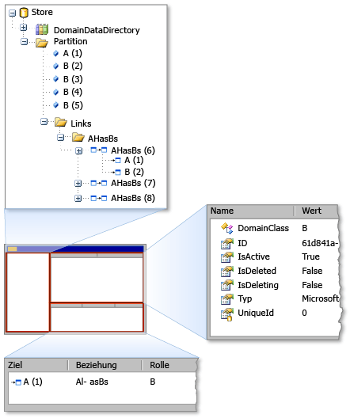

# <a name="debugging-by-using-the-store-viewer"></a>Debuggen mithilfe der Speicheranzeige
Mit dem Viewer speichern können Sie den Status der Prüfen einer *speichern* verwendeten [!INCLUDE[dsl](../modeling/includes/dsl_md.md)]. Die speichern-Viewers zeigt alle die Domäne Modellelemente, die in einem bestimmten Speicher, zusammen mit Elementeigenschaften und Links zwischen Elementen sind.  
  
## <a name="opening-store-viewer"></a>Öffnenden Speicher-Viewer  
 Wenn Sie sind der [!INCLUDE[vsprvs](../code-quality/includes/vsprvs_md.md)] experimentellen "erstellen", beenden Sie den Code an einem Haltepunkt, in dem eine Instanz des Speichers Modellinformationen enthält. Öffnen Sie dann den Speicher-Viewer durch Eingabe des folgenden Befehls in die **Direktfenster** Fenster:  
  
```  
Microsoft.VisualStudio.Modeling.Diagnostics.StoreViewer.Show(mystore);  
```  
  
> [!NOTE]
>  Ersetzen Sie `mystore` durch den Namen Ihrer Store-Instanz. Wenn Sie den Namespace in den Code hinzufügen, können Sie den Befehl für die Speicher-Viewer anzeigen, ohne den vollqualifizierten Namespace eingeben:  
>   
>  `using Microsoft.VisualStudio.Modeling.Diagnostics;`  
>   
>  `...`  
>   
>  `StoreViewer.Show(mystore);`  
  
 Die `Show` -Methode weist mehrere Überladungen. Sie können eine Instanz von einem Speicher oder eine Partition als Parameter angeben.  
  
 Als Alternative können Sie die Codezeile, die die Speicher-Viewer an einer beliebigen Stelle im Code zeigt einfügen können, in dem der Parameter, die Sie zum Übergeben der `Show` Methode befindet sich im Bereich. Dadurch zeigt der Viewer speichern aus, wenn die Codezeile, die als eine Momentaufnahme des Inhalts des Speichers ausgeführt wird.  
  
### <a name="using-store-viewer"></a>Verwenden von Speicher-Viewer  
 Wenn der Speicher-Viewer geöffnet wird, wird ein nicht modales Windows Forms-Fenster wie die folgende Abbildung zeigt angezeigt.  
  
   
Speicher-Viewer  
  
 Der Speicher-Viewer verfügt über drei Bereiche: links, oben rechts im Bereich und Bereich unten rechts. Der linke Bereich ist eine Strukturansicht der Typen in der `DomainDataDirectory` Member eines Speichers. Wenn Sie erweitern Sie den Knoten für die Partition, und klicken Sie auf ein Element, werden die Eigenschaften des Elements in der oberen rechten Bereich angezeigt. Wenn das Element auf andere Elemente verknüpft ist, werden die zusätzlichen Elemente in der unteren rechten Ecke angezeigt. Wenn Sie ein Element in der unteren rechten Bereich doppelklicken, wird das Element im linken Bereich hervorgehoben.  
  
## <a name="see-also"></a>Siehe auch  
 [Navigieren in und Aktualisieren von Modellen im Programmcode](../modeling/navigating-and-updating-a-model-in-program-code.md)