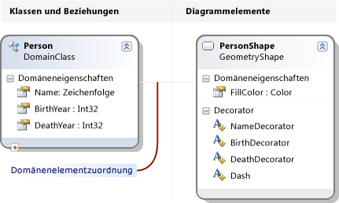
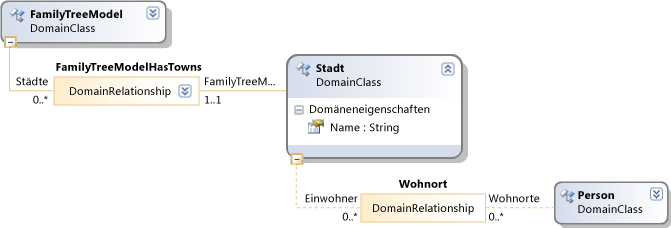
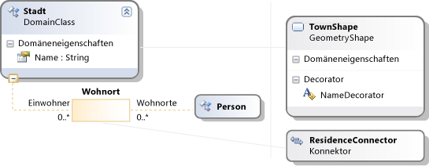

# <a name="getting-started-with-domain-specific-languages"></a>Erste Schritte mit domänenspezifischen Sprachen
In diesem Thema wird erläutert, die grundlegenden Konzepte in definieren und verwenden eine domänenspezifische Sprache (DSL) mit den Modellierungs-SDK für Visual Studio erstellt wird.

> [!NOTE]
> In Visual Studio 2017 werden Text Vorlage Transformation SDK und Visual Studio Modellierungs-SDKS automatisch installiert, wenn Sie bestimmte Funktionen von Visual Studio zu installieren. Weitere Informationen finden Sie unter [diesem Blogbeitrag](https://blogs.msdn.microsoft.com/visualstudioalm/2016/12/12/the-visual-studio-modeling-sdk-is-now-available-with-visual-studio-2017/).

Wenn Sie konzentriert vertraut sind, es wird empfohlen, dass Sie über arbeiten die **DSL-Tools Lab**, das Sie an diesem Standort zugreifen können: [Visualizaton und Modellierungs-SDKS](http://go.microsoft.com/fwlink/?LinkID=186128)  
  
## <a name="what-can-you-do-with-a-domain-specific-language"></a>Was können Sie mit einer domänenspezifischen Sprache?  
 Eine domänenspezifische Sprache ist eine Notation, in der Regel Grafik, die für einen bestimmten Zweck verwendet werden soll. Im Gegensatz dazu sind Sprachen wie z. B. UML allgemeine. Eine DSL können Sie definieren die Typen von Modellelement und ihre Beziehungen und wie sie auf dem Bildschirm dargestellt sind.  
  
 Wenn Sie eine DSL entworfen haben, können Sie ihn als Teil eines Pakets für Visual Studio Integration Extension (VSIX) verteilen. Benutzer arbeiten mit der DSL in Visual Studio:  
  
   
  
 Die Notation ist nur ein Teil der DSL. Zusammen mit der Schreibweise enthält des VSIX-Pakets Tools, die Benutzer dabei unterstützen, bearbeiten und Generieren von Material aus ihrer Modelle beschränkt werden können.  
  
 Eine der wichtigsten Anwendungen von konzentriert ist Programmcode, Konfigurationsdateien und andere Artefakte generieren. Insbesondere in großen Projekten und Produktlinien, wobei mehrere Varianten eines Produkts erstellt wird, kann zahlreiche Variablen Aspekte von konzentriert generieren eine große Erhöhung in der Zuverlässigkeits- und eine sehr schnelle Reaktion auf anforderungsänderungen bereitstellen.  
  
 Der Rest dieser Übersicht ist eine exemplarische Vorgehensweise, die die grundlegenden Operationen des Erstellens und Verwendens einer domänenspezifischen Sprache in Visual Studio eingeführt werden.  
  
## <a name="prerequisites"></a>Erforderliche Komponenten  
 Zur Definition einer DSL müssen folgende Komponenten installiert sein:  
  
|||  
|-|-|  
|Visual Studio|[http://go.microsoft.com/fwlink/?LinkId=185579](http://go.microsoft.com/fwlink/?LinkId=185579)|  
|[!INCLUDE[vssdk_current_short](../modeling/includes/vssdk_current_short_md.md)]|[http://go.microsoft.com/fwlink/?LinkId=185580](http://go.microsoft.com/fwlink/?LinkId=185580)|  
|Modeling SDK für Visual Studio||  


[!INCLUDE[modeling_sdk_info](includes/modeling_sdk_info.md)]

  
## <a name="creating-a-dsl-solution"></a>Erstellen einer Projektmappe DSL  
 Um eine neue domänenspezifische Sprache zu erstellen, erstellen Sie eine neue Visual Studio-Projektmappe mithilfe der Projektvorlage einer domänenspezifischen Sprache.  
  
#### <a name="to-create-a-dsl-solution"></a>So erstellen Sie eine DSL-Projektmappe  
  
1.  Zeigen Sie im Menü **Datei** auf **Neu**, und klicken Sie dann auf **Projekt**.  
  
2.  Klicken Sie unter **-Projekttypen**, erweitern Sie die **andere Projekttypen** Knoten, und klicken Sie auf **Erweiterbarkeit**.  
  
3.  Klicken Sie auf **einer domänenspezifischen Sprachdesigner**.  
  
       
  
4.  In der **Namen** geben **FamilyTree**. Klicken Sie auf **OK**.  
  
     Die **einer domänenspezifischen Sprache Assistenten** wird geöffnet und zeigt eine Liste der DSL Vorlagenprojektmappen.  
  
     Klicken Sie auf jede Vorlage um eine Beschreibung anzuzeigen,  
  
     Die Vorlagen eignen sich Startpunkte. Jede von ihnen bietet eine vollständige funktionierende DSL, die Sie bearbeiten können, um Ihren Anforderungen entsprechend. Normalerweise wählen Sie die Vorlage am nächsten liegt, Sie erstellen möchten.  
  
5.  Wählen Sie für diese exemplarische Vorgehensweise die **minimale Sprache** Vorlage.  
  
6.  Geben Sie auf der entsprechenden Seite des Assistenten eine Dateinamenerweiterung für die DSL ein. Diese Erweiterung wird für Dateien mit Instanzen Ihrer DSL verwendet.  
  
    -   Wählen Sie eine Erweiterung, die nicht in der bezieht sich auf jede Anwendung in Ihrem Computer oder in einem beliebigen Computer, auf dem der DSL installiert werden soll. Beispielsweise **Docx** und **Htm** wäre nicht akzeptabel Datei Dateinamenerweiterungen.  
  
    -   Der Assistent warnt Sie, wenn die eingegebene Erweiterung bereits als DSL verwendet wird. Verwenden Sie nach Möglichkeit eine andere Dateinamenerweiterung. Sie können die experimentelle Instanz des Visual Studio SDK auch zurücksetzen, um alte experimentelle Designer zu löschen. Klicken Sie auf **starten**, klicken Sie auf **Programme**, **Microsoft Visual Studio 2010 SDK**, **Tools**, und klicken Sie dann **Microsoft zurücksetzen Visual Studio 2010 experimentelle Instanz**.  
  
7.  Überprüfen Sie die anderen Seiten, und klicken Sie dann auf **Fertig stellen**.  
  
     Eine Projektmappe wird erstellt, die zwei Projekte enthält. Sie erhalten den Namen Dsl und DslPackage. Eine Diagrammdatei wird also benannte DslDefinition.dsl geöffnet.  
  
    > [!NOTE]
    >  Die meisten des Codes, den Sie in den Ordnern in beiden Projekten finden Sie unter wird DslDefinition.dsl generiert. Aus diesem Grund sind die meisten Änderungen an der DSL in dieser Datei vorgenommen.  
  
 Die Benutzeroberfläche gleicht nun der folgenden Abbildung.  
  
   
  
 Diese Projektmappe definiert eine domänenspezifische Sprache. Weitere Informationen finden Sie unter [Überblick über die Benutzeroberfläche von einer domänenspezifischen Sprache Tools](../modeling/overview-of-the-domain-specific-language-tools-user-interface.md).  
  
## <a name="the-important-parts-of-the-dsl-solution"></a>Die wichtigen Teile der DSL-Lösung  
 Beachten Sie die folgenden Aspekte der neuen Projektmappe ein.  
  
-   **Dsl\DslDefinition.DSL** Dies ist die Datei, die Sie beim Erstellen einer Lösung DSL angezeigt. Fast alle der Code in der Lösung wird von dieser Datei generiert, und die meisten der Änderungen, die Sie für die Definition einer DSL stellen werden hier versucht. Weitere Informationen finden Sie unter Verwendung der [arbeiten mit der DSL-Definitionsdiagramm](../modeling/working-with-the-dsl-definition-diagram.md).  
  
-   **DSL-Projekt** dieses Projekt enthält Code, der einer domänenspezifischen Sprache definiert.  
  
-   **DslPackage Projekt** dieses Projekt enthält Code, der Instanzen der DSL geöffnet und in Visual Studio bearbeitet werden kann.  
  
##  <a name="Debugging"></a>Ausführen der DSL  
 Sie können die DSL-Lösung ausführen, sobald Sie ihn erstellt haben. Später können Sie die DSL-Definition nach und nach Ausführen der Projektmappe nach jeder Änderung erneut ändern.  
  
#### <a name="to-experiment-with-the-dsl"></a>Zum Experimentieren mit der DSL  
  
1.  Klicken Sie auf **alle Vorlagen transformieren** in der Projektmappen-Explorer-Symbolleiste. Dies generiert einen neuen Großteil den Quellcode aus DslDefinition.dsl.  
  
    > [!NOTE]
    >  Wenn Sie DslDefinition.dsl ändern, klicken Sie auf **alle Vorlagen transformieren** , bevor Sie die Projektmappe neu erstellen. Dieser Schritt kann automatisiert werden. Weitere Informationen finden Sie unter [wie alle Vorlagen transformieren automatisieren](http://msdn.microsoft.com/b63cfe20-fe5e-47cc-9506-59b29bca768a).
  
2.  Drücken Sie F5, oder auf die **Debuggen** Menü klicken Sie auf **Debuggen**.  
  
     Der DSL erstellt und wird in der experimentellen Instanz von Visual Studio installiert.
  
     Eine experimentelle Instanz von Visual Studio wird gestartet. Die experimentelle Instanz hat seine Einstellungen über eine separate Unterstruktur der Registrierung, in der Visual Studio-Erweiterungen für Debugzwecke registriert sind. Den Zugriff auf Erweiterungen registriert gibt es keine normale Instanzen von Visual Studio.  
  
3.  In der experimentellen Instanz von Visual Studio, öffnen Sie die Modelldatei, die mit dem Namen **Test** aus **Projektmappen-Explorer**.  
  
     \- oder –  
  
     Mit der rechten Maustaste des Debugging-Projekts, zeigen Sie auf **hinzufügen**, und klicken Sie dann auf **Element**. In der **Element hinzufügen** wählen Sie im Dialogfeld Geben Sie die Datei von der DSL.  
  
     Die Modelldatei wird als ein leeres Diagramm geöffnet.  
  
     Die Toolbox wird geöffnet und zeigt Tools, die den Diagrammtyp.  
  
4.  Verwenden Sie die Tools, um Formen und Konnektoren im Diagramm zu erstellen.  
  
    1.  Zum Erstellen von Shapes ziehen Sie aus der Form "Beispiel"-Tool, auf das Diagramm.  
  
    2.  Um zwei Formen verbinden, klicken Sie auf die Beispiel-Verbinder, klicken Sie auf die erste Form, und klicken Sie dann auf die zweite Form.  
  
5.  Klicken Sie auf die Bezeichnungen der Formen ändern.  
  
 Die experimentelle Visual Studio wird im folgende Beispiel ähneln:  
  
   
  
### <a name="the-content-of-a-model"></a>Der Inhalt eines Modells  
 Wird aufgerufen, der Inhalt der Datei, die eine Instanz eine DSL ist eine *Modell*. Das Modell enthält *Modell ** Elemente* und *Links* zwischen den Elementen. DSL-Definition gibt an, welche Arten von Modellelementen und Links können im Modell vorhanden sein. Z. B. in eine DSL, die aus der Vorlage für die minimale Sprache erstellt, besteht eine Art von Modellelement und einen Typ des Links.  
  
 DSL-Definition kann angeben, wie das Modell in einem Diagramm dargestellt. Sie können aus einer Vielzahl von Formaten von Formen und Verbindern auswählen. Sie können angeben, dass einige Formen in anderen Formen angezeigt werden.  
  
 Sehen Sie ein Modell als Baumstruktur in der **Explorer** während der Bearbeitung eines Modells anzeigen. Hinzufügen von Formen im Diagramm werden die betroffenen Modellelemente auch im Explorer angezeigt. Der Explorer kann verwendet werden, auch wenn es kein Diagramm.  
  
 Wenn Sie in der Debug-Instanz von Visual Studio im Explorer nicht angezeigt der **Ansicht** zeigen Sie im Menü auf **Weitere Fenster**, und klicken Sie dann auf  *\<Ihre Sprache >* **Explorer**.  
  
### <a name="the-api-of-your-dsl"></a>Die API der DSL  
 Der DSL generiert eine API, mit dem Sie zum Lesen und Aktualisieren von Modellen, die Instanzen der DSL. Eine Anwendung der API wird zum Generieren von Textdateien aus einem Modell. Weitere Informationen finden Sie unter [Design-Time Code Generation mithilfe von T4-Textvorlagen](../modeling/design-time-code-generation-by-using-t4-text-templates.md).  
  
 Öffnen Sie in der Projektmappe Debuggen die Vorlagendateien mit der Erweiterung "tt" ein. Diese Beispiele veranschaulichen, wie Sie Text aus Modelle generieren und ermöglichen es Ihnen, die der DSL-API testen können. Eines der Beispiele in geschrieben [!INCLUDE[vbprvb](../code-quality/includes/vbprvb_md.md)], die andere in [!INCLUDE[csprcs](../data-tools/includes/csprcs_md.md)].  
  
 Unter jeder Vorlage ist die Datei der Datei, die sie generiert. Erweitern Sie im Projektmappen-Explorer die Datei der Vorlage, und öffnen Sie die generierte Datei.  
  
 Die Vorlagedatei enthält einen kurzen Codesegment, die alle Elemente im Modell enthält.  
  
 Die generierte Datei enthält das Ergebnis an.  
  
 Wenn Sie eine Modelldatei ändern, sehen Sie entsprechende Änderungen im generierten Dateien nach dem die Dateien erneut zu generieren.  
  
##### <a name="to-regenerate-text-files-after-you-change-the-model-file"></a>Beim Neugenerieren des Text-Dateien nach dem Ändern der Modelldatei  
  
1.  Speichern Sie die Modelldatei, in der experimentellen Instanz von Visual Studio.  
  
2.  Stellen Sie sicher, dass die Dateinamenparameter in jeder TT-Datei auf die Modelldatei bezieht, die Sie für Experimente verwenden. Die TT-Datei zu speichern.  
  
3.  Klicken Sie auf **alle Vorlagen transformieren** auf der Symbolleiste des **Projektmappen-Explorer**.  
  
     \- oder –  
  
     Mit der rechten Maustaste in der Vorlagen, die Sie verwenden möchten, generieren, und klicken Sie dann auf **benutzerdefiniertes Tool ausführen**.  
  
 Sie können eine beliebige Anzahl von Textvorlagendateien zu einem Projekt hinzufügen. Jede Vorlage generiert eine Ergebnisdatei an.  
  
> [!NOTE]
>  Wenn Sie die DSL-Definition ändern, funktioniert der Textvorlagencode Beispiel nicht, wenn Sie es aktualisieren.  
  
 Weitere Informationen finden Sie unter [Generieren von Code aus einer domänenspezifischen Sprache](../modeling/generating-code-from-a-domain-specific-language.md) und [Schreiben von Code zum Anpassen einer domänenspezifischen Sprache](../modeling/writing-code-to-customise-a-domain-specific-language.md).  
  
## <a name="customizing-the-dsl"></a>Anpassen der DSL  
 Wenn Sie die DSL-Definition ändern möchten, schließen Sie die experimentelle Instanz und aktualisieren Sie die Definition in der Hauptinstanz von Visual Studio.  
  
> [!NOTE]
>  Nachdem Sie die DSL-Definition geändert haben, verlieren Sie möglicherweise Informationen in den Test-Modellen, die Sie erstellt haben, mithilfe von früheren Versionen.  Die Lösung Debuggen enthält beispielsweise eine Datei mit dem Namen Sample, die einige Formen und-Verbinder enthält. Nach dem Starten die DSL-Definition zu entwickeln, werden sie nicht angezeigt, und diese verloren, wenn Sie die Datei speichern.  
  
 Sie können eine Vielzahl von Erweiterungen an der DSL vornehmen. In den folgenden Beispielen erhalten Sie einen Eindruck von den Möglichkeiten.  
  
 Klicken Sie nach jeder Änderung, speichern Sie die Definition der DSL auf **alle Vorlagen transformieren** in **Projektmappen-Explorer**, und drücken Sie dann die **F5** zum Experimentieren mit der geänderten DSL.  
  
### <a name="rename-the-types-and-tools"></a>Benennen Sie die Typen und Tools  
 Benennen Sie die vorhandene Domänenklassen und Beziehungen. Beispielsweise konnte beginnend mit einer Dsl-Definition aus der Vorlage für die minimale Sprache erstellt, Sie die folgenden Vorgänge umbenennen, um die Familie Strukturen darstellen DSL stellen ausgeführt werden.  
  
##### <a name="to-rename-domain-classes-relationships-and-tools"></a>So benennen Sie um Domänenklassen, Beziehungen und tools  
  
1.  Benennen Sie das Diagramm DslDefinition **ExampleModel** auf **FamilyTreeModel**, **ExampleElement** auf **Person**,  **Ziele** auf **Eltern**, und **Quellen** auf **Kinder**. Sie können jede Bezeichnung, um ihn zu ändern klicken.  
  
       
  
2.  Benennen Sie die Element- und Connector-Tools.  
  
    1.  Öffnen Sie das DSL-Explorer-Fenster, indem Sie auf der Registerkarte "im Projektmappen-Explorer. Wenn Sie es, nicht angezeigt der **Ansicht** zeigen Sie im Menü auf **Weitere Fenster** , und klicken Sie dann auf **Explorer für DSL**. DSL-Explorer ist sichtbar, nur, wenn der DSL-Definitionsdiagramm das aktive Fenster ist.  
  
    2.  Um öffnen Sie das Eigenschaftenfenster zu, und positionieren Sie ihn, sodass DSL-Explorer, und Eigenschaften gleichzeitig angezeigt werden können.  
  
    3.  Erweitern Sie im Explorer für DSL, **Editor**, **Toolboxregisterkarten**,  *\<der DSL >*, und klicken Sie dann **Tools**.  
  
    4.  Klicken Sie auf **ExampleElement**. Dies ist das Toolboxelement, das zum Erstellen von Elementen verwendet wird.  
  
    5.  Ändern Sie im Fenster Eigenschaften die **Namen** Eigenschaft **Person**.  
  
         Beachten Sie, dass die **Beschriftung** Eigenschaft auch geändert.  
  
    6.  Ändern Sie den Namen der auf die gleiche Weise die **ExampleConnector** -tool in **ParentLink**. Ändern der **Beschriftung** Eigenschaft, sodass diese nicht über eine Kopie der Name-Eigenschaft ist. Geben Sie z. B. **übergeordneter Link**.  
  
3.  Neuerstellen der DSL.  
  
    1.  Speichern Sie die Datei DSL-Definition.  
  
    2.  Klicken Sie auf **alle Vorlagen transformieren** auf der Symbolleiste des Projektmappen-Explorer  
  
    3.  Drücken Sie F5. Warten Sie, bis der experimentellen Instanz von Visual Studio wird angezeigt.  
  
4.  Öffnen Sie in der Debugging-Lösung in der experimentellen Instanz von Visual Studio eine Testdatei für das Modell ein. Ziehen Sie Elemente auf ihn aus der Toolbox. Beachten Sie, dass das Tool Beschriftungen und den Typnamen im Explorer für DSL geändert wurden.  
  
5.  Speichern Sie die Modelldatei.  
  
6.  Öffnen einer TT-Datei, und Ersetzen Sie Vorkommen der alten Typ- und Eigenschaftennamens Namen mit den neuen Namen.  
  
7.  Stellen Sie sicher, dass der Dateiname, der in die TT-Datei angegeben ist Ihre Testmodell angibt.  
  
8.  Die TT-Datei zu speichern. Öffnen Sie die generierte Datei, um das Ergebnis der Ausführung des Codes in die TT-Datei finden Sie unter. Stellen Sie sicher, dass er korrekt ist.  
  
### <a name="add-domain-properties-to-classes"></a>Fügen Sie Domäneneigenschaften Klassen hinzu  
 Fügen Sie Eigenschaften in eine Domänenklasse, z. B. zur Darstellung der Jahre Geburtsdatum und Tod einer Person.  
  
 Um die neuen Eigenschaften im Diagramm sichtbar zu machen, fügen Sie *Decorators* mit der Form, die das Modellelement anzeigt. Sie müssen auch die Eigenschaften der Decorators zuordnen.  
  
##### <a name="to-add-properties-and-display-them"></a>Hinzufügen von Eigenschaften und angezeigt werden können  
  
1.  Fügen Sie die Eigenschaften hinzu.  
  
    1.  DSL-Definitionsdiagramm mit der Maustaste die **Person** Domänenklasse, zeigen Sie auf **hinzufügen**, und klicken Sie dann auf **Eigenschaft "Domain"**.  
  
    2.  Geben Sie z. B. eine Liste der neuen Eigenschaftennamen **Geburtsdatum** und **Tod**. Drücken Sie **EINGABETASTE** nach jedem.  
  
2.  Hinzufügen von Decorator-Elementen, die die Eigenschaften in der Form angezeigt werden.  
  
    1.  Führen Sie die graue Linie, die von der Person Domänenklasse an die andere Seite des Diagramms reicht aus. Dies ist eine Zuordnung der Diagramm-Element. Es verknüpft die Domänenklasse auf eine Form "-Klasse.  
  
    2.  Mit der rechten Maustaste in dieser formenklasse, zeigen Sie auf **hinzufügen**, und klicken Sie dann auf **Text Decorator**.  
  
    3.  Fügen Sie zwei Decorator-Elemente mit Namen wie z. B. **BirthDecorator** und **DeathDecorator**.  
  
    4.  Wählen Sie jede neue Decorator-Element, und legen Sie im Fenster Eigenschaften die **Position** Feld. Dies bestimmt, in der Eigenschaftswert für die Domäne auf der Form angezeigt werden soll. Legen Sie z. B. **InnerBottomLeft** und **InnerBottomRight**.  
  
           
  
3.  Die Eigenschaften der Decorator-Elementen zugeordnet.  
  
    1.  DSL-Detailfenster Fenster zu öffnen. Normalerweise ist es auf einer Registerkarte neben dem Fenster "Ausgabe". Wenn Sie es, nicht angezeigt der **Ansicht** Sie im Menü **Weitere Fenster**, und klicken Sie dann auf **DSL-Detailfenster**.  
  
    2.  Klicken Sie auf der DSL-Definitionsdiagramm auf der Verbindungslinie der **Person** Domänenklasse auf die Form "-Klasse.  
  
    3.  In **DSL-Detailfenster**auf die **Decorator-Zuordnungen** Registerkarte, klicken Sie auf das Kontrollkästchen auf einem nicht zugeordneten Decorator-Element. In **Anzeigeeigenschaft**, wählen Sie die Eigenschaft "Domain" sie die zugeordnet möchten. Ordnen Sie z. B. **BirthDecorator** auf **Geburtsdatum**.  
  
4.  Speichern Sie die DSL, klicken Sie auf alle Vorlagen transformieren, und drücken Sie F5.  
  
5.  In einem Beispiel-Modell-Diagramm stellen Sie sicher, dass Sie jetzt klicken Sie auf den Positionen, die Sie ausgewählt haben und Werte eingeben können. Darüber hinaus bei Auswahl einer **Person** Form, das Eigenschaftenfenster zeigt die neuen Eigenschaften Geburtsdatum und Tod.  
  
6.  In einer TT-Datei können Sie Code hinzufügen, die die Eigenschaften von jeder Person abruft.  
  
   
  
### <a name="define-new-classes"></a>Neue Klassen definieren  
 Sie können die Domänenklassen und Beziehungen zu einem Modell hinzufügen. Beispielsweise können Sie eine neue Klasse darstellt, Städte und eine neue Beziehung aus, um darzustellen, dass eine Person in einer Stadt entsprechen erstellen.  
  
 Um die verschiedenen Typen in einem Modelldiagramm eindeutig zu machen, können Sie die Domänenklassen für andere Arten von Form oder Formen mit anderen Geometrie- und Farben zuordnen.  
  
##### <a name="to-add-and-display-a-new-domain-class"></a>Zum Hinzufügen einer neuen Domänenklasse  
  
1.  Fügen Sie eine Domänenklasse, und stellen Sie es ein untergeordnetes Element des Modellstamms.  
  
    1.  Klicken Sie in der DSL-Definitionsdiagramm auf die **einbetten Beziehung** -tool, klicken Sie auf der Stammklasse **FamilyTreeModel**, und klicken Sie dann auf einen leeren Bereich des Diagramms auf.  
  
         Eine neue Domänenklasse wird angezeigt, die mit der FamilyTreeModel mit einer Einbetten von Beziehung verbunden ist.  
  
         Legen Sie dessen Namen, z. B. **Örtlichkeit**.  
  
        > [!NOTE]
        >  Jede Domänenklasse außer der Stamm des Modells muss das Ziel über mindestens ein Einbetten von Beziehung, oder es muss eine Klasse, die das Ziel einer einbetten ist erben. Aus diesem Grund ist es häufig sinnvoll, eine Domänenklasse erstellen, mit dem Tool Beziehung einbetten.  
  
    2.  Hinzufügen eine Eigenschaft "Domain" auf die neue Klasse, z. B. **Namen**.  
  
2.  Fügen Sie eine verweisbeziehung zwischen "Person" und Stadt hinzu.  
  
    1.  Klicken Sie auf die **Verweisbeziehung** tool Person auf und klicken Sie dann auf Stadt.  
  
           
  
        > [!NOTE]
        >  Verweisbeziehungen stellen Querverweise von einem Teil der Modellstruktur dar, in eine andere.  
  
3.  Fügen Sie eine Form, um die Städte in den Diagrammen Modell darstellen.  
  
    1.  Ziehen Sie eine **Form "Geometry"** aus der Toolbox in das Diagramm, und benennen Sie sie, z. B. **TownShape**.  
  
    2.  Legen Sie im Fenster Eigenschaften die Felder Darstellung der neuen Form, z. B. Füllfarbe und Geometrie.  
  
    3.  Fügen Sie einen Decorator-Element um den Namen der Stadt anzuzeigen, und benennen Sie sie NameDecorator. Durch Festlegen der Position-Eigenschaft.  
  
4.  Die TownShape der Stadt Domänenklasse zuordnen.  
  
    1.  Klicken Sie auf die **Diagramm Element Zuordnung** -tool, und klicken Sie auf die Stadt Domänenklasse und klicken Sie dann die TownShape Form-Klasse.  
  
    2.  In der **Decorator-Zuordnungen** auf der Registerkarte die **DSL-Detailfenster** Fenster mit dem Connector Zuordnung ausgewählt, NameDecorator überprüfen und festlegen **Anzeigeeigenschaft** Namen.  
  
5.  Erstellen Sie einen Connector zum Anzeigen der Beziehung zwischen "Person" und Städte ein.  
  
    1.  Ziehen Sie einen Connector aus der Toolbox in das Diagramm ein. Benennen Sie sie aus, und legen Sie die Darstellungseigenschaften.  
  
    2.  Verwenden der **Diagramm Element Zuordnung** Tool, um den neuen Connector mit der Beziehung zwischen "Person" und Stadt zu verknüpfen.  
  
           
  
6.  Erstellen Sie eine Elementtool zum Durchführen einer Stadt neu.  
  
    1.  In **Explorer für DSL**, erweitern Sie **Editor** dann **Toolboxregisterkarten**.  
  
    2.  Mit der rechten Maustaste  *\<der DSL >* , und klicken Sie dann auf **Tool für neues Element hinzufügen**.  
  
    3.  Festlegen der **Namen** Eigenschaft, der das neue Tool, und legen seine **Klasse** Eigenschaft Stadt.  
  
    4.  Legen Sie die **Symbol "Toolbox"** Eigenschaft. Klicken Sie auf **[...]**  und klicken Sie in der **Dateiname** wählen eine Symboldatei.  
  
7.  Erstellen Sie einen Verbinder zum Treffen einer Verknüpfung zwischen brushville und Personen.  
  
    1.  Mit der rechten Maustaste  *\<der DSL >* , und klicken Sie dann auf **neue Verbinder hinzufügen**.  
  
    2.  Legen Sie die Name-Eigenschaft des neuen Tools.  
  
    3.  In der **ConnectionBuilder** -Eigenschaft, wählen Sie den Generator, der den Namen der Person Örtlichkeit Beziehung enthält.  
  
    4.  Legen Sie die **Symbol "Toolbox"**.  
  
8.  DSL-Definition speichern, klicken Sie auf **alle Vorlagen transformieren**, und drücken Sie dann die **F5**.  
  
9. Öffnen Sie in der experimentellen Instanz von Visual Studio eine Testdatei für das Modell. Verwenden Sie den neuen Tools zum Erstellen von brushville und Verknüpfungen zwischen brushville und Personen. Beachten Sie, dass Sie nur zwischen den richtigen Typen des Elements Links erstellen können.  
  
10. Erstellen Sie Code, der die Stadt enthält, in der jede Person aktiv ist. Textvorlagen sind eine der Stellen, in dem Sie diesen Code ausführen können. Die vorhandene Sample.tt-Datei in der Projektmappe debuggen z. B. konnte ändern, sodass sie den folgenden Code enthält:  
  
    ```  
    <#@ template inherits="Microsoft.VisualStudio.TextTemplating.VSHost.ModelingTextTransformation" debug="true" #>  
    <#@ output extension=".txt" #>  
    <#@ FamilyTree processor="FamilyTreeDirectiveProcessor" requires="fileName='Sample.ftree'" #>  
  
    <#  
      foreach (Person person in this.FamilyTreeModel.People)  
      {  
    #>  
        <#= person.Name #><#if (person.Town != null) {#> of <#= person.Town.Name #> <#}#>  
  
    <#  
          foreach (Person child in person.Children)  
      {  
    #>  
                <#= child.Name #>  
    <#  
      }  
      }  
    #>  
  
    ```  
  
     Wenn Sie die *.tt-Datei speichern, erstellt er eine untergeordnete Datei, die die Liste der Personen und deren Wohngebäude enthält. Weitere Informationen finden Sie unter [Generieren von Code aus einer domänenspezifischen Sprache](../modeling/generating-code-from-a-domain-specific-language.md).  
  
## <a name="validation-and-commands"></a>Überprüfung und Befehle  
 Sie konnten diese DSL weiter durch Hinzufügen von validierungseinschränkungen entwickeln. Diese Einschränkungen sind Methoden, die Sie definieren können, und sicherstellen, dass das Modell im richtigen Zustand befindet. Sie können z. B. eine Einschränkung, um sicherzustellen, definieren, die das Geburtsdatum einer untergeordneten höher als die des übergeordneten ist. Die Überprüfungsfunktion zeigt eine Warnung aus, wenn der DSL-Benutzer versucht, ein Modell speichern, die Einschränkungen verletzen. Weitere Informationen finden Sie unter [Überprüfung in einer domänenspezifischen Sprache](../modeling/validation-in-a-domain-specific-language.md).  
  
 Sie können auch Befehle definieren, die der Benutzer aufrufen kann. Befehle können das Modell ändern. Sie können auch mit anderen Modellen in Visual Studio und externe Ressourcen interagieren. Weitere Informationen finden Sie unter [Vorgehensweise: Ändern eines Menübefehls Standard](../modeling/how-to-modify-a-standard-menu-command-in-a-domain-specific-language.md).  
  
## <a name="deploying-the-dsl"></a>Bereitstellen der DSL  
 Damit andere Benutzer die domänenspezifische Sprache zu verwenden, verteilen Sie eine Visual Studio-Erweiterung (VSIX)-Datei. Dies wird erstellt, wenn die DSL-Projektmappe zu erstellen.  
  
 Suchen Sie die VSIX-Datei im Ordner "bin" Ihrer Lösung. Kopieren sie auf dem Computer, auf dem er installiert werden soll. Doppelklicken Sie auf diesem Computer auf die VSIX-Datei. Der DSL kann in allen Instanzen von Visual Studio auf diesem Computer verwendet werden.  
  
 Das gleiche Verfahren können Sie um die DSL auf Ihrem eigenen Computer zu installieren, sodass Sie keine die experimentelle Instanz von Visual Studio verwenden.  
  
 Weitere Informationen finden Sie unter [Bereitstellen einer domänenspezifischen Sprachlösungen](../modeling/deploying-domain-specific-language-solutions.md).  
  
##  <a name="Reset"></a>Entfernen alte experimentellen konzentriert.  
 Wenn Sie die experimentelle konzentriert, die Sie nicht mehr benötigen erstellt haben, können Sie sie durch das Zurücksetzen der Visual Studio experimentellen Instanz von Ihrem Computer entfernen.  
  
 Dies wird von Ihrem Computer entfernen, alle experimentellen konzentriert und andere experimentellen Visual Studio-Erweiterungen. Hierbei handelt es sich um Erweiterungen, die im Debugmodus ausgeführt wurden.  
  
 Diese Prozedur entfernt keine konzentriert oder andere Visual Studio-Erweiterungen, die vollständig installiert wurden, indem Sie die VSIX-Datei ausführen.  
  
#### <a name="to-reset-the-visual-studio-experimental-instance"></a>So setzen Sie die Visual Studio experimentelle Instanz zurück  
  
1.  Klicken Sie auf **starten**, klicken Sie auf **Programme**, **Microsoft Visual Studio 2010 SDK**, **Tools**, und klicken Sie dann **Microsoft zurücksetzen Visual Studio 2010 experimentelle Instanz**.  
  
2.  Erstellen Sie eine experimentelle konzentriert oder andere experimentellen Visual Studio-Erweiterungen, die Sie weiterhin verwenden möchten.  
  
## <a name="see-also"></a>Siehe auch

[Grundlegendes zu Modellen, Klassen und Beziehungen](../modeling/understanding-models-classes-and-relationships.md)   
[So definieren Sie eine domänenspezifische Sprache](../modeling/how-to-define-a-domain-specific-language.md)

