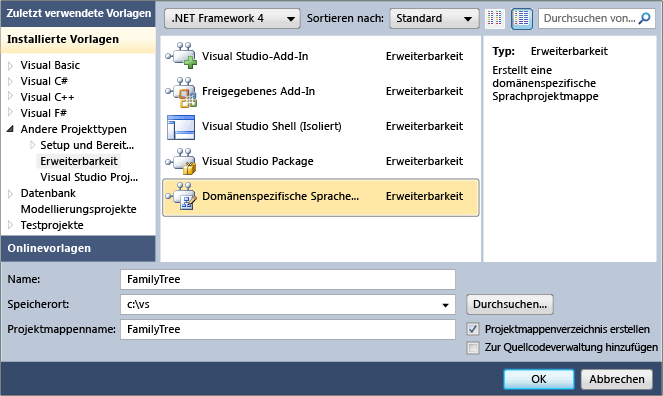
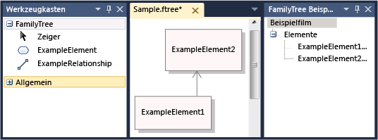
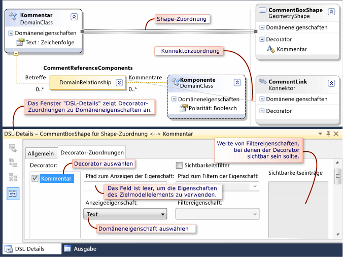
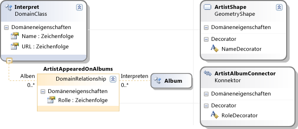
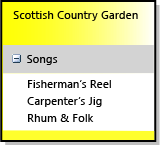
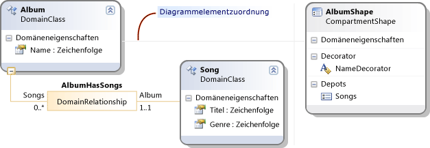

# So definieren Sie eine domänenspezifische Sprache
Um eine domänenspezifische Sprache (DSL) zu definieren, erstellen Sie eine Visual Studio-Projektmappe aus einer Vorlage. Der zentrale Bestandteil der Projektmappe ist das DSL-Definitionsdiagramm, das in "DslDefinition.dsl" gespeichert wird. Die DSL-Definition definiert die Klassen und Formen der DSL. Nachdem Sie diese Elemente geändert und weitere hinzugefügt haben, können Sie Programmcode hinzufügen, um die DSL weiter anzupassen.

Wenn Sie noch nicht mit DSLs sind, es wird empfohlen, dass Sie über arbeiten die **DSL-Tools Lab**, finden Sie auf dieser Website: [Visualisierungs- und Modellierungs-SDK](http://go.microsoft.com/fwlink/?LinkID=186128)

##  Auswählen einer Vorlagenprojektmappe

Zur Definition einer DSL müssen folgende Komponenten installiert sein:

- Visual Studio
- Visual Studio-Erweiterung entwicklungsworkload (einschließlich Visual Studio SDK)
- Modellierungs-SDK (Installieren Sie sie als einzelne Komponente in Visual Studio)

[!INCLUDE[modeling_sdk_info](includes/modeling_sdk_info.md)]

Um eine neue domänenspezifische Sprache zu erstellen, erstellen Sie eine neue Visual Studio-Projektmappe mithilfe der Projektvorlage einer domänenspezifischen Sprache.

### So erstellen Sie eine DSL-Projektmappe

1. Erstellen Sie ein neues **Domain-Specific Languge** Projekt.

   ::: moniker range="vs-2017"

    

   ::: moniker-end

    Die **Domain-Specific Language Assistenten** wird geöffnet und zeigt eine Liste der Vorlagen-DSL-Projektmappen.

2. Klicken Sie auf die einzelnen Vorlagen, um eine Beschreibung anzuzeigen. Wählen Sie die Projektmappe aus, die Ihren Vorstellungen am nächsten kommt.

    Jede DSL-Vorlage definiert eine grundlegende, funktionsfähige DSL. Sie bearbeiten diese DSL nach Ihren Anforderungen.

    Klicken Sie auf die Beispiele, um weitere Informationen anzuzeigen.

   - Wählen Sie **Aufgabenfluss** um eine DSL zu erstellen, die von Verantwortlichkeitsbereichen. Verantwortlichkeitsbereiche sind vertikale oder horizontale Bereiche des Diagramms.

   - Wählen Sie **Komponentenmodelle** um eine DSL zu erstellen, die Ports verfügt. Anschlüsse sind kleine Formen am Rand einer größeren Form.

   - Wählen Sie **Klassendiagramme** eine DSL definieren, die Depot-Formen. Depot-Formen enthalten Listen von Elementen.

   - Wählen Sie **minimale Sprache** in anderen Fällen oder wenn Sie unsicher sind.

   - Wählen Sie **minimaler WinForm-Designer** oder **minimaler WPF-Designer** um eine DSL zu erstellen, die auf einer Windows Forms- oder WPF-Oberfläche angezeigt wird. Sie müssen Code zur Definition des Editors schreiben. Weitere Informationen finden Sie unter den folgenden Themen:

        [Erstellen einer Windows Forms-basierten domänenspezifischen Sprache](../modeling/creating-a-windows-forms-based-domain-specific-language.md)

        [Erstellen einer WPF-basierten domänenspezifischen Sprache](../modeling/creating-a-wpf-based-domain-specific-language.md)

3. Geben Sie auf der entsprechenden Seite des Assistenten eine Dateinamenerweiterung für die DSL ein. Diese Erweiterung wird für Dateien mit Instanzen Ihrer DSL verwendet.

   - Wählen Sie eine Dateinamenerweiterung, die keiner Anwendung auf Ihrem Computer bzw. auf einem Computer, auf dem Sie die DSL installieren möchten, zugeordnet ist. Z. B. **Docx** und **Htm** wäre akzeptablen Dateinamenerweiterungen.

   - Der Assistent warnt Sie, wenn die eingegebene Erweiterung bereits als DSL verwendet wird. Verwenden Sie nach Möglichkeit eine andere Dateinamenerweiterung. Sie können die experimentelle Instanz des Visual Studio SDK auch zurücksetzen, um alte experimentelle Designer zu löschen. Klicken Sie auf **starten**, klicken Sie auf **Programme**, **Microsoft Visual Studio 2010 SDK**, **Tools**, und klicken Sie dann **Microsoft zurücksetzen Instanz von Visual Studio 2010 experimentell**.

4. Auf den anderen Seiten können Sie Einstellungen anpassen oder die Standardwerte übernehmen.

5. Klicken Sie auf **Fertig stellen**.

    Der Assistent erstellt eine Projektmappe mit zwei oder drei Projekten und generiert Code aus der DSL-Definition.

   Die Benutzeroberfläche gleicht nun der folgenden Abbildung.

   

   Diese Projektmappe definiert eine domänenspezifische Sprache. Weitere Informationen finden Sie unter [Überblick über die Benutzeroberfläche für domänenspezifische Sprachtools](../modeling/overview-of-the-domain-specific-language-tools-user-interface.md).

### Testen der Projektmappe
 Die Vorlagenprojektmappe enthält eine funktionsfähige DSL, die Sie ändern oder direkt verwenden können.

 Drücken Sie F5 oder STRG+F5, um die Projektmappe zu testen. Eine neue Instanz von Visual Studio wird im Testmodus gestartet.

 Öffnen Sie die Beispiel-Datei, in der neuen Instanz von Visual Studio im Projektmappen-Explorer. Sie wird als Diagramm mit einem Werkzeugkasten geöffnet.

 Wenn Sie einer Projektmappe ausführen haben Sie von der **minimale Sprache** der experimentellen Visual Studio-Vorlage wird im folgende Beispiel ähneln:

 

 Experimentieren Sie mit den Werkzeugen. Erstellen Sie Elemente, und verbinden Sie sie.

 Schließen Sie die experimentelle Instanz von Visual Studio.

> [!NOTE]
> Wenn Sie die DSL geändert haben, können Sie die Formen in der "Sample"-Testdatei nicht mehr sehen. Sie können aber neue Elemente erstellen.

### Ändern der Vorlagen-DSL
 Benennen Sie einige oder alle Domänenklassen und Formklassen der Vorlagen-DSL-Definition um, und behalten Sie sie bei. Die neuen Klassennamen sollten gültige CLR-Namen ohne Leerzeichen oder Interpunktionszeichen sein.

 Die Beibehaltung der folgenden Klassen ist besonders sinnvoll:

- Die Stammklasse erscheint auf der linken oberen Ecke des im DSL-Definitionsdiagramm unter **Klassen und Beziehungen**. Benennen Sie sie in einen von der DSL verschiedenen Namen um. Zum Beispiel eine DSL namens **"Musikbibliothek"** möglicherweise eine Basisklasse, die mit dem Namen **Musik**.

- Die Diagrammklasse erscheint unten rechts im DSL-Definitionsdiagramm der **Diagrammelemente** Spalte. Möglicherweise müssen Sie einen Bildlauf nach rechts durchführen, um sie zu sehen. Sie heißt normalerweise _Ihredsl_**Diagramm**.

- Bei Verwendung der **Aufgabenfluss** Vorlage und Diagramme mit Verantwortlichkeitsbereichen erstellen, zu halten, und benennen Sie die Actor-Domänenklasse und die ActorSwimlane-Form möchten.

  Löschen Sie andere Klassen nach Bedarf, oder benennen Sie sie um.

##  Muster zum Definieren einer DSL
 Es ist empfehlenswert, beim Entwickeln einer DSL nur jeweils ein oder zwei Features gleichzeitig hinzuzufügen bzw. anzupassen. Fügen Sie ein Feature hinzu, führen Sie die DSL aus und testen Sie sie. Fügen Sie dann ein oder zwei weitere Features hinzu. Ein typisches Feature Ihrer DSL könnte folgendermaßen aussehen:

- Eine Domänenklasse, die einbettende Beziehung, die das Element mit dem Modell verbindet, die erforderliche Form zum Anzeigen von Elementen der Klasse im Diagramm sowie das Elementwerkzeug, mit dem Benutzer Elemente erstellen können.

- Die Domäneneigenschaften einer Domänenklasse und die Decorator-Elemente, die sie in einer Form anzeigen.

- Eine Verweisbeziehung und der Konnektor, der sie im Diagramm anzeigt, sowie das Konnektorwerkzeug, mit dem Benutzer Verbindungen erstellen können.

- Eine Anpassung, die Programmcode erfordert, wie z. B. eine Validierungseinschränkung oder ein Menübefehl.

  In den folgenden Abschnitten wird die Erstellung der nützlichsten DSL-Features beschrieben. Es gibt viele andere Muster, nach denen eine DSL erstellt werden kann, aber die folgenden sind die gängigsten.

> [!NOTE]
> Nach dem Hinzufügen eines Features, vergessen Sie nicht auf **alle Vorlagen transformieren** auf der Symbolleiste des Projektmappen-Explorer vor dem Erstellen und Ausführen von Ihrer DSL.

 In der folgenden Abbildung sind die Klassen und Beziehungen der DSL dargestellt, die in diesem Thema als Beispiel verwendet wird.

 

 Die nächste Abbildung zeigt ein Beispielmodell dieser DSL:

 

> [!NOTE]
> "Modell" bezieht sich auf eine Instanz Ihrer DSL, die Benutzer erstellen. Sie wird üblicherweise als Diagramm dargestellt. In diesem Thema werden das DSL-Definitionsdiagramm und die Modelldiagramme erläutert, die bei Verwendung der DSL angezeigt werden.

##  Definieren von Domänenklassen
 Domänenklassen stellen die Konzepte der DSL dar. Die Instanzen sind *Modellelemente*. Z. B. in einem **"Musikbibliothek"** DSL möglicherweise Domänenklassen, die mit dem Namen **Album** und **"Song"**.

 Um eine Domänenklasse erstellen möchten, können Sie aus ziehen die **benannte Domänenklasse** tool, das Diagramm, und klicken Sie dann benennen Sie die Klasse.

 Weitere Informationen finden Sie unter [Eigenschaften von Domänenklassen](../modeling/properties-of-domain-classes.md).

### Erstellen einer einbettenden Beziehung für jede Domänenklasse
 Jede Domänenklasse mit Ausnahme der Stammklasse muss Ziel mindestens einer einbettenden Beziehung sein, oder sie muss von einer Klasse erben, die Ziel einer einbettenden Beziehung ist.

 Jedes Modellelement in einem Modell ist ein Knoten in einer einzelnen Struktur einbettender Beziehungen. Quelle und Ziel einer einbettenden Beziehung werden häufig als übergeordnetes und untergeordnetes Element bezeichnet.

 Die Auswahl eines übergeordneten Elements für eine Domänenklasse hängt davon ab, wie die Lebensdauer ihrer Elemente von anderen Elementen abhängen soll. Wenn ein Knoten einer Struktur gelöscht wird, wird auch seine Unterstruktur gelöscht. Daher werden Klassen von Elementen, deren Existenz nicht von anderen abhängt, direkt unter der Stammklasse eingebettet.

 Wenn Sie ein Element innerhalb eines anderen Elements anzeigen, möchten Sie normalerweise eine Besitzerbeziehung darstellen. In diesem Fall wird als übergeordnete Klasse am besten die Klasse des Containers gewählt. Dies gilt jedoch nicht, wenn das in einem Container dargestellte Element tatsächlich nur ein Verweislink auf ein unabhängiges Element ist. In diesem Fall wird beim Löschen des Containers der Verweis gelöscht, aber nicht sein Ziel.

 In den hier beschriebenen DSL-Definitionsmustern wird vorausgesetzt, dass beim Löschen eines Containers die in dem Container dargestellten Elemente ebenfalls gelöscht werden. Komplexere Schemas können durch Definieren von Regeln erzielt werden.

|Darstellung des Elements|Übergeordnete (einbettende) Klasse|Beispiel in DSL-Projektmappenvorlage|
|-|-|-|
|Form im Diagramm   Verantwortlichkeitsbereich|Stammklasse der DSL|Minimale Sprache   Aufgabenfluss: Actor-Klasse.|
|Form in Verantwortlichkeitsbereich|Domänenklasse von Elementen, die als Verantwortlichkeitsbereiche dargestellt werden.|Aufgabenfluss: Task-Klasse.|
|Element in Liste in Form, das zusammen mit Container gelöscht wird.   Anschluss am Rand einer Form|Der Containerform zugeordnete Domänenklasse|Klassendiagramm: Die Attributklasse.   UML-Komponentendiagramme: Port-Klasse.|
|Element in Liste, nicht zusammen mit Container gelöscht|Stammklasse der DSL   Die Liste enthält Verweislinks.||
|Nicht direkt angezeigt|Die Klasse, von der es Bestandteil ist||

 Im Beispiel "Musikbibliothek" werden Alben als Rechtecke dargestellt, in denen die Titel von Songs aufgelistet sind. Daher ist das übergeordnete Element von "Album" die Stammklasse "Musik", und das übergeordnete Element von "Song" ist "Album".

 Um eine Domänenklasse und ihre Einbettung gleichzeitig zu erstellen, klicken Sie auf die **einbettende Beziehung** Tools, und klicken Sie auf die übergeordnete Klasse und klicken Sie dann auf einen leeren Bereich des Diagramms.

 In der Regel müssen Sie den Namen der einbettenden Beziehung und ihrer Rollen nicht anpassen, da automatisch die Klassennamen verwendet werden.

 Weitere Informationen finden Sie unter [Eigenschaften des Domänenbeziehungen](../modeling/properties-of-domain-relationships.md) und [Eigenschaften von Domänenrollen](../modeling/properties-of-domain-roles.md).

> [!NOTE]
> Einbettung ist nicht identisch mit Vererbung. Die untergeordneten Elemente in einer einbettenden Beziehung erben keine Features von ihren übergeordneten Elementen.

### Hinzufügen von Domäneneigenschaften zu den einzelnen Domänenklassen
 In Domäneneigenschaften werden Werte gespeichert. Beispiele sind: Name, Titel, Veröffentlichungsdatum.

 Klicken Sie auf **Domäneneigenschaften** in der Klasse, die EINGABETASTE drücken, und geben Sie den Namen einer Eigenschaft. Der Standardtyp einer Domäneneigenschaft lautet String. Wenn Sie den Typ ändern möchten, wählen Sie die Eigenschaft "Domain", und legen die **Typ** in die **Eigenschaften** Fenster. Wenn der Typ des nicht in der Dropdown-Liste enthalten ist, finden Sie unter [Hinzufügen von Eigenschaftentypen](#addTypes).

 **Legen Sie eine Eigenschaft als Elementnamen ein.** Wählen Sie eine Eigenschaft "Domain", die zum Identifizieren von Elementen im Sprach-Explorer verwendet werden kann. Beispielsweise könnten Sie in der "Song"-Domänenklasse die "Titel"-Domäneneigenschaft auswählen. In der **Eigenschaften** legen **ist Elementname** zu `true`.

### Erstellen abgeleiteter Domänenklassen
 Soll eine Domänenklasse Varianten aufweisen, die ihre Eigenschaften und Beziehungen erben, erstellen Sie von der Domänenklasse abgeleitete Klassen. "Album" könnte z. B. die abgeleiteten Klassen WMA und MP3 haben.

 Erstellen Sie die abgeleitete Klasse mit dem **Domänenklasse** Tool.

 Klicken Sie auf die **Vererbung** tool, klicken Sie auf die abgeleitete Klasse, und klicken Sie dann auf die Basisklasse.

 Neben der Einstellung der **Vererbungsmodifizierer** der Basisklasse zu **abstrakte**. Wenn Sie voraussichtlich Instanzen der Basisklasse benötigen, können Sie stattdessen eine gesonderte abgeleitete Klasse für diese erstellen.

 Abgeleitete Klassen erben die Eigenschaften und Rollen ihrer Basisklassen.

### Bereinigen des DSL-Definitionsdiagramms
 Wenn Sie Beziehungen hinzufügen, erscheinen einige Klassen an mehreren Stellen. Klicken Sie zum Reduzieren der Anzahl des Vorkommens, und das Diagramm breiter zu machen, mit der rechten Maustaste in der Zielklasse einer Beziehung, und klicken Sie dann auf **Struktur hier**. Für den gegenteiligen Effekt, mit der Maustaste der Zielklasse einer Beziehung und klicken Sie auf **Baum teilen**. Wenn diese Menübefehle nicht angezeigt werden, vergewissern Sie sich, dass nur die Domänenklasse ausgewählt ist.

 Verwenden Sie STRG+NACH OBEN und STRG+NACH UNTEN, um Domänenklassen und Formklassen zu verschieben.

### Testen der Domänenklassen

##### So testen Sie die neuen Domänenklassen

1. **Klicken Sie auf alle Vorlagen transformieren** auf der Symbolleiste des Projektmappen-Explorer, um den DSL-Designercode zu generieren. Dieser Schritt kann automatisiert werden. Weitere Informationen finden Sie unter [wie alle Vorlagen transformieren automatisieren](/previous-versions/visualstudio/visual-studio-2012/ff521399\(v\=vs.110\)).

2. **Erstellen Sie und führen Sie die DSL.** Drücken Sie F5 oder STRG + F5, um eine neue Instanz von Visual Studio im experimentellen Modus auszuführen. Klicken Sie in der experimentellen Instanz von Visual Studio öffnen Sie, oder erstellen Sie eine Datei mit der Dateinamenerweiterung Ihrer DSL.

3. **Öffnen Sie den Explorer an.** An die Seite des Diagramms ist das Language-Explorer-Fenster, das in der Regel heißt *Ihresprache* Explorer. Sollten Sie das Fenster nicht sehen, befindet es sich möglicherweise auf einer Registerkarte unter dem Projektmappen-Explorer. Wenn Sie nicht, auf finden die **Ansicht** , zeigen Sie auf **andere Windows**, und klicken Sie dann auf *Ihresprache* **Explorer**.

     Im Explorer wird eine Strukturansicht des Modells dargestellt.

4. **Erstellen Sie neue Elemente ein.** Klicken Sie auf den Stammknoten oben, und klicken Sie dann auf **Add New**_Ihreklasse_.

     Im Sprach-Explorer wird eine neue Instanz Ihrer Klasse angezeigt.

5. Überprüfen Sie beim Erstellen neuer Instanzen, ob jede Instanz einen anderen Namen hat. Dies geschieht nur, wenn Sie festgelegt haben die **ist Elementname** Flag für eine Domäneneigenschaft.

6. **Untersuchen Sie die Domäneneigenschaften. Mit einer Instanz Ihrer Klasse ausgewählt haben** überprüfen Sie das Fenster "Eigenschaften". Es sollte die Domäneneigenschaften zeigen, die Sie für die Domänenklasse definiert haben.

7. **Speichern Sie die Datei schließen und öffnen Sie sie erneut**. Nachdem Sie die Knoten erweitert haben, sollten alle erstellten Instanzen im Explorer sichtbar sein.

##  Definieren von Formen im Diagramm
 Sie können Klassen von Elementen definieren, die in einem Diagramm als Rechtecke, Ellipsen oder Symbole erscheinen.

#### So definieren Sie eine Klasse von Elementen, die in einem Diagramm als Formen dargestellt werden

1. **Definieren und Testen Sie eine Domänenklasse, wie in beschrieben**[Definieren von Domänenklassen](#classes) **.**

   - Das übergeordnete Element der Klasse sollte die Stammklasse sein. Es sollte also eine einbettende Beziehung zwischen der Stammklasse und der neuen Domänenklasse bestehen.

   - Wenn das Diagramm Verantwortlichkeitsbereiche enthält, kann das übergeordnete Element die Domänenklasse sein, die einem Verantwortlichkeitsbereich zugeordnet ist. Bevor Sie Sie mit diesem Verfahren fortfahren, finden Sie unter [Definieren einer DSL, die von Verantwortlichkeitsbereichen](#swimlanes).

2. **Fügen Sie eine formklasse** um die Elemente im Modelldiagramm darzustellen. Ziehen Sie eines der folgenden Werkzeuge in das DSL-Definitionsdiagramm:

   - **Geometrie-Form** stellt ein Rechteck oder eine Ellipse.

   - **Bild-Form** zeigt ein Bild an, die Sie bereitstellen.

   - **Depot-Form** ist ein Rechteck, das eine oder mehrere Listen von Elementen enthält.

     Benennen Sie die Formklasse um, die rechts im DSL-Definitionsdiagramm unter "Formen und Konnektoren" angezeigt wird.

3. **Definieren Sie ein Bild aus, wenn Sie eine Bild-Form erstellt**.

   1. Erstellen Sie eine Bilddatei beliebiger Größe. Die Formate BMP, JPEG, GIF und EMF werden unterstützt.

   2. Fügen Sie die Datei im Projektmappen-Explorer der Projektmappe unter Dsl\Ressourcen hinzu.

   3. Kehren Sie zum DSL-Definitionsdiagramm zurück, und wählen Sie die neue Bild-Formklasse aus.

   4. Klicken Sie im Eigenschaftenfenster auf die **Image** Eigenschaft.

   5. In der **Bild auswählen** Dialogfeld klicken Sie auf die Dropdown-Menü unter **Dateiname**, und wählen Sie das Image.

4. **Fügen Sie Text-Decorator-Elemente, mit der Form, um die Domäneneigenschaften anzuzeigen.**

    Sie benötigen wahrscheinlich mindestens ein Text-Decorator-Element, um den Namen oder Titel des Modellelements anzuzeigen.

    Mit der rechten Maustaste in des Headers der formklasse, zeigen Sie auf **hinzufügen**, und klicken Sie dann auf **Text-Decorator**. Legen Sie den Namen des Decorator-Elements, und klicken Sie in den Eigenschaften im Fenster der **Position**.

5. **Verbinden Sie jede Form mit einer Diagrammelementzuordnung mit der Domänenklasse, die sie anzeigen soll**.

    Klicken Sie auf die **Diagrammelementzuordnung** tool, klicken Sie auf die Domänenklasse und dann klicken Sie auf die Shape-Klasse.

6. **Ordnen Sie die Eigenschaften, die Text-Decorator-Elemente.**

   1. Wählen Sie die graue Linie zwischen der Domänenklasse und der Formklasse aus, die die Diagrammelementzuordnung darstellt.

   2. In der **DSL-Details** Fenster, klicken Sie auf die **Decorator-Zuordnungen** Registerkarte. Wenn Sie nicht sehen die **DSL-Details** Fenster auf die **Ansicht** , zeigen Sie auf **andere Windows** , und klicken Sie dann auf **DSL-Details**. Häufig muss der obere Rand des Fensters angehoben werden, um den gesamten Inhalt anzuzeigen.

   3. Wählen Sie den Namen eines Decorator-Elements aus. Klicken Sie unter **Anzeigeeigenschaft**, wählen Sie den Namen einer Eigenschaft der Domänenklasse. Wiederholen Sie dies für jedes Decorator-Element.

       Wenn Sie eine Eigenschaft eines verwandten Elements anzeigen möchten, klicken Sie auf die Dropdown-strukturnavigator unter **Pfad zur Anzeigeeigenschaft**.

   4. Stellen Sie sicher, dass neben jedem Decorator-Namen ein Häkchen angezeigt wird.

      

7. **Stellen Sie ein Toolboxelement zum Erstellen von Elementen der Domänenklasse.**

   1. In **DSL-Explorer**, erweitern Sie die **Editor** Knoten und alle zugehörigen Unterknoten.

   2. Mit der rechten Maustaste unter des Knotens **Toolboxregisterkarten** Listenfeldsteuerelement mit den gleichen Namen wie Ihre DSL hat, z. B. "Musikbibliothek". Klicken Sie auf **Elementwerkzeug hinzufügen**.

       > [!NOTE]
       > Wenn Sie mit der rechten Maustaste die **Tools** Knoten nicht sehen Sie **Elementwerkzeug hinzufügen**. Klicken Sie stattdessen auf den übergeordneten Knoten.

   3. Die mit dem neuen Elementtool ausgewählt haben, legen Sie im Fenster **Klasse** mit der Domänenklasse, die Sie vor kurzem hinzugefügt haben.

   4. Legen Sie **Beschriftung** und **QuickInfo**.

   5. Legen Sie **Toolboxsymbol** für ein Symbol, das in der Toolbox angezeigt wird. Sie können ein neues Symbol oder ein bereits für ein anderes Werkzeug verwendetes Symbol angeben.

        Um ein neues Symbol zu erstellen, öffnen Sie dsl\ressourcen im **Projektmappen-Explorer**. Kopieren Sie eine der vorhandenen BMP-Dateien für Elementwerkzeuge, und fügen Sie sie ein. Benennen Sie die eingefügte Kopie um, und doppelklicken Sie dann darauf, um sie zu öffnen.

        Kehren Sie zum DSL-Definitionsdiagramm zurück, wählen Sie das Tool, und klicken Sie im Fenster Eigenschaften auf **[...]**  in **Toolboxsymbol**. In der **Bitmap auswählen** wählen Sie im Dialogfeld Ihre. BMP-Datei aus der Dropdown-Menü.

   Weitere Informationen finden Sie unter [von Eigenschaften Geometrischer Formen](../modeling/properties-of-geometry-shapes.md) und [Eigenschaften von Bildformen](../modeling/properties-of-image-shapes.md).

#### So testen Sie Formen

1. **Klicken Sie auf alle Vorlagen transformieren** auf der Symbolleiste des Projektmappen-Explorer, um den DSL-Designercode zu generieren.

2. **Erstellen Sie und führen Sie die DSL.** Drücken Sie F5 oder STRG + F5, um eine neue Instanz von Visual Studio im experimentellen Modus auszuführen. Klicken Sie in der experimentellen Instanz von Visual Studio öffnen Sie, oder erstellen Sie eine Datei mit der Dateinamenerweiterung Ihrer DSL.

3. **Stellen Sie sicher, dass die elementwerkzeuge im Werkzeugkasten erscheinen.**

4. **Erstellen Sie Formen** über ein Tool in das Modelldiagramm ziehen.

5. **Stellen Sie sicher, dass jedes Text-Decorator-Element angezeigt wird,** und:

   1. Sie bearbeiten können, es sei denn, Sie haben die **ist schreibgeschützte Benutzeroberfläche** Flag für die Eigenschaft "Domain".

   2. Wenn Sie die Eigenschaft im Eigenschaftenfenster oder im Decorator bearbeiten, wird die jeweils andere Ansicht aktualisiert.

   Nach dem ersten Test einer Form möchten Sie unter Umständen einige Eigenschaften anpassen und erweiterte Features hinzufügen. Weitere Informationen finden Sie unter [anpassen und Erweitern einer domänenspezifischen Sprache](../modeling/customizing-and-extending-a-domain-specific-language.md).

##  Definieren von Verweisbeziehungen
 Sie können eine Verweisbeziehung zwischen einer Quelldomänenklasse und einer Zieldomänenklasse definieren. Verweisbeziehungen werden in einem Diagramm üblicherweise als Konnektoren, also als Linien zwischen Formen, angezeigt.

 Wenn beispielsweise Alben und Interpreten als Formen in einem Diagramm dargestellt werden, könnten Sie eine Beziehung namens "ArtistsAppearedOnAlbums" definieren, die Interpreten mit den Alben verknüpft, an denen sie mitgewirkt haben. Siehe das Beispiel in der Abbildung.

 

 Verweisbeziehungen können auch Elemente desselben Typs verbinden. So ist in einer DSL, die einen Familienstammbaum darstellt, die Beziehung zwischen Eltern und Kindern eine Verweisbeziehung von Person zu Person.

### Definieren einer Verweisbeziehung
 Klicken Sie auf das Werkzeug "Verweisbeziehung", auf die Quelldomänenklasse der Beziehung und dann auf die Zieldomänenklasse. Die Zielklasse kann mit der Quellklasse übereinstimmen.

 Jede Beziehung hat zwei Rollen, die durch die Linien auf beiden Seiten des Beziehungsfelds dargestellt werden. Sie können jede Rolle auswählen und ihre Eigenschaften im Eigenschaftenfenster festlegen.

 **Betrachten Sie die Rollen umzubenennen**. In einer Beziehung zwischen Personen könnten Sie z. B. die Standardnamen in Eltern und Kinder, Manager und Mitarbeiter, Lehrer und Schüler usw. ändern.

 **Passen Sie die Multiplizität der einzelnen Rollen**, wenn es erforderlich ist. Soll jede Person höchstens einen Manager haben, legen Sie die Multiplizität (unter der Beschriftung "Manager") im Diagramm auf 0..1 fest.

 **Fügen Sie der Beziehung Domäneneigenschaften hinzu.** In der Abbildung hat die Beziehung Interpret und Album eine Eigenschaft der Rolle.

 **Legen Sie die Allows Duplicates-Eigenschaft der Beziehung** Wenn zwischen demselben Paar von Modellelementen mehrere Links derselben Klasse vorhanden kann. Beispielsweise könnten Sie zulassen, dass ein Lehrer einen Schüler in mehreren Fächern unterrichtet.

 

 Weitere Informationen finden Sie unter [Eigenschaften des Domänenbeziehungen](../modeling/properties-of-domain-relationships.md) und [Eigenschaften von Domänenrollen](../modeling/properties-of-domain-roles.md).

### Definieren eines Konnektors zur Darstellung der Beziehung
 Ein Konnektor stellt eine Linie zwischen zwei Formen im Modelldiagramm dar.

 Ziehen Sie die **Connector** Tool in das DSL-Definitionsdiagramm.

 Fügen Sie Text-Decorator-Elemente hinzu, falls Beschriftungen auf dem Konnektor angezeigt werden sollen. Legen Sie deren Positionen fest. Damit den Benutzer einen Text-Decorator verschieben können, setzen die **ist verschiebbar** Eigenschaft.

 Verwenden der **Diagrammelementzuordnung** Tool, um den Connector mit der verweisbeziehung zu verknüpfen.

 Die diagrammelementzuordnung ausgewählt haben, öffnen die **DSL-Details** Fenster, und öffnen Sie die **Decorator-Zuordnungen** Registerkarte.

 Wählen Sie jeden einzelnen **Decorator-Elements** und **Anzeigeeigenschaft** auf die richtige Domäneneigenschaft fest.

 Stellen Sie sicher, dass ein Häkchen angezeigt, neben jedem Element in wird der **Decorator-Elemente** Liste.

### Definieren eines Werkzeugs "Verbindungs-Generator"
 In der **DSL-Explorer** Fenster, erweitern Sie die **Editor** Knoten und alle zugehörigen Unterknoten.

 Mit der rechten Maustaste des Knotens mit dem gleichen Namen wie Ihre DSL, und klicken Sie dann auf **neues Verbindungswerkzeug hinzufügen**.

 Führen Sie, während das neue Werkzeug ausgewählt ist, im Eigenschaftenfenster Folgendes aus:

- Legen Sie die **Beschriftung** und **QuickInfo**.

- Klicken Sie auf **Verbindungsgenerator** , und wählen Sie den geeigneten Generator für die neue Beziehung.

- Legen Sie **Toolboxsymbol** auf das Symbol, das in der Toolbox angezeigt werden sollen. Sie können ein neues Symbol oder ein bereits für ein anderes Werkzeug verwendetes Symbol angeben.

     Um ein neues Symbol zu erstellen, öffnen Sie dsl\ressourcen im **Projektmappen-Explorer**. Kopieren Sie eine der vorhandenen BMP-Dateien für Elementwerkzeuge, und fügen Sie sie ein. Benennen Sie die eingefügte Kopie um, und doppelklicken Sie dann darauf, um sie zu öffnen.

     Kehren Sie zum DSL-Definitionsdiagramm zurück, wählen Sie das Tool, und klicken Sie im Fenster Eigenschaften auf **[...]**  in **Toolboxsymbol**. In der **Bitmap auswählen** wählen Sie im Dialogfeld Ihre. BMP-Datei aus der Dropdown-Menü.

##### So testen Sie eine Verweisbeziehung und einen Konnektor

1. **Klicken Sie auf alle Vorlagen transformieren** auf der Symbolleiste des Projektmappen-Explorer, um den DSL-Designercode zu generieren.

2. **Erstellen Sie und führen Sie die DSL.** Drücken Sie F5 oder STRG + F5, um eine neue Instanz von Visual Studio im experimentellen Modus auszuführen. Klicken Sie in der experimentellen Instanz von Visual Studio öffnen Sie, oder erstellen Sie eine Datei mit der Dateinamenerweiterung Ihrer DSL.

3. **Stellen Sie sicher, dass das Verbindungstool in der Toolbox angezeigt wird.**

4. **Erstellen Sie Formen** über ein Tool in das Modelldiagramm ziehen.

5. **Erstellen von Verbindungen** zwischen den Formen. Klicken Sie auf das Konnektorwerkzeug, auf eine Form und dann auf eine andere Form.

6. **Stellen Sie sicher, dass Sie keine Verbindungen zwischen ungeeigneten Klassen erstellen können.** Beispielsweise ist die Beziehung zwischen Alben und Interpreten, stellen Sie sicher, dass Sie Interpreten mit Interpreten verbinden können.

7. **Stellen Sie sicher, dass die Multiplizitäten zutreffend sind. Beispielsweise stellen Sie sicher, dass Sie eine Person mit mehreren Managern herstellen können.**

8. **Stellen Sie sicher, dass jedes Text-Decorator-Element angezeigt wird,** und:

   1. Sie bearbeiten können, es sei denn, Sie haben die **ist schreibgeschützte Benutzeroberfläche** Flag für die Eigenschaft "Domain".

   2. Wenn Sie die Eigenschaft im Eigenschaftenfenster oder im Decorator bearbeiten, wird die jeweils andere Ansicht aktualisiert.

   Nach dem ersten Test eines Konnektors möchten Sie unter Umständen einige Eigenschaften anpassen und erweiterte Features hinzufügen. Weitere Informationen finden Sie unter [anpassen und Erweitern einer domänenspezifischen Sprache](../modeling/customizing-and-extending-a-domain-specific-language.md).

##  Definieren von Formen, die Listen enthalten: Depot-Formen
 Eine Depot-Form enthält mindestens eine Liste von Elementen. In einer DSL für eine Musikbibliothek würden Sie z. B. Depot-Formen verwenden, um Musikalben darzustellen. Jedes Album enthält eine Liste von Songs.

 

 Am einfachsten erzielen Sie diesen Effekt in einer DSL-Definition, indem Sie eine Domänenklasse für den Container und eine Domänenklasse für jede Liste definieren. Die Containerklasse wird der Depot-Form zugeordnet.

 

 Weitere Informationen finden Sie unter [Eigenschaften von Depotformen](../modeling/properties-of-compartment-shapes.md).

#### So definieren Sie eine Depot-Form

1. **Erstellen Sie die Container-Domänenklasse**. Klicken Sie auf die **einbettende Beziehung** tool, klicken Sie auf die Stammklasse des Modells, und klicken Sie dann auf einen leeren Bereich des DSL-Definitionsdiagramm. Dadurch wird in der Beispielabbildung die Domänenklasse namens "Album" erstellt.

     Alternativ können Sie den Container statt in die Stammklasse auch in eine Domänenklasse einbetten, die einem Verantwortlichkeitsbereich zugeordnet ist.

     Fügen Sie der Klasse eine Domäneneigenschaft wie z. B. Namen, und legen dessen **ist Elementname** -Flag in das Fenster "Eigenschaften".

2. **Die Liste Element-Domänenklasse erstellen**. Klicken Sie auf die **einbettende Beziehung** tool, klicken Sie auf die Containerklasse (Album), und klicken Sie dann auf einen leeren Bereich des Diagramms. Dadurch wird in der Beispielabbildung die Domänenklasse namens "Song" erstellt.

     Fügen Sie eine Domäneneigenschaft wie Titel, der die Klasse, und legen dessen **ist Elementname** Flag.

     Fügen Sie weitere Domäneneigenschaften hinzu.

     Fügen Sie eine weitere Domänenklasse für Listenelemente jeder Liste hinzu, die Sie anzeigen möchten.

3. **Kombinieren Sie mehrere Elementtypen in der Liste**, erstellen Sie Klassen, die von der Listenklasse erben. Stellen Sie die List-Klasse abstrakt, durch Festlegen seiner **Vererbungsmodifizierer**.

     Möchten Sie beispielsweise klassische Musik nach Komponisten statt nach Interpreten sortieren, könnten Sie zwei Unterklassen von Song erstellen: ClassicalSong und NonClassicalSong.

4. **Erstellen Sie die Depot-Form**. Ziehen Sie aus der **Depot-Form** Tool in das DSL-Definitionsdiagramm.

     Fügen Sie ein Text-Decorator-Element hinzu, und legen Sie seinen Namen fest.

     Fügen Sie ein Depot hinzu, und legen Sie seinen Namen fest.

5. Damit kann den Benutzer die listendepots Ausblenden der rechten Maustaste auf die Depot-Form, zeigen Sie auf **hinzufügen**, und klicken Sie dann auf **erweitern/reduzieren-Decorator-Elements**. Legen Sie im Eigenschaftenfenster die Position des Decorator-Elements fest.

6. Klicken Sie auf die **Diagrammelementzuordnung** tool, klicken Sie auf die Container-Domänenklasse und klicken Sie dann auf die Depot-Form.

7. Wählen Sie den Diagrammelementzuordnungs-Link zwischen der Domänenklasse und der Form aus. In der **DSL-Details** Fenster:

    1. Klicken Sie auf die **Decorator-Elemente** Registerkarte. Klicken Sie auf den Namen des Decorator-Elements ein, und wählen Sie dann das entsprechende Element unter **Anzeigeeigenschaft**. Stellen Sie sicher, dass neben dem Namen des Decorator-Elements ein Häkchen angezeigt wird.

    2. Klicken Sie auf die **Depotzuordnungen** Registerkarte.

         Klicken Sie auf den Namen des Depots.

         Klicken Sie unter **Pfad der angezeigten Elementauflistung**, navigieren Sie zur listenelementklasse ("Song"). Klicken Sie auf den Dropdownpfeil, um das Navigatorwerkzeug zu verwenden.

         Klicken Sie unter **Anzeigeeigenschaft**, wählen Sie die Eigenschaft, die in der Liste angezeigt werden sollen. Im Beispiel ist dies "Titel".

> [!NOTE]
> Mithilfe der Pfadfelder in der Decorator-Zuordnung und der Depot-Zuordnung können Sie komplexere Beziehungen zwischen der Domänenklasse und der Depot-Form erstellen.

#### So definieren Sie ein Werkzeug zum Erstellen der Form

1. **Stellen Sie ein Toolboxelement zum Erstellen von Elementen der Domänenklasse.**

2. In **DSL-Explorer**, erweitern Sie die **Editor** Knoten und alle zugehörigen Unterknoten.

3. Mit der rechten Maustaste unter des Knotens **Toolboxregisterkarten** Listenfeldsteuerelement mit den gleichen Namen wie Ihre DSL hat, z. B. "Musikbibliothek". Klicken Sie auf **Elementwerkzeug hinzufügen**.

    > [!NOTE]
    > Wenn Sie mit der rechten Maustaste die **Tools** Knoten nicht sehen Sie **Elementwerkzeug hinzufügen**. Klicken Sie stattdessen auf den übergeordneten Knoten.

4. Die mit dem neuen Elementtool ausgewählt haben, legen Sie im Fenster **Klasse** mit der Domänenklasse, die Sie vor kurzem hinzugefügt haben.

5. Legen Sie **Beschriftung** und **QuickInfo**.

6. Legen Sie **Toolboxsymbol** für ein Symbol, das in der Toolbox angezeigt wird. Sie können ein neues Symbol oder ein bereits für ein anderes Werkzeug verwendetes Symbol angeben.

     Um ein neues Symbol zu erstellen, öffnen Sie dsl\ressourcen im **Projektmappen-Explorer**. Kopieren Sie eine der vorhandenen BMP-Dateien für Elementwerkzeuge, und fügen Sie sie ein. Benennen Sie die eingefügte Kopie um, und doppelklicken Sie dann darauf, um sie zu öffnen.

     Kehren Sie zum DSL-Definitionsdiagramm zurück, wählen Sie das Tool, und klicken Sie im Fenster Eigenschaften auf **[...]**  in **Toolboxsymbol**. In der **Bitmap auswählen** Dialogfeld Wählen Ihre BMP-Datei aus der Dropdown-Menü.

#### So testen Sie eine Depot-Form

1. **Klicken Sie auf alle Vorlagen transformieren** auf der Symbolleiste des Projektmappen-Explorer, um den DSL-Designercode zu generieren.

2. **Erstellen Sie und führen Sie die DSL.** Drücken Sie F5 oder STRG + F5, um eine neue Instanz von Visual Studio im experimentellen Modus auszuführen. Klicken Sie in der experimentellen Instanz von Visual Studio öffnen Sie, oder erstellen Sie eine Datei mit der Dateinamenerweiterung Ihrer DSL.

3. **Stellen Sie sicher, dass das Tool im Werkzeugkasten erscheint.**

4. Ziehen Sie das Werkzeug in das Modelldiagramm. Eine Form wird erstellt.

    Überprüfen Sie, ob der Name des Elements angezeigt und automatisch auf einen Standardwert festgelegt wird.

5. Mit der rechten Maustaste in des Headers der neuen Form, und klicken Sie dann auf Hinzufügen *Ihrlistenelement.* Im Beispiel lautet der Befehl "Song hinzufügen".

    Überprüfen Sie, ob ein Element mit einem neuen Namen in der Liste erscheint.

6. Klicken Sie auf eines der Listenelemente, und betrachten Sie das Eigenschaftenfenster. Es sollten die Eigenschaften der Listenelemente angezeigt werden.

7. Öffnen Sie den Sprach-Explorer. Überprüfen Sie, ob die Containerknoten mit darin enthaltenen Listenelementknoten angezeigt werden.

   

   Nach dem ersten Test einer Depot-Form möchten Sie unter Umständen einige Eigenschaften anpassen und erweiterte Features hinzufügen. Weitere Informationen finden Sie unter [anpassen und Erweitern einer domänenspezifischen Sprache](../modeling/customizing-and-extending-a-domain-specific-language.md).

### Anzeigen eines Verweislinks in einem Depot
 Normalerweise ist ein in einem Depot angezeigtes Element ein untergeordnetes Element des Elements, das durch die Depot-Form dargestellt wird. Aber manchmal soll ein Element angezeigt werden, das durch eine Verweisbeziehung damit verbunden ist.

 Wir könnten z. B. ein zweites Depot zu AlbumShape hinzufügen, in dem eine Liste der mit dem Album verbundenen Interpreten angezeigt wird.

 In diesem Fall sollte das Depot statt des Elements, auf das verwiesen wird, den Link anzeigen. Denn wenn der Benutzer das Element im Depot auswählt und ENTF drückt, soll der Link gelöscht werden und nicht das Element, auf das verwiesen wird.

 Dennoch kann der Name des Elements, auf das verwiesen wird, im Depot erscheinen.

 Im folgenden Verfahren wird vorausgesetzt, dass Sie bereits die Domänenklasse, die Verweisbeziehung, die Depot-Form und die Diagrammelementzuordnung erstellt haben, wie weiter oben in diesem Abschnitt beschrieben.

##### So zeigen Sie einen Verweislink in einem Depot an

1. **Fügen Sie auf die Depot-Form ein Depot**. Klicken Sie auf die DSL-Definitionsdiagramm mit der Maustaste der Depot-Form, zeigen Sie auf **hinzufügen**, und klicken Sie dann auf **Depot**.

2. Legen Sie **Pfad der angezeigten Elementauflistung** , zu dem Link statt zu seinem Zielelement zu navigieren. Klicken Sie auf das Dropdownmenü, und verwenden Sie die Strukturansicht, um die Verweisbeziehung statt ihres Ziels auszuwählen. Im Beispiel wird die Beziehung **"artistappearedonalbums"**.

3. Legen Sie **Pfad zur Anzeigeeigenschaft** , über den Link zum Zielelement zu navigieren. In diesem Beispiel ist dies **Interpreten**.

4. Legen Sie **Anzeigeeigenschaft** auf die entsprechende Eigenschaft des Target-Elements, z. B. **Namen**.

5. **Alle Vorlagen transformieren**, erstellen und führen Sie die DSL, und öffnen Sie ein Testmodell.

6. Erstellen Sie in dem Modelldiagramm die entsprechenden Formklassen, legen Sie ihre Namen fest, und erstellen Sie einen Link zwischen ihnen. In der Depot-Form sollten die Namen der verbundenen Elemente angezeigt werden.

7. Wählen Sie entweder den Link oder das Element in der Depot-Form aus. Sowohl der Link als auch das Element sollte angezeigt werden.

##  Definieren von Anschlüssen am Rand einer anderen Form
 Ein Anschluss ist eine Form, die sich am Rand einer anderen Form befindet.

 Anschlüsse können auch verwendet werden, um einen festen Verbindungspunkt an einer anderen Form bereitzustellen, zu dem der Benutzer Konnektoren zeichnen kann. In diesem Fall können Sie die Anschluss-Form transparent machen.

 Um ein Beispiel mit Anschlüssen sehen möchten, wählen Sie die **Komponentendiagramm** Vorlage beim Erstellen einer neuen DSL-Projektmappe. Dieses Beispiel zeigt die wesentlichen Punkte, die Sie bei der Definition von Anschlüssen berücksichtigen können:

- Es gibt eine Domänenklasse, die den Container der Anschlüsse darstellt: `Component`.

- Es gibt eine Domänenklasse, die Anschlüsse darstellt. Im Beispiel ist dies `ComponentPort`.

- Es gibt eine einbettende Beziehung von der Container-Domänenklasse zur Anschluss-Domänenklasse. Weitere Informationen finden Sie unter [Definieren von Domänenklassen](#classes).

- Wenn verschiedene Anschlusstypen in demselben Container gemischt werden sollen, können Sie Unterklassen der Anschluss-Domänenklasse erstellen. In dem Beispiel erben `InPort` und `OutPort` von `ComponentPort`.

- Die Container-Domänenklasse kann jeder beliebigen Form zugeordnet werden. Im Beispiel ist dies `ComponentShape`. Weitere Informationen finden Sie unter [Definieren von Formen](#shapes).

- Die Anschluss-Domänenklassen werden Anschluss-Formen zugeordnet. Sie können entweder die abgeleiteten Klassen verschiedenen Anschluss-Formklassen zuordnen oder die Basisklasse einer Anschluss-Formklasse zuordnen.

  Ansonsten Anschluss-Formen Verhalten sich wie beschrieben [Definieren von Formen](#shapes).

  Weitere Informationen finden Sie unter [Eigenschaften von Anschlussformen](../modeling/properties-of-port-shapes.md).

##  Definieren einer DSL, die von Verantwortlichkeitsbereichen
 Verantwortlichkeitsbereiche sind vertikale oder horizontale Bereiche eines Diagramms. Jeder Verantwortlichkeitsbereich entspricht einem Modellelement. Ihre DSL-Definition muss eine Domänenklasse für die Verantwortlichkeitsbereich-Elemente enthalten.

 Am besten lässt sich eine DSL mit Verantwortlichkeitsbereichen erstellen, indem Sie eine neue DSL-Projektmappe erstellen und die Projektmappenvorlage "Aufgabenfluss" auswählen. In der DSL-Definition ist die Actor-Klasse die Domänenklasse, die dem Verantwortlichkeitsbereich zugeordnet wird. Benennen Sie diese und die anderen Klassen nach den Anforderungen Ihres Projekts um.

 Um eine Klasse hinzuzufügen, die als Form innerhalb eines Verantwortlichkeitsbereichs angezeigt wird, erstellen Sie eine einbettende Beziehung zwischen der Klasse des Verantwortlichkeitsbereichs und Ihrer neuen Klasse. Benutzer können Elemente von einem Verantwortlichkeitsbereich in einen anderen ziehen, aber jedes Element befindet sich immer innerhalb eines bestimmten Verantwortlichkeitsbereichs. In der Projektmappenvorlage "Aufgabenfluss" ist "FlowElement" ein untergeordnetes Element der Verantwortlichkeitsbereich-Klasse.

 Um eine Klasse hinzuzufügen, die als Form unabhängig von Verantwortlichkeitsbereichen angezeigt wird, erstellen Sie eine einbettende Beziehung zwischen der Stammklasse und Ihrer neuen Klasse. Benutzer können diese Formen beliebig im Diagramm platzieren, auch über die Grenzen von Verantwortlichkeitsbereichen hinweg und außerhalb von Verantwortlichkeitsbereichen. In der Projektmappenvorlage "Aufgabenfluss" ist "Comment" ein untergeordnetes Element der Stammklasse.

 Weitere Informationen finden Sie unter [Eigenschaften von Verantwortlichkeitsbereichen](../modeling/properties-of-swimlanes.md).

##  Hinzufügen von Eigenschaftentypen

### Domänenenumerationen und Literale
 Eine Domänenenumeration ist ein Typ mit mehreren Literalwerten.

 Um eine domänenenumeration hinzuzufügen, Maustaste den Stamm des Modells in der **DSL-Explorer** , und klicken Sie dann auf **neue Domänenenumeration hinzufügen**. Das Element erscheint der **DSL-Explorer** unter der **Domänentypen** Knoten. Das Element erscheint nicht im Diagramm.

 Um die domänenenumeration domänenenumeration enumerationsliterale hinzuzufügen, Maustaste die domänenenumeration, in der **DSL-Explorer** , und klicken Sie dann auf **neues Enumerationsliteral hinzufügen**.

 Eine Eigenschaft, die einen Enumerationstyp besitzt, kann standardmäßig jeweils nur auf einen Wert der Enumeration festgelegt werden. Soll der Benutzer und Programmierer eine beliebige Kombination der Werte sind möglich: Festlegen als "Bitfeld" - Festlegen der **IsFlags** Eigenschaft der Enumeration.

### Externe Typen
 Wenn Sie den Typ einer Domäneneigenschaft festlegen, wenn Sie den Typ nicht finden können, sollten Sie der **Typ** Dropdown-Liste, Sie können einen externen Typ hinzufügen. Sie könnten z. B. Hinzufügen der **System.Drawing.Color** Typ in der Liste.

 Um einen Typ hinzuzufügen, mit der rechten Maustaste in des Stamm des Modells in der DSL-Explorer, und klicken Sie dann auf **neuen externen Typ hinzufügen**. Legen Sie im Fenster Eigenschaften den Namen auf **Farbe** und den Namespace auf **"System.Drawing"**. Dieser Typ wird nun in DSL-Explorer unter **Domänentypen**. Sie können ihn immer auswählen, wenn Sie den Typ einer Domäneneigenschaft festlegen.

##  Anpassen der DSL
 Mit den hier beschriebenen Verfahren können Sie schnell eine DSL mit einer Diagrammdarstellung, einem lesbaren XML-Format und den grundlegenden Tools erstellen, mit denen Code und andere Artefakte generiert werden.

 Die DSL-Definition kann auf zwei Arten erweitert werden:

1. Optimieren Sie die DSL, indem Sie weitere Features in der DSL-Definition verwenden. Sie können beispielsweise ein einzelnes Konnektorwerkzeug erstellen, das verschiedene Typen von Konnektoren generieren kann, und Sie können die Regeln steuern, nach denen beim Löschen eines Elements auch verwandte Elemente gelöscht werden. Diese Verfahren bestehen meist im Festlegen von Werten in der DSL-Definition. Manche erfordern auch einige Zeilen Programmcode.

     Weitere Informationen finden Sie unter [anpassen und Erweitern einer domänenspezifischen Sprache](../modeling/customizing-and-extending-a-domain-specific-language.md).

2. Erweitern Sie Ihre Modellierungstools mit Programmcode, um kompliziertere Effekte zu erzielen. So können Sie z. B. Menübefehle erstellen, die das Modell ändern, und Sie können Tools erstellen, in denen zwei oder mehr DSLs integriert sind. VMSDK wurde speziell dafür entwickelt, die Integration Ihrer Erweiterungen in den Code zu vereinfachen, der aus der DSL-Definition generiert wird.  Weitere Informationen finden Sie unter [Schreiben von Code zum Anpassen einer domänenspezifischen Sprache](../modeling/writing-code-to-customise-a-domain-specific-language.md).

### Ändern der DSL-Definition
 Wenn Sie ein Element in einer DSL-Definition erstellen, werden viele Standardwerte automatisch festgelegt. Diese Werte können Sie anschließend ändern. Dies vereinfacht die Entwicklung einer DSL und ermöglicht gleichzeitig wirkungsvolle Anpassungen.

 Wenn Sie beispielsweise eine Form einem Element zuordnen, wird der Pfad des übergeordneten Elements der Zuordnung automatisch entsprechend der einbettenden Beziehung der Domänenklasse festgelegt. Wenn Sie die einbettende Beziehung später ändern, wird der Pfad des übergeordneten Elements nicht automatisch geändert.

 Daher sollten Sie damit rechnen, dass nach einer Änderung von Beziehungen in der DSL-Definition häufig Fehler gemeldet werden, wenn Sie die Definition speichern oder "Alle Vorlagen transformieren" verwenden. Die meisten dieser Fehler sind leicht zu beheben. Doppelklicken Sie auf den Fehlerbericht, um den Ort des Fehlers zu ermitteln.

 Weitere Information finden Sie unter [How to: Ändern Sie den Namespace einer domänenspezifischen Sprache](../modeling/how-to-change-the-namespace-of-a-domain-specific-language.md).

##  Problembehandlung bei
 In der folgenden Tabelle sind einige der häufigsten Probleme, die beim Entwurf einer DSL auftreten, zusammen mit ihrer Lösung aufgeführt. Weitere Ratschläge finden Sie auf die [Visualisierung Tools Extensibility Forum](http://go.microsoft.com/fwlink/?LinkId=186074).

| Problem | Vorschlag |
|-|-|
| Die Änderungen, die ich an der DSL-Definition vorgenommen habe, wirken sich nicht aus. | Klicken Sie auf **alle Vorlagen transformieren** in der Symbolleiste Projektmappen-Explorer, und klicken Sie dann neu erstellen der Projektmappe. |
| Formen zeigen statt des Eigenschaftenwerts den Namen eines Decorator-Elements an. | Richten Sie die Decorator-Zuordnung ein. Klicken Sie im DSL-Definitionsdiagramm auf die Diagrammelementzuordnung (die graue Linie zwischen der Domänenklasse und der Formklasse).   Öffnen der **DSL-Details** Fenster. Wenn Sie sie im Menü Ansicht nicht angezeigt wird, zeigen Sie auf **Other Windows**, und klicken Sie dann auf **DSL-Details**.   Klicken Sie auf die **Decorator-Zuordnungen** Registerkarte. Wählen Sie den Namen des Decorator-Elements aus. Vergewissern Sie sich, dass das Kontrollkästchen daneben aktiviert ist. Klicken Sie unter **Anzeigeeigenschaft**, wählen Sie den Namen einer Domäneneigenschaft.   Weitere Informationen finden Sie unter [Formen im Diagramm](#shapes). |
| Ich kann in DSL-Explorer keine Auflistung hinzufügen. Zum Beispiel gibt es beim Rechtsklick auf "Werkzeuge" keinen "Tool hinzufügen"-Befehl im Menü.   Ich kann im Explorer für meine DSL kein Element zu einer Liste hinzufügen. | Klicken Sie mit der rechten Maustaste auf das Element über dem Knoten, den Sie testen. Wenn Sie etwas zu einer Liste hinzufügen möchten, befindet sich der Befehl zum Hinzufügen nicht im Listenknoten, sondern in seinem Besitzer. |
| Ich habe eine Domänenklasse erstellt, aber ich kann im Explorer der Sprache keine Instanzen erstellen. | Jede Domänenklasse mit Ausnahme des Stamms muss Ziel einer einbettenden Beziehung sein. |
| Im Explorer für meine DSL werden die Elemente nur mit ihren Typennamen angezeigt. | Wählen Sie in der DSL-Definition eine Domäneneigenschaft der Klasse, und legen Sie in den Eigenschaften im Fenster **ist Elementname** auf "true". |
| Meine DSL wird immer im XML-Editor geöffnet. | Das kann an einem Fehler beim Lesen der Datei liegen. Nachdem Sie den Fehler behoben haben, müssen Sie den Editor explizit als Ihren DSL-Designer zurücksetzen.   Das Projektelement, klicken Sie auf **Öffnen mit** , und wählen Sie * Ihresprache ***Designer (Standard)**. |
| Der Werkzeugkasten meiner DSL wird nicht angezeigt, nachdem ich die Assemblynamen geändert habe. | Überprüfen und aktualisieren Sie **DslPackage\GeneratedCode\Package.tt** Weitere Informationen finden Sie unter [Vorgehensweise: Ändern Sie den Namespace einer domänenspezifischen Sprache](../modeling/how-to-change-the-namespace-of-a-domain-specific-language.md). |
| Der Werkzeugkasten meiner DSL wird nicht angezeigt, obwohl ich die Assemblynamen nicht geändert habe.   Oder es wird in einem Meldungsfeld gemeldet, dass eine Erweiterung nicht geladen werden konnte. | Setzen Sie die experimentelle Instanz zurück, und erstellen Sie die Projektmappe neu.   1.  Auf der Windows-Startmenü unter **Programme**, erweitern Sie [!INCLUDE[vssdk_current_long](../misc/includes/vssdk_current_long_md.md)], klicken Sie dann **Tools**, und klicken Sie dann auf **Zurücksetzen der Microsoft Visual Studio experimentelle Instanz**. 2.  Klicken Sie im Menü **Build** auf **Projektmappe neu erstellen**. |

## Siehe auch

- [Erste Schritte mit domänenspezifischen Sprachen](../modeling/getting-started-with-domain-specific-languages.md)
- [Erstellen einer Windows Forms-basierten domänenspezifischen Sprache](../modeling/creating-a-windows-forms-based-domain-specific-language.md)
- [Erstellen einer WPF-basierten domänenspezifischen Sprache](../modeling/creating-a-wpf-based-domain-specific-language.md)
