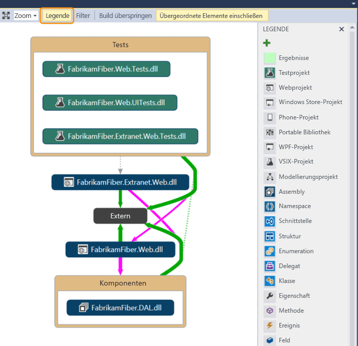
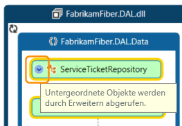
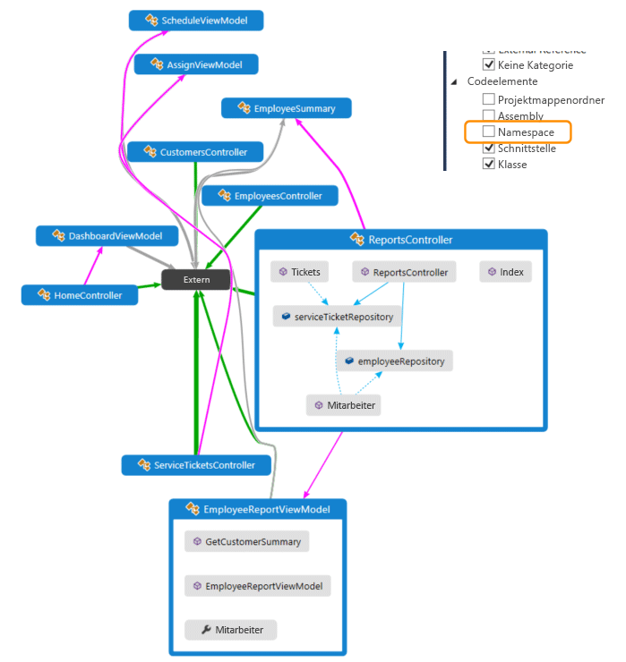

# Zuordnen von Abhängigkeiten mit Code maps

Erstellen einer Code Map, um Abhängigkeiten in Ihrem Code zu visualisieren. Mit Code maps können, die Sie sehen, wie der Code zusammenpasst, ohne zu Codezeilen und Dateien lesen.

Zum Erstellen und Bearbeiten von Code Maps, benötigen Sie Visual Studio Enterprise-Edition. Klicken Sie in Visual Studio Community und Professional-Editionen können Sie Diagramme, die in der Enterprise Edition generiert wurden, öffnen, aber nicht bearbeiten.

> [!NOTE]
> Bevor Sie in Visual Studio Enterprise mit anderen Benutzern erstellte Zuordnungen, die Visual Studio Professional verwenden freigeben, stellen Sie sicher, dass alle Elemente auf der Karte (z. B. ausgeblendete Elemente, erweiterte Gruppen und gruppenübergreifende Links) sichtbar sind.

Sie können Abhängigkeiten für Code in diesen Sprachen zuordnen:

- Visual c# oder Visual Basic in einer Projektmappe oder in Assemblys (*DLL* oder *.exe*)

- Systemeigenen oder verwalteten C oder C++-Code in Visual C++-Projekten, Headerdateien (*h* oder `#include`), oder Binärdateien

- Aus .NET-Modulen für Microsoft Dynamics AX erstellte X++-Projekte und X++-Assemblydateien

> [!NOTE]
> Für andere als C#- oder Visual Basic sind weniger Optionen zum Starten einer Code Map oder zum Hinzufügen von Elementen zu einer vorhanden Code Map. Beispielweise können Sie nicht mit der rechten Maustaste auf ein Objekt im Text-Editor eines C++-Projekts klicken, es einer Code Map hinzuzufügen. Allerdings können Drag & drop einzelne Codeelemente oder Dateien aus **Projektmappen-Explorer**, **Klassenansicht**, und **Objektkatalog**.

## Installieren Sie Code Map "und" Live-Abhängigkeitsüberprüfung

Zum Erstellen einer Code Map in Visual Studio installieren Sie zuerst die **Code Map** und **Live-Abhängigkeitsvalidierung** Komponenten:

1. Open **Visual Studio-Installer**. Können Sie sie öffnen in Visual Studio oder über das Startmenü von Windows dazu **Tools** > **Tools und Features abrufen**.

1. Wählen Sie die Registerkarte **Einzelne Komponenten** aus.

1. Führen Sie einen Bildlauf nach unten, um die **Codetools** aus, und wählen Sie **Code Map** und **Live-Abhängigkeitsvalidierung**.

   

1. Klicken Sie auf **Ändern**.

   Die **Code Map** und **Live-Abhängigkeitsvalidierung** Komponenten mit der Installation beginnen. Möglicherweise werden Sie aufgefordert, Visual Studio zu schließen.

## Fügen Sie eine Code Map hinzu

Sie erstellen eine leere Code Map und ziehen Sie Elemente in ihn verwenden, einschließlich Assemblyverweisen, Dateien und Ordner, oder Sie können eine Code Map für alle oder einen Teil Ihrer Projektmappe generieren.

So fügen Sie eine leere Code Map hinzu:

1. Öffnen Sie im **Projektmappen-Explorer**das Kontextmenü für den Projektmappenknoten auf oberster Ebene. Wählen Sie **hinzufügen** > **neues Element**.

2. In der **neues Element hinzufügen** Dialogfeld unter **installiert**, wählen Sie die **allgemeine** Kategorie.

3. Wählen Sie die **Directed Graph Document(.dgml)** Vorlage, und wählen Sie dann **hinzufügen**.

   > [!TIP]
   > Diese Vorlage erscheint alphabetisch, nicht so führen Sie einen Bildlauf zum unteren Rand der Vorlagenliste aus, wenn diese Option nicht angezeigt.

   Eine leere Code Map wird angezeigt, in der Projektmappe **Projektmappenelemente** Ordner.

Auf ähnliche Weise können Sie eine neue Code Map-Datei erstellen, ohne es durch Auswählen der Projektmappe hinzuzufügen **Architektur** > **neuer Code Map** oder **Datei**  >  **Neue** > **Datei**.

## Generieren einer Code Map für Ihre Lösung

Um alle Abhängigkeiten in Ihrer Lösung finden Sie unter:

1. Wählen Sie auf der Menüleiste **Architektur** > **Code Map für Projektmappe generieren**. Wenn Ihr Code seit der letzten Erstellung nicht geändert wird, können Sie auswählen **Architektur** > **Code Map für Projektmappe ohne Erstellung generieren** stattdessen.

   

   Eine Zuordnung wird generiert, mit dem Assemblys auf oberster Ebene und die aggregatlinks zwischen diesen angezeigt werden sollen. Desto größer die Aggregatsverbindung, desto mehr Abhängigkeiten stellt sie dar.

2. Mit der Schaltfläche **Legende** auf der Symbolleiste der Code Map können Sie die Liste der Projekttypsymbole (z. B. Test, Web und Phone-Projekt), der Codeelemente (z. B. Klassen, Methoden und Eigenschaften) sowie der Beziehungstypen (z. B. Erbt von, Implementiert und Aufrufe) anzeigen oder ausblenden.

   

   Diese Beispielprojektmappe enthält Projektmappenordner (**Tests** und **Komponenten**), Testprojekte, Webprojekte und Assemblys. Standardmäßig werden alle Einschlussbeziehungen als *Gruppen*dargestellt, die Sie erweitern und reduzieren können. Die Gruppe **Extern** enthält alle Elemente außerhalb der Projektmappe, einschließlich Plattformabhängigkeiten. Für externe Assemblys werden nur die Elemente angezeigt, die verwendet werden. Standardmäßig werden Systembasistypen auf der Code Map ausgeblendet, um die Übersichtlichkeit zu verbessern.

3. Um einen Drilldown in der Code Map durchzuführen, erweitern Sie die Gruppen, die Projekte und Assemblys darstellen. Sie können alle Gruppen erweitern, indem Sie durch Drücken von **STRG + A** alle Knoten auswählen und dann **Gruppe**, **Erweitern** im Kontextmenü auswählen.

   

4. Allerdings ist dieses Verfahren für große Projektmappen nicht unbedingt hilfreich. Tatsächlich können Sie bei komplexen Projektmappen aufgrund von Speicherbeschränkungen möglicherweise nicht alle Gruppen erweitern. Erweitern Sie in diesem Fall einen einzelnen Knoten, um seinen Inhalt anzuzeigen. Bewegen Sie den Mauszeiger auf einen Knoten, und klicken Sie dann auf das Chevron (Abwärtspfeil), wenn es angezeigt wird.

   

   Alternativ können Sie die Tastatur verwenden, indem Sie das Element auswählen und dann die Plus-Taste (**+**) drücken. Gehen Sie bei Namespaces, Typen und Mitglieder genauso vor, um tiefere Ebenen des Codes untersuchen.

   > [!TIP]
   > Weitere Informationen zum Arbeiten mit Code maps unter Verwendung den Maus, Tastatur und Toucheingabe finden Sie unter [durchsuchen und Neuanordnen code Maps](../modeling/browse-and-rearrange-code-maps.md).

5. Um die Code Map zu vereinfachen und sich auf einzelne Teile zu konzentrieren, wählen Sie **Filter** auf der Symbolleiste der Code Map aus, und wählen Sie dann nur die Knoten- und Linktypen aus, die für Sie von Interesse sind. Beispielsweise können Sie alle Projektmappenordner und Assemblycontainer ausblenden.

   

   Sie können die Code Map auch vereinfachen, indem Sie einzelne Gruppen und Elemente ausblenden oder aus der Code Map entfernen, ohne dass sich dies auf den zugrunde liegenden Projektmappencode auswirkt.

6. Um die Beziehungen zwischen Elementen anzuzeigen, wählen Sie die Elemente in der Code Map aus. Die Farben der Links zeigen die Beziehungstypen an, wie im Bereich **Legende** dargestellt.

   

   In diesem Beispiel sind die violetten Links Aufrufe, die gepunkteten Links sind Verweise, und die hellblauen Links sind Feldzugriffe. Grüne Links können Vererbung darstellen, oder es kann sich um *Aggregatlinks* handeln, die mehrere Beziehungstypen (oder *Kategorien*) angeben.

   > [!TIP]
   > Wenn ein grüner Link angezeigt wird, muss dies nicht bedeuten, dass nur eine Vererbungsbeziehung besteht. Möglicherweise gibt es auch Methodenaufrufe, aber diese sind durch die Vererbungsbeziehung ausgeblendet. Um bestimmte Linktypen anzuzeigen, verwenden Sie die Kontrollkästchen in der **Filter** Bereich, um die Typen ausblenden, die Sie nicht interessiert sind.

7. Weitere Informationen zu einem Element oder einem Link erhalten Sie, indem Sie den Mauszeiger darauf bewegen und warten, bis eine QuickInfo angezeigt wird. Diese enthält Details zu einem Codeelement oder den Kategorien, die ein Link darstellt.

   

8. Wählen Sie zum Untersuchen von Elementen und Abhängigkeiten, die durch einen Aggregatlink dargestellt werden, zunächst den Link aus, und öffnen Sie dann das zugehörige Kontextmenü. Wählen Sie **Zugehörige Links anzeigen** (oder **Zugehörige Links auf neuer Code Map anzeigen**) aus. Hierdurch werden die Gruppen an beiden Enden des Links erweitert und nur die Elemente und Abhängigkeiten angezeigt, die zu dem Link gehören.

9. Um auf bestimmte Teile der Zuordnung im zu konzentrieren, können Sie weiterhin Elemente zu entfernen, die, denen Sie nicht interessiert sind. Wenn Sie z. B. einen Drillinto für die Klassen- und Memberansicht ausführen möchten, filtern Sie einfach alle Namespaceknoten im Bereich **Filter** .

   

10. Eine andere Methode zum Fokussieren einer Code Map einer komplexen Projektmappe besteht darin, eine neue Code Map zu generieren, die ausgewählte Elemente aus einer vorhandenen Code Map enthält. Halten Sie **STRG** beim Auswählen der Elemente, die Sie auf konzentrieren möchten, öffnen Sie das Kontextmenü, und wählen **neues Diagramm aus der Markierung**.

    

11. Der enthaltende Kontext wird in die neue Code Map übernommen. Blenden Sie Projektmappenordner und andere Container, die Sie nicht, finden unter Verwendung möchten der **Filter** Bereich.

    

12. Erweitern Sie die Gruppen, und wählen Sie Elemente in der Code Map aus, um die Beziehungen anzuzeigen.

    

Siehe auch:

- [Durchsuchen und Neuanordnen von Code Maps](../modeling/browse-and-rearrange-code-maps.md)
- [Anpassen von Code Maps durch Bearbeiten der DGML-Dateien](../modeling/customize-code-maps-by-editing-the-dgml-files.md)
- Ermitteln potenzieller Probleme in Ihrem Code durch [eines Analyzers](../modeling/find-potential-problems-using-code-map-analyzers.md)

## Anzeigen bestimmter Abhängigkeiten in einer Code map

Nehmen wir an, dass Sie eine codeüberprüfung in einigen Dateien mit ausstehenden Änderungen ausgeführt haben. Um die Abhängigkeiten in diesen Änderungen anzuzeigen, können Sie eine Code Map aus diesen Dateien erstellen.

   

1. In **Projektmappen-Explorer**, wählen Sie die Projekte, Assemblyverweise, Ordner, Dateien, Typen oder Member, die Sie zuordnen möchten.

   

1. Auf der **Projektmappen-Explorer** Symbolleiste wählen **auf Code Map anzeigen** . Oder öffnen Sie das Kontextmenü für eine oder eine Gruppe von Elementen, und wählen Sie **auf Code Map anzeigen**.

   Sie können Elemente auch ziehen **Projektmappen-Explorer**, **Klassenansicht**, oder **Objektkatalog**, in einem [neue](#add-a-code-map) oder am vorhandenen Code zuordnen. Um die übergeordnete Hierarchie für die Elemente einzuschließen, halten Sie die **STRG** gedrückt, während Sie Elemente ziehen, oder verwenden Sie die **übergeordnete Elemente einschließen** Schaltfläche auf der Symbolleiste der Codeübersicht auf die Standardaktion anzugeben. Sie können auch Assemblydateien außerhalb von Visual Studio, z. B. ziehen, von **Windows Explorer**.

   > [!NOTE]
   > Werden Sie diese Elemente auf der Karte mit dem derzeit aktiven app-Projekt angezeigt, wenn Sie Elemente aus einem Projekt hinzufügen, die von mehreren apps wie Windows Phone oder Microsoft Store, gemeinsam genutzt wird. Wenn Sie den Kontext für ein anderes App-Projekt ändern und mehrere Elemente aus dem freigegebenen Projekt hinzufügen, werden diese Elemente nun mit dem neuen aktiven App-Projekt angezeigt. Vorgänge, die Sie mit einem Element in der Zuordnung ausführen, gelten nur für solche Elemente, die denselben Kontext gemeinsam verwenden.

3. Die Code Map zeigt die ausgewählten Elemente in ihren enthaltenden Assemblys.

   

4. Um Elemente zu untersuchen, erweitern Sie diese. Bewegen Sie den Mauszeiger auf ein Element, und klicken Sie dann auf das Chevron (Abwärtspfeil), wenn es angezeigt wird.

   

   Um alle Elemente zu erweitern, wählen Sie diese mithilfe von **STRG**+**ein**, öffnen Sie das Kontextmenü für die Karte, und wählen Sie **Gruppe**  >   **Erweitern Sie**. Diese Option ist jedoch nicht verfügbar, wenn das Erweitern aller Gruppen zu einer nicht verwendbaren Code Map oder zu Speicherproblemen führt.

5. Erweitern Sie weitere Elemente, die Sie interessieren, direkt zur Klassen- und Memberebene Ebene bei Bedarf.

   

   Zum Anzeigen von Mitgliedern, die im Code, aber nicht angezeigt, auf der Karte, klicken Sie auf die **untergeordnete Elemente erneut abrufen** Symbol  in der oberen linken Ecke einer Gruppe.

6. Um weitere Elemente im Zusammenhang mit den auf der Code Map dargestellten anzuzeigen, wählen Sie ein Element aus, wählen Sie **Verwandte anzeigen** auf der Symbolleiste der Code Map aus, und wählen Sie dann den Typ verwandter Elemente aus, die der Code Map hinzugefügt werden sollen. Alternativ wählen Sie eine oder mehrere Elemente, öffnen Sie das Kontextmenü und wählen Sie dann die **anzeigen** Option für den Typ verwandter Elemente aus, um die Karte hinzugefügt. Zum Beispiel:

    Für eine **Assembly**wählen Sie Folgendes aus:

    |||
    |-|-|
    |**Assemblys anzeigen, auf die verwiesen wird**|Fügt Assemblys hinzu, auf die diese Assembly verweist. Externe Assemblys werden in der Gruppe **Extern** angezeigt.|
    |**Assemblys anzeigen, die auf diese Funktion verweisen**|Fügt Assemblys in der Projektmappe hinzu, die auf diese Assembly verweisen.|

    Für einen **Namespace**wählen Sie **Enthaltende Assembly anzeigen**aus, falls sie nicht sichtbar ist.

    Für eine **Klasse** oder **Schnittstelle**wählen Sie Folgendes aus:

    |||
    |-|-|
    |**Basistypen anzeigen**|Fügt einer Klasse die Basisklasse und die implementierten Schnittstellen hinzu.   Fügt einer Schnittstelle die Basisschnittstellen hinzu.|
    |**Abgeleitete Typen anzeigen**|Fügt bei einer Klasse die abgeleiteten Klassen hinzu.   Fügt bei einer Schnittstelle die abgeleiteten Schnittstellen und die implementierenden Klassen oder Strukturen hinzu.|
    |**Typen anzeigen, auf die verwiesen wird**|Fügt alle Klassen und deren Mitglieder hinzu, die diese Klasse verwendet.|
    |**Typen anzeigen, die auf diese Funktion verweisen**|Fügt alle Klassen und deren Mitglieder hinzu, die diese Klasse verwenden.|
    |**Enthaltenden Namespace anzeigen**|Fügt den übergeordneten Namespace hinzu.|
    |**Enthaltende/n Namespace und Assembly anzeigen**|Fügt die übergeordnete Containerhierarchie hinzu.|
    |**Alle Basistypen anzeigen**|Fügt die Basisklasse oder die Schnittstellenhierarchie rekursiv hinzu.|
    |**Alle abgeleiteten Typen anzeigen**|Fügt bei einer Klasse alle abgeleiteten Klassen rekursiv hinzu.   Fügt bei einer Schnittstelle alle abgeleiteten Schnittstellen und die implementierenden Klassen oder Strukturen rekursiv hinzu.|

     Für eine **Methode**wählen Sie Folgendes aus:

    |||
    |-|-|
    |**Methode anzeigen, die aufruft**|Fügt die Methoden hinzu, die diese Methode aufruft.|
    |**Felder anzeigen, auf die verwiesen wird**|Fügt die Felder hinzu, auf die diese Methode verweist.|
    |**Enthaltenden Typ anzeigen**|Fügt den übergeordneten Typ hinzu.|
    |**Enthaltende/n Typ, Namespace und Assembly anzeigen**|Fügt die übergeordnete Containerhierarchie hinzu.|
    |**Überschriebene Methoden anzeigen**|Fügt bei einer Methode, die andere Methoden überschreibt oder die Methode einer Schnittstelle implementiert, alle abstrakten oder virtuellen Methoden in Basisklassen, die überschrieben werden, und ggf. die Methode der Schnittstelle, die implementiert wird, hinzu.|

     Für ein **Feld** oder eine **Eigenschaft**wählen Sie Folgendes aus:

    |||
    |-|-|
    |**Enthaltenden Typ anzeigen**|Fügt den übergeordneten Typ hinzu.|
    |**Enthaltende/n Typ, Namespace und Assembly anzeigen**|Fügt die übergeordnete Containerhierarchie hinzu.|

    

7. Die Beziehungen werden auf der Code Map angezeigt. In diesem Beispiel die Code Map zeigt die Methoden aufgerufen werden, indem die `Find` -Methode und ihre Position, die in der Projektmappe oder extern.

   

8. Um die Code Map zu vereinfachen und sich auf einzelne Teile zu konzentrieren, wählen Sie **Filter** auf der Symbolleiste der Code Map aus, und wählen Sie dann nur die Knoten- und Linktypen aus, die für Sie von Interesse sind. Deaktivieren Sie z. B. die Anzeige von Projektmappenordnern, Assemblys und Namespaces.

   

## Siehe auch

- [Video: Verstehen des Entwurfs aus Visual Studio 2015-codezuordnungen](https://channel9.msdn.com/Events/Visual-Studio/Connect-event-2015/502)]
- [Verwenden von Code Maps zum Debuggen von Anwendungen](../modeling/use-code-maps-to-debug-your-applications.md)
- [Zuordnen von Methoden in der Aufrufliste beim Debuggen](../debugger/map-methods-on-the-call-stack-while-debugging-in-visual-studio.md)
- [Ermitteln potenzieller Probleme mithilfe von Code Map-Analyzern](../modeling/find-potential-problems-using-code-map-analyzers.md)
- [Durchsuchen und Neuanordnen von Code Maps](../modeling/browse-and-rearrange-code-maps.md)
- [Anpassen von Code Maps durch Bearbeiten der DGML-Dateien](../modeling/customize-code-maps-by-editing-the-dgml-files.md)
