# Zuordnen von Methoden in der Aufrufliste beim Debuggen in Visual Studio
Erstellen Sie eine Code Map, um die Aufrufliste visuell zu verfolgen, während Sie debuggen. Sie können Notizen auf der Zuordnung vermerken, um das Verhalten des Codes zu verfolgen, sodass Sie sich auf das Suchen von Fehlern konzentrieren können.

 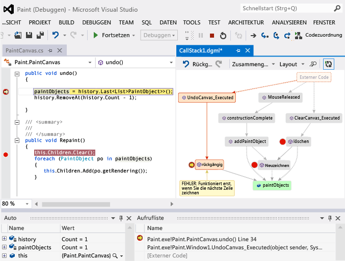

 Sie benötigen Folgendes:

-   [Visual Studio Enterprise](https://www.visualstudio.com/downloads/download-visual-studio-vs)

-   Code, den Sie, z. B. Visual c#, Visual Basic, C++, JavaScript oder X++ Debuggen können

 Thema

-   [Video: Debuggen Sie visuell mit Code Map-Debugger-Integration (Channel 9)](http://go.microsoft.com/fwlink/?LinkId=293418)

-   [Zuordnen der Aufrufliste](#MapStack)

-   [Notizen Sie zum code](#MakeNotes)

-   [Die Zuordnung mit nächster Aufrufliste aktualisieren](#UpdateMap)

-   [Hinzufügen von zugehörigem Code zur Zuordnung](#AddRelatedCode)

-   [Suchen von Fehlern mithilfe der Zuordnung](#FindBugs)

-   [FRAGEN UND ANTWORTEN](#QA)

 Weitere Informationen zu den Befehlen und Aktionen können Sie beim Arbeiten mit codezuordnungen verwenden, finden Sie unter [durchsuchen und Neuanordnen code Maps](../modeling/browse-and-rearrange-code-maps.md).

##   Zuordnen der Aufrufliste

1.  Beginnen Sie mit dem Debuggen. (Tastatur: **F5**)

2.  Nachdem Ihre app in den Unterbrechungsmodus wechselt oder Sie eine Funktion schrittweise ausführen, wählen Sie **Codezuordnung**. (Tastatur: **STRG** + **UMSCHALT** + **`**)

     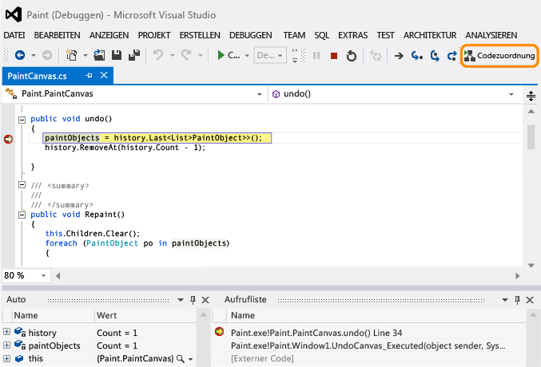

     Die aktuelle Aufrufliste wird in einer neuen Codezuordnung orange dargestellt:

     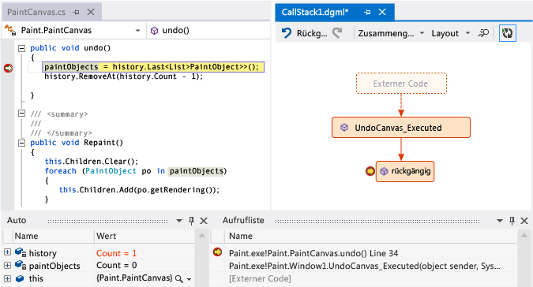

     Die Map wird beim Debuggen automatisch aktualisiert. Finden Sie unter [Aktualisieren der Zuordnung mit der nächsten Aufrufliste](#UpdateMap).

##   Notizen Sie zum code
 Hinzufügen von Kommentaren, um nachzuverfolgen, was im Code geschieht. Um eine neue Zeile in einem Kommentar hinzuzufügen, drücken Sie **Umschalt + Eingabe**.

 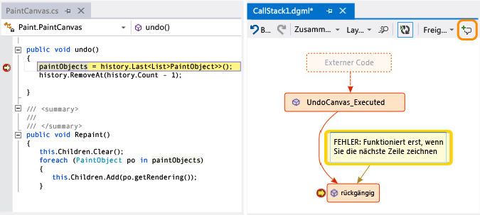

##   Die Zuordnung mit nächster Aufrufliste aktualisieren
 Führen Sie die Anwendung bis zum nächsten Haltepunkt aus, oder führen Sie eine Funktion schrittweise aus. Die Zuordnung fügt eine neue Aufrufliste hinzu.

 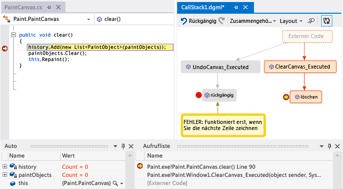

##   Hinzufügen von zugehörigem Code zur Zuordnung
 Jetzt haben Sie einer Karte - was geschieht als Nächstes? Wenn Sie mit c# oder Visual Basic arbeiten, fügen Sie Elemente, wie Felder, Eigenschaften und andere Methoden, um nachzuverfolgen, was im Code geschieht.

 Doppelklicken Sie auf eine Methode, um ihre Codedefinition anzuzeigen, oder verwenden Sie das Kontextmenü für die Methode. (Tastatur: Wählen Sie die Methode für die Zuordnung, und drücken Sie **F12**)

 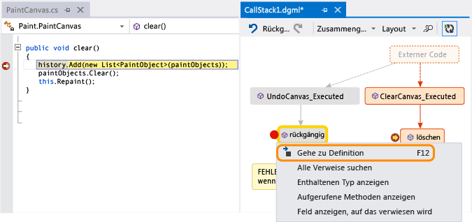

 Fügen Sie die Elemente hinzu, die Sie in der Zuordnung nachverfolgen möchten.

 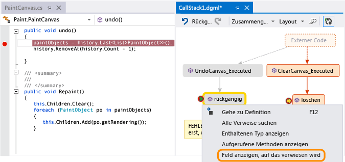

> [!NOTE]
>  Standardmäßig werden beim Hinzufügen von Elementen zur Zuordnung auch die übergeordnete Gruppenknoten, wie Klasse, Namespace und Assembly, hinzugefügt. Dies ist, zwar hilfreich Sie können die Zuordnung einfach halten durch das Deaktivieren dieser Funktion mit dem **übergeordnete Elemente einschließen** in der zuordnungssymbolleiste, oder durch Drücken von **STRG** beim Hinzufügen von Elementen.

 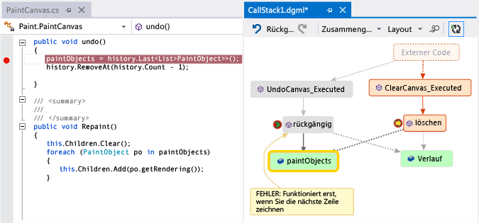

 Hier können Sie leicht erkennen, welche Methoden die gleichen Felder verwenden. Die zuletzt hinzugefügten Elemente werden grün dargestellt.

 Setzen Sie das Erstellen der Zuordnung fort, um weiteren Code anzuzeigen.

 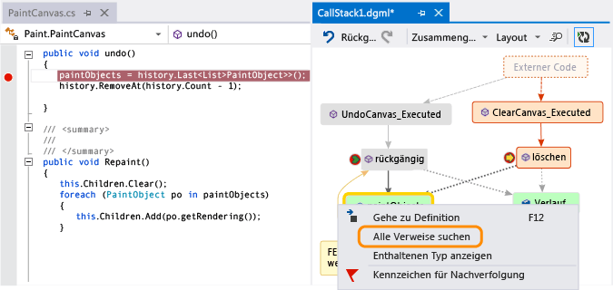

 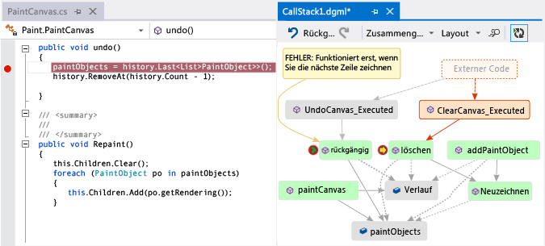

##   Suchen von Fehlern mithilfe der Zuordnung
 Durch die Visualisierung des Codes können Sie Fehler schneller finden. Nehmen Sie beispielsweise an, dass Sie einen Fehler in einem Zeichenprogramm untersuchen. Wenn Sie eine Linie zeichnen und versuchen, sie rückgängig zu machen, geschieht nichts, bis Sie eine andere Zeile zeichnen.

 Legen Sie die Haltepunkte `clear`, `undo` und `Repaint` fest, starten Sie das Debugging, und erstellen Sie eine Zuordnung wie die folgende:

 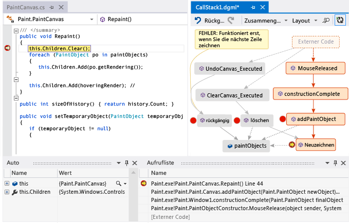

 Sie stellen fest, dass alle Benutzergesten in der Zuordnung die `Repaint`-Funktion aufrufen, außer `undo`. Dies erklärt möglicherweise, warum `undo` nicht sofort funktioniert.

 Nachdem Sie den Fehler korrigiert haben und die Ausführung des Programms fortsetzen, fügt die Zuordnung den neuen Aufruf von `undo` zur `Repaint`-Funktion hinzu:

 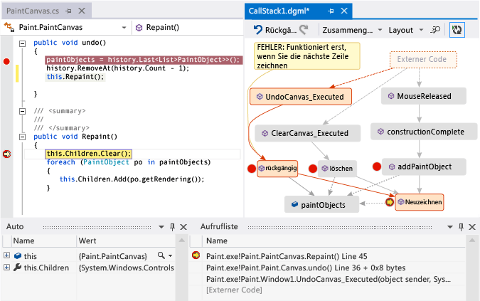

##   Fragen und Antworten

-   **Nicht alle Aufrufe, die auf der Karte angezeigt werden. Warum?**

     Standardmäßig wird nur Ihr eigener Code in der Zuordnung angezeigt. Um externen Code anzuzeigen, aktivieren Sie es in der **Aufrufliste** Fenster:

     

     oder deaktivieren Sie **nur meinen Code aktivieren** in Visual Studio Debuggen von Optionen:

     

-   **Wirkt durch Ändern der Zuordnung den Code sich?**

     Durch Ändern der Zuordnung wirkt sich nicht auf den Code in keiner Weise aus. Sie können beliebigen Code in der Zuordnung gerne umbenennen, verschieben oder entfernen.

-   **Was bedeutet diese Meldung: "das Diagramm basiert möglicherweise auf eine ältere Version des Codes"?**

     Der Code wurde möglicherweise geändert, nachdem Sie die Zuordnung zuletzt aktualisiert haben. Zum Beispiel befindet sich möglicherweise ein Aufruf für die Zuordnung nicht mehr im Code. Schließen Sie die Meldung, und versuchen Sie dann, die Projektmappe vor der erneuten Aktualisierung der Zuordnung neu zu erstellen.

-   **Wie können die Zuordnung Layout werden gesteuert?**

     Öffnen der **Layout** Menü in der zuordnungssymbolleiste:

    -   Ändern Sie das Standardlayout.

    -   Um die Zuordnung automatisch anordnen zu beenden, deaktivieren Sie **Automatisches Layout beim Debugging**.

    -   Um die Zuordnung so wenig wie möglich zu ändern, wenn Sie Elemente hinzufügen, deaktivieren Sie **inkrementelles Layout**.

-   **Kann ich die Zuordnung für andere Benutzer freigeben?**

     Sie können die Zuordnung exportieren, an andere Benutzer senden (sofern Sie über Microsoft Outlook verfügen) oder in der Projektmappe speichern, um sie in der Team Foundation-Versionskontrolle einzuchecken.

     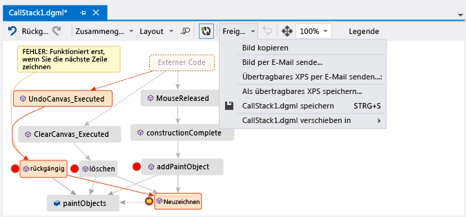

-   **Wie hindere ich die Zuordnung neue Aufruflisten automatisch hinzufügt?**

     Wählen Sie  auf der Symbolleiste der Map. Um die aktuelle Aufrufliste manuell zur Zuordnung hinzuzufügen, drücken Sie die **STRG** + **UMSCHALT** + **`**.

     Die Zuordnung weiterhin vorhandene Aufruflisten in der Zuordnung hervorgehoben, während Sie debuggen.

-   **Was bedeuten die Elementsymbole und Pfeile?**

     Um weitere Informationen zu einem Element zu erhalten, bewegen Sie den Mauszeiger darüber, und sehen Sie sich das Element QuickInfo. Sie können außerdem sehen Sie sich die **Legende** um zu erfahren, was bedeutet, dass jedes Symbol.

     ![Was bedeuten die Symbole in der Aufruflisten-codezuordnung? ] (../debugger/media/debuggermap_showlegend.png "DebuggerMap_ShowLegend")

 Thema

-   [Zuordnen der Aufrufliste](#MapStack)

-   [Notizen Sie zum code](#MakeNotes)

-   [Die Zuordnung mit nächster Aufrufliste aktualisieren](#UpdateMap)

-   [Hinzufügen von zugehörigem Code zur Zuordnung](#AddRelatedCode)

-   [Suchen von Fehlern mithilfe der Zuordnung](#FindBugs)

## Siehe auch

- [Projektmappenübergreifendes Zuordnen von Abhängigkeiten](../modeling/map-dependencies-across-your-solutions.md)
- [Verwenden von Code Maps zum Debuggen von Anwendungen](../modeling/use-code-maps-to-debug-your-applications.md)
- [Ermitteln potenzieller Probleme mithilfe von Code Map-Analyzern](../modeling/find-potential-problems-using-code-map-analyzers.md)
- [Durchsuchen und Neuanordnen von Code Maps](../modeling/browse-and-rearrange-code-maps.md)
