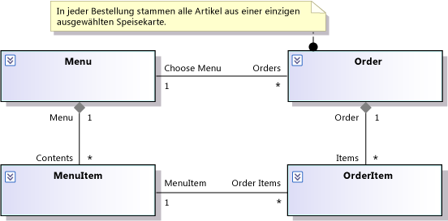

# Modellieren von Benutzeranforderungen

Visual Studio hilft Ihnen dabei, die Anforderungen der Benutzer zu verstehen, zu besprechen und zu kommunizieren, indem Diagramme über ihre Aktivitäten und die Rolle Ihres System bei der Erreichung ihrer Ziele gezeichnet werden. Ein Anforderungsmodell ist ein Satz dieser Diagramme, von denen sich jedes auf einen anderen Aspekt der Benutzeranforderungen konzentriert. Eine Videodemo finden Sie unter: [Modeling the Business Domain](http://channel9.msdn.com/posts/clinted/UML-with-VS-2010-Part-3-Modeling-the-Business-Domain/)(Modellieren der Geschäftsdomäne) .

 Informationen dazu, welche Versionen von Visual Studio die einzelnen Modelltypen unterstützen, finden Sie unter [Version support for architecture and modeling tools](../modeling/what-s-new-for-design-in-visual-studio.md#VersionSupport).

 Ein Anforderungsmodell hilft Ihnen bei Folgendem:

-   Konzentration auf das externe Verhalten des Systems, unabhängig von seinem internen Entwurf.

-   Beschreiben der Anforderungen von Benutzern und Projektbeteiligten mit deutlich weniger Mehrdeutigkeiten als in der natürlichen Sprache.

-   Definieren eines konsistenten Glossars von Begriffen, das von Benutzern, Entwicklern und Testern verwendet werden kann.

-   Reduzieren von Lücken und Inkonsistenzen hinsichtlich der Anforderungen.

-   Reduzieren der für die Reaktion auf Anforderungsänderungen notwendigen Arbeit.

-   Planen der Reihenfolge, in der Funktionen entwickelt werden.

-   Verwenden der Modelle als Grundlage für Systemtests, um eine klare Beziehung zwischen den Tests und den Anforderungen herzustellen. Wenn sich die Anforderungen ändern, hilft Ihnen diese Beziehung beim ordnungsgemäßen Aktualisieren der Tests. Dadurch wird sichergestellt, dass das System die neuen Anforderungen erfüllt.

 Ein Anforderungsmodell bietet den größten Vorteil, wenn Sie es für die Ausrichtung von Besprechungen mit den Benutzern oder ihren Vertretern einsetzen und es am Anfang jeder Iteration überdenken. Sie müssen es nicht im Detail fertigstellen, bevor Sie Code schreiben. Eine teilweise funktionierende Anwendung bildet in der Regel, auch wenn sie sehr vereinfacht ist, die anregendste Grundlage für die Besprechung der Anforderungen mit den Benutzern. Das Modell ist eine effektive Methode, um die Ergebnisse solcher Diskussionen zusammenzufassen. Weitere Informationen finden Sie unter [Verwenden von Modellen im Entwicklungsprozess](../modeling/use-models-in-your-development-process.md).

> [!NOTE]
> In diesen Themen meint „System“ das System oder die Anwendung, das bzw. die Sie entwickeln. Es kann sich um eine umfangreiche Sammlung von vielen Software- und Hardwarekomponenten, eine einzelne Anwendung oder eine Softwarekomponente in einem größeren System handeln. In jedem Fall beschreibt das Anforderungsmodell das Verhalten, das über eine Benutzeroberfläche oder eine API von außerhalb Ihres Systems sichtbar ist.

## Allgemeine Aufgaben

Sie können verschiedene Ansichten der Benutzeranforderungen erstellen.  Jede Ansicht bietet eine bestimmte Art von Informationen.  Wenn Sie diese Ansichten erstellen, empfiehlt es sich, häufig zwischen ihnen zu wechseln. Sie können bei jeder Ansicht starten.

|Diagramm oder Dokument|Was es in einem Anforderungsmodell beschreibt|Bereich|
|-------------------------|-----------------------------------------------|-------------|
|Konzeptionelles Klassendiagramm|Glossar von Typen, die zum Beschreiben der Anforderungen verwendet werden; die auf der Benutzeroberfläche des Systems sichtbaren Typen.||
|Zusätzliche Dokumente oder Arbeitsaufgaben|Kriterien für die Leistung, Sicherheit, Nutzbarkeit und Zuverlässigkeit|[Beschreiben von Servicequalitätsanforderungen](#QoSRequirements)|
|Zusätzliche Dokumente oder Arbeitsaufgaben|Einschränkungen und Regeln, die nicht spezifisch für einen bestimmten Anwendungsfall sind|[Anzeigen von Geschäftsregeln](#BusinessRules)|

 Beachten Sie, dass die meisten Diagrammtypen für andere Zwecke verwendet werden können. Einen Überblick über die Diagrammtypen finden Sie unter [Erstellen von Modellen für Ihre app](../modeling/create-models-for-your-app.md).

##   Showing Business Rules

Eine Geschäftsregel ist eine Anforderung, die mit keinem speziellen Anwendungsfall verknüpft ist und im ganzen System zu beachten ist.

 Viele Geschäftsregeln sind Einschränkungen der Beziehungen zwischen den konzeptionellen Klassen. Sie können diese schreiben *statische ** Geschäftsregeln* als die entsprechenden Klassen in einem konzeptionellen Klassendiagramm zugeordneten Kommentare. Zum Beispiel:

 

 *Dynamische Geschäftsregeln* schränken die zulässigen Sequenzen von Ereignissen ein. Beispielsweise verwenden Sie ein Sequenz- oder Aktivitätsdiagramm, um zu zeigen, dass sich ein Benutzer anmelden muss, bevor er andere Vorgänge im System durchführen kann.

 Allerdings können viele dynamische Regeln effektiver und allgemeiner durch Ersetzung durch statische Regeln angegeben werden. Beispielsweise können Sie einer Klasse im konzeptionellen Klassenmodell ein boolesches Attribut „Angemeldet“ hinzufügen. Sie würden „Angemeldet“ als Nachbedingung des Anwendungsfalls für das Anmelden hinzufügen und als Vorbedingung für die meisten der anderen Anwendungsfälle. Mit diesem Ansatz können Sie vermeiden, alle möglichen Kombinationen von Ereignissequenzen definieren zu müssen. Zudem ist dieses Vorgehen flexibler, wenn Sie dem Model neue Anwendungsfälle hinzufügen müssen.

 Beachten Sie, dass hier zu entscheiden ist, wie Sie die Anforderungen definieren, und dass dies unabhängig von der Implementierung der Anforderungen im Programmcode ist.

 Weitere Informationen finden Sie in den folgenden Themen:

|Thema|Lesen|
|--------------------|----------|
|Entwickeln von Code, der Geschäftsregeln entspricht|[Modellieren der Architektur Ihrer App](../modeling/model-your-app-s-architecture.md)|

##   Describing Quality of Service Requirements

Es gibt mehrere Kategorien von Servicequalitätsanforderungen. Hierzu gehören Folgende:

-   Leistung

-   Sicherheit

-   Verwendbarkeit

-   Zuverlässigkeit

-   Stabilität

Sie können einige dieser Anforderungen in die Beschreibungen bestimmter Anwendungsfälle einschließen. Andere Anforderungen sind nicht spezifisch für Anwendungsfälle und werden am effektivsten in ein separates Dokument geschrieben. Es ist nützlich, nach Möglichkeit das von den Anforderungsmodellen definierte Vokabular einzuhalten. Beachten Sie im nächsten Beispiel, dass die in der Anforderung verwendeten Hauptwörter den Titeln von Akteuren, Anwendungsfällen und Klassen in den vorangehenden Abbildungen entsprechen:

Wenn ein Restaurant ein Gericht löscht, während ein Kunde eine Mahlzeit bestellt, werden Bestellpositionen, die sich auf dieses Gericht beziehen, rot angezeigt.

Finden Sie unter [modellieren Ihrer app-Architektur](../modeling/model-your-app-s-architecture.md) erhalten Sie Informationen zum Entwickeln von Code, die servicequalitätsanforderungen entspricht.

## Siehe auch

- [Verwenden von Modellen im Entwicklungsprozess](../modeling/use-models-in-your-development-process.md)
- [Modellieren der Architektur Ihrer App](../modeling/model-your-app-s-architecture.md)
