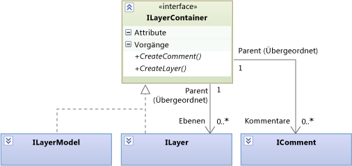
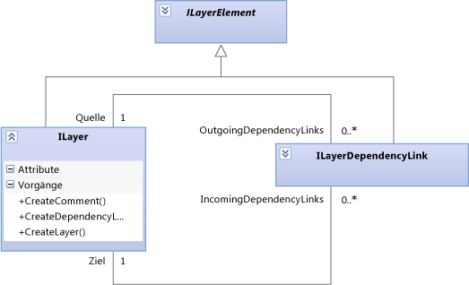
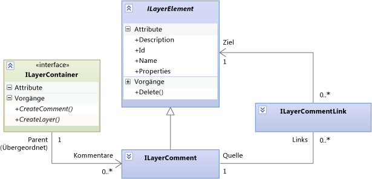
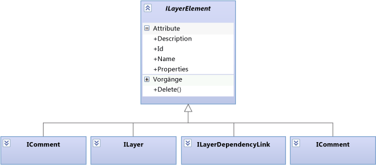

# <a name="navigate-and-update-layer-models-in-program-code"></a>Navigieren in und Aktualisieren von Ebenenmodellen im Programmcode

Dieser Artikel beschreibt die Elemente und Beziehungen in Ebenenmodellen, die Sie navigieren und mithilfe von Programmcode aktualisieren können. Weitere Informationen zu Abhängigkeitsdiagrammen aus Sicht des Benutzers, finden Sie unter [Abhängigkeitsdiagramme: Verweis](../modeling/layer-diagrams-reference.md) und [Abhängigkeitsdiagramme: Richtlinien](../modeling/layer-diagrams-guidelines.md).

Die <xref:Microsoft.VisualStudio.ArchitectureTools.Extensibility.Layer> in diesem Thema beschriebene Modell ist eine Fassade eines allgemeineren <xref:Microsoft.VisualStudio.GraphModel> Modell. Wenn Sie schreiben eine [menüerweiterung Befehls- oder Gestenhandlerprojekts](../modeling/add-commands-and-gestures-to-layer-diagrams.md), verwenden Sie die `Layer` Modell. Wenn Sie schreiben eine [layer validierungserweiterung](../modeling/add-custom-architecture-validation-to-layer-diagrams.md), es ist einfacher zu verwenden die `GraphModel`.

## <a name="transactions"></a>Transaktionen

Wenn Sie ein Modell aktualisieren, sollten Sie die Änderungen im einschließenden eine `ILinkedUndoTransaction`, die die Änderungen in einer Transaktion gruppieren. Wenn eine der Änderungen fehlschlägt, wird die gesamte Transaktion zurückgesetzt. Wenn der Benutzer eine Änderung rückgängig macht, werden alle Änderungen zusammen rückgängig gemacht.

```csharp
using (ILinkedUndoTransaction t =
        LinkedUndoContext.BeginTransaction("a name"))
{
    // Make changes here ....
    t.Commit(); // Don't forget this!
}
```

## <a name="containment"></a>Kapselung



Ebenen (<xref:Microsoft.VisualStudio.ArchitectureTools.Extensibility.Layer.ILayer>) und das Ebenenmodell (<xref:Microsoft.VisualStudio.ArchitectureTools.Extensibility.Layer.ILayerModel>) können Kommentare und Ebenen enthalten.

Eine Ebene (`ILayer`) kann in einem Ebenenmodell (`ILayerModel`) enthalten sein oder in einer anderen `ILayer` geschachtelt werden.

Verwenden Sie die Erstellungsmethoden für den entsprechenden Container, um einen Kommentar oder eine Ebene zu erstellen.

## <a name="dependency-links"></a>Abhängigkeitslinks

Ein Abhängigkeitslink wird durch ein Objekt dargestellt. Er kann in beide Richtungen navigiert werden:



Rufen Sie `source.CreateDependencyLink(target)` auf, um einen Abhängigkeitslink zu erstellen.

## <a name="comments"></a>Kommentare

Kommentare können auf Ebenen oder im Ebenenmodell enthalten sein. Zudem können sie mit beliebigen anderen Ebenenelementen verknüpft werden:



Ein Kommentar kann mit einer beliebigen Anzahl von Elementen sowie auch mit keinem Element verknüpft werden.

Verwenden Sie Folgendes, um die Kommentare abzurufen, die einem Ebenenelement zugeordnet sind:

```csharp
ILayerModel model = diagram.GetLayerModel();
IEnumerable<ILayerComment> comments =
   model.Comments.Where(comment =>
      comment.Links.Any(link => link.Target == layerElement));
```

> [!CAUTION]
> Die `Comments`-Eigenschaft einer `ILayer` ruft die Kommentare ab, die in `ILayer` enthalten sind. Es werden nicht die mit ihr verknüpften Kommentare abgerufen.

Erstellen Sie einen Kommentar durch Aufrufen von `CreateComment()` im entsprechenden Container.

Erstellen Sie einen Link, indem Sie `CreateLink()` auf den Kommentar anwenden.

## <a name="layer-elements"></a>Ebenenelemente

Alle Elementtypen, die in einem Modell enthalten sein können, sind Ebenenelemente:



## <a name="properties"></a>Eigenschaften

Jedes `ILayerElement` verfügt über ein Zeichenfolgenwörterbuch namens `Properties`. Über dieses Wörterbuch können Sie willkürliche Informationen an ein beliebiges Ebenenelement anfügen.

## <a name="artifact-references"></a>Artefaktverweise

Ein Artefaktverweis (<xref:Microsoft.VisualStudio.ArchitectureTools.Extensibility.Layer.ILayerArtifactReference>) stellt den Link zwischen einer Ebene und einem Projektelement dar, z. B. einer Datei, einer Klasse oder einem Ordner. Der Benutzer erstellt Artefakte, beim Erstellen einer Ebene oder durch Ziehen von Elementen aus dem Projektmappen-Explorer, Klassenansicht oder Objektkatalog in ein Abhängigkeitsdiagramm hinzugefügt. Mit einer Ebene kann eine beliebige Anzahl von Artefaktverweisen verknüpft werden.

Jede Zeile im Ebenen-Explorer zeigt einen Artefaktverweis an. Weitere Informationen finden Sie unter [Erstellen von Abhängigkeitsdiagrammen aus Ihrem Code](../modeling/create-layer-diagrams-from-your-code.md).

Folgende hauptsächliche Typen und Methoden sind von Artefaktverweisen betroffen:

<xref:Microsoft.VisualStudio.ArchitectureTools.Extensibility.Layer.ILayerArtifactReference>. Die Eigenschaft „Kategorien“ gibt an, welche Art von Artefakt referenziert wird, z. B. Klasse, ausführbare Datei oder Assembly. Die Eigenschaft "Kategorien" bestimmt, wie der Bezeichner das Zielartefakt identifiziert.

<xref:Microsoft.VisualStudio.ArchitectureTools.Extensibility.Layer.ArtifactReferenceExtensions.CreateArtifactReferenceAsync%2A> erstellt einen Artefaktverweis über ein <xref:EnvDTE.Project> oder <xref:EnvDTE.ProjectItem>. Das ist ein asynchroner Vorgang. Aus diesem Grund geben Sie in der Regel einen Rückruf, der aufgerufen wird, wenn die Erstellung abgeschlossen ist.

Ebenenartefaktverweise unterscheiden sich von Elementen in Anwendungsfalldiagrammen.

## <a name="shapes-and-diagrams"></a>Formen und Diagramme

Es werden zwei Objekte verwendet, um die einzelnen Elemente in einem Ebenenmodell darzustellen: <xref:Microsoft.VisualStudio.ArchitectureTools.Extensibility.Layer.ILayerElement> und <xref:Microsoft.VisualStudio.ArchitectureTools.Extensibility.Presentation.IShape>. `IShape` stellt Position und Größe der Form auf dem Diagramm dar. In Ebenenmodellen jeder `ILayerElement` verfügt über ein `IShape`, und jede `IShape` auf einer Abhängigkeit besitzt ein `ILayerElement`. `IShape` wird auch für UML-Modelle verwendet. Daher verfügt nicht jedes `IShape` über ein Ebenenelement.

Auf dieselbe Weise wird <xref:Microsoft.VisualStudio.ArchitectureTools.Extensibility.Layer.ILayerModel> für ein <xref:Microsoft.VisualStudio.ArchitectureTools.Extensibility.Presentation.IDiagram> angezeigt.

Im Code eines benutzerdefinierten Befehl- oder Gestenhandlers können Sie das aktuelle Diagramm und die aktuelle Formenauswahl aus dem `DiagramContext`-Import abrufen:

```csharp
public class ... {
[Import]
    public IDiagramContext DiagramContext { get; set; }
...
public void ... (...)
{ IDiagram diagram = this.DiagramContext.CurrentDiagram;
  ILayerModel model = diagram.GetLayerModel();
  if (model != null)
  { foreach (ILayer layer in model.Layers) { ... }}
  foreach (IShape selected in diagram.SelectedShapes)
  { ILayerElement element = selected.GetLayerElement();
    if (element != null) ... }}
```


<xref:Microsoft.VisualStudio.ArchitectureTools.Extensibility.Presentation.IShape> und <xref:Microsoft.VisualStudio.ArchitectureTools.Extensibility.Presentation.IDiagram> werden auch zum Anzeigen von UML-Modellen verwendet.

## <a name="see-also"></a>Siehe auch

- [Hinzufügen von Befehlen und Gesten zu Abhängigkeitsdiagrammen](../modeling/add-commands-and-gestures-to-layer-diagrams.md)
- [Hinzufügen einer benutzerdefinierten Architekturvalidierung zu Abhängigkeitsdiagrammen](../modeling/add-custom-architecture-validation-to-layer-diagrams.md)
- [Hinzufügen benutzerdefinierter Eigenschaften zu Abhängigkeitsdiagrammen](../modeling/add-custom-properties-to-layer-diagrams.md)
- [Abhängigkeitsdiagramme: Referenz](../modeling/layer-diagrams-reference.md)
- [Abhängigkeitsdiagramme: Richtlinien](../modeling/layer-diagrams-guidelines.md)
